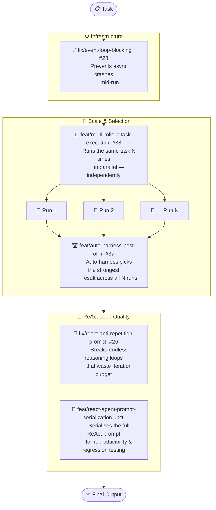

# Agent Core — Features Overview

## Reading the diagram

| Phase | What happens | Feature(s) |
|-------|-------------|------------|
| **Infrastructure** | Async event loop is stabilised before any work starts | #28 |
| **Scale** | Task is run N independent times; strongest result is selected | #38 → #37 |
| **ReAct quality** | Each individual run has loop-breaking and prompt capture | #26, #21 |

> **Core idea:** instead of betting everything on one run, run N times in parallel and pick the winner — while keeping each run stable and loop-free.
