# jiuwenswarm — Features Overview

```mermaid
flowchart TD
    T(["📋 Task arrives"])

    T --> Infra

    subgraph Infra["⚙️ Infrastructure — always on"]
        direction LR
        EL["⚡ bugfix/event-loop-blocking  #119
        Prevents async crash
        during task execution"]
        ACP["🔒 fix/acp-runtime-tool-blocking  #139
        Unblocks tools wrongly
        rejected by ACP runtime"]
    end

    Infra --> Init

    subgraph Init["🚀 Session Start — injected once, pinned for the whole run"]
        direction LR
        TDR["📌 task-description-reinjection  #371
        Pins full task.md as permanent
        system-prompt section —
        survives context compression"]
        OFR["📋 output-format-reminder  #401
        Extracts output format hints
        from task.md and pins them —
        agent never forgets the format"]
        ESD["🔍 external-skill-discovery  #214
        Discovers and exposes
        task-environment skill
        scripts to the agent"]
    end

    Init --> IterLoop

    subgraph IterLoop["🔁 Iteration Loop  (repeats until done or budget exhausted)"]
        direction TB

        subgraph B4LLM["Before every LLM call"]
            direction LR
            IBA["⏳ iteration-budget-awareness  #368
            Warns agent when remaining
            iterations fall below threshold —
            shifts focus to finishing"]
            CHG["📊 context-headroom-guard  #397
            Monitors context fill — injects
            'be concise' at 60% and
            'critical brevity' at 80%"]
            FPM_in["🧠 failure-pattern-memory  #396
            Injects running list of failed
            tool calls — agent told
            not to repeat them"]
            SBR["↩️ step-back-rail  #399
            After N consecutive shell
            failures — forces full
            strategy rethink"]
        end

        LLM(["🤖 LLM decides\nnext action"])

        subgraph B4Tool["Before tool executes"]
            direction LR
            DD["♻️ tool-call-dedup-cache  #372
            Detects identical repeated
            tool calls — returns cached
            result, skips execution"]
            AU["🚀 autonomous-execution-mode  #370
            Replaces hedging language
            with autonomous directives —
            no confirmation pauses"]
        end

        Tool(["🔧 Tool runs"])

        subgraph AftTool["After tool returns"]
            direction LR
            TR["✂️ bash-output-truncation  #334
            Keeps head + tail of
            long output — verifier
            errors never cut off"]
            FPM_out["🧠 failure-pattern-memory  #396
            Records this failure in
            session state if tool
            returned an error"]
        end

        B4LLM --> LLM --> B4Tool --> Tool --> AftTool
        AftTool -->|"not done yet"| B4LLM
    end

    IterLoop -->|"agent declares task done"| Verify

    subgraph Verify["✅ Completion Checks"]
        direction LR
        SV["🔎 self-verification-loop  #328
        Agent runs the verifier
        script itself — catches
        errors before submission"]
        TV["👥 team-verification-layer  #121
        Secondary agent independently
        reviews the output —
        second pair of eyes"]
    end

    Verify --> Out(["🏁 Output submitted"])
```

## Reading the diagram

| Phase | Trigger | Features |
|-------|---------|---------|
| **Infrastructure** | Always active | #119 event-loop fix, #139 ACP tool fix |
| **Session start** | Once per task | #371 task re-injection, #401 format reminder, #214 skill discovery |
| **Before LLM call** | Every iteration | #368 budget warning, #397 context guard, #396 failure memory (inject), #399 step-back |
| **Before tool** | Every tool call | #372 dedup cache, #370 autonomous mode |
| **After tool** | Every tool return | #334 bash truncation, #396 failure memory (record) |
| **Completion** | Once, when done | #328 self-verification, #121 team verification |

> **Core idea:** a layered set of rails intervenes at every stage of the agent loop — pinning context at the start, guiding the LLM before each call, guarding tool execution in both directions, and double-checking output at the end.
