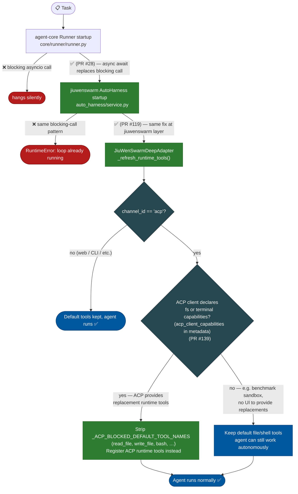
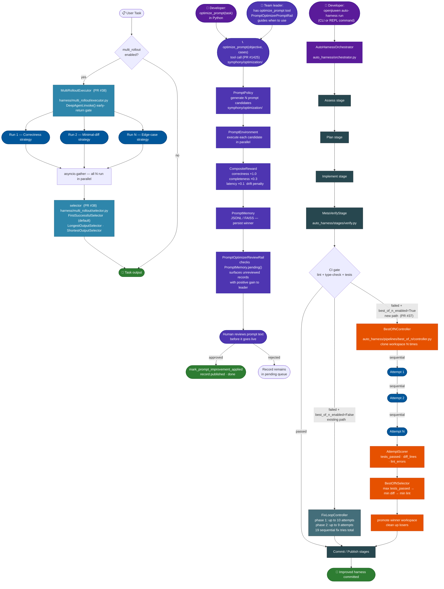
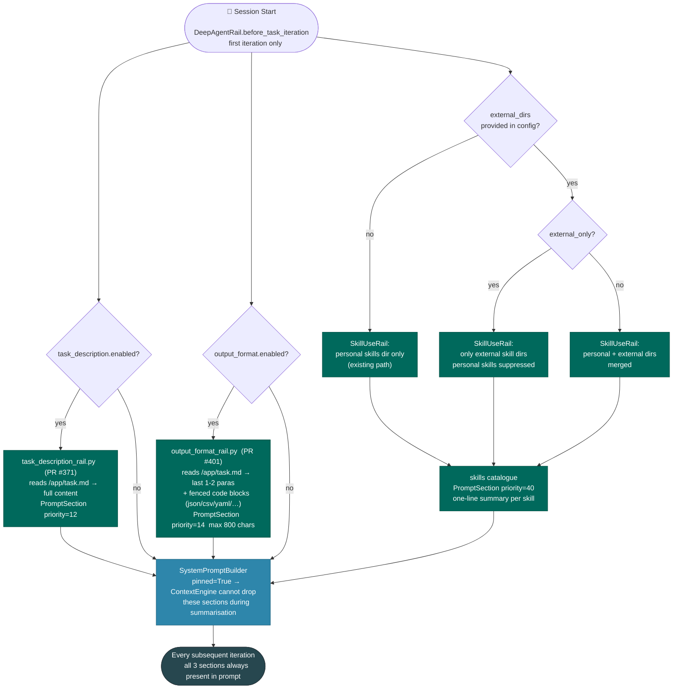
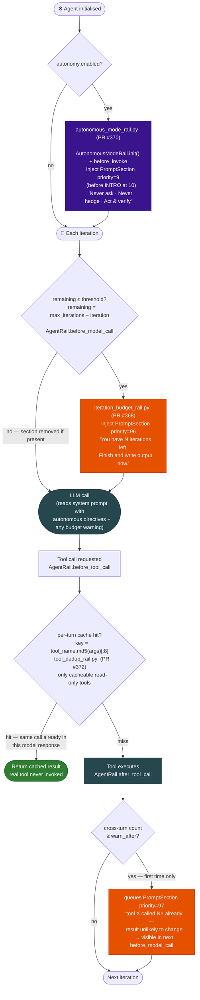
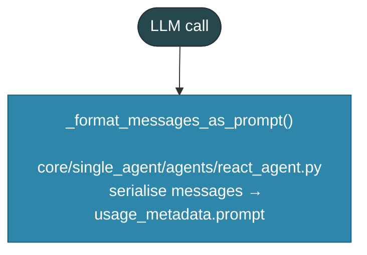
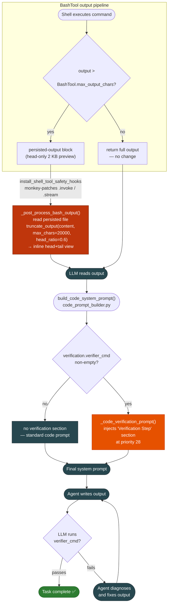

# JiuwenSwarm Quality Improvements — Technical Overview

**Audience:** architects and developers of `agent-core` and `jiuwenswarm`
**Purpose:** master orientation document; each of the 8 groups has its own deep-dive

---

## 1. Overview of Improvements

Each section below identifies: the failure mode, a feature summary, prior art, a data flow diagram, which hook points are used, and which files are touched.

---

#### <strong>Group 1 — Stability: Stop the agent from crashing before it even starts</strong>

**Failure mode:<br>** The process hangs or crashes before any iteration fires, producing zero output.

**Feature summary:<br>**
These are prerequisites — if any of them is missing, the agent produces zero output before a single hook fires. Item #1 fixes the asyncio lifecycle bug at both layers (agent-core and jiuwenswarm). Item #2 fixes a tool duplication problem on the ACP channel: before this change, ACP tools were simply added on top of the existing default tools, leaving the agent with both registered simultaneously. Now when the ACP client declares fs/terminal capabilities, the default equivalents are removed first and then replaced by the ACP-specific tools; when the ACP client declares no capabilities (e.g. benchmark sandboxes), the defaults stay so the agent can still act autonomously.

| # | Feature | What it does |
|---|---|---|
| #1 | Event Loop Fix (both layers) | Replaces blocking asyncio call in both `Runner` startup (agent-core) and `AutoHarness` service (jiuwenswarm); prevents silent hang |
| #2 | ACP Tool Deduplication Guard | Before this PR, ACP tools were added alongside default tools, causing duplication; now the default equivalents are removed first when the ACP client declares fs/terminal capabilities, and kept when it does not (e.g. benchmark sandboxes) |

<b>Data Flow</b>



<u>Technical Details</u>

<details>
<summary><strong>#1 — Event Loop Fix (both layers)</strong> &nbsp;(agent-core <code>fix/event-loop-blocking</code> (PR #28) + jiuwenswarm <code>bugfix/event-loop-blocking</code> (PR #119))</summary>

<br>

**How it works**

- Root cause: blocking `asyncio` call at two independent layers — `Runner` startup in agent-core and the `AutoHarness` service in jiuwenswarm
- Symptoms: process hangs silently (agent-core) or raises `RuntimeError: This event loop is already running` (jiuwenswarm)
- Fix: replace the blocking call with proper `async/await` in both locations. Both fixes are required.

**Technical metadata**

| | |
|---|---|
| **Hook points** | None — process-level fix, before any hook fires |
| **Files** | `core/runner/runner.py` — `Runner.__init__` / startup sequence<br>`agents/harness/common/auto_harness/service.py` — `AutoHarness` startup |

</details>

<br>

<details>
<summary><strong>#2 — ACP Tool Deduplication Guard</strong> &nbsp;(<code>feat/acp-runtime-tool-blocking</code> (PR #139))</summary>

<br>

**How it works**

- The ACP channel provides its own runtime tools for file and terminal access (`read_text_file`, `write_text_file`, `create_terminal`, etc.) when the ACP client has the corresponding capabilities
- **Problem before this PR:** `_refresh_acp_runtime_tools()` only added ACP tools — it never removed the default equivalents (`read_file`, `write_file`, `bash`, etc.). The agent ended up with both sets registered simultaneously, creating tool duplication and ambiguity
- **Fix (two new code blocks added):**
  - **Block 1 — remove defaults before adding ACP tools:** `if channel_id == "acp" and can_register_acp_runtime_tools`: iterate `ability_manager`, remove any tool whose name is in `_ACP_BLOCKED_DEFAULT_TOOL_NAMES`; this runs only when the ACP client actually has capabilities, so benchmark sandboxes and other ACP callers without caps keep their defaults and can still act autonomously
  - **Block 2 — clean up stale ACP tools:** always remove previously registered ACP tool names before re-registering; prevents accumulation across re-entrant calls on the same session
- `_acp_runtime_tools_enabled(request_metadata)` reads `caps["fs"]` and `caps["terminal"]` from `acp_client_capabilities` in the request metadata to determine which replacement tools the client can provide
- `_should_register_acp_runtime_tools(channel_id, request_id, session_id, has_runtime_capability)` returns `True` only when channel is `"acp"`, both `request_id` and `session_id` are set, and at least one capability is declared

**Technical metadata**

| | |
|---|---|
| **Hook points** | Request-level adapter — `JiuWenSwarmDeepAdapter._refresh_runtime_tools()`, not a standard rail hook |
| **Key methods** | `_acp_runtime_tools_enabled()`, `_should_register_acp_runtime_tools()` (both in `interface_deep.py`) |
| **Files** | `jiuwenswarm/server/runtime/agent_adapter/interface_deep.py` (only changed file in this PR) |

</details>

---

#### <strong>Group 2 — Scale: Try more than one approach, submit the best</strong>

**Failure mode:<br>** A single deterministic attempt on a hard task has a low per-attempt success probability. Running once is insufficient.

**Feature summary:<br>**
All three features apply the same principle — "try N variants, keep the best" — but at different levels and with different entry points. #3 and #5 are triggered by a regular user task (agent invocation). #4 is triggered by the developer manually running `openjiuwen auto-harness run` (CLI or REPL), which executes its own Assess → Plan → Implement → Verify pipeline independent of the agent's task loop.

| # | Feature | What it does |
|---|---|---|
| #3 | Multi-Rollout | Runs N workspace clones in parallel with different strategies; `FirstSuccessfulSelector` / `LongestOutputSelector` / `ShortestOutputSelector` picks the best output |
| #4 | Auto-Harness Best-of-N | When CI fails in the verify stage, runs N fix agents on workspace clones (one per strategy); `BestOfNSelector` promotes the winner by `tests_passed` → `diff_lines` → `lint_errors` |
| #5 | RLAF-P Prompt Optimizer | RL loop generating N prompt candidates; scored by composite reward; winner persisted to `PromptMemory` for reuse |

<b>Data Flow</b>



<u>Technical Details</u>

<details>
<summary><strong>#3 — Multi-Rollout Task Execution</strong> &nbsp;(agent-core <code>feat/multi-rollout-task-execution</code> (PR #38))</summary>

<br>

**How it works**

- Early-return gate in `DeepAgent.invoke()`: if `deep_config.multi_rollout.enabled`, delegate to `MultiRolloutExecutor` before the standard pipeline starts
- `MultiRolloutExecutor._create_subagents(n)`: create N isolated subagents
- `_build_attempt_inputs()`: inject a strategy prefix into the query for each subagent:
  - Attempt 0: focus on correctness and thoroughness
  - Attempt 1: focus on minimal changes — change as few lines as possible
  - Attempt 2: focus on edge cases and defensive programming
- `_execute_parallel()`: run all N via `asyncio.gather` with `asyncio.Semaphore(max_parallel)` for concurrency control; each attempt has an individual `timeout_per_rollout` (default 600 s)
- Selector picks the winner from `RolloutResult` objects: `FirstSuccessfulSelector` (default) / `LongestOutputSelector` / `ShortestOutputSelector`
- Converts single-attempt to pass@k: expected pass rate rises from p → 1-(1-p)^N

**Technical metadata**

| | |
|---|---|
| **Hook points** | Early-return in `DeepAgent.invoke()` before `ReActAgent.before_invoke` — bypasses the standard pipeline entirely |
| **New classes** | `MultiRolloutExecutor`, `MultiRolloutConfig`, `RolloutResult`, `FirstSuccessfulSelector`, `LongestOutputSelector`, `ShortestOutputSelector` |
| **Config** | `multi_rollout.enabled` (bool, default `False`); `multi_rollout.n_rollouts` (int, default 3); `multi_rollout.selector_kind` (str, default `"first_successful"`); `multi_rollout.timeout_per_rollout` (float, default 600.0 s) |
| **Files** | `openjiuwen/harness/multi_rollout/executor.py`, `config.py`, `selector.py`; `openjiuwen/harness/schema/config.py` (`DeepConfig.multi_rollout` field); `openjiuwen/harness/deep_agent.py` (early-return gate in `invoke()`) |

</details>

<br>

<details>
<summary><strong>#4 — Auto-Harness Best-of-N</strong> &nbsp;(agent-core <code>feat/auto-harness-best-of-n</code> (PR #37))</summary>

<br>

**How it works**

- **Entry point:** this is not triggered by a user task. It runs inside the `openjiuwen auto-harness run` CLI / REPL pipeline — a developer tool that runs its own Assess → Plan → Implement → Verify → Commit pipeline to improve the harness itself
- Replaces the iterative fix loop (phase 1: 10 tries + phase 2: 9 tries = 19 sequential attempts) when enabled
- Trigger: `MetaVerifyStage.stream()` — fires after the implement stage when `CIGateRunner` reports CI failure AND `best_of_n_enabled = True`
- Clone the current workspace N times via `WorkspaceCloner.clone_n_async()` (default N = 3)
- For each clone, run the fix agent **sequentially** (sequential is required; each attempt calls `os.chdir` into its clone) with a strategy-specific prompt:
  - Attempt 0: "CI failed — fix focusing on correctness"
  - Attempt 1: "CI failed — minimal code changes, change as few lines as possible"
  - Attempt 2: "CI failed — fix focusing on edge cases and boundary conditions"
- Score each completed workspace via `AttemptScorer`:
  - `tests_passed`: result from `CIGateRunner.run("all")` on the clone
  - `diff_lines`: total insertions + deletions from `git diff HEAD --stat`
  - `lint_errors`: violation count from `ruff check --output-format json`
- `BestOfNSelector` picks winner: max `tests_passed` → min `diff_lines` → min `lint_errors`
- Promote winning workspace back to the original path; clean up all other clones

**Technical metadata**

| | |
|---|---|
| **Hook points** | `MetaVerifyStage.stream()` in the auto-harness verify stage — not a standard rail hook point |
| **New classes** | `BestOfNController`, `AttemptScorer`, `AttemptScore`, `ScoredAttempt`, `BestOfNSelector`, `BestOfNResult` |
| **Config** | `best_of_n_enabled` (bool, default `False`); `best_of_n_attempts` (int, default 3) — both in `AutoHarnessConfig` |
| **Files** | `openjiuwen/auto_harness/pipelines/best_of_n/controller.py`, `attempt_scorer.py`, `attempt_selector.py`; `openjiuwen/auto_harness/stages/verify.py` (MetaVerifyStage); `openjiuwen/auto_harness/orchestrator.py` (BestOfNController init) |

</details>

<br>

<details>
<summary><strong>#5 — RLAF-P Runtime Prompt Optimizer</strong> &nbsp;(jiuwenswarm <a href="https://github.com/openJiuwen-ai/jiuwenswarm/pull/1425"><code>feat/optimization</code> (PR #1425)</a>)</summary>

<br>

**How it works**

- Gated by `symphony.optimization.enabled` (default false); restricted to team leader role
- Generate N candidate prompts via `PromptPolicy`
- Execute each candidate via `PromptEnvironment`
- Score with composite reward: correctness ×1.0 · completeness ×0.3 · latency ×0.1 · token cost · drift penalty
- Persist best performer to JSONL prompt knowledge base (`PromptMemory`) for reuse across sessions
- `PromptOptimizerReviewRail` surfaces winning candidates to the leader for human confirmation before any prompt goes live

**Technical metadata**

| | |
|---|---|
| **Hook points** | `optimize_prompt` tool call + `PromptOptimizerReviewRail` at `AgentRail.before_model_call` for leader only |
| **New classes** | `PromptPolicy`, `PromptEnvironment`, `CompositeReward`, `LLMDriftJudge`, `ConvergenceDetector`, `PromptMemory`, `PromptOptimizerReviewRail` |
| **Config** | `symphony.optimization.enabled` (bool, default false) |

</details>

---

#### <strong>Group 3 — Session Start: Make sure the agent begins with everything it needs</strong>

**Failure mode:<br>** The agent starts each task with no knowledge of the output contract or available tools. After compression, even its memory of the goal becomes lossy.

**Feature summary:<br>**
All three rails add a permanent section to `SystemPromptBuilder` so the content lives in the system prompt rather than the conversation history and is therefore never removed by context compression. #6 and #7 hook into `ReActAgent.before_invoke` (fires at the start of each task iteration) with a `before_model_call` retry in case the file is not yet available at invoke time. #8 scans external skill dirs at the same point.

| # | Feature | What it does |
|---|---|---|
| #6 | Task Description Re-injection | Reads `task.md` in full and adds it as a `PromptSection(priority=12)` in the system prompt; the agent always has the original goal regardless of how long the conversation has grown |
| #7 | Output Format Reminder | Extracts the last 1–2 format-signal paragraphs and fenced code blocks (json/csv/yaml/xml/…) from `task.md`; adds as `PromptSection(priority=14)`; capped at 800 chars |
| #8 | External Skill Directories | Loads skills from configurable paths (`skills.external_dirs` in config or `EXTERNAL_SKILL_DIRS` env var); injects skill catalogue into system prompt at `priority=900`; `external_only` flag isolates the agent to task-provided skills only (CI/benchmark use) |

<b>Data Flow</b>



<u>Technical Details</u>

<details>
<summary><strong>#6 — Task Description Re-injection</strong> &nbsp;(<code>feat/task-description-reinjection</code> (PR #371))</summary>

<br>

**How it works**

- `before_invoke` fires at the start of each task iteration: clears any previous section, then calls `_try_inject()` to read the file and add a fresh section
- `before_model_call` also calls `_try_inject()` on every model call until `self._injected` is `True` — handles the case where the file is mounted asynchronously and not yet present at invoke time
- Once injected, the section lives in `SystemPromptBuilder` for the remainder of the invocation — it is part of the system prompt, not the conversation history, so context compression never touches it
- Content injected: `# Task Description\n\n<full file content>` as `PromptSection(name="task_description", priority=12)` — sits just after the INTRO section (10) and before SYSTEM (15), so the agent reads the full goal at the very top of every system prompt
- If the file is absent or unreadable: logs a warning and skips — no crash, no side effect
- Addresses the most common form of task drift: after 20+ turns of context compression, the agent's working memory of the goal becomes lossy; the system-prompt section never moves

**Technical metadata**

| | |
|---|---|
| **Hook points** | `ReActAgent.before_invoke` (each task iteration) + `AgentRail.before_model_call` (retry until file available) |
| **Config** | `task_description.enabled` (bool, default `false`); `task_description.path` (str, default `/app/task.md`) |
| **Prompt position** | `PromptSection(priority=12)` — after INTRO (10), before SYSTEM (15) |
| **File** | `agents/harness/common/rails/task_description_rail.py` |

</details>

<br>

<details>
<summary><strong>#7 — Output Format Reminder Rail</strong> &nbsp;(<code>feat/output-format-reminder-rail</code> (PR #401))</summary>

<br>

**How it works**

- Same lifecycle as #6: `before_invoke` clears and re-injects at each invocation; `before_model_call` retries until `self._injected` is `True`
- **Extraction pipeline** (all steps operate on the YAML-frontmatter-stripped body):
  - `_last_paragraphs(body, n=2)` — takes the last 2 non-empty paragraphs
  - `_has_format_signal(para)` — filters: only keeps paragraphs containing words like `output`, `save`, `write`, `store`, `produce`, `generate`, `file`, `path`, `csv`, `json`, `yaml`, etc.
  - `_output_code_blocks(body, max_blocks=2)` — finds fenced code blocks tagged with any of: `json`, `csv`, `tsv`, `yaml`, `yml`, `xml`, `toml`, `txt`, `text`, `plaintext`
  - If neither relevant paragraphs nor code blocks are found: section is silently skipped
- Builds snippet: filtered paragraphs first, then code blocks; hard-truncated at `max_chars` (default 800) on a newline boundary
- Injects: `# Required Output Format\n\n{snippet}` as `PromptSection(name="output_format_reminder", priority=14)` — sits just after the full task description (12) and before SYSTEM (15)
- One wrong key name or wrong file extension renders output unusable even when the answer content is correct; this section keeps the format contract visible regardless of context length

**Technical metadata**

| | |
|---|---|
| **Hook points** | `ReActAgent.before_invoke` (each task iteration) + `AgentRail.before_model_call` (retry until file available) |
| **Config** | `output_format.enabled` (bool, default `false`); `output_format.path` (str, default `/app/task.md`); `output_format.max_chars` (int, default `800`) |
| **Prompt position** | `PromptSection(priority=14)` — after task description (12), before SYSTEM (15) |
| **File** | `agents/harness/common/rails/output_format_rail.py` |

</details>

<br>

<details>
<summary><strong>#8 — External Skill Directories</strong> &nbsp;(<code>feat/external-skill-discovery</code> (PR #214))</summary>

<br>

**How it works**

- Fires once at session start — `DeepAgentRail.before_task_iteration`, first iteration only; no-op on all subsequent turns
- Skills are loaded from **configurable external directories** — two equivalent config methods, merged together:
  - **YAML**: `skills.external_dirs` in `config.yaml` — a list of paths on disk
  - **Env var**: `EXTERNAL_SKILL_DIRS` — semicolon-separated paths (useful in CI where config files are not mounted)
- Each configured directory is scanned for `SKILL.md` files; the first paragraph of each file is extracted as a one-line summary
- Result injected into the system prompt as `PromptSection(pinned=True, priority=900)` — one entry per skill: name + summary; `ContextEngine` cannot drop this section during summarisation
- **`external_only: true`** (config flag): when external dirs are non-empty, suppresses the agent's personal installed-skills dir entirely — only the task-provided skills are visible; falls back to personal dir if external dirs are empty; designed for CI and benchmark pipelines where personal skills would be distractors
- **Precedence**: if a skill with the same name exists in both the personal dir and an external dir, the personal dir wins; external duplicates are silently skipped
- **Primary use cases**: CI / benchmark pipelines that mount task-specific skills at a known path; development workflows where skills live in a project repo and should be testable without installing via the UI
- Without this: agents in benchmark / CI environments have no knowledge of task-specific `SKILL.md` files → re-implement skill logic from scratch → wrong output formats, missing validation rules

**Technical metadata**

| | |
|---|---|
| **Hook points** | `DeepAgentRail.before_task_iteration` first iteration only; `PromptSection(pinned=True, priority=900)` |
| **Config** | `skills.external_dirs` (YAML list of paths); `EXTERNAL_SKILL_DIRS` (env var, semicolon-separated); `skills.external_only` (bool, default `false`) |
| **File** | `rails/runtime_prompt_rail.py` (or dedicated skill-discovery rail) |

</details>

---

#### <strong>Group 4 — Budget Awareness: Don't waste the limited number of steps</strong>

***Failure mode:<br>** The agent exhausts its iteration budget on redundant reads, confirmation pauses, and exploration without ever writing output.

**Feature summary:<br>**
Each rail targets a different cause of budget exhaustion. #9 and #10 hook into `AgentRail.before_model_call` / `before_tool_call`. #11 is different — it injects directives into the system prompt at agent initialisation so the LLM never produces hedging or confirmation requests in the first place.

| # | Feature | What it does |
|---|---|---|
| #9 | Iteration Budget Rail | On each `before_model_call` computes `remaining = max_iterations − iteration`; injects a budget-warning section (priority 96) when `remaining ≤ threshold` (default 10); section removed when back above threshold |
| #10 | Tool Call Dedup Cache | Per-turn: suppresses identical repeat calls within one LLM response (MD5-8 key); cross-turn: injects a prompt warning (priority 97) after `warn_after` real executions of the same call |
| #11 | Autonomous Execution Mode | Injects a static directive block (priority 9, before INTRO) at agent init and each `before_invoke`; directs the LLM to never ask for clarification, never hedge, act and verify autonomously |

<b>Data Flow</b>



<u>Technical Details</u>

<details>
<summary><strong>#9 — Iteration Budget Awareness Rail</strong> &nbsp;(<code>feat/iteration-budget-awareness</code> (PR #368))</summary>

<br>

**How it works**

- Rail is **always attached** — no `enabled` flag; reads `max_iterations` and `budget_warning_threshold` directly from the `react` config block
- `before_invoke`: clears any stale warning section at the start of each invocation
- `before_model_call`: reads `ctx.session.get_state("iteration")` to get the current iteration count; computes `remaining = max_iterations − iteration`; removes the previous section, then re-evaluates:
  - If `remaining ≤ warning_threshold` → inject `PromptSection(name="iteration_budget_warning", priority=96)` with the text: *"You have used N of M iterations and have approximately R remaining. Prioritise completing or cleanly summarising your current task. Do not start new long subtasks. If you cannot finish, produce the best partial result you can and clearly state what remains."*
  - If above threshold → section is not added (or was already removed)
- Section priority 96 places it just after `runtime.model_answer_policy` (95), so the urgency message sits near the top of what the LLM reads
- Prevents the agent from starting new long subtasks in the final turns, which would exhaust the budget without producing output

**Technical metadata**

| | |
|---|---|
| **Hook points** | `ReActAgent.before_invoke` (clear); `AgentRail.before_model_call` (evaluate and inject/remove each turn) |
| **Config** | `react.max_iterations` (int, default `100`); `react.budget_warning_threshold` (int, default `10`) |
| **Prompt position** | `PromptSection(priority=96)` — just after runtime.model_answer_policy (95) |
| **File** | `agents/harness/common/rails/iteration_budget_rail.py` |

</details>

<br>

<details>
<summary><strong>#10 — Tool Call Deduplication Cache</strong> &nbsp;(<code>feat/tool-call-dedup-cache</code> (PR #372))</summary>

<br>

**How it works**

Two independent mechanisms are active simultaneously:

**Mechanism 1 — Per-turn deduplication** (within one LLM response):
- `before_model_call`: clears `_turn_cache` at the start of every model call (fresh cache per LLM response)
- `before_tool_call`: computes `key = f"{tool_name}:{md5(json.dumps(args, sort_keys=True))[:8]}"` for cacheable tools only; if key is in `_turn_cache` → sets `ctx.extra["_skip_tool"] = True`, writes cached result back to `ctx.inputs.tool_result` and `ctx.inputs.tool_msg` — the real tool is never invoked
- `after_tool_call`: stores the result of a fresh (non-cached) execution into `_turn_cache`

**Mechanism 2 — Cross-turn repetition warning** (across the whole session):
- `after_tool_call`: increments `_exec_counts[key]`; when count first reaches `warn_after` → calls `_inject_warning()`
- `_inject_warning()`: builds an aggregated notice listing all over-threshold tool+fingerprint pairs with their counts; injects as `PromptSection(name="tool_dedup_warning", priority=97)`

**Cacheable tool whitelist** (side-effecting tools are never intercepted):
`read_file`, `read_text_file`, `read`, `glob`, `glob_file_search`, `list_dir`, `list_files`, `grep`, `search`

**Technical metadata**

| | |
|---|---|
| **Hook points** | `AgentRail.before_model_call` (clear per-turn cache); `AgentRail.before_tool_call` (hit check); `AgentRail.after_tool_call` (cache write + cross-turn counter) |
| **Config** | `tool_dedup.enabled` (bool, default `false`); `tool_dedup.warn_after` (int, default `3`) |
| **Prompt position** | Warning: `PromptSection(priority=97)` |
| **File** | `agents/harness/common/rails/tool_dedup_rail.py` |

</details>

<br>

<details>
<summary><strong>#11 — Autonomous Execution Mode</strong> &nbsp;(<code>feat/autonomous-execution-mode</code> (PR #370))</summary>

<br>

**How it works**

- This rail does **not** post-process LLM output — it prevents hedging and confirmation requests from appearing in the first place by injecting directives into the system prompt
- `init()`: immediately on agent construction, if `autonomy.enabled` is `true`, adds a `PromptSection(name="autonomous_mode", priority=9)` — priority 9 places it directly before INTRO (10), making it one of the very first lines the LLM reads in every system prompt
- `before_invoke`: re-asserts the section at the start of each task iteration (clears + re-adds) to ensure it is never accidentally removed
- **`_AUTONOMOUS_DIRECTIVE` content** (injected verbatim):
  - Never ask for clarification or confirmation — the task description is complete; proceed directly
  - Never ask permission before acting — all tool use is pre-authorised; execute read/write/edit/shell without prompting
  - Never hedge or express uncertainty — make a decision and act on it; choose the most reasonable interpretation
  - Verify your own work — use available tools (tests, linters, build commands) to confirm correctness; iterate on failures autonomously
  - Complete the task end-to-end — do not stop mid-task to report progress; finish, verify, then report the final outcome
- Rail is **always attached** (no `enabled` check at attachment time) but only injects content when `autonomy.enabled` is `true`; when `false`, the `init()` and `before_invoke` hooks are no-ops
- Target failure: in a CI/benchmark environment the agent produces correct plans but stalls waiting for human confirmation that will never arrive

**Technical metadata**

| | |
|---|---|
| **Hook points** | `DeepAgentRail.init()` (inject immediately on construction); `ReActAgent.before_invoke` (re-assert each iteration) |
| **Config** | `autonomy.enabled` (bool, default `false`) |
| **Prompt position** | `PromptSection(priority=9)` — before INTRO (10); first directive the LLM reads |
| **File** | `agents/harness/common/rails/autonomous_mode_rail.py` |

</details>

---

#### <strong>Group 5 — Loop Breaking: Escape patterns that consume steps without progress</strong>

***Failure mode:<br>** The agent enters a repetition or patch loop, consuming the entire iteration budget without changing strategy.

**Feature summary:<br>**
Five mechanisms, each targeting a different loop or inefficiency pattern and operating at a different granularity. They are independent and complementary — a session can trigger multiple simultaneously.

| # | Feature | What it does |
|---|---|---|
| #12 | Anti-Repetition Prompt | System prompt instruction not to repeat identical tool calls already made in the session |
| #13 | Failure Pattern Memory | Logs each failed tool call; prepends "do not repeat these approaches" block before every LLM call |
| #14 | Step-Back Rail | Counts consecutive non-zero exit codes; injects escalating "rethink strategy" directive at N and 2N |
| #15 | Verifier Circuit Breaker | Fingerprints verifier failure (test + assertion + exit code); injects escalating "abandon approach" directive at N and 2N identical failures |
| #16 | Context Headroom Guard | Monitors token fill ratio via `ctx.context.statistic()`; injects conciseness directive at 60%, urgent directive at 80% |

```mermaid
flowchart TD
    classDef ac   fill:#2E86AB,color:#fff,stroke:#1a5f7a
    classDef pre  fill:#E65100,color:#fff,stroke:#BF360C
    classDef post fill:#BF360C,color:#fff,stroke:#6f2407
    classDef io   fill:#27474F,color:#fff,stroke:#263238

    PROMPT(["Prompt build · SystemPromptBuilder"])

    PROMPT --> AR["Anti-Repetition · identity.py
    openjiuwen/harness/prompts/sections/identity.py
    explicit: never repeat identical tool calls"]:::ac

    AR --> CH_GATE{"context_headroom
    enabled?"}

    CH_GATE -->|"yes"| CH_RATIO["ctx.context.statistic()
    total_tokens / context_window"]
    CH_GATE -->|"no"| FM_GATE

    CH_RATIO -->|"< warn_ratio (60%)"| CH_PASS(["no injection"])
    CH_RATIO -->|"≥ warn_ratio (60%)"| CH_NUDGE["inject: be concise —
    do not restate, prefer short confirmations
    (PromptSection priority 93)"]:::pre
    CH_RATIO -->|"≥ critical_ratio (80%)"| CH_CRIT["inject: be extremely brief —
    compression imminent, do not repeat
    or summarise past steps"]:::pre

    CH_PASS & CH_NUDGE & CH_CRIT --> FM_GATE{"failure_memory
    enabled?"}

    FM_GATE -->|"yes"| DMEM["failure_memory_rail.py (PR #396) · before_model_call
    read _failure_memory · if non-empty
    inject numbered list into system prompt (priority 95)"]:::pre

    FM_GATE -->|"no"| SB_GATE
    DMEM --> SB_GATE{"step_back
    enabled?"}

    SB_GATE -->|"yes"| SB_CHK{"_step_back_consecutive_failures"}
    SB_GATE -->|"no"| VCB_GATE

    SB_CHK -->|"< N (default 3)"| VCB_GATE
    SB_CHK -->|"≥ N"| SB1["step_back_rail.py (PR #399)
    inject 4-step rethink directive (priority 94)
    single level — no 2N escalation"]:::pre

    SB1 --> VCB_GATE{"verifier_circuit_breaker
    enabled?"}

    VCB_GATE -->|"yes"| VCB_CHK{"_vcb_consecutive"}
    VCB_GATE -->|"no"| LLM

    VCB_CHK -->|"< N (default 3)"| LLM
    VCB_CHK -->|"≥ N"| VCB1["verifier_circuit_breaker_rail.py (PR #409)
    inject: rethink directive (priority 96)"]:::pre
    VCB_CHK -->|"≥ 2N"| VCB2["inject: CIRCUIT BREAKER
    ABANDON everything · start from scratch"]:::pre

    VCB1 & VCB2 --> LLM(["LLM call"]):::io

    %% ── after_tool_call: two independent filter passes ──

    LLM -->|"normal result"| FM_CHK{"error strings in result?
    (15+ patterns: Traceback / Error: /
    FAILED / SyntaxError …)"}

    LLM -->|"tool exception"| EXCEP(["on_tool_exception"]):::post

    FM_CHK -->|"yes"| FM_W["append to _failure_memory
    tool + args_120chars + error_snippet_300chars
    skip if duplicate of last · keep max 10"]:::post
    FM_CHK -->|"no"| SH_CHK

    FM_W --> SH_CHK
    EXCEP --> FM_W
    EXCEP --> SB_INC

    SH_CHK{"shell tool?
    bash / run_bash /
    mcp_exec_command …"}

    SH_CHK -->|"not a shell tool"| VER_CHK
    SH_CHK -->|"exit code = 0"| SB_RST["reset
    _step_back_consecutive_failures = 0"]:::post
    SH_CHK -->|"exit code ≠ 0"| SB_INC["increment
    _step_back_consecutive_failures"]:::post

    SB_RST & SB_INC --> VER_CHK{"≥ 2 verifier markers?
    pytest / PASSED / FAILED /
    AssertionError / reward.txt …"}

    VER_CHK -->|"no verifier output"| END5
    VER_CHK -->|"success
    (N passed / reward:1)"| VCB_CLR["clear _vcb_failure_sig
    clear _vcb_consecutive"]:::post
    VER_CHK -->|"failure"| VER_FP["normalize FAILED/AssertionError lines
    compute MD5 fingerprint (16 hex chars)"]:::post

    VER_FP --> SAME{"same as _vcb_failure_sig?"}
    SAME -->|"yes"| VCB_INC["increment _vcb_consecutive"]:::post
    SAME -->|"no"| VCB_RST["reset _vcb_consecutive = 1
    store new _vcb_failure_sig"]:::post

    VCB_CLR & VCB_INC & VCB_RST --> END5(["🏁 Turn complete"]):::done
```

<b>Data Flow</b>



<u>Technical Details</u>

<details>
<summary><strong>#12 — Anti-Repetition Identity Prompt</strong></summary>

<br>

**How it works**

- Adds an explicit instruction to the agent identity prompt: if a tool returns no results, empty output, or an error, do **not** call the same tool with identical arguments again; refer to the tool-call history already visible in the conversation context and try a different tool or approach
- Not a separate runtime rail — the identity section is baked into every system prompt at priority 10

**Technical metadata**

| | |
|---|---|
| **Hook points** | `PromptSection` priority 10 — always present in the system prompt |
| **File** | `openjiuwen/harness/prompts/sections/identity.py` |

</details>

<br>

<details>
<summary><strong>#13 — Failure Pattern Memory Rail</strong> &nbsp;(<code>feat/failure-pattern-memory-rail</code> (PR #396))</summary>

<br>

**How it works**

- `DeepAgentRail.after_tool_call`: inspects the tool result string for 15+ error substrings (`Traceback`, `Error:`, `FAILED`, `exit code 1`, `SyntaxError`, `FileNotFoundError`, etc.); if matched, extracts the error line plus up to 5 following lines (max 300 chars) and appends `(tool_name, args_120chars, error_snippet)` to the session failure log
- `DeepAgentRail.on_tool_exception`: also appends exception text (max 300 chars) when a tool raises an exception instead of returning a result
- Deduplication: skips if the new entry is identical to the most recent one; keeps at most `max_failures` entries (default 10, rolling window)
- `DeepAgentRail.before_model_call`: if the failure log is non-empty, injects a numbered-list system-prompt section at priority 95: `{i}. \`{tool}\` → {error_snippet}`
- Prevents the agent from retrying approaches that have already been proven to fail

**Technical metadata**

| | |
|---|---|
| **Hook points** | `after_tool_call` + `on_tool_exception` write; `before_model_call` read and inject |
| **File** | `rails/failure_memory_rail.py`; session-state key `_failure_memory`; config `failure_memory.max_failures: 10` |

</details>

<br>

<details>
<summary><strong>#14 — Step-Back Rail</strong> &nbsp;(<code>feat/step-back-rail</code> (PR #399))</summary>

<br>

**How it works**

- Only monitors shell tools: `mcp_exec_command`, `bash`, `run_bash`, `execute_command`, `run_command`, `run_shell`
- `DeepAgentRail.after_tool_call`: parses exit code from the JSON result (accepts `exit_code`, `exitCode`, `returncode`, `return_code` keys); exit code 0 resets the counter to 0; any non-zero value increments it; result stored in session state
- `DeepAgentRail.on_tool_exception`: also increments the counter when a shell tool raises an exception
- `DeepAgentRail.before_model_call`: if `consecutive ≥ step_back_after` (default 3), injects a 4-step rethink directive into the system prompt (priority 94): re-read the task → identify root cause → design a different strategy → execute; otherwise removes the section
- Single-level only — no escalation at 2N
- Target failure: marginal one-line patches to the same broken implementation, repeated until timeout

**Technical metadata**

| | |
|---|---|
| **Hook points** | `after_tool_call` + `on_tool_exception` count; `before_model_call` inject |
| **File** | `rails/step_back_rail.py`; session-state key `_step_back_consecutive_failures`; config `step_back.step_back_after: 3` |

</details>

<br>

<details>
<summary><strong>#15 — Verifier Circuit Breaker Rail</strong> &nbsp;(<code>feat/verifier-circuit-breaker-rail</code> (PR #409))</summary>

<br>

**How it works**

- `DeepAgentRail.after_tool_call`: first checks if the tool output is actually verifier output — requires ≥ 2 of 10 markers: `pytest`, `PASSED`, `FAILED`, `AssertionError`, `reward.txt`, etc.; non-verifier tool output is ignored entirely
- **Success path**: if the output contains `"{N} passed"` with no `"failed"` string, or `"reward: 1"`, both session-state keys are cleared and the circuit-breaker section is removed
- **Failure path**: extracts `FAILED`, `AssertionError`, and `E ` lines (up to 20), normalizes away `/tmp/` paths, timestamps, line numbers, and memory addresses, then computes an MD5 fingerprint (first 16 hex chars)
  - Different signature from last run → resets counter to 1, stores new signature
  - Same signature → increments counter
- `DeepAgentRail.before_model_call`: removes any existing section; if `consecutive ≥ break_after` (default 3), injects a rethink directive (priority 96); if `consecutive ≥ break_after × 2`, escalates to a "CIRCUIT BREAKER — ABANDON everything and start from scratch" directive
- Priority 96 > StepBackRail (94), so the circuit-breaker directive takes precedence when both rails are active simultaneously
- Target failure: same assertion fails → agent patches one line → verifier re-runs → same assertion fails → repeat ×15 → timeout

**Technical metadata**

| | |
|---|---|
| **Hook points** | `after_tool_call` fingerprint and count; `before_model_call` inject |
| **File** | `rails/verifier_circuit_breaker_rail.py`; session-state keys `_vcb_failure_sig`, `_vcb_consecutive`; default `break_after=3` |
| **Fingerprint** | MD5 first 16 hex chars of normalized FAILED/AssertionError lines — identical only when the same assertion fails in the same location |

</details>

<details>
<summary><strong>#16 — Context Headroom Guard</strong></summary>

<br>

**How it works**

- `DeepAgentRail.before_model_call` (priority 9): reads `ctx.context.statistic().total_tokens` and compares to `ctx.context._context_window_tokens`
- Computes `ratio = total_tokens / max_tokens`
  - `≥ critical_ratio (80%)`: injects a strong "compression imminent — be extremely brief, do not repeat or summarise" directive (PromptSection priority 93)
  - `≥ warn_ratio (60%)`: injects a moderate "be concise — do not restate, prefer short confirmations" nudge (PromptSection priority 93)
  - Below `warn_ratio`: removes section if previously injected
- Slows the rate at which the context window fills, delaying destructive automatic summarisation
- No session state — reads fresh from the context object every time

**Technical metadata**

| | |
|---|---|
| **Hook points** | `DeepAgentRail.before_model_call`; reads `ctx.context.statistic().total_tokens` and `ctx.context._context_window_tokens` |
| **File** | `jiuwenswarm/agents/harness/common/rails/context_headroom_rail.py` |
| **Config** | `context_headroom.enabled` (default false), `warn_ratio` (default 0.60), `critical_ratio` (default 0.80) |
| **Registration** | `interface_deep.py` — gated by `enabled` |

</details>

---

#### <strong>Group 6 — Observability: Inspect what the LLM actually received</strong>

***Failure mode:<br>** Prompt regressions go undetected across runs; there is no record of what was actually sent to the LLM.

**Feature summary:<br>**

| # | Feature | What it does |
|---|---|---|
| #17 | Prompt Serialisation | Serialises the assembled messages into `usage_metadata.prompt` after every LLM call, making the prompt available for downstream inspection |

<b>Data Flow</b>



<u>Technical Details</u>

<details>
<summary><strong>#17 — Prompt Serialisation</strong> &nbsp;(<code>react_agent.py</code>)</summary>

<br>

**How it works**

- After every LLM call (both streaming and non-streaming paths), `_format_messages_as_prompt()` serialises the assembled messages into `ai_message.usage_metadata.prompt`
- The serialised prompt rolls up each message as `[role]: content | tool_calls=[...]` with a configurable max length
- Enables downstream tools (logging, telemetry, debugging) to inspect exactly what was sent to the LLM

**Technical metadata**

| | |
|---|---|
| **Hook point** | `_railed_model_call()` — after LLM returns, before returning the `AssistantMessage` |
| **Location** | `core/single_agent/agents/react_agent.py` — standalone function `_format_messages_as_prompt` |

</details>

---

#### <strong>Group 7 — Output Quality: Make sure the final answer is correct and in the right place</strong>

***Failure mode:<br>** The agent produces a correct answer but (a) cannot read the verifier's error because it was truncated from the head, or (b) submits output without first checking whether the verifier passes.

**Feature summary:<br>**
Two features acting at adjacent points: #18 preserves verifier error output that was previously truncated; #19 adds a "Verification Step" to the code system prompt so the agent knows to run verifier before declaring done.

| # | Feature | What it does |
|---|---|---|
| #18 | Bash Output Head+Tail | Monkey-patches `BashTool.invoke`/`.stream` to replace `<persisted-output>` head-only preview with inline head+tail view; preserves verifier error messages at the end of long output |
| #19 | Self-Verification Prompt | Injects a "Verification Step" section into the code system prompt instructing the agent to run the verifier after writing output files and loop until it passes |

<b>Data Flow</b>



<u>Technical Details</u>

<details>
<summary><strong>#18 — Bash Output Head+Tail Truncation</strong></summary>

<br>

**How it works**

- `install_shell_tool_safety_hooks()` in `bash_tool_safety.py` monkey-patches `BashTool.invoke` and `BashTool.stream` (and `PowerShellTool`)
- After each shell call, `_post_process_bash_output()` checks whether the output contains a `<persisted-output>` block — this is the marker BashTool inserts when output exceeds `max_output_chars` and only a head-only 2 KB preview is shown
- If found, the function reads the persisted temp file, calls `truncate_output(full_content, max_chars, head_ratio)` from openjiuwen's `bash._output` module, and replaces the marker with an inline head+tail view that fits within `max_chars`
- Config: `shell_output.max_chars` (default 20000) — total characters budget; `shell_output.head_ratio` (default 0.6) — fraction kept from the head, the remainder from the tail
- The same config is also consumed by `command_tools.py`'s `_clip_head_tail()` for `mcp_exec_command` output clipping
- Not a rail — no `AgentRail` hook; it operates on `ToolOutput` data returned by the tool

**Technical metadata**

| | |
|---|---|
| **Mechanism** | Monkey-patch on `BashTool.invoke` / `BashTool.stream` — not a rail hook |
| **Config** | `shell_output.max_chars: 20000` · `shell_output.head_ratio: 0.6` |
| **Trigger** | `<persisted-output>` marker in tool output (BashTool's own truncation) |
| **Files** | `bash_tool_safety.py` — post-processing hook installation<br>`command_tools.py` — `_clip_head_tail()` for `mcp_exec_command` |

</details>

<br>

<details>
<summary><strong>#19 — Self-Verification Prompt</strong></summary>

<br>

**How it works**

- `_code_verification_prompt()` in `code_prompt_builder.py` reads `verification.verifier_cmd` from config at prompt-build time
- If `verifier_cmd` is non-empty, a `PromptSection` (priority 28, name `code_verification`) is added to the code system prompt instructing the agent to:
  - Run the verifier command after writing all required output files
  - If all tests pass → task is complete
  - If any test fails → diagnose, fix output/code, and re-run the verifier
  - Repeat until all tests pass or iterations are exhausted
  - If the verifier command cannot be executed for any reason, skip and submit best answer
- Not a rail — no runtime hooks; the behavior emerges from the LLM reading the instruction in the system prompt

**Technical metadata**

| | |
|---|---|
| **Hook point** | Prompt construction — built once at agent creation time |
| **Config** | `verification.verifier_cmd` (default empty = disabled); can be set via `VERIFICATION_CMD` env var |
| **Priority** | `CodePromptPriority.VERIFICATION = 28` |
| **File** | `jiuwenswarm/agents/harness/code/prompt/code_prompt_builder.py` — function `_code_verification_prompt` |

</details>

---

#### <strong>Group 8 — Multi-Agent Verification: QA reviewer in team mode</strong>

***Failure mode:<br>** In team mode, the leader receives teammate outputs and consolidates results without objective quality data on each submission.

**Feature summary:<br>**
A `TeamVerificationRail` (DeepAgentRail) on the leader asynchronously reviews each completed task output across 6 quality dimensions, persists results to `TEAM_MEMORY.md`, and emits frontend-visible events. Enabled by default when the team config has a `verification` section.

| # | Feature | What it does |
|---|---|---|
| #20 | Team Verification Layer | Mounts `TeamVerificationRail` on the leader; on `TASK_UNBLOCKED`, calls `VerificationReviewer` (model-based LLM call) scoring 6 dimensions (Correctness 25% / Completeness 20% / Consistency 20% / Clarity 15% / Security 10% / Performance 10%); stores results in `TEAM_MEMORY.md`; emits `team.verification.completed` events |

<b>Data Flow</b>

```mermaid
flowchart TD
    classDef leader fill:#01579B,color:#fff,stroke:#003c74
    classDef teammate fill:#2E86AB,color:#fff,stroke:#1a5f7a
    classDef rev    fill:#4E35B1,color:#fff,stroke:#211B92
    classDef done   fill:#2E7D32,color:#fff,stroke:#1B5E20
    classDef cfg    fill:#27474F,color:#fff,stroke:#263238

    TM(["Teammate completes task"]):::teammate

    TM --> TEAM_EVENT["Monitor emits TASK_UNBLOCKED\n(event_types.py)"]

    TEAM_EVENT --> MON_HANDLER["TeamMonitorHandler._handle_task_unblocked()\n team_monitor_handler.py"]:::leader

    MON_HANDLER --> CFG{"verification.enabled\n(default true)?"}:::cfg

    CFG -->|"false"| BYPASS["no verification\n— result bypasses"]
    BYPASS --> LEADER_DONE

    CFG -->|"yes"| SKIP{"task title matches\nskip_patterns?"}:::cfg

    SKIP -->|"yes"| BYPASS

    SKIP -->|"no"|     VERIFY["asyncio.create_task(_run_verification())
    fire-and-forget"]:::rev

    VERIFY --> RAIL["TeamVerificationRail.on_task_completed()\n rail.py"]:::rev

    RAIL --> REVIEWER["VerificationReviewer.review()\n reviewer.py\n model call with structured JSON output\n6 dimensions:\n· correctness (25%)\n· completeness (20%)\n· consistency (20%)\n· clarity (15%)\n· security (10%)\n· performance (10%)"]:::rev

    REVIEWER --> RESULT{"model call\nsucceeds?"}

    RESULT -->|"no"| GRACEFUL["return SKIPPED status\n graceful degradation\nnever blocks the team"]:::rev

    RESULT -->|"yes"| PERSIST["VerificationMemory.store()\n persists to TEAM_MEMORY.md"]:::rev

    PERSIST --> EVENT_EMIT["emit team.verification.completed\n event to frontend"]:::rev

    GRACEFUL & EVENT_EMIT & BYPASS --> LEADER_DONE(["Leader sees verification\n results in trends hook\nbefore_model_call"]):::leader

    LEADER_DONE --> CONSOLIDATE(["Final consolidated output ✅"]):::done
```

<u>Technical Details</u>

<details>
<summary><strong>#20 — Team Verification Layer</strong> &nbsp;(agent-core <code>feat/team-verification-layer</code> (PR #123) / jiuwenswarm <code>feat/team-verification-layer</code> (PR #121))</summary>

<br>

**How it works**

- `TeamVerificationRail` is a `DeepAgentRail` mounted exclusively on the **Leader** via `build_member_rails()` (`team_runtime_inheritance.py:352`) when `role == "leader"` and `verification.enabled == true`
- Not a sub-agent post-processor — it's a rail with standard lifecycle hooks (`before_model_call` injects verification trends; `after_model_call` placeholder for `block_on_fail`)
- The public entry point is `on_task_completed(VerificationInput)`, called by `TeamMonitorHandler._run_verification()` on `TASK_UNBLOCKED` events — **asynchronously** (fire-and-forget via `asyncio.create_task`)
- `VerificationReviewer` makes a single model call with a structured JSON prompt; no sub-agent spawned
- **6 quality dimensions** with weights: Correctness (25%), Completeness (20%), Consistency (20%), Clarity (15%), Security (10%), Performance (10%)
- Scoring thresholds: ≥70 PASS, 40–69 NEEDS_REWORK, <40 FAIL
- Results stored in `TEAM_MEMORY.md` under "Verification History" section
- Emits `team.verification.completed` / `team.verification.error` events (category `TASK`)
- Falls back to **mock mode** (PASS, score 75) when no model client configured
- Errors are handled gracefully — always returns a result (SKIPPED on failure), never blocks the team
- `block_on_fail` and `auto_rework` config fields exist but are not yet wired to frontend actions

**Technical metadata**

| | |
|---|---|
| **Hook points** | `DeepAgentRail.before_model_call` (trend injection) · `after_model_call` (placeholder); verification triggered by `TASK_UNBLOCKED` monitor events, not rail hooks |
| **Config** | `team.verification.enabled` (default true) · `block_on_fail` (false) · `auto_rework` (false) · `pass_threshold` (70) · `rework_threshold` (40) · `skip_patterns` (heartbeat/ping/status) |
| **Mock mode** | No model client configured → default PASS (score 75) — system works out-of-the-box |
| **Files (agent-core)** | `agent_teams/verification/rail.py` — `TeamVerificationRail`<br>`agent_teams/verification/reviewer.py` — `VerificationReviewer`<br>`agent_teams/verification/result.py` — data models<br>`agent_teams/verification/memory.py` — `TEAM_MEMORY.md` persistence<br>`agent_teams/verification/config.py` — typed config |
| **Files (jiuwenswarm)** | `agents/harness/team/team_runtime_inheritance.py` — mounts the rail on leader<br>`agents/harness/team/handlers/team_monitor_handler.py` — triggers on `TASK_UNBLOCKED`<br>`agents/harness/team/event_types.py` — verification event types<br>`agents/harness/team/team_manager.py` — stores `_team_verification_rails` |

</details>

<br>

---

## 2. Cross-Cutting Concerns

### Prompt Section Priority Ordering

All rails that inject text compete for space in the assembled prompt. The priority scheme (higher = appears earlier / survives compression longer) used across this set:

| Content | Priority | Pinned |
|---------|----------|--------|
| External skill catalogue (#8) | 900 | Yes |
| Tool call dedup warning (#10) | 97 | No |
| Iteration budget warning (#9) | 96 | No |
| Verifier circuit breaker (#15) | 96 | No |
| Failure pattern memory (#13) | 95 | No |
| Step-back rethink directive (#14) | 94 | No |
| Context headroom guard (#16) | 93 | No |
| Self-verification prompt (#19) | 28 | Yes |
| Output format contract (#7) | 14 | Yes |
| Task description (#6) | 12 | Yes |
| Anti-repetition instruction (#12) | 10 | — |
| Autonomous execution mode (#11) | 9 | No |

Pinned sections are never summarised. Non-pinned sections at lower priority are the first to be condensed when `ContextEngine` needs to shrink the context.

### Session-State Key Namespace

To avoid collisions between rails, each rail owns a prefixed key namespace:

| Rail | Session-state key prefix |
|------|--------------------------|
| Failure Pattern Memory (#13) | `failure_memory.*` |
| Step-Back (#14) | `step_back.*` |
| Verifier Circuit Breaker (#15) | `verifier_cb.*` |
| Tool Dedup Cache (#10) | `tool_dedup.*` |
| Context Headroom (#16) | `context_headroom.*` |
| Iteration Budget (#9) | `iter_budget.*` |

### Testing Conventions

Each rail must have unit tests covering:

1. **No-op path** — trigger condition not met; session state and prompt unchanged
2. **Single trigger** — trigger fires once; correct text injected; session state updated
3. **Escalation path** (where applicable, #14 and #15) — counter increments correctly; directive escalates from rethink to abandon at the right threshold
4. **Pinned sections** (#6, #7, #8) — `ContextEngine` summarisation pass does not drop the section

Run with: `make test TESTFLAGS="tests/unit_tests/rails/"`

---

## 3. Implementation Status by PR

| # | Item | Repo | PR / Branch |
|---|------|------|------------|
| 1 | Event Loop Fix (both layers) | agent-core + jiuwenswarm | (PR #28) + (PR #119) |
| 2 | ACP Tool Deduplication Guard | jiuwenswarm | (PR #139) |
| 3 | Multi-Rollout | agent-core | (PR #38) |
| 4 | Auto-Harness Best-of-N | agent-core | (PR #37) |
| 5 | RLAF-P Prompt Optimizer | jiuwenswarm | (PR #1425) |
| 6 | Task Description Re-injection | jiuwenswarm | (PR #371) |
| 7 | Output Format Reminder | jiuwenswarm | (PR #401) |
| 8 | External Skill Directories | jiuwenswarm | (PR #214) |
| 9 | Iteration Budget Awareness | jiuwenswarm | (PR #368) |
| 10 | Tool Call Dedup Cache | jiuwenswarm | (PR #372) |
| 11 | Autonomous Execution Mode | jiuwenswarm | (PR #370) |
| 12 | Anti-Repetition Prompt Fix | agent-core | (PR #26) |
| 13 | Failure Pattern Memory | jiuwenswarm | (PR #396) |
| 14 | Step-Back Rail | jiuwenswarm | (PR #399) |
| 15 | Verifier Circuit Breaker | jiuwenswarm | (PR #409) |
| 16 | Context Headroom Guard | jiuwenswarm | (PR #397) |
| 17 | Prompt Serialisation | agent-core | (PR #21) |
| 18 | Bash Output Head+Tail | jiuwenswarm | (PR #334) |
| 19 | Self-Verification Prompt | jiuwenswarm | (PR #328) |
| 20 | Team Verification Layer | agent-core + jiuwenswarm | (PR #123) + (PR #121) |

Integration branch combining all: `New-Features-Integration` (both repos)

---

## Appendix: Architecture Context

### Layer Map

```
┌─────────────────────────────────────────────────────────┐
│  jiuwenswarm                                            │
│  ┌──────────────────────────────────────────────────┐  │
│  │  AutoHarness  (agents/harness/common/auto_harness │  │
│  │               /service.py)                        │  │
│  │  ┌────────────────────────────────────────────┐  │  │
│  │  │  Symphony rails  (agents/harness/common/   │  │  │
│  │  │                   rails/*.py)              │  │  │
│  │  └────────────────────────────────────────────┘  │  │
│  └──────────────────────────────────────────────────┘  │
│  ACP permission client  (acp/stdio_client.py)           │
└────────────────────┬────────────────────────────────────┘
                     │ uses
┌────────────────────▼────────────────────────────────────┐
│  agent-core / harness                                   │
│  DeepAgent  (harness/deep_agent.py)                     │
│  ┌──────────────────────────────────────────────────┐  │
│  │  DeepAgentRail  (harness/rails/base.py)          │  │
│  │  hooks: before/after_task_iteration               │  │
│  └──────────────────────────────────────────────────┘  │
│  ┌──────────────────────────────────────────────────┐  │
│  │  ReActAgent  (core/single_agent/agents/           │  │
│  │               react_agent.py)                     │  │
│  │  ┌────────────────────────────────────────────┐  │  │
│  │  │  AgentRail  (core/single_agent/rail/base.py│  │  │
│  │  │  hooks: before/after_model_call             │  │  │
│  │  │           before/after_tool_call            │  │  │
│  │  │           before/after_invoke               │  │  │
│  │  └────────────────────────────────────────────┘  │  │
│  └──────────────────────────────────────────────────┘  │
│  Runner + ResourceMgr  (core/runner/runner.py)          │
│  ContextEngine  (core/context_engine/)                  │
│  SystemPromptBuilder  (core/single_agent/prompts/       │
│                        builder.py)                      │
└─────────────────────────────────────────────────────────┘
```

### Execution Pipeline — Hook Points

Every rail in this project attaches to one or more of these labeled hook points. Group deep-dives reference them by letter.

```
[A]  ReActAgent.invoke() — before_invoke
[B]  DeepAgent outer loop — before_task_iteration
       ↓
[C]  SystemPromptBuilder assembles system prompt
     (ContextEngine builds full messages list)
       ↓
[D]  AgentRail — before_model_call
       ↓
[E]  LLM call
       ↓
[F]  AgentRail — after_model_call
       ↓
     Parse tool calls from LLM response
       ↓  (per tool call)
[G]  AgentRail — before_tool_call
       ↓
[H]  AbilityManager dispatches via Runner.resource_mgr
     → ACP permission check (acp/stdio_client.py)
     → Tool executes
       ↓
[I]  AgentRail — after_tool_call
       ↓
     Completion check — if done, exit inner loop
       ↓  (if not done, back to [C])
[J]  DeepAgent outer loop — after_task_iteration
       ↓
     Outer completion check — if done, exit
       ↓  (if not done, back to [B])
[K]  ReActAgent.invoke() — after_invoke
```

### How Rails Inject Into the System Prompt

Rails that need to inject text into the prompt do so via `SystemPromptBuilder`. Each `PromptSection` has:
- `content` — the text
- `priority` — sections are sorted; higher priority renders closer to the top
- `pinned=True` — exempt from `ContextEngine`'s automatic summarisation pass

Rails write sections at `AgentRail.before_model_call` or at session start `DeepAgentRail.before_task_iteration` for pinned content. The assembled prompt is then passed to the LLM at LLM call.

### Session State — Where Rails Read and Write

Stateful rails persist data between turns using the `AgentCallbackContext` passed to every hook. In jiuwenswarm this is backed by:

- `agents/harness/common/session_ops_service.py` — mutable per-session state store
- `server/runtime/session/` — durable session history (used by evolution layer)

Rails that need a persistent counter or log (e.g., failure counts, verifier fingerprints) write to a key in the session state dict at `AgentRail.after_tool_call` and read from it at `AgentRail.before_model_call` on the next turn.

---

## Appendix: Equivalent Features in Competitor Systems

### Group 1 — Stability

**#1 — Event Loop Fix**

| System | Equivalent |
|---|---|
| SWE-agent | Had identical asyncio lifecycle bug in early release |
| OpenHands | Had identical asyncio lifecycle bug in early release |
| AutoGPT | Had identical asyncio lifecycle bug in early release |
| Note | Universal early-stage issue in Python async agent frameworks |

**#2 — ACP Tool Deduplication Guard**

| System | Equivalent |
|---|---|
| LangChain / LangGraph | Capability-scoped tool sets: tools declared in `allowed_tools` per agent/chain; no-op when capability not advertised |
| OpenAI Assistants API | Tool availability controlled by `tools` array on the assistant; omitting a tool removes it without breaking non-capable clients |
| OpenClaw | `before-tool-call` policy hooks (`agent-tools.before-tool-call.policy.ts`) — tool availability decided at dispatch time by capability flags in the channel context |
| Hermes | Toolset `check_fn()` inspects request context before registering a tool; `tools.disabled` list removes tools for channels lacking the matching capability |

### Group 2 — Scale

**#3 — Multi-Rollout**

| System | Equivalent |
|---|---|
| SWE-agent | `--num_attempts N` flag |
| LATS (Language Agent Tree Search) | Tree of attempts with backtracking |
| AlphaCode | Samples thousands of candidates; filters by test pass rate |
| Claude Code | Internal pass@k evaluation harness |
| OpenHands | `--num_experiments` flag |
| Hermes | MoA loop (`moa_loop.py`) — up to 8 concurrent reference advisors run in parallel; most direct internal precedent for multi-rollout |

**#4 — Auto-Harness Best-of-N**

| System | Equivalent |
|---|---|
| AlphaCode | Candidate filtering by test pass rate |
| SWE-bench | Evaluation scripts pick best patch per model |
| Devin | Internal retry-with-repair mechanism |
| OpenHands | Patch ranking across repair attempts |

**#5 — RLAF-P Prompt Optimizer**

| System | Equivalent |
|---|---|
| DSPy (Stanford) | `MIPROv2` / `BootstrapFewShot` — closest direct equivalent |
| OPRO (Google DeepMind) | Uses an LLM as optimizer to iteratively improve prompts |
| TextGrad | Gradient-based text/prompt optimization |
| APE (Zhou et al. 2022) | Automatic Prompt Engineer — generates and scores candidates |
| PE2 / ProTeGi | Evolutionary and error-analysis-based prompt improvement |
| Hermes | `learn_prompt.py` — skill learning from turn feedback (direct RLAF-P equivalent); `background_review.py` — post-turn daemon reviews and updates skill prompts |

### Group 3 — Session Start

**#6 — Task Description Re-injection**

| System | Equivalent |
|---|---|
| SWE-agent | `{issue}` template variable injects task description verbatim into every model call |
| Claude Code | Reinjects active task/todo content into each call |
| OpenHands | Pins task description in system prompt |
| Devin | Maintains persistent task context throughout the session |
| Hermes | Persistent task goal injection in system prompt via `turn_context.py:compose_user_api_content()` |
| OpenClaw | Task passed as `params.prompt` — injected into agent context before first turn |

**#7 — Output Format Reminder**

| System | Equivalent |
|---|---|
| SWE-agent | Patch format requirements in every prompt: "must be in unified diff format" |
| Aider | Diff format instructions pinned permanently in system prompt |
| Claude Code | Output format instructions included in system prompt |
| Hermes | Output contract pinned for each skill invocation |

**#8 — External Skill Directories**

| System | Equivalent |
|---|---|
| SWE-agent | **RepoMap** — compressed repo structure injected at session start |
| Aider | Uses RepoMap identically |
| Claude Code | File and tool discovery at startup |
| GitHub Copilot Workspace | Scans repo structure before generating a plan |
| Hermes | Core feature: `prompt_builder.py` scans `skills/` for `SKILL.md` files and injects catalogue into system prompt at session start — direct equivalent |

### Group 4 — Budget Awareness

**#9 — Iteration Budget Rail**

| System | Equivalent |
|---|---|
| SWE-agent | `Current step: N / max_steps` counter in every prompt |
| OpenHands | `max_iterations` parameter with visible counter |
| Claude Code | Communicates remaining turns to the agent |
| AutoGPT | Configurable step limits |
| Hermes | `IterationBudget` class (`iteration_budget.py`) — `max_iterations` (default 500 parent / 50 subagents); `consume()` / `refund()` / `remaining`; graceful fallback via `_handle_max_iterations()` |
| OpenClaw | Lane-based queueing instead of iteration cap — no hard max-iterations limit; contrast: opposite design choice |

**#10 — Tool Call Dedup Cache**

| System | Equivalent |
|---|---|
| LangChain `InMemoryCache` | Caches LLM calls by prompt hash — same concept, one layer up |
| LangSmith / Helicone | Tool result caching across calls |
| SWE-agent | Implicit dedup via structured ACI history — no explicit cache |
| OpenClaw | `hashToolCall` / `digestStable` (SHA-256) in `tool-loop-detection.ts` — hashes tool call arguments for repeat detection; closest equivalent |

**#11 — Autonomous Execution Mode**

| System | Equivalent |
|---|---|
| Claude Code | `--dangerously-skip-permissions`; system prompt written to never ask for confirmation |
| SWE-agent | ACI prompt explicitly: "Do not ask for confirmation — just do it" |
| Devin | Fully autonomous execution by design; no confirmation prompts |
| OpenHands | Headless mode — no human-in-the-loop confirmation |
| Hermes | System prompt instructs direct action without confirmation |

### Group 5 — Loop Breaking

**#12 — Anti-Repetition Prompt**

| System | Equivalent |
|---|---|
| SWE-agent | ACI prompt: "Do not repeat a command you have already run"; command history in observation |
| Claude Code | Implicit dedup through tool call history |
| Reflexion (Shinn et al. 2023) | Verbal reinforcement to break repetition loops |
| OpenClaw | `generic_repeat` detector (`tool-loop-detection.ts`) — detects repeated identical tool calls by hashing arguments |
| Hermes | Explicit no-repeat constraint in ReAct-style prompt |

**#13 — Failure Pattern Memory**

| System | Equivalent |
|---|---|
| Reflexion (Shinn et al. 2023) | Defining paper: verbal reinforcement from failure stored in memory, injected into next attempt |
| SWE-agent | Tracks failed patch applications in structured history |
| Devin | Maintains running log of failed approaches |
| OpenHands | Tracks failed actions across turns |
| OpenClaw | `argument_churn` detector — tracks incremental argument drift; flags when args keep changing without progress |
| Hermes | Failure history maintained across iterations |

**#14 — Step-Back Rail**

| System | Equivalent |
|---|---|
| Step-Back Prompting (Zheng et al. 2023, Google DeepMind) | Instruct model to abstract and reflect before diving back into tactics |
| SWE-agent | Dedicated `think` action that forces a reflection step |
| OpenHands | Reflection mechanism on consecutive failures |
| Reflexion (Shinn et al. 2023) | Core loop: failure → reflect → retry with new strategy |
| OpenClaw | `known_poll_no_progress` detector — warning/critical thresholds before escalating loop verdict |
| Hermes | `_handle_max_iterations()` — graceful strategy-change fallback when iteration limit is reached |

**#15 — Verifier Circuit Breaker**

| System | Equivalent |
|---|---|
| Netflix Hystrix | Origin of the "circuit breaker" pattern in distributed systems |
| Aider | Detects repeated test failure signatures; modifies retry strategy |
| SWE-agent | Early-stopping heuristics on repeated identical patches |
| OpenClaw | `global_circuit_breaker` (hard threshold 30); `unknown_tool_repeat` detector; `ping_pong` detector for A→B→A tool flip loops — all in `tool-loop-detection.ts` |
| Note | Fingerprinting verifier output specifically is a JiuwenSwarm-original implementation |

**#16 — Context Headroom Guard**

| System | Equivalent |
|---|---|
| Aider | `--max-chat-history-tokens` caps consumption and forces summarisation of old messages |
| LangChain `ConversationSummaryMemory` | Proactively compresses old turns |
| Claude Code | Built-in context management with auto-summarisation |
| SWE-agent | Structured ACI formatting keeps outputs compact |
| Hermes | `context_compressor.py` + `context_engine.py` — automatic compression with multiple retry strategies; cache control markers on pinned sections; closest internal equivalent |
| Note | 60%/80% dual-threshold is JiuwenSwarm-specific; other systems typically use a single hard cutoff |

### Group 6 — Observability

**#17 — Prompt Serialisation**

| System | Equivalent |
|---|---|
| DSPy | Compiles and serialises prompt programs for reproducibility |
| LangSmith | Logs the fully rendered prompt for every LLM call |
| Weights & Biases Prompts | Tracks prompt versions across runs |
| Helicone / PromptLayer | Dedicated prompt logging and diffing services |

### Group 7 — Output Quality

**#18 — Bash Output Head+Tail**

| System | Equivalent |
|---|---|
| SWE-agent | Smart output truncation preserving end of command output where errors appear |
| OpenHands | Processes tool output to keep diagnostics visible |
| Claude Code | Truncates long outputs but preserves error context |
| Hermes | `_REFERENCE_TOOL_RESULT_BUDGET = 4000` chars in `moa_loop.py` — head+tail budget applied to each reference advisor's tool results |
| Note | Head+tail (vs. head-only) is a simple but high-impact fix that most frameworks adopt after observing the same failure mode |

**#19 — Self-Verification Prompt**

| System | Equivalent |
|---|---|
| SWE-agent | Runs `pytest` after each patch; uses result to decide whether to continue |
| Devin | Runs tests after every code change; iterates until they pass |
| Aider | `--auto-test` mode runs tests after each edit and loops on failure |
| Claude Code | Runs shell commands to verify changes work before completing a task; iterates on failures |
| OpenHands | Runs test suite and feeds results back to the agent before completion |
| OpenClaw | `before-agent-reply` plugin hooks — intercept before final reply; enables pre-reply verification step |
| Hermes | `verify_on_stop` (`verification_stop.py`) — runs verification after code edits before completing; config `agent.verify_on_stop`; surface-aware (ON for CLI, OFF for messaging) |
| Reflexion (Shinn et al. 2023) | Direct academic precedent: evaluate output → reflect on failure → retry |

### Group 8 — Multi-Agent Verification

| System | Equivalent |
|---|---|
| AutoGen (Microsoft) | Critic agent pattern — first-class primitive; separate LLM agent reviews output before acceptance |
| MetaGPT | Dedicated QA Engineer role reviews code produced by the Code role |
| CrewAI | Reviewer agents in crew workflows with explicit task handoff |
| ChatDev (paper) | Dedicated review stage with a reviewer agent |
| LangGraph | Reviewer nodes definable in the agent execution graph |
| OpenClaw | Sub-agent tool with built-in loop guard — prevents reviewer from entering the same loop patterns as the primary agent |
| Hermes | `background_review.py` — daemon thread that reviews skill/memory quality after each sub-agent turn; `SubagentLifecycleService` manages sub-agent lifecycle and review handoff |
