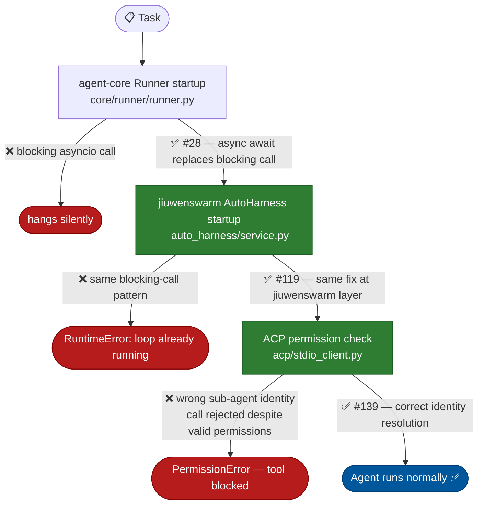
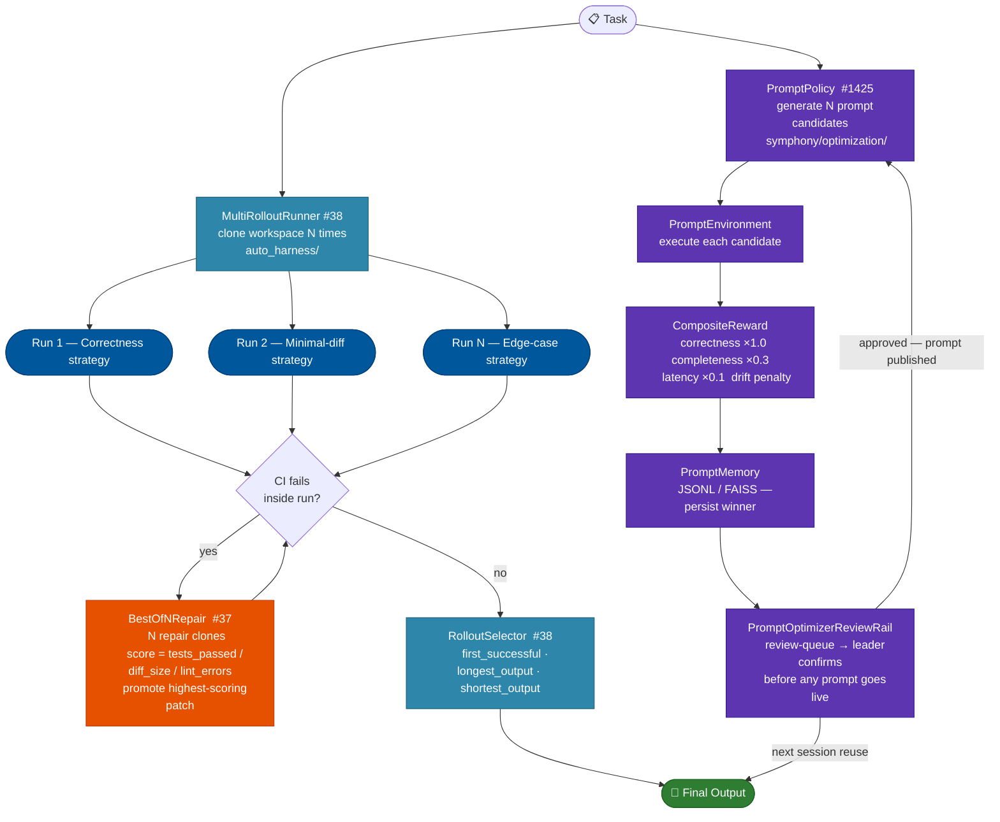
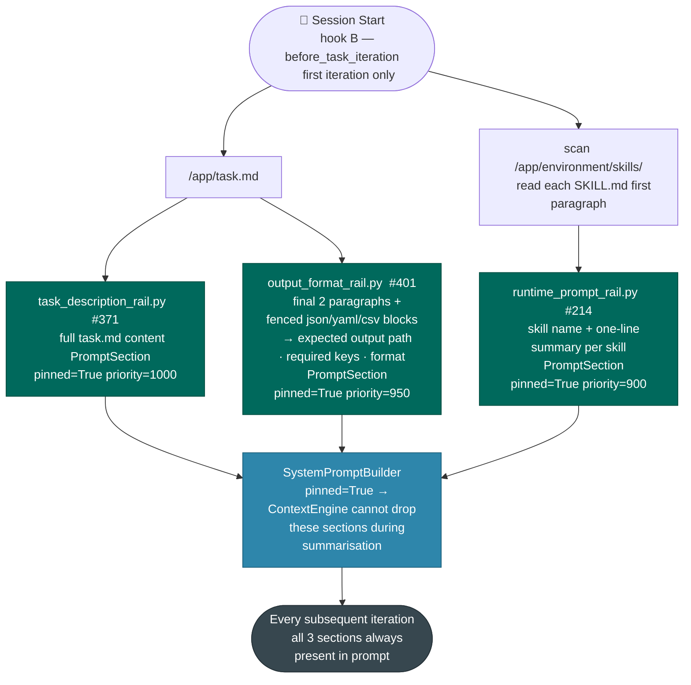
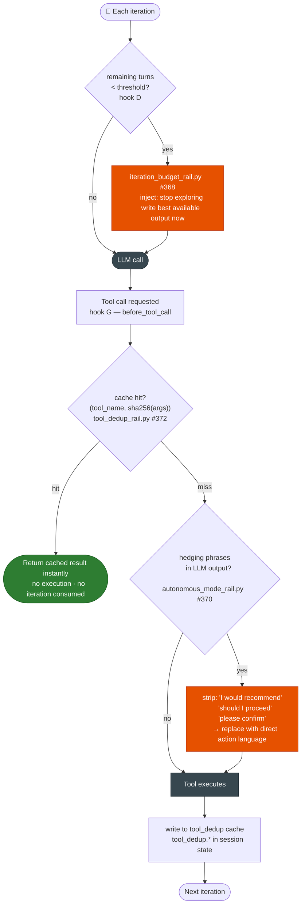
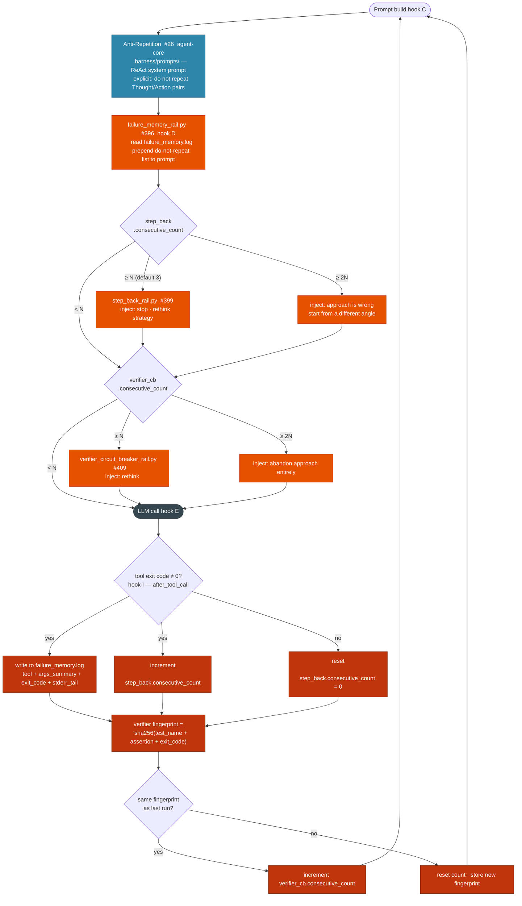
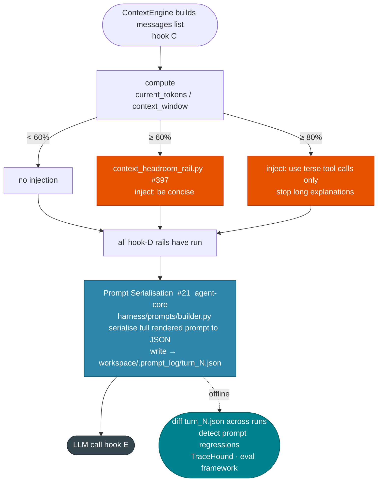
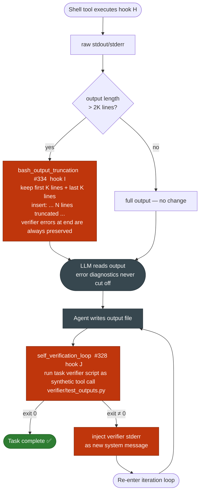
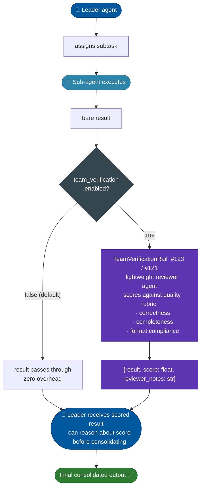

# JiuwenSwarm Quality Improvements — Technical Overview

**Audience:** architects and developers of `agent-core` and `jiuwenswarm`
**Purpose:** master orientation document; each of the 8 groups has its own deep-dive

---

## 1. Architecture Context

### Layer Map

```
┌─────────────────────────────────────────────────────────┐
│  jiuwenswarm                                            │
│  ┌──────────────────────────────────────────────────┐  │
│  │  AutoHarness  (agents/harness/common/auto_harness │  │
│  │               /service.py)                        │  │
│  │  ┌────────────────────────────────────────────┐  │  │
│  │  │  Symphony rails  (agents/harness/common/   │  │  │
│  │  │                   rails/*.py)              │  │  │
│  │  └────────────────────────────────────────────┘  │  │
│  └──────────────────────────────────────────────────┘  │
│  ACP permission client  (acp/stdio_client.py)           │
└────────────────────┬────────────────────────────────────┘
                     │ uses
┌────────────────────▼────────────────────────────────────┐
│  agent-core / harness                                   │
│  DeepAgent  (harness/deep_agent.py)                     │
│  ┌──────────────────────────────────────────────────┐  │
│  │  DeepAgentRail  (harness/rails/base.py)          │  │
│  │  hooks: before/after_task_iteration               │  │
│  └──────────────────────────────────────────────────┘  │
│  ┌──────────────────────────────────────────────────┐  │
│  │  ReActAgent  (core/single_agent/agents/           │  │
│  │               react_agent.py)                     │  │
│  │  ┌────────────────────────────────────────────┐  │  │
│  │  │  AgentRail  (core/single_agent/rail/base.py│  │  │
│  │  │  hooks: before/after_model_call             │  │  │
│  │  │           before/after_tool_call            │  │  │
│  │  │           before/after_invoke               │  │  │
│  │  └────────────────────────────────────────────┘  │  │
│  └──────────────────────────────────────────────────┘  │
│  Runner + ResourceMgr  (core/runner/runner.py)          │
│  ContextEngine  (core/context_engine/)                  │
│  SystemPromptBuilder  (core/single_agent/prompts/       │
│                        builder.py)                      │
└─────────────────────────────────────────────────────────┘
```

### Execution Pipeline — Hook Points

Every rail in this project attaches to one or more of these labeled hook points. Group deep-dives reference them by letter.

```
[A]  ReActAgent.invoke() — before_invoke
[B]  DeepAgent outer loop — before_task_iteration
       ↓
[C]  SystemPromptBuilder assembles system prompt
     (ContextEngine builds full messages list)
       ↓
[D]  AgentRail — before_model_call
       ↓
[E]  LLM call
       ↓
[F]  AgentRail — after_model_call
       ↓
     Parse tool calls from LLM response
       ↓  (per tool call)
[G]  AgentRail — before_tool_call
       ↓
[H]  AbilityManager dispatches via Runner.resource_mgr
     → ACP permission check (acp/stdio_client.py)
     → Tool executes
       ↓
[I]  AgentRail — after_tool_call
       ↓
     Completion check — if done, exit inner loop
       ↓  (if not done, back to [C])
[J]  DeepAgent outer loop — after_task_iteration
       ↓
     Outer completion check — if done, exit
       ↓  (if not done, back to [B])
[K]  ReActAgent.invoke() — after_invoke
```

### How Rails Inject Into the System Prompt

Rails that need to inject text into the prompt do so via `SystemPromptBuilder`. Each `PromptSection` has:
- `content` — the text
- `priority` — sections are sorted; higher priority renders closer to the top
- `pinned=True` — exempt from `ContextEngine`'s automatic summarisation pass

Rails write sections at hook point **[D]** (`before_model_call`) or at session start **[B]** for pinned content. The assembled prompt is then passed to the LLM at **[E]**.

### Session State — Where Rails Read and Write

Stateful rails persist data between turns using the `AgentCallbackContext` passed to every hook. In jiuwenswarm this is backed by:

- `agents/harness/common/session_ops_service.py` — mutable per-session state store
- `server/runtime/session/` — durable session history (used by evolution layer)

Rails that need a persistent counter or log (e.g., failure counts, verifier fingerprints) write to a key in the session state dict at hook **[I]** and read from it at hook **[D]** on the next turn.

---

## 2. Group-by-Group Overview

Each section below identifies: the failure mode, a data flow diagram, which hook points are used, which files are touched, the PR(s), and equivalent patterns in comparable agent systems.

---

#### <strong>Group 1 — Stability: Stop the agent from crashing before it even starts</strong>
<details><summary>Items #1–#3 &nbsp;|&nbsp; PRs: agent-core #28 · jiuwenswarm #119, #139</summary>

**Failure mode:** The process hangs or crashes before any iteration fires, producing zero output.

The three fixes in this group are prerequisites for everything else: if the event loop hangs or the ACP layer incorrectly rejects a tool call, the agent produces zero output regardless of how good its reasoning is. Items #1 and #2 fix the same asyncio lifecycle bug at two independent layers (agent-core and jiuwenswarm); both must be applied. Item #3 fixes the ACP identity-resolution path that incorrectly rejects valid tool calls from sub-agent contexts. All three are pure bug fixes — no new abstractions, no config changes.

<b>Data Flow</b>



**Features**

<details>
<summary><strong>#1 — Event Loop Fix — agent-core</strong> &nbsp;(<code>fix/event-loop-blocking</code> #28)</summary>

Corrects an incorrect `asyncio` event-loop lifecycle in the agent-core task runner. An unhandled blocking call during startup causes the entire task process to hang silently. Fix: replace the blocking call with a proper async await. This is a prerequisite for all subsequent items; a hung process produces no output and fails silently.

| | |
|---|---|
| **Hook points** | None — process-level fix, before any hook fires |
| **Files** | `core/runner/runner.py` — `Runner.__init__` / startup sequence |

**Precedent:** Async event-loop stability issues are a common early-stage problem in all Python-based agent frameworks. SWE-agent, OpenHands, and AutoGPT all had similar async lifecycle bugs in their early releases. Not a differentiating feature — a prerequisite for everything else.

---

</details>

<details>
<summary><strong>#2 — Event Loop Fix — jiuwenswarm</strong> &nbsp;(<code>bugfix/event-loop-blocking</code> #119)</summary>

Identical root cause at the jiuwenswarm runtime layer. The two fixes are independent; both must be applied. Symptom: jiuwenswarm sessions hang or raise `RuntimeError: This event loop is already running` mid-task.

| | |
|---|---|
| **Hook points** | None — service-level startup fix |
| **Files** | `agents/harness/common/auto_harness/service.py` |

**Precedent:** Same class of bug as #1; different layer. Must be fixed independently.

---
</details>

<details>
<summary><strong>#3 — ACP Runtime Tool Unblock</strong> &nbsp;(<code>fix/acp-runtime-tool-blocking</code> #139)</summary>

The ACP permission layer incorrectly rejects tool calls that are within the agent's declared permissions when the call arrives from a sub-agent context. Fix: correct the identity-resolution path in the ACP runtime check. Symptom: tasks that require writing files or running shell commands fail immediately with a permission error even when the tool is listed in the agent's tool card.

| | |
|---|---|
| **Hook points** | **[H]** — inside `AbilityManager` dispatch, before tool executes |
| **Files** | `acp/stdio_client.py` (`ACPClient.request_permission()`), `rails/permissions/` |

**Precedent:** Sub-agent identity propagation bugs are common in any multi-agent permission system. Standard fix: ensure sub-agent identity is propagated along with the permission context, not replaced by the launcher's identity.

</details>

</details>

---

#### <strong>Group 2 — Scale: Try more than one approach, submit the best</strong>
<details><summary>Items #4–#6 &nbsp;|&nbsp; PRs: agent-core #38, #37 · jiuwenswarm #1425</summary>

**Failure mode:** A single deterministic attempt on a hard task has a low per-attempt success probability. Running once is insufficient.

Rather than betting on a single attempt per task, this group adds "try N, keep the best" at three levels: solution-level parallelism (#4), repair-level selection when CI fails inside a run (#5), and prompt-level optimization across sessions (#6). Items #4 and #5 are activated at the `Runner` level and wrap the entire agent lifecycle; item #6 is a Symphony-layer RL loop gated by a feature flag. Each level independently raises the probability of a successful outcome and can be enabled independently.

<b>Data Flow</b>



<b>Features</b>

<details>
<summary><strong>#4 — Multi-Rollout Task Execution</strong> &nbsp;(agent-core <code>feat/multi-rollout-task-execution</code> #38)</summary>

Clones the task workspace N times, injects a distinct strategy prompt into each clone (Correctness-focused / Minimal-diff / Edge-case-focused), runs all N clones in parallel, and exposes a configurable selector (`first_successful` / `longest_output` / `shortest_output`) to pick the winner. This converts a single-attempt system into a pass@k system; the expected pass rate for a task with per-attempt pass probability p rises from p to 1-(1-p)^N.

| | |
|---|---|
| **Hook points** | Wraps the entire `DeepAgent.invoke()` — sits outside **[A]**–**[K]** |
| **New classes** | `MultiRolloutRunner`, `RolloutSelector` |
| **Config** | `multi_rollout.n` (Runner, int, default 1 = disabled) |

**Similar in other systems:** SWE-agent (`--num_attempts N`), LATS / Language Agent Tree Search (tree of attempts with backtracking), AlphaCode (samples thousands of candidates then filters), Claude Code's internal pass@k evaluation harness, OpenHands (`--num_experiments`).

---
</details>

<details>
<summary><strong>#5 — Auto-Harness Best-of-N</strong> &nbsp;(agent-core <code>feat/auto-harness-best-of-n</code> #37)</summary>

Activated when the CI/verifier step inside a run fails. Clones the failing workspace N times, applies a different repair strategy to each clone, scores each repaired clone by `(tests_passed / diff_size / lint_errors)`, and promotes the highest-scoring patch back into the run. This is a self-healing step; it does not require user intervention.

| | |
|---|---|
| **Hook points** | Wraps `DeepAgent.invoke()` — triggered by CI failure signal, outside **[A]**–**[K]** |
| **New class** | `BestOfNRepair` |
| **Config** | `auto_harness.best_of_n` (Runner, int, default 1 = disabled) |

**Similar in other systems:** AlphaCode's candidate filtering by test pass rate, SWE-bench evaluation scripts that pick the best patch per model, Devin's internal retry-with-repair mechanism, OpenHands' patch ranking.

---
</details>

<details>
<summary><strong>#6 — RLAF-P Runtime Prompt Optimizer</strong> &nbsp;(jiuwenswarm <a href="https://github.com/openJiuwen-ai/jiuwenswarm/pull/1425"><code>feat/optimization</code> #1425</a>)</summary>

Runs an RL-style feedback loop — gated by `symphony.optimization.enabled` (default false) and restricted to the team leader role — that generates N candidate prompts, executes each, scores results via a composite reward (correctness, completeness, latency, token cost, drift from objective), and persists the best performer to a JSONL prompt knowledge base for reuse across sessions. A review-queue rail surfaces winning candidates to the leader for human confirmation before any prompt goes live. Applies the same "try N variants, keep the best" principle as items 4–5, but at the prompt level rather than the solution level.

| | |
|---|---|
| **Hook points** | `optimize_prompt` tool call + `PromptOptimizerReviewRail` at **[D]** for leader only |
| **New classes** | `PromptPolicy`, `PromptEnvironment`, `CompositeReward`, `LLMDriftJudge`, `ConvergenceDetector`, `PromptMemory`, `PromptOptimizerReviewRail` |
| **Config** | `symphony.optimization.enabled` (bool, default false) |

**Similar in other systems:** **DSPy** (Stanford) — `MIPROv2` and `BootstrapFewShot` are the closest direct equivalents: automatic prompt optimization via labeled examples and a reward signal. **OPRO** (Google DeepMind) — uses an LLM as an optimizer to iteratively improve prompts. **TextGrad** — gradient-based text optimization including prompt tuning. **APE** (Automatic Prompt Engineer, Zhou et al. 2022) — generates and scores prompt candidates automatically. **PE2** (Prompt Evolution) and **ProTeGi** — evolutionary and error-analysis-based prompt improvement. Hermes has a similar self-evolution mechanism for skill prompts.

</details>

</details>

---

#### <strong>Group 3 — Session Start: Make sure the agent begins with everything it needs</strong>
<details><summary>Items #7–#9 &nbsp;|&nbsp; PRs: jiuwenswarm #371, #401, #214</summary>

**Failure mode:** The agent starts each task with no knowledge of the output contract or available tools. After compression, even its memory of the goal becomes lossy.

At session start, three pinned sections are injected into the system prompt via `SystemPromptBuilder` with `pinned=True`. Once pinned, these sections are exempt from `ContextEngine` summarisation for the entire session — the agent always has the full task goal, the output contract, and the skill index in its context, regardless of how many turns have passed. All three rails fire once at hook **[B]** (first iteration of `before_task_iteration`) and are no-ops on all subsequent turns.

<b>Data Flow</b>



<b>Features</b>

<details>
<summary><strong>#7 — Task Description Re-injection</strong> &nbsp;(<code>feat/task-description-reinjection</code> #371)</summary>

Reads `/app/task.md` at session start and appends its full content as a permanent `system`-role section in the prompt. The section is exempt from the context manager's summarisation pass (implemented via a `pinned=True` flag on the message). Addresses the most common form of task drift: after 20+ turns of context compression, the agent's working summary of the goal is lossy, causing misaligned final output.

| | |
|---|---|
| **Hook points** | **[B]** first iteration only; `PromptSection(pinned=True, priority=1000)` |
| **File** | `rails/task_description_rail.py` |

**Similar in other systems:** SWE-agent injects the GitHub issue description verbatim into every model call via an `{issue}` template variable in its ACI prompt — structurally identical. Claude Code reinjects the active task/todo content. OpenHands pins the task description in the system prompt. Devin maintains a persistent task context throughout the session.

---
</details>

<details>
<summary><strong>#8 — Output Format Reminder Rail</strong> &nbsp;(<code>feat/output-format-reminder-rail</code> #401)</summary>

At session start, parses `task.md` for output-format signals: the final two paragraphs (which typically contain the output contract) and any fenced code blocks with a `json`, `yaml`, or `csv` language tag. Extracts expected output path, required keys, and format constraints; pins them as a permanent system-prompt section. One wrong key name or wrong file extension can render output unusable even when the answer content is fully correct.

| | |
|---|---|
| **Hook points** | **[B]** first iteration only; `PromptSection(pinned=True, priority=950)` |
| **File** | `rails/output_format_rail.py` |

**Similar in other systems:** SWE-agent specifies patch format requirements explicitly in every prompt ("Your patch must be in unified diff format with correct line numbers"). Aider pins diff format instructions permanently. Claude Code includes format instructions in its system prompt. These are well-established patterns across all coding agents.

---
</details>

<details>
<summary><strong>#9 — External Skill Discovery</strong> &nbsp;(<code>feat/external-skill-discovery</code> #214)</summary>

At session start, scans `/app/environment/skills/` for `SKILL.md` files and injects a formatted index (skill name + one-line summary per skill) into the system prompt. Tasks in this class are built around specialist skills that implement the correct workflow, output format, and API usage pattern. Agents that do not know a skill exists re-implement its logic from scratch, producing incorrect output formats and missing task-specific validation.

| | |
|---|---|
| **Hook points** | **[B]** first iteration only; `PromptSection(pinned=True, priority=900)` |
| **File** | Extension of `rails/runtime_prompt_rail.py` or dedicated skill-discovery rail |

**Similar in other systems:** SWE-agent's **RepoMap** (builds a compressed map of the repository structure and injects it at session start — same intent, different source). Aider uses RepoMap identically. Claude Code performs file and tool discovery at startup. GitHub Copilot Workspace scans the repo structure before generating a plan. Hermes injects available skill descriptions into the agent context.

---
</details>

</details>

---

#### <strong>Group 4 — Budget Awareness: Don't waste the limited number of steps</strong>
<details><summary>Items #10–#12 &nbsp;|&nbsp; PRs: jiuwenswarm #368, #372, #370</summary>

**Failure mode:** The agent exhausts its iteration budget on redundant reads, confirmation pauses, and exploration without ever writing output.

The three rails in this group target different causes of budget exhaustion: the budget rail fires when turns are running low and forces the agent to write output now; the dedup cache eliminates redundant tool calls that were observed to consume 30–40% of iteration budgets in production traces; and the autonomous mode rail removes the class of stalls caused by confirmation requests that will never receive a human reply. All three hook into **[D]** or **[G]** — they are lightweight checks that add negligible overhead per turn.

<b>Data Flow</b>



<b>Features</b>

<details>
<summary><strong>#10 — Iteration Budget Awareness Rail</strong> &nbsp;(<code>feat/iteration-budget-awareness</code> #368)</summary>

Tracks `(max_iterations - current_turn)`. When the remaining budget falls below a configurable threshold (default: 5 turns), injects a high-priority directive: stop exploring, write the best available output now, and run the verifier. Prevents the agent from running out of turns mid-solution.

| | |
|---|---|
| **Hook points** | **[D]** `before_model_call`; reads `AgentCallbackContext.current_turn` and `.max_iterations` |
| **File** | `rails/iteration_budget_rail.py` |

**Similar in other systems:** SWE-agent exposes a step counter to the agent in every prompt (`Current step: N / max_steps`). OpenHands has a `max_iterations` parameter with a visible counter. Claude Code communicates remaining turns. AutoGPT has configurable step limits. This is one of the most universally adopted patterns across all autonomous agent systems.

---
</details>

<details>
<summary><strong>#11 — Tool Call Deduplication Cache</strong> &nbsp;(<code>feat/tool-call-dedup-cache</code> #372)</summary>

Maintains a per-session `(tool_name, sha256(canonical_json(args))) → result` cache. Before dispatching any tool call, checks the cache; returns the cached result immediately if the call is identical to one already made. Prevents the agent from re-reading the same file or re-running the same search command on every turn, which was observed to consume 30–40% of iteration budgets in recorded session traces.

| | |
|---|---|
| **Hook points** | **[G]** `before_tool_call`; cache TTL = session lifetime only |
| **File** | `rails/tool_dedup_rail.py`; session-state key prefix `tool_dedup.*` |

**Similar in other systems:** LangChain's `InMemoryCache` caches LLM calls by prompt hash — same concept applied one layer up. LangSmith and Helicone can cache tool results. SWE-agent avoids duplicate reads implicitly via its structured ACI history, but has no explicit cache. Claude Code appears to cache repeated file reads within a session. Explicit tool-call deduplication as a named rail is less common — this is a JiuwenSwarm-specific implementation of a broadly understood optimisation.

---
</details>

<details>
<summary><strong>#12 — Autonomous Execution Mode</strong> &nbsp;(<code>feat/autonomous-execution-mode</code> #370)</summary>

Post-processes the LLM output before tool dispatch. Detects hedging phrases ("I would recommend", "you might want to", "should I proceed") and confirmation requests ("please confirm", "let me know if"). Replaces them with direct execution language. Removes the class of failures where the agent produces a correct plan but stalls waiting for a human confirmation that will never come in a non-interactive autonomous execution environment.

| | |
|---|---|
| **Hook points** | **[G]** `before_tool_call` — post-processes LLM text output before dispatch |
| **File** | `rails/autonomous_mode_rail.py`; patterns defined as `list[tuple[re.Pattern, str]]` |

**Similar in other systems:** Claude Code runs with `--dangerously-skip-permissions` for fully autonomous operation, and its system prompt is written to never ask for confirmation. SWE-agent's ACI prompt explicitly instructs the model to never ask for clarification: "Do not ask for confirmation — just do it." Devin is designed for fully autonomous execution from the ground up. OpenHands headless mode. This pattern is universal in production coding agents.

---
</details>

</details>

---

#### <strong>Group 5 — Loop Breaking: Escape patterns that consume steps without progress</strong>
<details><summary>Items #13–#16 &nbsp;|&nbsp; PRs: agent-core #26 · jiuwenswarm #396, #399, #409</summary>

**Failure mode:** The agent enters a repetition or patch loop, consuming the entire iteration budget without changing strategy.

Four independent loop-detection mechanisms work at different granularities: one at the prompt level (anti-repetition, #13), one tracking failed tool approaches across turns (failure memory, #14), one counting consecutive non-zero exit codes (step-back, #15), and one fingerprinting repeated identical verifier failures (circuit breaker, #16). Each has different sensitivity and triggers escalating interventions. The state flows are complementary: #14 and #15 share the `after_tool_call` write path, while #16 focuses specifically on verifier-run outcomes. All four inject into `before_model_call` when their trigger condition fires.

<b>Data Flow</b>



<b>Features</b>

<details>
<summary><strong>#13 — Anti-Repetition Prompt Fix</strong> &nbsp;(agent-core <code>fix/react-anti-repetition-prompt</code> #26)</summary>

Modifies the ReAct system prompt to explicitly instruct the model not to repeat a Thought/Action pair it has already produced in the current session. The existing prompt contained no such constraint; repetition loops were the second most common cause of iteration budget exhaustion in production session traces.

| | |
|---|---|
| **Hook points** | Prompt template change — no runtime hook; fires at every **[E]** because it is baked into the system prompt |
| **File** | `harness/prompts/` in agent-core |

**Similar in other systems:** SWE-agent's ACI prompt explicitly states "Do not repeat a command you have already run" and includes command history in the observation. Claude Code has implicit deduplication through its tool call history. Reflexion (Shinn et al. 2023) uses verbal reinforcement to break repetition. This is one of the most commonly documented failure modes in agent research literature.

---
</details>

<details>
<summary><strong>#14 — Failure Pattern Memory Rail</strong> &nbsp;(<code>feat/failure-pattern-memory-rail</code> #396)</summary>

Maintains a session-state failure log: after each tool call that returns non-zero, serialises `(tool_name, args_summary, exit_code, stderr_tail)` into the log. Before each LLM call, prepends a formatted "Do not repeat these failed approaches" block to the system prompt. The list grows as more failures accumulate, preventing the agent from retrying approaches it has already proven do not work.

| | |
|---|---|
| **Hook points** | **[I]** write (`after_tool_call`); **[D]** read and inject (`before_model_call`) |
| **File** | `rails/failure_memory_rail.py`; session-state key `failure_memory.log` |

**Similar in other systems:** **Reflexion** (Shinn et al. 2023) is the defining academic paper for this exact pattern — stores "verbal reinforcement" from failure observations in memory and injects them into the next attempt. SWE-agent tracks failed patch applications in its structured history. Devin maintains a running log of failed approaches. OpenHands tracks failed actions across turns. This pattern has strong academic and industry precedent.

---
</details>

<details>
<summary><strong>#15 — Step-Back Rail</strong> &nbsp;(<code>feat/step-back-rail</code> #399)</summary>

Counts consecutive non-zero shell exit codes in session state. After N consecutive failures (default: 3), injects a "stop and reconsider your strategy entirely" directive. After 2N consecutive failures, escalates to "your current approach is fundamentally wrong; start from a different angle." Breaks the most common stuck pattern: marginal one-line patches to the same broken implementation, repeated until timeout.

| | |
|---|---|
| **Hook points** | **[I]** count (`after_tool_call`); **[D]** inject (`before_model_call`) |
| **File** | `rails/step_back_rail.py`; session-state key `step_back.consecutive_count` |

**Similar in other systems:** **Step-Back Prompting** (Zheng et al. 2023, Google DeepMind) is the academic basis — instruct the model to abstract and reflect before diving back into tactics. SWE-agent has a dedicated `think` action that forces a reflection step. OpenHands has a similar reflection mechanism. Reflexion's core loop is structurally identical: failure → reflect → retry with new strategy.

---
</details>

<details>
<summary><strong>#16 — Verifier Circuit Breaker Rail</strong> &nbsp;(<code>feat/verifier-circuit-breaker-rail</code> #409)</summary>

After each verifier run, extracts a failure fingerprint: `(failing_test_name, assertion_text, exit_code)` and tracks a consecutive-identical-failure counter in session state. After N consecutive identical verifier failures (default: 3), injects a rethink directive before the next LLM call. After 2N, injects an "abandon this approach entirely" directive. Specifically targets the most destructive failure loop: same test assertion fails → agent patches one line → verifier re-runs → same assertion fails → repeat × 15 → timeout.

| | |
|---|---|
| **Hook points** | **[I]** fingerprint and count (`after_tool_call`); **[D]** inject (`before_model_call`) |
| **File** | `rails/verifier_circuit_breaker_rail.py`; session-state keys `verifier_cb.fingerprint`, `verifier_cb.consecutive_count` |
| **Fingerprint** | `sha256(test_name + assertion_text + exit_code)` — identical only when all three fields match |

**Similar in other systems:** The "circuit breaker" pattern originates in distributed systems (Netflix Hystrix). Applied to LLM agents: Aider detects repeated test failure signatures and modifies its retry strategy. SWE-agent has early-stopping heuristics on repeated identical patches. This specific implementation — fingerprinting verifier output and escalating directives — is a JiuwenSwarm-original approach, though the underlying idea appears in several agent papers as "failure detection."

</details>

</details>

---

#### <strong>Group 6 — Context Management: Keep important information from getting lost</strong>
<details><summary>Items #17–#18 &nbsp;|&nbsp; PRs: jiuwenswarm #397 · agent-core #21</summary>

**Failure mode:** The context window fills, triggering destructive automatic summarisation that discards working state; or prompt regressions go undetected across runs.

The context headroom guard and prompt serialisation work together. The guard slows context consumption to delay destructive summarisation by nudging the model toward terse output as the window fills — buying more productive turns before `ContextEngine` is forced to compress. The serialiser is orthogonal: it captures the fully-assembled prompt (after all rail injections) as a diff-able JSON artifact, making prompt changes between sessions detectable without an external service.

<b>Data Flow</b>



<b>Features</b>

<details>
<summary><strong>#17 — Context Headroom Guard</strong> &nbsp;(<code>feat/context-headroom-guard</code> #397)</summary>

Monitors `current_tokens / context_window`. At 60% fill, injects a conciseness nudge. At 80% fill, injects a critical directive to stop issuing long explanations and to use terse tool calls only. Slows the rate at which the context window fills, delaying the onset of destructive automatic summarisation.

| | |
|---|---|
| **Hook points** | **[D]** `before_model_call`; reads `ContextEngine.token_count()` and `.context_window_size()` |
| **File** | `rails/context_headroom_rail.py`; thresholds and directives are configurable; session-state key prefix `context_headroom.*` |

**Similar in other systems:** Aider's `--max-chat-history-tokens` caps context consumption and forces summarisation of old messages. LangChain's `ConversationSummaryMemory` proactively compresses old turns. Claude Code has built-in context management with auto-summarisation. SWE-agent manages context via structured ACI formatting that keeps outputs compact. The 60%/80% dual-threshold approach is a JiuwenSwarm-specific design; other systems typically have a single hard cutoff.

---
</details>

<details>
<summary><strong>#18 — Prompt Serialisation</strong> &nbsp;(agent-core <code>feat/react-agent-prompt-serialization</code> #21)</summary>

Serialises the fully-rendered ReAct system prompt (after all rail injections) to a deterministic JSON structure before each LLM call. Enables exact diff-based comparison between runs, regression detection when rails change, and reproducible replay of any agent session.

| | |
|---|---|
| **Hook points** | **[D]** `before_model_call`, runs last (after all other rails have injected); writes to `workspace/.prompt_log/turn_{n}.json` |
| **File** | `harness/prompts/builder.py` serialisation path in agent-core #21 |

**Similar in other systems:** **DSPy** compiles and serialises prompt programs for reproducibility and version control. **LangSmith** logs the fully rendered prompt for every LLM call. **Weights & Biases Prompts** tracks prompt versions across runs. **Helicone** and **PromptLayer** are dedicated services for prompt logging and diffing. Within Anthropic's internal tooling, prompt versioning is standard practice. This feature makes JiuwenSwarm's prompt evolution auditable without requiring an external service.

---
</details>

</details>

---

#### <strong>Group 7 — Output Quality: Make sure the final answer is correct and in the right place</strong>
<details><summary>Items #19–#20 &nbsp;|&nbsp; PRs: jiuwenswarm #334, #328</summary>

**Failure mode:** The agent produces a correct answer but (a) cannot read the verifier's error because it was truncated from the head, or (b) submits output without first checking whether the verifier passes.

The two rails in this group act on adjacent failure points in a single end-to-end flow. Bash truncation (#19) fixes what the agent *sees* from each shell call — ensuring error details at the end of stdout/stderr are never silently dropped. Self-verification (#20) fixes what happens *after* the agent writes output — it forces a verifier run before declaring done and feeds failure details back into the iteration loop if the verifier exits non-zero. Together they eliminate the most common avoidable output errors.

<b>Data Flow</b>



<b>Features</b>

<details>
<summary><strong>#19 — Bash Output Head+Tail Truncation</strong> &nbsp;(<code>feat/bash-output-head-tail-truncation</code> #334)</summary>

Replaces the default head-only truncation of long shell output with a head+tail strategy: keeps the first K lines and the last K lines, with a `... [N lines truncated] ...` separator. Verifier error messages and pytest failure details always appear at the end of stdout/stderr. The previous head-only truncation was silently discarding all diagnostic information from the verifier, leaving the agent blind to the reason its output was rejected.

| | |
|---|---|
| **Hook points** | **[I]** `after_tool_call` — post-processes raw tool output bytes before packaging as `ToolMessage` |
| **Default** | K = 50 lines (configurable); separator includes dropped-line count for transparency |

**Similar in other systems:** SWE-agent applies smart output truncation that preserves the end of command output where errors appear. OpenHands processes tool output to keep diagnostics visible. Claude Code truncates long outputs but preserves error context. Head+tail specifically (vs. head-only) is a simple but high-impact fix that most frameworks eventually adopt after observing the same failure pattern.

---
</details>

<details>
<summary><strong>#20 — Self-Verification Loop</strong> &nbsp;(<code>feat/self-verification-loop</code> #328)</summary>

After the agent produces any output file, before declaring the task done, runs the task's verifier script as a shell tool call. If the verifier exits non-zero, the agent re-enters the iteration loop with the verifier's stderr as the new context. Only exits cleanly when the verifier exits zero. This catches avoidable output errors before they reach the user, at the cost of one additional verifier run per output attempt.

| | |
|---|---|
| **Hook points** | **[J]** `after_task_iteration` — conditional on output file detection; verifier is called as a synthetic tool call; failure re-injects stderr as `system` message |
| **File** | `agents/harness/common/rails/` self-verification logic |

**Similar in other systems:** SWE-agent runs `pytest` after applying a patch and uses the result to decide whether to continue. Devin runs tests after every code change and iterates until they pass. OpenHands runs the test suite and feeds results back to the agent. Aider's `--auto-test` mode runs tests after each edit and loops on failure. **Reflexion** (Shinn et al. 2023) is the direct academic precedent: evaluate output → reflect on failure → retry. This pattern is now effectively universal in all serious coding agent frameworks.

</details>

</details>

---

#### <strong>Group 8 — Multi-Agent Verification: Add a second reviewer in team mode</strong>
<details><summary>Item #21 &nbsp;|&nbsp; PRs: agent-core #123 · jiuwenswarm #121</summary>

**Failure mode:** In leader/sub-agent sessions, the leader receives bare sub-agent results and consolidates them without knowing whether any are incorrect.

This group adds a single-item review stage to the leader/sub-agent handoff. The `TeamVerificationRail` runs a lightweight reviewer agent after each sub-agent completes, scoring the output against a quality rubric before it reaches the leader. Because it is gated by a flag (default false), it adds zero overhead when not enabled and can be turned on selectively for high-stakes tasks where undetected sub-agent errors are particularly costly. The scoring logic lives in agent-core (#123); the rail mount and event wiring live in jiuwenswarm (#121).

<b>Data Flow</b>



<b>Features</b>

<details>
<summary><strong>#21 — Team Verification Layer</strong> &nbsp;(agent-core <code>feat/team-verification-layer</code> #123 / jiuwenswarm <code>feat/team-verification-layer</code> #121)</summary>

In sessions where the leader spawns sub-agents: after each sub-agent completes its assigned task, a lightweight reviewer agent independently scores the sub-agent's output against a quality rubric (correctness, completeness, format compliance) before returning it to the leader. The leader receives `{result, score: float, reviewer_notes: str}` rather than a bare result. Implemented as a rail on the leader agent in jiuwenswarm (#121), backed by the scoring logic in agent-core (#123). Prevents the leader from consolidating sub-agent outputs that contain undetected errors.

| | |
|---|---|
| **Hook points** | Post-processor between sub-agent completion and result delivery to leader — sits inside the sub-agent orchestration layer in `agents/harness/team/`, not a standard rail hook point |
| **Config** | `team_verification.enabled` (AgentConfig bool, default false); when false, the sub-agent result passes through unchanged with zero overhead |
| **Key files** | agent-core #123: `agent_teams/` or `harness/subagents/` — `TeamVerificationRail` scoring rubric; jiuwenswarm #121: `agents/harness/team/` — mounts the rail; wires team-monitor event pipeline |

**Similar in other systems:** **AutoGen** (Microsoft) has the Critic agent pattern as a first-class primitive — a separate LLM agent reviews and provides feedback on another agent's output before it is accepted. **MetaGPT** has a dedicated QA Engineer role that reviews code produced by the Code role. **CrewAI** supports reviewer agents in crew workflows with explicit task handoff between worker and reviewer. **ChatDev** (paper) defines a review stage with a dedicated reviewer agent. **LangGraph** allows defining reviewer nodes in the agent execution graph. This pattern is well-established in multi-agent research and is increasingly standard in production agent frameworks.

</details>

</details>

---

## 3. Cross-Cutting Concerns

### Prompt Section Priority Ordering

All rails that inject text compete for space in the assembled prompt. The priority scheme (higher = appears earlier / survives compression longer) used across this set:

| Content | Suggested priority | Pinned |
|---------|-------------------|--------|
| Task description (#7) | 1000 | Yes |
| Output format contract (#8) | 950 | Yes |
| Skill index (#9) | 900 | Yes |
| Anti-repetition instruction (#13) | 800 | No |
| "Do not repeat failures" list (#14) | 700 | No |
| Iteration budget warning (#10) | 600 | No |
| Step-back / rethink directive (#15, #16) | 600 | No |
| Context headroom nudge (#17) | 500 | No |

Pinned sections are never summarised. Non-pinned sections at lower priority are the first to be condensed when `ContextEngine` needs to shrink the context.

### Session-State Key Namespace

To avoid collisions between rails, each rail owns a prefixed key namespace:

| Rail | Session-state key prefix |
|------|--------------------------|
| Failure Pattern Memory (#14) | `failure_memory.*` |
| Step-Back (#15) | `step_back.*` |
| Verifier Circuit Breaker (#16) | `verifier_cb.*` |
| Tool Dedup Cache (#11) | `tool_dedup.*` |
| Context Headroom (#17) | `context_headroom.*` |
| Iteration Budget (#10) | `iter_budget.*` |

### Testing Conventions

Each rail must have unit tests covering:

1. **No-op path** — trigger condition not met; session state and prompt unchanged
2. **Single trigger** — trigger fires once; correct text injected; session state updated
3. **Escalation path** (where applicable, #15 and #16) — counter increments correctly; directive escalates from rethink to abandon at the right threshold
4. **Pinned sections** (#7, #8, #9) — `ContextEngine` summarisation pass does not drop the section

Run with: `make test TESTFLAGS="tests/unit_tests/rails/"`

---

## 4. Implementation Status by PR

| # | Item | Repo | PR / Branch | Status |
|---|------|------|------------|--------|
| 1 | Event Loop Fix | agent-core | #28 | Branch open |
| 2 | Event Loop Fix | jiuwenswarm | #119 | Branch open |
| 3 | ACP Tool Unblock | jiuwenswarm | #139 | Branch open |
| 4 | Multi-Rollout | agent-core | #38 | Branch open |
| 5 | Auto-Harness Best-of-N | agent-core | #37 | Branch open |
| 6 | RLAF-P Prompt Optimizer | jiuwenswarm | #1425 | Branch open · 25 unit tests passing |
| 7 | Task Description Re-injection | jiuwenswarm | #371 | Branch open |
| 8 | Output Format Reminder | jiuwenswarm | #401 | Branch open |
| 9 | External Skill Discovery | jiuwenswarm | #214 | Branch open |
| 10 | Iteration Budget Awareness | jiuwenswarm | #368 | Branch open |
| 11 | Tool Call Dedup Cache | jiuwenswarm | #372 | Branch open |
| 12 | Autonomous Execution Mode | jiuwenswarm | #370 | Branch open |
| 13 | Anti-Repetition Prompt Fix | agent-core | #26 | Branch open |
| 14 | Failure Pattern Memory | jiuwenswarm | #396 | Branch open |
| 15 | Step-Back Rail | jiuwenswarm | #399 | Branch open |
| 16 | Verifier Circuit Breaker | jiuwenswarm | #409 | Branch open |
| 17 | Context Headroom Guard | jiuwenswarm | #397 | Branch open |
| 18 | Prompt Serialisation | agent-core | #21 | Branch open |
| 19 | Bash Output Head+Tail | jiuwenswarm | #334 | Branch open |
| 20 | Self-Verification Loop | jiuwenswarm | #328 | Branch open |
| 21 | Team Verification Layer | agent-core + jiuwenswarm | #123 + #121 | Branch open |

Integration branch combining all: `New-Features-Integration` (both repos)

---

## 5. Per-Group Deep-Dive Documents

Each group will be covered in its own document with: full implementation walkthrough, class/method signatures, data flow diagrams, edge cases, and test plan.

| Group | Document |
|-------|---------|
| Group 1 — Stability | `Group1.Stability.md` _(to be created)_ |
| Group 2 — Scale | `Group2.Scale.md` _(to be created)_ |
| Group 3 — Session Start | `Group3.SessionStart.md` _(to be created)_ |
| Group 4 — Budget Awareness | `Group4.BudgetAwareness.md` _(to be created)_ |
| Group 5 — Loop Breaking | `Group5.LoopBreaking.md` _(to be created)_ |
| Group 6 — Context Management | `Group6.ContextManagement.md` _(to be created)_ |
| Group 7 — Output Quality | `Group7.OutputQuality.md` _(to be created)_ |
| Group 8 — Multi-Agent Verification | `Group8.TeamVerification.md` _(to be created)_ |
