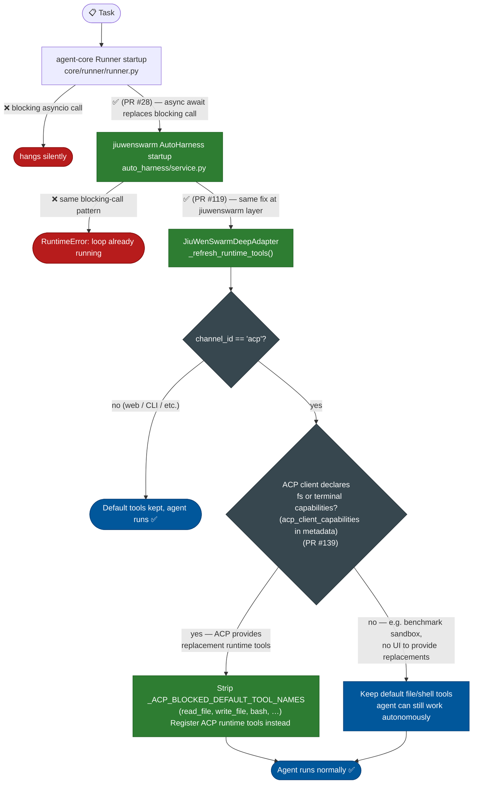
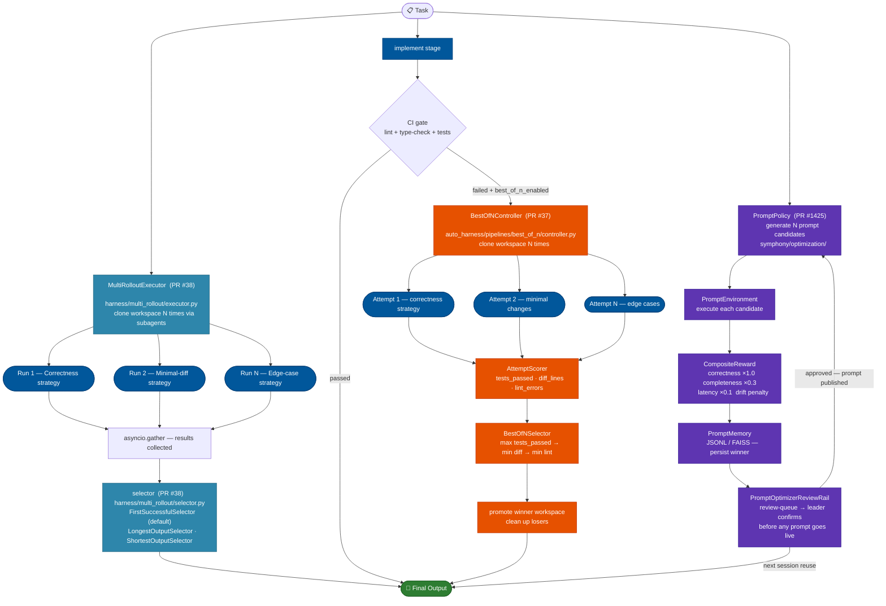
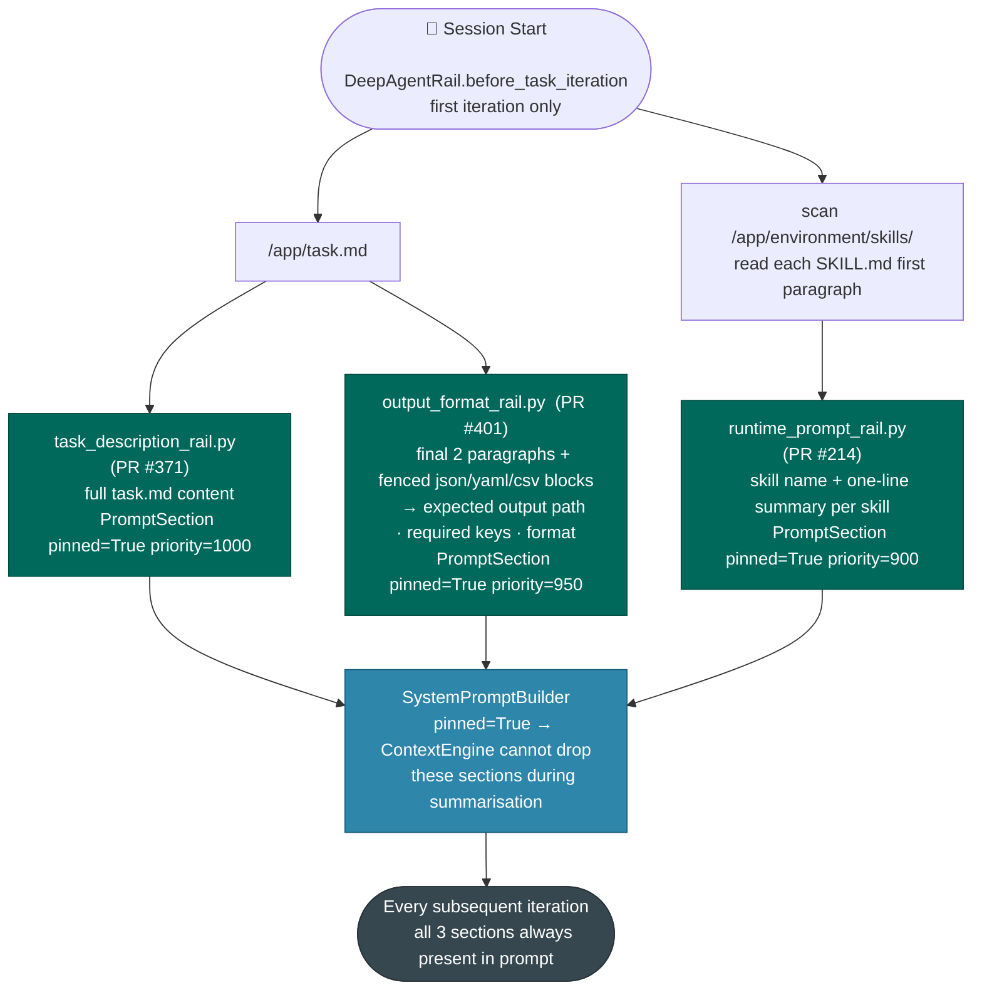
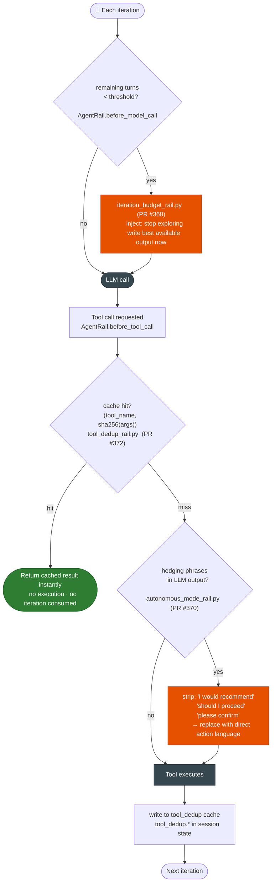
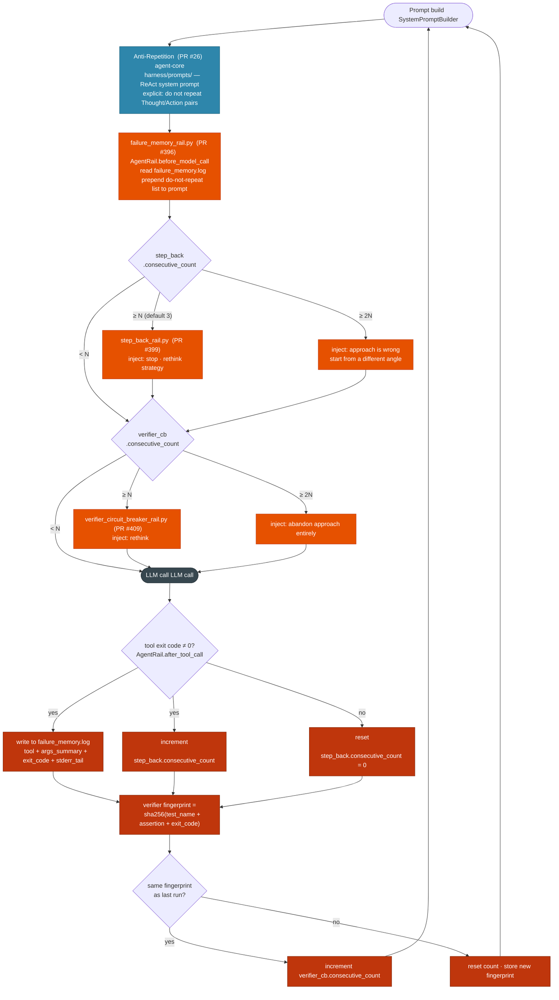
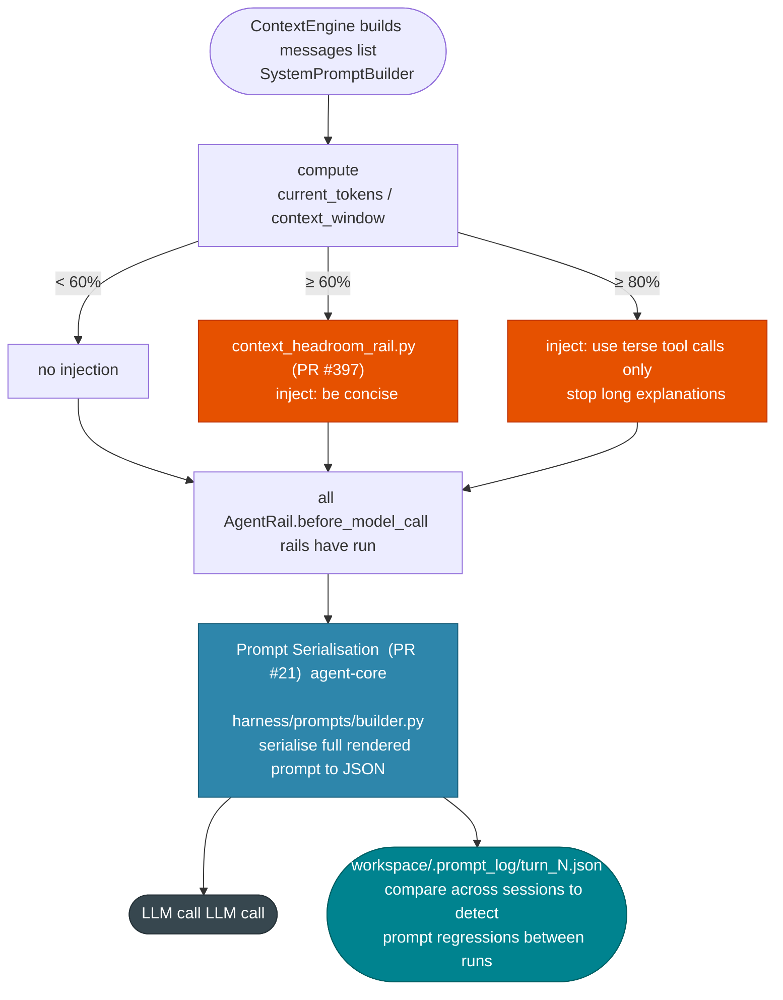
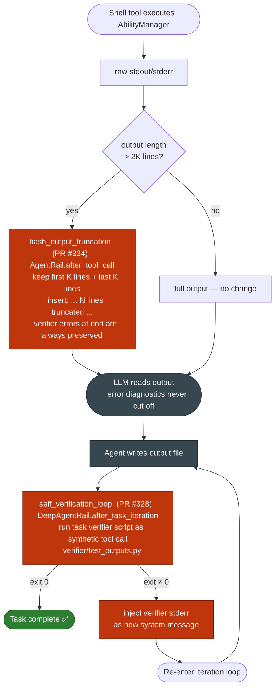

# JiuwenSwarm Quality Improvements — Technical Overview

**Audience:** architects and developers of `agent-core` and `jiuwenswarm`
**Purpose:** master orientation document; each of the 8 groups has its own deep-dive

---

## 1. Architecture Context

### Layer Map

```
┌─────────────────────────────────────────────────────────┐
│  jiuwenswarm                                            │
│  ┌──────────────────────────────────────────────────┐  │
│  │  AutoHarness  (agents/harness/common/auto_harness │  │
│  │               /service.py)                        │  │
│  │  ┌────────────────────────────────────────────┐  │  │
│  │  │  Symphony rails  (agents/harness/common/   │  │  │
│  │  │                   rails/*.py)              │  │  │
│  │  └────────────────────────────────────────────┘  │  │
│  └──────────────────────────────────────────────────┘  │
│  ACP permission client  (acp/stdio_client.py)           │
└────────────────────┬────────────────────────────────────┘
                     │ uses
┌────────────────────▼────────────────────────────────────┐
│  agent-core / harness                                   │
│  DeepAgent  (harness/deep_agent.py)                     │
│  ┌──────────────────────────────────────────────────┐  │
│  │  DeepAgentRail  (harness/rails/base.py)          │  │
│  │  hooks: before/after_task_iteration               │  │
│  └──────────────────────────────────────────────────┘  │
│  ┌──────────────────────────────────────────────────┐  │
│  │  ReActAgent  (core/single_agent/agents/           │  │
│  │               react_agent.py)                     │  │
│  │  ┌────────────────────────────────────────────┐  │  │
│  │  │  AgentRail  (core/single_agent/rail/base.py│  │  │
│  │  │  hooks: before/after_model_call             │  │  │
│  │  │           before/after_tool_call            │  │  │
│  │  │           before/after_invoke               │  │  │
│  │  └────────────────────────────────────────────┘  │  │
│  └──────────────────────────────────────────────────┘  │
│  Runner + ResourceMgr  (core/runner/runner.py)          │
│  ContextEngine  (core/context_engine/)                  │
│  SystemPromptBuilder  (core/single_agent/prompts/       │
│                        builder.py)                      │
└─────────────────────────────────────────────────────────┘
```

### Execution Pipeline — Hook Points

Every rail in this project attaches to one or more of these labeled hook points. Group deep-dives reference them by letter.

```
[A]  ReActAgent.invoke() — before_invoke
[B]  DeepAgent outer loop — before_task_iteration
       ↓
[C]  SystemPromptBuilder assembles system prompt
     (ContextEngine builds full messages list)
       ↓
[D]  AgentRail — before_model_call
       ↓
[E]  LLM call
       ↓
[F]  AgentRail — after_model_call
       ↓
     Parse tool calls from LLM response
       ↓  (per tool call)
[G]  AgentRail — before_tool_call
       ↓
[H]  AbilityManager dispatches via Runner.resource_mgr
     → ACP permission check (acp/stdio_client.py)
     → Tool executes
       ↓
[I]  AgentRail — after_tool_call
       ↓
     Completion check — if done, exit inner loop
       ↓  (if not done, back to [C])
[J]  DeepAgent outer loop — after_task_iteration
       ↓
     Outer completion check — if done, exit
       ↓  (if not done, back to [B])
[K]  ReActAgent.invoke() — after_invoke
```

### How Rails Inject Into the System Prompt

Rails that need to inject text into the prompt do so via `SystemPromptBuilder`. Each `PromptSection` has:
- `content` — the text
- `priority` — sections are sorted; higher priority renders closer to the top
- `pinned=True` — exempt from `ContextEngine`'s automatic summarisation pass

Rails write sections at `AgentRail.before_model_call` or at session start `DeepAgentRail.before_task_iteration` for pinned content. The assembled prompt is then passed to the LLM at LLM call.

### Session State — Where Rails Read and Write

Stateful rails persist data between turns using the `AgentCallbackContext` passed to every hook. In jiuwenswarm this is backed by:

- `agents/harness/common/session_ops_service.py` — mutable per-session state store
- `server/runtime/session/` — durable session history (used by evolution layer)

Rails that need a persistent counter or log (e.g., failure counts, verifier fingerprints) write to a key in the session state dict at `AgentRail.after_tool_call` and read from it at `AgentRail.before_model_call` on the next turn.

---

## 2. Group-by-Group Overview

Each section below identifies: the failure mode, a feature summary, prior art, a data flow diagram, which hook points are used, and which files are touched.

---

#### <strong>Group 1 — Stability: Stop the agent from crashing before it even starts</strong>
<details><summary>Items #1–#3 &nbsp;|&nbsp; PRs: agent-core (PR #28) · jiuwenswarm (PR #119), (PR #139)</summary>

**Failure mode:<br>** The process hangs or crashes before any iteration fires, producing zero output.

**Feature summary:<br>**
These are prerequisites — if any of them is missing, the agent produces zero output before a single hook fires. Items #1 and #2 fix the same asyncio lifecycle bug at two independent layers. Item #3 fixes a tool duplication problem on the ACP channel: before this change, ACP tools were simply added on top of the existing default tools, leaving the agent with both registered simultaneously. Now when the ACP client declares fs/terminal capabilities, the default equivalents are removed first and then replaced by the ACP-specific tools; when the ACP client declares no capabilities (e.g. benchmark sandboxes), the defaults stay so the agent can still act autonomously.

| # | Feature | What it does |
|---|---|---|
| #1 | Event Loop Fix — agent-core | Replaces blocking asyncio call in `Runner` startup; prevents silent hang |
| #2 | Event Loop Fix — jiuwenswarm | Same asyncio fix at jiuwenswarm `AutoHarness` layer; independent of #1, both required |
| #3 | ACP Tool Deduplication Guard | Before this PR, ACP tools were added alongside default tools, causing duplication; now the default equivalents are removed first when the ACP client declares fs/terminal capabilities, and kept when it does not (e.g. benchmark sandboxes) |

**Prior art (Comptetitors):**

| Feature | System | Equivalent |
|---|---|---|
| #1 #2 | SWE-agent | Had identical asyncio lifecycle bug in early release |
| #1 #2 | OpenHands | Had identical asyncio lifecycle bug in early release |
| #1 #2 | AutoGPT | Had identical asyncio lifecycle bug in early release |
| #1 #2 | Note | Universal early-stage issue in Python async agent frameworks |
| #3 ACP Tool Filter | LangChain / LangGraph | Capability-scoped tool sets: tools declared in `allowed_tools` per agent/chain; no-op when capability not advertised |
| #3 | OpenAI Assistants API | Tool availability controlled by `tools` array on the assistant; omitting a tool removes it without breaking non-capable clients |
| #3 | OpenClaw | `before-tool-call` policy hooks (`agent-tools.before-tool-call.policy.ts`) — tool availability decided at dispatch time by capability flags in the channel context |
| #3 | Hermes | Toolset `check_fn()` inspects request context before registering a tool; `tools.disabled` list removes tools for channels lacking the matching capability |

<b>Data Flow</b>



<u>Technical Details</u>

<details>
<summary><strong>#1 — Event Loop Fix — agent-core</strong> &nbsp;(<code>fix/event-loop-blocking</code> (PR #28))</summary>

<br>

**How it works**

- Root cause: blocking `asyncio` call inside `Runner` startup sequence
- Symptom: entire task process hangs silently — zero output, no error message
- Fix: replace the blocking call with proper `async/await`
- This must be fixed before any hook fires; a hung process produces nothing

**Technical metadata**

| | |
|---|---|
| **Hook points** | None — process-level fix, before any hook fires |
| **Files** | `core/runner/runner.py` — `Runner.__init__` / startup sequence |

</details>

<br>

<details>
<summary><strong>#2 — Event Loop Fix — jiuwenswarm</strong> &nbsp;(<code>bugfix/event-loop-blocking</code> (PR #119))</summary>

<br>

**How it works**

- Same root cause as #1 — blocking `asyncio` call, at the jiuwenswarm `AutoHarness` layer instead of agent-core
- Symptom: sessions hang or raise `RuntimeError: This event loop is already running` mid-task
- Fixes #1 and #2 are independent — both must be applied
- Fix: same `async/await` replacement at the jiuwenswarm layer

**Technical metadata**

| | |
|---|---|
| **Hook points** | None — service-level startup fix |
| **Files** | `agents/harness/common/auto_harness/service.py` |

</details>

<br>

<details>
<summary><strong>#3 — ACP Tool Deduplication Guard</strong> &nbsp;(<code>feat/acp-runtime-tool-blocking</code> (PR #139))</summary>

<br>

**How it works**

- The ACP channel provides its own runtime tools for file and terminal access (`read_text_file`, `write_text_file`, `create_terminal`, etc.) when the ACP client has the corresponding capabilities
- **Problem before this PR:** `_refresh_acp_runtime_tools()` only added ACP tools — it never removed the default equivalents (`read_file`, `write_file`, `bash`, etc.). The agent ended up with both sets registered simultaneously, creating tool duplication and ambiguity
- **Fix (two new code blocks added):**
  - **Block 1 — remove defaults before adding ACP tools:** `if channel_id == "acp" and can_register_acp_runtime_tools`: iterate `ability_manager`, remove any tool whose name is in `_ACP_BLOCKED_DEFAULT_TOOL_NAMES`; this runs only when the ACP client actually has capabilities, so benchmark sandboxes and other ACP callers without caps keep their defaults and can still act autonomously
  - **Block 2 — clean up stale ACP tools:** always remove previously registered ACP tool names before re-registering; prevents accumulation across re-entrant calls on the same session
- `_acp_runtime_tools_enabled(request_metadata)` reads `caps["fs"]` and `caps["terminal"]` from `acp_client_capabilities` in the request metadata to determine which replacement tools the client can provide
- `_should_register_acp_runtime_tools(channel_id, request_id, session_id, has_runtime_capability)` returns `True` only when channel is `"acp"`, both `request_id` and `session_id` are set, and at least one capability is declared

**Technical metadata**

| | |
|---|---|
| **Hook points** | Request-level adapter — `JiuWenSwarmDeepAdapter._refresh_runtime_tools()`, not a standard rail hook |
| **Key methods** | `_acp_runtime_tools_enabled()`, `_should_register_acp_runtime_tools()` (both in `interface_deep.py`) |
| **Files** | `jiuwenswarm/server/runtime/agent_adapter/interface_deep.py` (only changed file in this PR) |

</details>

</details>

---

#### <strong>Group 2 — Scale: Try more than one approach, submit the best</strong>
<details><summary>Items #4–#6 &nbsp;|&nbsp; PRs: agent-core (PR #38), (PR #37) · jiuwenswarm (PR #1425)</summary>

**Failure mode:<br>** A single deterministic attempt on a hard task has a low per-attempt success probability. Running once is insufficient.

**Feature summary:<br>**
All three features apply the same principle — "try N variants, keep the best" — at different levels of the system. They are independent and can be enabled in any combination.

| # | Feature | What it does |
|---|---|---|
| #4 | Multi-Rollout | Runs N workspace clones in parallel with different strategies; `FirstSuccessfulSelector` / `LongestOutputSelector` / `ShortestOutputSelector` picks the best output |
| #5 | Auto-Harness Best-of-N | When CI fails in the verify stage, runs N fix agents on workspace clones (one per strategy); `BestOfNSelector` promotes the winner by `tests_passed` → `diff_lines` → `lint_errors` |
| #6 | RLAF-P Prompt Optimizer | RL loop generating N prompt candidates; scored by composite reward; winner persisted to `PromptMemory` for reuse |

**Prior art (Comptetitors):**

| Feature | System | Equivalent |
|---|---|---|
| #4 | SWE-agent | `--num_attempts N` flag |
| #4 | LATS (Language Agent Tree Search) | Tree of attempts with backtracking |
| #4 | AlphaCode | Samples thousands of candidates; filters by test pass rate |
| #4 | Claude Code | Internal pass@k evaluation harness |
| #4 | OpenHands | `--num_experiments` flag |
| #4 | Hermes | MoA loop (`moa_loop.py`) — up to 8 concurrent reference advisors run in parallel; most direct internal precedent for multi-rollout |
| #5 | AlphaCode | Candidate filtering by test pass rate |
| #5 | SWE-bench | Evaluation scripts pick best patch per model |
| #5 | Devin | Internal retry-with-repair mechanism |
| #5 | OpenHands | Patch ranking across repair attempts |
| #6 | DSPy (Stanford) | `MIPROv2` / `BootstrapFewShot` — closest direct equivalent |
| #6 | OPRO (Google DeepMind) | Uses an LLM as optimizer to iteratively improve prompts |
| #6 | TextGrad | Gradient-based text/prompt optimization |
| #6 | APE (Zhou et al. 2022) | Automatic Prompt Engineer — generates and scores candidates |
| #6 | PE2 / ProTeGi | Evolutionary and error-analysis-based prompt improvement |
| #6 | Hermes | `learn_prompt.py` — skill learning from turn feedback (direct RLAF-P equivalent); `background_review.py` — post-turn daemon reviews and updates skill prompts |

<b>Data Flow</b>



<u>Technical Details</u>

<details>
<summary><strong>#4 — Multi-Rollout Task Execution</strong> &nbsp;(agent-core <code>feat/multi-rollout-task-execution</code> (PR #38))</summary>

<br>

**How it works**

- Early-return gate in `DeepAgent.invoke()`: if `deep_config.multi_rollout.enabled`, delegate to `MultiRolloutExecutor` before the standard pipeline starts
- `MultiRolloutExecutor._create_subagents(n)`: create N isolated subagents
- `_build_attempt_inputs()`: inject a strategy prefix into the query for each subagent:
  - Attempt 0: focus on correctness and thoroughness
  - Attempt 1: focus on minimal changes — change as few lines as possible
  - Attempt 2: focus on edge cases and defensive programming
- `_execute_parallel()`: run all N via `asyncio.gather` with `asyncio.Semaphore(max_parallel)` for concurrency control; each attempt has an individual `timeout_per_rollout` (default 600 s)
- Selector picks the winner from `RolloutResult` objects: `FirstSuccessfulSelector` (default) / `LongestOutputSelector` / `ShortestOutputSelector`
- Converts single-attempt to pass@k: expected pass rate rises from p → 1-(1-p)^N

**Technical metadata**

| | |
|---|---|
| **Hook points** | Early-return in `DeepAgent.invoke()` before `ReActAgent.before_invoke` — bypasses the standard pipeline entirely |
| **New classes** | `MultiRolloutExecutor`, `MultiRolloutConfig`, `RolloutResult`, `FirstSuccessfulSelector`, `LongestOutputSelector`, `ShortestOutputSelector` |
| **Config** | `multi_rollout.enabled` (bool, default `False`); `multi_rollout.n_rollouts` (int, default 3); `multi_rollout.selector_kind` (str, default `"first_successful"`); `multi_rollout.timeout_per_rollout` (float, default 600.0 s) |
| **Files** | `openjiuwen/harness/multi_rollout/executor.py`, `config.py`, `selector.py`; `openjiuwen/harness/schema/config.py` (`DeepConfig.multi_rollout` field); `openjiuwen/harness/deep_agent.py` (early-return gate in `invoke()`) |

</details>

<br>

<details>
<summary><strong>#5 — Auto-Harness Best-of-N</strong> &nbsp;(agent-core <code>feat/auto-harness-best-of-n</code> (PR #37))</summary>

<br>

**How it works**

- Replaces the iterative fix loop (phase 1: 10 tries + phase 2: 9 tries = 19 sequential attempts) when enabled
- Trigger: `MetaVerifyStage.stream()` — fires after the implement stage when `CIGateRunner` reports CI failure AND `best_of_n_enabled = True`
- Clone the current workspace N times via `WorkspaceCloner.clone_n_async()` (default N = 3)
- For each clone, run the fix agent **sequentially** (sequential is required; each attempt calls `os.chdir` into its clone) with a strategy-specific prompt:
  - Attempt 0: "CI failed — fix focusing on correctness"
  - Attempt 1: "CI failed — minimal code changes, change as few lines as possible"
  - Attempt 2: "CI failed — fix focusing on edge cases and boundary conditions"
- Score each completed workspace via `AttemptScorer`:
  - `tests_passed`: result from `CIGateRunner.run("all")` on the clone
  - `diff_lines`: total insertions + deletions from `git diff HEAD --stat`
  - `lint_errors`: violation count from `ruff check --output-format json`
- `BestOfNSelector` picks winner: max `tests_passed` → min `diff_lines` → min `lint_errors`
- Promote winning workspace back to the original path; clean up all other clones

**Technical metadata**

| | |
|---|---|
| **Hook points** | `MetaVerifyStage.stream()` in the auto-harness verify stage — not a standard rail hook point |
| **New classes** | `BestOfNController`, `AttemptScorer`, `AttemptScore`, `ScoredAttempt`, `BestOfNSelector`, `BestOfNResult` |
| **Config** | `best_of_n_enabled` (bool, default `False`); `best_of_n_attempts` (int, default 3) — both in `AutoHarnessConfig` |
| **Files** | `openjiuwen/auto_harness/pipelines/best_of_n/controller.py`, `attempt_scorer.py`, `attempt_selector.py`; `openjiuwen/auto_harness/stages/verify.py` (MetaVerifyStage); `openjiuwen/auto_harness/orchestrator.py` (BestOfNController init) |

</details>

<br>

<details>
<summary><strong>#6 — RLAF-P Runtime Prompt Optimizer</strong> &nbsp;(jiuwenswarm <a href="https://github.com/openJiuwen-ai/jiuwenswarm/pull/1425"><code>feat/optimization</code> (PR #1425)</a>)</summary>

<br>

**How it works**

- Gated by `symphony.optimization.enabled` (default false); restricted to team leader role
- Generate N candidate prompts via `PromptPolicy`
- Execute each candidate via `PromptEnvironment`
- Score with composite reward: correctness ×1.0 · completeness ×0.3 · latency ×0.1 · token cost · drift penalty
- Persist best performer to JSONL prompt knowledge base (`PromptMemory`) for reuse across sessions
- `PromptOptimizerReviewRail` surfaces winning candidates to the leader for human confirmation before any prompt goes live

**Technical metadata**

| | |
|---|---|
| **Hook points** | `optimize_prompt` tool call + `PromptOptimizerReviewRail` at `AgentRail.before_model_call` for leader only |
| **New classes** | `PromptPolicy`, `PromptEnvironment`, `CompositeReward`, `LLMDriftJudge`, `ConvergenceDetector`, `PromptMemory`, `PromptOptimizerReviewRail` |
| **Config** | `symphony.optimization.enabled` (bool, default false) |

</details>

</details>

---

#### <strong>Group 3 — Session Start: Make sure the agent begins with everything it needs</strong>
<details><summary>Items #7–#9 &nbsp;|&nbsp; PRs: jiuwenswarm (PR #371), (PR #401), (PR #214)</summary>

***Failure mode:<br>** The agent starts each task with no knowledge of the output contract or available tools. After compression, even its memory of the goal becomes lossy.

**Feature summary:<br>**
All three rails fire once at session start (`DeepAgentRail.before_task_iteration`, first iteration only) and inject a pinned section that `ContextEngine` can never drop. They are no-ops on all subsequent turns.

| # | Feature | What it does |
|---|---|---|
| #7 | Task Description Re-injection | Pins full `task.md` content in system prompt at `priority=1000`; the agent always knows the full goal |
| #8 | Output Format Reminder | Extracts expected output path, required keys, and format from `task.md`; pins at `priority=950` |
| #9 | External Skill Discovery | Scans `/app/environment/skills/` for `SKILL.md` files; injects skill name + one-line summary at `priority=900` |

**Prior art (Competitors):**

| Feature | System | Equivalent |
|---|---|---|
| #7 | SWE-agent | `{issue}` template variable injects task description verbatim into every model call |
| #7 | Claude Code | Reinjects active task/todo content into each call |
| #7 | OpenHands | Pins task description in system prompt |
| #7 | Devin | Maintains persistent task context throughout the session |
| #7 | Hermes | Persistent task goal injection in system prompt via `turn_context.py:compose_user_api_content()` |
| #7 | OpenClaw | Task passed as `params.prompt` — injected into agent context before first turn |
| #8 | SWE-agent | Patch format requirements in every prompt: "must be in unified diff format" |
| #8 | Aider | Diff format instructions pinned permanently in system prompt |
| #8 | Claude Code | Output format instructions included in system prompt |
| #8 | Hermes | Output contract pinned for each skill invocation |
| #9 | SWE-agent | **RepoMap** — compressed repo structure injected at session start |
| #9 | Aider | Uses RepoMap identically |
| #9 | Claude Code | File and tool discovery at startup |
| #9 | GitHub Copilot Workspace | Scans repo structure before generating a plan |
| #9 | Hermes | Core feature: `prompt_builder.py` scans `skills/` for `SKILL.md` files and injects catalogue into system prompt at session start — direct equivalent |

<b>Data Flow</b>



<u>Technical Details</u>

<details>
<summary><strong>#7 — Task Description Re-injection</strong> &nbsp;(<code>feat/task-description-reinjection</code> (PR #371))</summary>

<br>

**How it works**

- Fires once at session start — `DeepAgentRail.before_task_iteration`, first iteration only; no-op on all subsequent turns
- Read `/app/task.md` in full
- Append content as a permanent `system`-role section: `PromptSection(pinned=True, priority=1000)`
- `pinned=True` makes the section exempt from `ContextEngine` summarisation — it can never be dropped
- Addresses the most common form of task drift: after 20+ turns of context compression, the agent's goal summary becomes lossy

**Technical metadata**

| | |
|---|---|
| **Hook points** | `DeepAgentRail.before_task_iteration` first iteration only; `PromptSection(pinned=True, priority=1000)` |
| **File** | `rails/task_description_rail.py` |

</details>

<br>

<details>
<summary><strong>#8 — Output Format Reminder Rail</strong> &nbsp;(<code>feat/output-format-reminder-rail</code> (PR #401))</summary>

<br>

**How it works**

- Fires once at session start — `DeepAgentRail.before_task_iteration`, first iteration only; no-op on all subsequent turns
- Parse `task.md` for output-format signals: final two paragraphs + fenced code blocks tagged `json`, `yaml`, or `csv`
- Extract: expected output path · required keys · format constraints
- Pin as `PromptSection(pinned=True, priority=950)` — survives all context compression
- One wrong key name or wrong file extension renders output unusable even when the answer content is correct

**Technical metadata**

| | |
|---|---|
| **Hook points** | `DeepAgentRail.before_task_iteration` first iteration only; `PromptSection(pinned=True, priority=950)` |
| **File** | `rails/output_format_rail.py` |

</details>

<br>

<details>
<summary><strong>#9 — External Skill Discovery</strong> &nbsp;(<code>feat/external-skill-discovery</code> (PR #214))</summary>

<br>

**How it works**

- Fires once at session start — `DeepAgentRail.before_task_iteration`, first iteration only; no-op on all subsequent turns
- Scan `/app/environment/skills/` for `SKILL.md` files
- Read each file's first paragraph to extract a one-line summary
- Inject formatted index (skill name + one-line summary per skill) as `PromptSection(pinned=True, priority=900)`
- Without this: agents re-implement skill logic from scratch → incorrect output formats, missing task-specific validation

**Technical metadata**

| | |
|---|---|
| **Hook points** | `DeepAgentRail.before_task_iteration` first iteration only; `PromptSection(pinned=True, priority=900)` |
| **File** | Extension of `rails/runtime_prompt_rail.py` or dedicated skill-discovery rail |

</details>

</details>

---

#### <strong>Group 4 — Budget Awareness: Don't waste the limited number of steps</strong>
<details><summary>Items #10–#12 &nbsp;|&nbsp; PRs: jiuwenswarm (PR #368), (PR #372), (PR #370)</summary>

***Failure mode:<br>** The agent exhausts its iteration budget on redundant reads, confirmation pauses, and exploration without ever writing output.

**Feature summary:<br>**
Each rail targets a different cause of budget exhaustion. They all hook into `AgentRail.before_model_call` or `AgentRail.before_tool_call` and are lightweight enough to run on every turn.

| # | Feature | What it does |
|---|---|---|
| #10 | Iteration Budget Rail | Tracks remaining turns; injects "write output now" directive when below threshold |
| #11 | Tool Call Dedup Cache | Caches `(tool_name, sha256(args)) → result`; returns hit immediately without executing the tool again |
| #12 | Autonomous Execution Mode | Regex-strips hedging phrases and confirmation requests from LLM output before tool dispatch |

**Prior art (Comptetitors):**

| Feature | System | Equivalent |
|---|---|---|
| #10 | SWE-agent | `Current step: N / max_steps` counter in every prompt |
| #10 | OpenHands | `max_iterations` parameter with visible counter |
| #10 | Claude Code | Communicates remaining turns to the agent |
| #10 | AutoGPT | Configurable step limits |
| #10 | Hermes | `IterationBudget` class (`iteration_budget.py`) — `max_iterations` (default 500 parent / 50 subagents); `consume()` / `refund()` / `remaining`; graceful fallback via `_handle_max_iterations()` |
| #10 | OpenClaw | Lane-based queueing instead of iteration cap — no hard max-iterations limit; contrast: opposite design choice |
| #11 | LangChain `InMemoryCache` | Caches LLM calls by prompt hash — same concept, one layer up |
| #11 | LangSmith / Helicone | Tool result caching across calls |
| #11 | SWE-agent | Implicit dedup via structured ACI history — no explicit cache |
| #11 | OpenClaw | `hashToolCall` / `digestStable` (SHA-256) in `tool-loop-detection.ts` — hashes tool call arguments for repeat detection; closest equivalent |
| #12 | Claude Code | `--dangerously-skip-permissions`; system prompt written to never ask for confirmation |
| #12 | SWE-agent | ACI prompt explicitly: "Do not ask for confirmation — just do it" |
| #12 | Devin | Fully autonomous execution by design; no confirmation prompts |
| #12 | OpenHands | Headless mode — no human-in-the-loop confirmation |
| #12 | Hermes | System prompt instructs direct action without confirmation |

<b>Data Flow</b>



<u>Technical Details</u>

<details>
<summary><strong>#10 — Iteration Budget Awareness Rail</strong> &nbsp;(<code>feat/iteration-budget-awareness</code> (PR #368))</summary>

<br>

**How it works**

- `AgentRail.before_model_call`: compute `remaining = max_iterations - current_turn`
- If `remaining < threshold` (default: 5 turns), inject a high-priority directive:
  - "Stop exploring"
  - "Write the best available output now"
  - "Run the verifier"
- Prevents the agent from exhausting its turn budget mid-solution without producing any output

**Technical metadata**

| | |
|---|---|
| **Hook points** | `AgentRail.before_model_call`; reads `AgentCallbackContext.current_turn` and `.max_iterations` |
| **File** | `rails/iteration_budget_rail.py` |

</details>

<br>

<details>
<summary><strong>#11 — Tool Call Deduplication Cache</strong> &nbsp;(<code>feat/tool-call-dedup-cache</code> (PR #372))</summary>

<br>

**How it works**

- Cache key: `(tool_name, sha256(canonical_json(args)))`
- `AgentRail.before_tool_call`: before dispatching any tool call, look up the cache
  - Cache hit → return cached result immediately; no tool execution, no turn consumed
  - Cache miss → execute normally, write result to cache
- Cache scope: per-session only (TTL = session lifetime)
- Impact: redundant file reads and search commands consumed 30–40% of iteration budgets in production traces

**Technical metadata**

| | |
|---|---|
| **Hook points** | `AgentRail.before_tool_call`; cache TTL = session lifetime only |
| **File** | `rails/tool_dedup_rail.py`; session-state key prefix `tool_dedup.*` |

</details>

<br>

<details>
<summary><strong>#12 — Autonomous Execution Mode</strong> &nbsp;(<code>feat/autonomous-execution-mode</code> (PR #370))</summary>

<br>

**How it works**

- `AgentRail.before_tool_call`: post-process LLM text output before tool dispatch
- Detect hedging phrases: "I would recommend", "you might want to", "should I proceed"
- Detect confirmation requests: "please confirm", "let me know if"
- Replace detected phrases with direct execution language
- Target failure: agent produces a correct plan but stalls waiting for human confirmation that will never arrive in a non-interactive environment

**Technical metadata**

| | |
|---|---|
| **Hook points** | `AgentRail.before_tool_call` — post-processes LLM text output before dispatch |
| **File** | `rails/autonomous_mode_rail.py`; patterns defined as `list[tuple[re.Pattern, str]]` |

</details>

</details>

---

#### <strong>Group 5 — Loop Breaking: Escape patterns that consume steps without progress</strong>
<details><summary>Items #13–#16 &nbsp;|&nbsp; PRs: agent-core (PR #26) · jiuwenswarm (PR #396), (PR #399), (PR #409)</summary>

***Failure mode:<br>** The agent enters a repetition or patch loop, consuming the entire iteration budget without changing strategy.

**Feature summary:<br>**
Four mechanisms, each targeting a different loop pattern and operating at a different granularity. They are independent and complementary — a session can trigger all four simultaneously.

| # | Feature | What it does |
|---|---|---|
| #13 | Anti-Repetition Prompt | System prompt instruction not to repeat Thought/Action pairs already produced in the session |
| #14 | Failure Pattern Memory | Logs each failed tool call; prepends "do not repeat these approaches" block before every LLM call |
| #15 | Step-Back Rail | Counts consecutive non-zero exit codes; injects escalating "rethink strategy" directive at N and 2N |
| #16 | Verifier Circuit Breaker | Fingerprints verifier failure (test + assertion + exit code); injects escalating "abandon approach" directive at N and 2N identical failures |

**Prior art (Comptetitors):**

| Feature | System | Equivalent |
|---|---|---|
| #13 | SWE-agent | ACI prompt: "Do not repeat a command you have already run"; command history in observation |
| #13 | Claude Code | Implicit dedup through tool call history |
| #13 | Reflexion (Shinn et al. 2023) | Verbal reinforcement to break repetition loops |
| #13 | OpenClaw | `generic_repeat` detector (`tool-loop-detection.ts`) — detects repeated identical tool calls by hashing arguments |
| #13 | Hermes | Explicit no-repeat constraint in ReAct-style prompt |
| #14 | Reflexion (Shinn et al. 2023) | Defining paper: verbal reinforcement from failure stored in memory, injected into next attempt |
| #14 | SWE-agent | Tracks failed patch applications in structured history |
| #14 | Devin | Maintains running log of failed approaches |
| #14 | OpenHands | Tracks failed actions across turns |
| #14 | OpenClaw | `argument_churn` detector — tracks incremental argument drift; flags when args keep changing without progress |
| #14 | Hermes | Failure history maintained across iterations |
| #15 | Step-Back Prompting (Zheng et al. 2023, Google DeepMind) | Instruct model to abstract and reflect before diving back into tactics |
| #15 | SWE-agent | Dedicated `think` action that forces a reflection step |
| #15 | OpenHands | Reflection mechanism on consecutive failures |
| #15 | Reflexion (Shinn et al. 2023) | Core loop: failure → reflect → retry with new strategy |
| #15 | OpenClaw | `known_poll_no_progress` detector — warning/critical thresholds before escalating loop verdict |
| #15 | Hermes | `_handle_max_iterations()` — graceful strategy-change fallback when iteration limit is reached |
| #16 | Netflix Hystrix | Origin of the "circuit breaker" pattern in distributed systems |
| #16 | Aider | Detects repeated test failure signatures; modifies retry strategy |
| #16 | SWE-agent | Early-stopping heuristics on repeated identical patches |
| #16 | OpenClaw | `global_circuit_breaker` (hard threshold 30); `unknown_tool_repeat` detector; `ping_pong` detector for A→B→A tool flip loops — all in `tool-loop-detection.ts` |
| #16 | Note | Fingerprinting verifier output specifically is a JiuwenSwarm-original implementation |

<b>Data Flow</b>



<u>Technical Details</u>

<details>
<summary><strong>#13 — Anti-Repetition Prompt Fix</strong> &nbsp;(agent-core <code>fix/react-anti-repetition-prompt</code> (PR #26))</summary>

<br>

**How it works**

- Changes the ReAct system prompt template — not a runtime hook; takes effect at every LLM call automatically
- Adds explicit instruction: "Do not repeat a Thought/Action pair already produced in this session"
- The previous prompt contained no such constraint
- Impact: repetition loops were the second most common cause of budget exhaustion in production traces

**Technical metadata**

| | |
|---|---|
| **Hook points** | Prompt template change — no runtime hook; fires at every LLM call because it is baked into the system prompt |
| **File** | `harness/prompts/` in agent-core |

</details>

<br>

<details>
<summary><strong>#14 — Failure Pattern Memory Rail</strong> &nbsp;(<code>feat/failure-pattern-memory-rail</code> (PR #396))</summary>

<br>

**How it works**

- `AgentRail.after_tool_call`: after each tool call returning non-zero exit code, serialize `(tool_name, args_summary, exit_code, stderr_tail)` into the session failure log (key `failure_memory.log`)
- `AgentRail.before_model_call`: before each LLM call, prepend a formatted "Do not repeat these failed approaches" block to the system prompt
- The list grows as failures accumulate across the session
- Prevents the agent from retrying approaches it has already proven do not work

**Technical metadata**

| | |
|---|---|
| **Hook points** | `AgentRail.after_tool_call` write; `AgentRail.before_model_call` read and inject |
| **File** | `rails/failure_memory_rail.py`; session-state key `failure_memory.log` |

</details>

<br>

<details>
<summary><strong>#15 — Step-Back Rail</strong> &nbsp;(<code>feat/step-back-rail</code> (PR #399))</summary>

<br>

**How it works**

- `AgentRail.after_tool_call`: on non-zero exit code, increment `step_back.consecutive_count`; reset to 0 on success
- `AgentRail.before_model_call`: before each LLM call, check the counter:
  - `count ≥ N` (default 3): inject "stop — reconsider your strategy entirely"
  - `count ≥ 2N`: escalate to "your current approach is fundamentally wrong — start from a different angle"
- Target failure: marginal one-line patches to the same broken implementation, repeated until timeout

**Technical metadata**

| | |
|---|---|
| **Hook points** | `AgentRail.after_tool_call` count; `AgentRail.before_model_call` inject |
| **File** | `rails/step_back_rail.py`; session-state key `step_back.consecutive_count` |

</details>

<br>

<details>
<summary><strong>#16 — Verifier Circuit Breaker Rail</strong> &nbsp;(<code>feat/verifier-circuit-breaker-rail</code> (PR #409))</summary>

<br>

**How it works**

- `AgentRail.after_tool_call`: compute fingerprint `sha256(test_name + assertion_text + exit_code)` after each verifier run
  - If fingerprint matches previous: increment `verifier_cb.consecutive_count`
  - If fingerprint differs: reset counter, store new fingerprint
- `AgentRail.before_model_call`: before each LLM call, check the counter:
  - `count ≥ N` (default 3): inject rethink directive
  - `count ≥ 2N`: inject "abandon this approach entirely"
- Target failure: same assertion fails → agent patches one line → verifier re-runs → same assertion fails → repeat ×15 → timeout

**Technical metadata**

| | |
|---|---|
| **Hook points** | `AgentRail.after_tool_call` fingerprint and count; `AgentRail.before_model_call` inject |
| **File** | `rails/verifier_circuit_breaker_rail.py`; session-state keys `verifier_cb.fingerprint`, `verifier_cb.consecutive_count` |
| **Fingerprint** | `sha256(test_name + assertion_text + exit_code)` — identical only when all three fields match |

</details>

</details>

---

#### <strong>Group 6 — Context Management: Keep important information from getting lost</strong>
<details><summary>Items #17–#18 &nbsp;|&nbsp; PRs: jiuwenswarm (PR #397) · agent-core (PR #21)</summary>

***Failure mode:<br>** The context window fills, triggering destructive automatic summarisation that discards working state; or prompt regressions go undetected across runs.

**Feature summary:<br>**
Two complementary features: #17 slows context consumption to delay summarisation; #18 logs the fully-assembled prompt before each LLM call, making changes between sessions diff-able.

| # | Feature | What it does |
|---|---|---|
| #17 | Context Headroom Guard | Monitors token fill ratio; injects conciseness directive at 60%, urgent terse-mode directive at 80% |
| #18 | Prompt Serialisation | Writes fully-rendered prompt to `workspace/.prompt_log/turn_N.json` after all rail injections, before each LLM call |

**Prior art (Comptetitors):**

| Feature | System | Equivalent |
|---|---|---|
| #17 | Aider | `--max-chat-history-tokens` caps consumption and forces summarisation of old messages |
| #17 | LangChain `ConversationSummaryMemory` | Proactively compresses old turns |
| #17 | Claude Code | Built-in context management with auto-summarisation |
| #17 | SWE-agent | Structured ACI formatting keeps outputs compact |
| #17 | Hermes | `context_compressor.py` + `context_engine.py` — automatic compression with multiple retry strategies; cache control markers on pinned sections; closest internal equivalent |
| #17 | Note | 60%/80% dual-threshold is JiuwenSwarm-specific; other systems typically use a single hard cutoff |
| #18 | DSPy | Compiles and serialises prompt programs for reproducibility |
| #18 | LangSmith | Logs the fully rendered prompt for every LLM call |
| #18 | Weights & Biases Prompts | Tracks prompt versions across runs |
| #18 | Helicone / PromptLayer | Dedicated prompt logging and diffing services |

<b>Data Flow</b>



<u>Technical Details</u>

<details>
<summary><strong>#17 — Context Headroom Guard</strong> &nbsp;(<code>feat/context-headroom-guard</code> (PR #397))</summary>

<br>

**How it works**

- `AgentRail.before_model_call`: compute `fill_ratio = current_tokens / context_window`
  - `≥ 60%`: inject conciseness nudge — "be brief in explanations"
  - `≥ 80%`: inject critical directive — "use terse tool calls only; stop long explanations"
- Slows the rate at which the context window fills
- Delays the onset of destructive automatic summarisation
- Dual-threshold is JiuwenSwarm-specific; most systems use a single hard cutoff

**Technical metadata**

| | |
|---|---|
| **Hook points** | `AgentRail.before_model_call`; reads `ContextEngine.token_count()` and `.context_window_size()` |
| **File** | `rails/context_headroom_rail.py`; thresholds and directives are configurable; session-state key prefix `context_headroom.*` |

</details>

<br>

<details>
<summary><strong>#18 — Prompt Serialisation</strong> &nbsp;(agent-core <code>feat/react-agent-prompt-serialization</code> (PR #21))</summary>

<br>

**How it works**

- `AgentRail.before_model_call`: runs last — after all other rails have injected their sections
- Serialize the fully-rendered system prompt (all sections assembled, all priorities applied) to deterministic JSON
- Write to `workspace/.prompt_log/turn_{n}.json` — one file per turn, one directory per session
- Enables: exact diff-based comparison between runs; regression detection when rails change

**Technical metadata**

| | |
|---|---|
| **Hook points** | `AgentRail.before_model_call`, runs last (after all other rails have injected) |
| **Output** | `workspace/.prompt_log/turn_{n}.json` — one file per turn, one directory per session |
| **File** | `harness/prompts/builder.py` serialisation path in agent-core (PR #21) |

</details>

</details>

---

#### <strong>Group 7 — Output Quality: Make sure the final answer is correct and in the right place</strong>
<details><summary>Items #19–#20 &nbsp;|&nbsp; PRs: jiuwenswarm (PR #334), (PR #328)</summary>

***Failure mode:<br>** The agent produces a correct answer but (a) cannot read the verifier's error because it was truncated from the head, or (b) submits output without first checking whether the verifier passes.

**Feature summary:<br>**
The two rails act on adjacent failure points in a single end-to-end flow: #19 fixes what the agent *reads* from each shell call; #20 fixes what happens *after* the agent writes its final output.

| # | Feature | What it does |
|---|---|---|
| #19 | Bash Output Head+Tail | Replaces head-only truncation; keeps first K + last K lines so verifier error messages at the end of stdout/stderr are never dropped |
| #20 | Self-Verification Loop | After writing output, runs verifier before declaring done; re-enters iteration loop with verifier stderr on non-zero exit |

**Prior art (Competitors):**

| Feature | System | Equivalent |
|---|---|---|
| #19 | SWE-agent | Smart output truncation preserving end of command output where errors appear |
| #19 | OpenHands | Processes tool output to keep diagnostics visible |
| #19 | Claude Code | Truncates long outputs but preserves error context |
| #19 | Hermes | `_REFERENCE_TOOL_RESULT_BUDGET = 4000` chars in `moa_loop.py` — head+tail budget applied to each reference advisor's tool results |
| #19 | Note | Head+tail (vs. head-only) is a simple but high-impact fix that most frameworks adopt after observing the same failure mode |
| #20 | SWE-agent | Runs `pytest` after each patch; uses result to decide whether to continue |
| #20 | Devin | Runs tests after every code change; iterates until they pass |
| #20 | Aider | `--auto-test` mode runs tests after each edit and loops on failure |
| #20 | Claude Code | Runs shell commands to verify changes work before completing a task; iterates on failures |
| #20 | OpenHands | Runs test suite and feeds results back to the agent before completion |
| #20 | OpenClaw | `before-agent-reply` plugin hooks — intercept before final reply; enables pre-reply verification step |
| #20 | Hermes | `verify_on_stop` (`verification_stop.py`) — runs verification after code edits before completing; config `agent.verify_on_stop`; surface-aware (ON for CLI, OFF for messaging) |
| #20 | Reflexion (Shinn et al. 2023) | Direct academic precedent: evaluate output → reflect on failure → retry |

<b>Data Flow</b>



<u>Technical Details</u>

<details>
<summary><strong>#19 — Bash Output Head+Tail Truncation</strong> &nbsp;(<code>feat/bash-output-head-tail-truncation</code> (PR #334))</summary>

<br>

**How it works**

- `AgentRail.after_tool_call`: post-process raw tool output bytes before packaging as `ToolMessage`
- If output length exceeds threshold, apply head+tail strategy:
  - Keep first K lines (default K = 50)
  - Keep last K lines
  - Insert `... [N lines truncated] ...` separator between them
- Verifier error messages and pytest failure details always appear at the end of stdout/stderr — they are always preserved
- Previous head-only truncation silently discarded all verifier diagnostics, leaving the agent blind to why its output was rejected

**Technical metadata**

| | |
|---|---|
| **Hook points** | `AgentRail.after_tool_call` — post-processes raw tool output bytes before packaging as `ToolMessage` |
| **Default** | K = 50 lines (configurable); separator includes dropped-line count for transparency |

</details>

<br>

<details>
<summary><strong>#20 — Self-Verification Loop</strong> &nbsp;(<code>feat/self-verification-loop</code> (PR #328))</summary>

<br>

**How it works**

- `DeepAgentRail.after_task_iteration`: triggers after the agent writes any output file, before declaring the task done
- Run the task verifier script as a synthetic shell tool call (`verifier/test_outputs.py`)
- If `exit 0`: task complete ✅
- If `exit ≠ 0`: inject verifier stderr as a new `system` message → re-enter the iteration loop
- Only exits cleanly when the verifier exits zero
- Cost: one additional verifier run per output attempt

**Technical metadata**

| | |
|---|---|
| **Hook points** | `DeepAgentRail.after_task_iteration` — conditional on output file detection; verifier is called as a synthetic tool call; failure re-injects stderr as `system` message |
| **File** | `agents/harness/common/rails/` self-verification logic |

</details>

</details>

---

#### <strong>Group 8 — Multi-Agent Verification: Add a second reviewer in team mode</strong>
<details><summary>Item #21 &nbsp;|&nbsp; PRs: agent-core (PR #123) · jiuwenswarm (PR #121)</summary>

***Failure mode:<br>** In leader/sub-agent sessions, the leader receives bare sub-agent results and consolidates them without knowing whether any are incorrect.

**Feature summary:<br>**
A single additional review stage inserted between sub-agent completion and result delivery to the leader. Zero overhead when disabled (default).

| # | Feature | What it does |
|---|---|---|
| #21 | Team Verification Layer | Lightweight reviewer agent scores sub-agent output (correctness / completeness / format compliance) and attaches `score` + `reviewer_notes` before the leader receives the result |

**Prior art (Competitors):**

| System | Equivalent |
|---|---|
| AutoGen (Microsoft) | Critic agent pattern — first-class primitive; separate LLM agent reviews output before acceptance |
| MetaGPT | Dedicated QA Engineer role reviews code produced by the Code role |
| CrewAI | Reviewer agents in crew workflows with explicit task handoff |
| ChatDev (paper) | Dedicated review stage with a reviewer agent |
| LangGraph | Reviewer nodes definable in the agent execution graph |
| OpenClaw | Sub-agent tool with built-in loop guard — prevents reviewer from entering the same loop patterns as the primary agent |
| Hermes | `background_review.py` — daemon thread that reviews skill/memory quality after each sub-agent turn; `SubagentLifecycleService` manages sub-agent lifecycle and review handoff |

<b>Data Flow</b>


<u>Technical Details</u>

<details>
<summary><strong>#21 — Team Verification Layer</strong> &nbsp;(agent-core <code>feat/team-verification-layer</code> (PR #123) / jiuwenswarm <code>feat/team-verification-layer</code> (PR #121))</summary>

<br>

**How it works**

- Triggers after each sub-agent completes its assigned task (only when `team_verification.enabled = true`)
- A lightweight reviewer agent independently scores the output against a quality rubric:
  - Correctness
  - Completeness
  - Format compliance
- Leader receives `{result, score: float, reviewer_notes: str}` instead of a bare result
- Leader can reason about the score before consolidating sub-agent outputs
- Implementation: rail on the leader agent in jiuwenswarm (PR #121); scoring logic in agent-core (PR #123)
- When disabled (default): result passes through unchanged with zero overhead

**Technical metadata**

| | |
|---|---|
| **Hook points** | Post-processor between sub-agent completion and result delivery to leader — sits inside `agents/harness/team/`, not a standard rail hook point |
| **Config** | `team_verification.enabled` (AgentConfig bool, default false); when false, result passes through unchanged with zero overhead |
| **Key files** | agent-core (PR #123): `agent_teams/` or `harness/subagents/` — scoring rubric; jiuwenswarm (PR #121): `agents/harness/team/` — mounts the rail |

</details>

</details>

---

## 3. Cross-Cutting Concerns

### Prompt Section Priority Ordering

All rails that inject text compete for space in the assembled prompt. The priority scheme (higher = appears earlier / survives compression longer) used across this set:

| Content | Suggested priority | Pinned |
|---------|-------------------|--------|
| Task description (#7) | 1000 | Yes |
| Output format contract (#8) | 950 | Yes |
| Skill index (#9) | 900 | Yes |
| Anti-repetition instruction (#13) | 800 | No |
| "Do not repeat failures" list (#14) | 700 | No |
| Iteration budget warning (#10) | 600 | No |
| Step-back / rethink directive (#15, #16) | 600 | No |
| Context headroom nudge (#17) | 500 | No |

Pinned sections are never summarised. Non-pinned sections at lower priority are the first to be condensed when `ContextEngine` needs to shrink the context.

### Session-State Key Namespace

To avoid collisions between rails, each rail owns a prefixed key namespace:

| Rail | Session-state key prefix |
|------|--------------------------|
| Failure Pattern Memory (#14) | `failure_memory.*` |
| Step-Back (#15) | `step_back.*` |
| Verifier Circuit Breaker (#16) | `verifier_cb.*` |
| Tool Dedup Cache (#11) | `tool_dedup.*` |
| Context Headroom (#17) | `context_headroom.*` |
| Iteration Budget (#10) | `iter_budget.*` |

### Testing Conventions

Each rail must have unit tests covering:

1. **No-op path** — trigger condition not met; session state and prompt unchanged
2. **Single trigger** — trigger fires once; correct text injected; session state updated
3. **Escalation path** (where applicable, #15 and #16) — counter increments correctly; directive escalates from rethink to abandon at the right threshold
4. **Pinned sections** (#7, #8, #9) — `ContextEngine` summarisation pass does not drop the section

Run with: `make test TESTFLAGS="tests/unit_tests/rails/"`

---

## 4. Implementation Status by PR

| # | Item | Repo | PR / Branch | Status |
|---|------|------|------------|--------|
| 1 | Event Loop Fix | agent-core | (PR #28) | Branch open |
| 2 | Event Loop Fix | jiuwenswarm | (PR #119) | Branch open |
| 3 | ACP Tool Deduplication Guard | jiuwenswarm | (PR #139) | Branch open |
| 4 | Multi-Rollout | agent-core | (PR #38) | Branch open |
| 5 | Auto-Harness Best-of-N | agent-core | (PR #37) | Branch open |
| 6 | RLAF-P Prompt Optimizer | jiuwenswarm | (PR #1425) | Branch open · 25 unit tests passing |
| 7 | Task Description Re-injection | jiuwenswarm | (PR #371) | Branch open |
| 8 | Output Format Reminder | jiuwenswarm | (PR #401) | Branch open |
| 9 | External Skill Discovery | jiuwenswarm | (PR #214) | Branch open |
| 10 | Iteration Budget Awareness | jiuwenswarm | (PR #368) | Branch open |
| 11 | Tool Call Dedup Cache | jiuwenswarm | (PR #372) | Branch open |
| 12 | Autonomous Execution Mode | jiuwenswarm | (PR #370) | Branch open |
| 13 | Anti-Repetition Prompt Fix | agent-core | (PR #26) | Branch open |
| 14 | Failure Pattern Memory | jiuwenswarm | (PR #396) | Branch open |
| 15 | Step-Back Rail | jiuwenswarm | (PR #399) | Branch open |
| 16 | Verifier Circuit Breaker | jiuwenswarm | (PR #409) | Branch open |
| 17 | Context Headroom Guard | jiuwenswarm | (PR #397) | Branch open |
| 18 | Prompt Serialisation | agent-core | (PR #21) | Branch open |
| 19 | Bash Output Head+Tail | jiuwenswarm | (PR #334) | Branch open |
| 20 | Self-Verification Loop | jiuwenswarm | (PR #328) | Branch open |
| 21 | Team Verification Layer | agent-core + jiuwenswarm | (PR #123) + (PR #121) | Branch open |

Integration branch combining all: `New-Features-Integration` (both repos)

---

## 5. Per-Group Deep-Dive Documents

Each group will be covered in its own document with: full implementation walkthrough, class/method signatures, data flow diagrams, edge cases, and test plan.

| Group | Document |
|-------|---------|
| Group 1 — Stability | `Group1.Stability.md` _(to be created)_ |
| Group 2 — Scale | `Group2.Scale.md` _(to be created)_ |
| Group 3 — Session Start | `Group3.SessionStart.md` _(to be created)_ |
| Group 4 — Budget Awareness | `Group4.BudgetAwareness.md` _(to be created)_ |
| Group 5 — Loop Breaking | `Group5.LoopBreaking.md` _(to be created)_ |
| Group 6 — Context Management | `Group6.ContextManagement.md` _(to be created)_ |
| Group 7 — Output Quality | `Group7.OutputQuality.md` _(to be created)_ |
| Group 8 — Multi-Agent Verification | `Group8.TeamVerification.md` _(to be created)_ |
