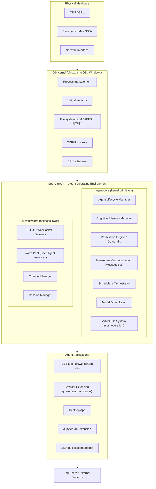
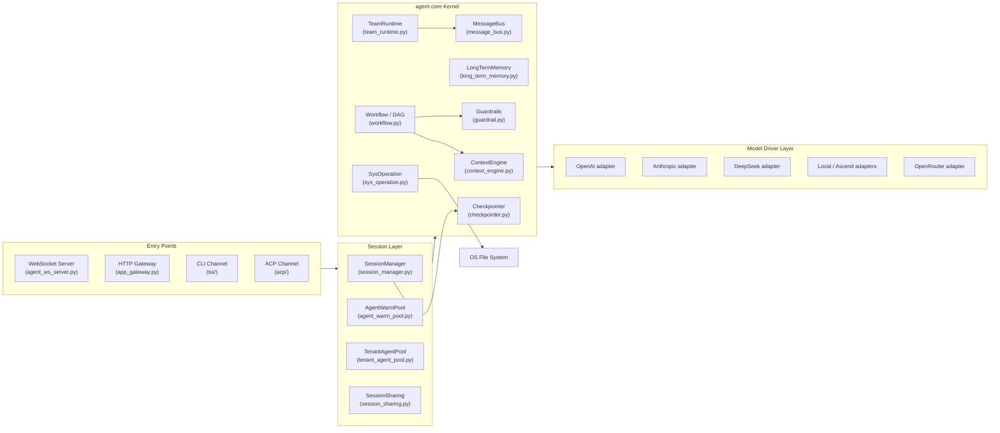
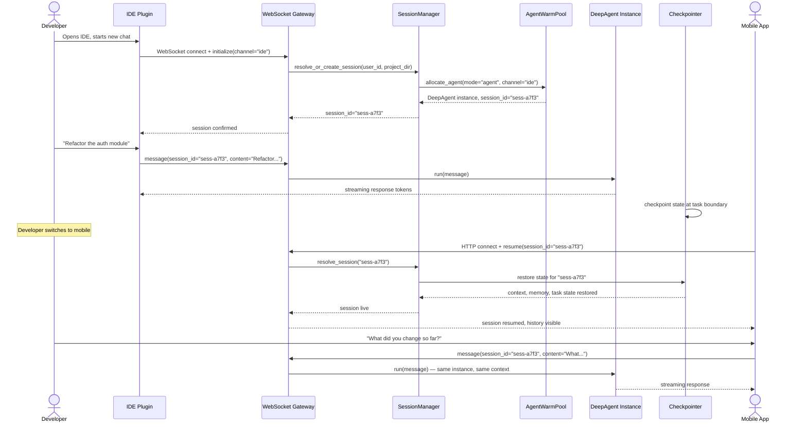
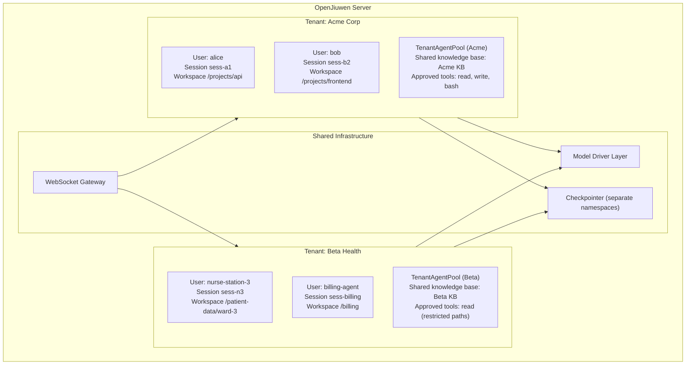

# OpenJiuwen as an Agent Operating Environment

---

## 1. What It Is

A conventional operating system manages programs. It gives each program a process, allocates memory, enforces permissions so one program cannot read another's memory, provides inter-process communication, and abstracts away the hardware so programs do not need to know whether they are running on an Intel chip or an ARM chip. None of this is visible to the user — it is infrastructure that makes everything else possible.

OpenJiuwen does the same thing, one layer higher, for AI agents.

An AI agent is not a program in the traditional sense. It has a reasoning loop rather than a call stack. Its "memory" is not a fixed allocation of bytes — it is a rolling context window plus retrieved knowledge from long-term stores. It communicates with other agents through structured message protocols, not shared memory. It calls tools — shell commands, APIs, file system operations — that need to be audited and permission-checked. It may be paused mid-task and resumed hours later, possibly from a different device. It may be one member of a coordinated team of agents working on the same goal.

None of the mechanisms a conventional OS provides address these needs directly. OpenJiuwen addresses them.

The combination of **agent-core** (the kernel of the agent OS) and **jiuwenswarm** (the services layer and multi-channel runtime) forms a complete agent operating environment. Agent-core provides the foundational primitives: sessions, context management, the graph execution engine, security guardrails, multi-agent messaging, and the abstract interfaces for models and tools. Jiuwenswarm provides the running server: the HTTP/WebSocket gateway, the per-tenant agent pools, the channel adapters for IDE, browser, desktop, and terminal, and the warm-pool scheduler that keeps agent instances ready.

Together they give agent applications the same deal that Linux gives to programs: write your agent logic, and the OS handles everything else.

---

## 2. Where It Sits in the Stack

OpenJiuwen is not a replacement for the OS kernel. It runs on top of a conventional OS, exactly as the JVM sits between Linux and Java applications — or as a web server sits between the kernel's TCP stack and a web application. It is a managed runtime for a new class of software.

The kernel handles processes, real memory, and hardware. OpenJiuwen handles agents, cognitive memory, and model access. Applications handle domain logic and user interaction. Nothing in the agent application layer needs to know what model is running, what database backs the long-term memory, or how messages are routed between agents.

---

## 3. Internal Architecture — What Each Subsystem Does

### Agent Lifecycle Manager — process manager

**OS analogy: process manager (systemd, launchd)**

In a conventional OS, the process manager creates processes, tracks their state (running, sleeping, zombie), and cleans them up when they exit. OpenJiuwen's `AgentWarmPool` (`agent_warm_pool.py`) and `AgentManager` (`agent_manager.py`) do this for agent instances. The warm pool pre-initializes `DeepAgent` instances so the first user request does not pay initialization latency. `TenantAgentPool` acts as the singleton registry of all live agents on a server, analogous to the OS process table. Each agent instance has an identity (session ID, channel ID, mode), a state, and a lifecycle: created, running, idle, terminated.

### Cognitive Memory Manager — virtual memory

**OS analogy: virtual memory system**

A conventional OS gives each process the illusion of having the entire address space to itself, mapping virtual addresses to physical RAM transparently. `ContextEngine` (`context_engine.py`) does the equivalent for an agent's reasoning context. It manages the rolling context window — what the model currently "sees" — applying processors to compress, summarize, or evict older messages when the token budget is exhausted. Below the context window, `LongTermMemory` (`long_term_memory.py`) stores facts, past conversations, and knowledge that can be retrieved and paged back into the active context on demand. The agent code does not manage this; the OS layer handles it.

### Permission Engine — capability / security system

**OS analogy: capability system + mandatory access control**

Linux uses file permissions and capabilities to control what processes can do. OpenJiuwen's `BaseGuardrail` (`guardrail.py`) intercepts every tool call and every model invocation at defined hook points (`HookType` events). It evaluates the call against configured risk levels, can abort it if the assessment exceeds a threshold, and emits audit records. Tool access is mediated through `SysOperation` (`sys_operation.py`), which provides the abstract file system, shell, and code execution surfaces — ensuring agents cannot bypass the guardrail layer by going directly to the kernel.

### Inter-Agent Communication — IPC / sockets

**OS analogy: pipes, sockets, message queues**

Processes on a conventional OS communicate through pipes, UNIX sockets, or message queues. Agents communicate through `MessageBus` (`message_bus.py`) and `TeamRuntime` (`team_runtime.py`). The message bus supports two patterns: point-to-point (P2P send with configurable timeout, default 30 minutes for deep reasoning chains) and publish/subscribe for broadcast to a team. The E2A protocol (`common/e2a/`) handles the encoding and routing of messages between agents and the gateway. `SessionSharing` (`session_sharing.py`) manages subscriptions so that a single session can have multiple simultaneous listeners — for example, an IDE plugin and a mobile app both watching the same agent stream.

### Scheduler / Orchestrator — process scheduler

**OS analogy: process scheduler + job scheduler**

The OS scheduler decides which process runs on which CPU core. OpenJiuwen's `SessionManager` (`session_manager.py`) manages per-session task queues with priority ordering — newer tasks preempt older ones within a session, analogous to interrupt handling. For multi-agent work, `Workflow` (`workflow.py`) and the underlying `PregelGraph` execute agent task graphs as DAGs, managing dependencies between steps. `TeamRuntime` orchestrates which agent in a team handles a given subtask.

### Model Driver Layer — device drivers

**OS analogy: device drivers**

Device drivers abstract hardware so that applications call `write()` rather than toggling GPIO pins. The model client adapters in `openjiuwen/core/foundation/llm/model_clients/` do the same for language models. There are concrete adapters for OpenAI (`openai_model_client.py`), Anthropic (`anthropic_model_client.py`), DeepSeek (`deepseek_model_client.py`), DashScope, SiliconFlow, OpenRouter, and hardware-specific backends (`ascend_affinity_model_client.py`). Agent code calls a uniform `Model` interface; the driver layer handles authentication, request formatting, streaming, and error normalization for each provider.

### Shell / CLI — terminal

**OS analogy: shell (bash, zsh)**

The terminal gives humans direct access to OS primitives. OpenJiuwen's TUI channel (`channels/tui/`) and the `BashTool` within `SysOperation` provide the equivalent: a direct interface for developers and operators to send messages, inspect state, and run commands against a live agent session.

### Display Server / Channels — window manager

**OS analogy: display server (Wayland, X11)**

A window manager multiplexes a physical display across multiple applications. OpenJiuwen's Channel Manager multiplexes agent output across multiple client surfaces simultaneously. Current channel adapters cover the IDE (`jiuwenswarm-ide`), browser extension (`jiuwenswarm-browser`), desktop app (`channels/desktop/`), JupyterLab (`jiuwenswarm-jupyterlab`), and the ACP protocol channel for SDK-built clients. The `SessionSharing` system (`session_sharing.py`) with its `SubRole.GODVIEW` and `SubRole.MEMBER` subscription model ensures each channel receives the appropriate slice of the agent's output stream.

### File System Access — VFS

**OS analogy: virtual file system (VFS)**

The Linux VFS layer gives processes a uniform file access interface regardless of whether the underlying storage is ext4, NFS, or tmpfs. `SysOperation` (`sys_operation.py`) provides agents with abstract file system access — directory listing, file reading, glob search, file sending — without exposing raw OS file paths or bypassing permission checks. The workspace model (`server/runtime/session/project_store.py`) ties a session to a specific working directory and tracks it through the session's lifetime.

### Network Layer — network stack

**OS analogy: TCP/IP network stack**

The kernel's network stack lets processes open sockets without understanding Ethernet frames. OpenJiuwen's gateway layer (`app_gateway.py`, `agent_ws_server.py`) handles connection management, message framing, heartbeat, reconnection, and routing — so agent applications receive clean, typed messages rather than raw bytes. Multi-channel routing (`channel_manager/`) maps incoming connections to the correct session regardless of which surface the user is connecting from.

---

## 4. How Sessions Work

A session in OpenJiuwen is the direct equivalent of a process in an OS. It has a unique identifier, a state object, a memory allocation (context window), a permission scope, and a lifecycle. It can be checkpointed and restored.

When a user sends a message, the gateway layer resolves the session ID. If no session exists, the `AgentWarmPool` allocates a pre-warmed `DeepAgent` instance and binds it to a new session record. If the session already exists, the `AgentManager` retrieves the live instance or restores its state from the `Checkpointer`. The `SessionManager` enqueues the task and manages concurrent execution within the session.

Sessions are channel-independent. A session started in the IDE can be resumed from a mobile device or a browser tab — the session record, context, and agent state are the same object. The `SessionSharing` layer manages which output streams each connected client receives.

The checkpointer (`CheckpointerFactory` in `checkpointer.py`) supports both in-memory and persistent backends. In production deployments, a persistent backend means sessions survive server restarts.

---

## 5. Multi-Tenancy and Isolation

OpenJiuwen runs multiple tenants — individual users, teams, or organizations — on a shared server with strict isolation between them. The isolation model operates at three levels.

**Session isolation.** Each session operates within its own context and workspace. The `project_store.py` ties each session to a specific directory. One session cannot read another session's context or workspace through the agent OS layer — the `SysOperation` layer enforces path boundaries.

**Tenant isolation.** `TenantAgentPool` is a singleton per process. In multi-tenant deployments, separate processes or namespaces enforce tenant boundaries at the OS level. Agent configurations, tool permissions, and knowledge bases are loaded per-tenant at agent initialization time.

**Tool permission isolation.** The `BaseGuardrail` configuration is resolved per agent instance. Two tenants running the same base agent can have completely different tool access policies — one tenant's agent may have shell access while another's is restricted to read-only file operations. Every tool call is checked against the active guardrail configuration before execution.

---

## 6. Real-World Examples

### Example 1 — Software Engineering Team at a 200-Person Company

**Scenario.** A software company has 20 developers. Each runs an AI coding agent in their IDE. The company has a shared internal knowledge base (architecture decisions, coding standards, internal API docs) and a defined set of approved tools (read, write, bash within the project directory — no network calls to external services without approval).

**Without an agent OS.** Each developer configures their own API key, their own prompt with context about the codebase, and their own tool permissions. When Alice asks her agent about the internal authentication library, it has no idea what she means because it has never seen the internal docs. Bob's agent accidentally calls an external API because there is nothing preventing it. When the same question is asked by ten developers, each agent re-reads the same files independently with no shared cache. There is no audit log.

**With OpenJiuwen.** The company deploys a shared OpenJiuwen server. The system administrator configures one `TenantAgentPool` for the engineering organization. It points to a shared knowledge base (the architecture docs, the internal API reference). The guardrail configuration allows `read`, `write`, and `bash` within a developer's project directory but blocks outbound HTTP calls. Every developer's IDE plugin connects to the same server. When Alice asks about the authentication library, her agent retrieves the answer from the shared knowledge base. When Bob tries to call an external service, the guardrail intercepts and logs the attempt. When Alice starts a refactor in her IDE and continues it on her laptop later, it is the same session, same context, no copy-paste required.

**Subsystems involved:** `TenantAgentPool`, `AgentWarmPool`, `LongTermMemory` (shared KB), `BaseGuardrail` (tool restrictions), `SessionSharing` (multi-device), `ContextEngine` (per-developer context windows).

---

### Example 2 — Hospital Deploying Specialized Agents

**Scenario.** A hospital runs four specialized agents: a triage assistant (patient-facing), a billing coder, a scheduling agent, and a drug interaction checker. Triage sees patient symptoms. Billing sees insurance records. Scheduling sees appointment data. Drug interaction checker accesses the pharmacy database. No agent should see data belonging to another department.

**Without an agent OS.** Each agent is deployed as a separate API wrapper. Each team configures it independently. Data boundaries are enforced by convention — developers are told not to pass patient data to the billing agent — but there is no enforcement. Audit logs are scattered across four separate systems with no common format. When a developer updates the triage agent's prompt, there is no record of what changed or when.

**With OpenJiuwen.** Each agent is configured with a distinct guardrail set and workspace. The triage agent's `SysOperation` is confined to `/data/triage/`. The billing agent's `SysOperation` is confined to `/data/billing/`. The drug interaction checker has read access to the pharmacy database path but no write access anywhere. The `BaseGuardrail` emits a structured audit record for every tool call, including which session, which user initiated it, what tool was called, and what the result was. These records go to a central log store. When a regulator asks for a full audit trail of what the billing agent accessed on a specific date, it is a single query. The triage agent and the billing agent run on the same server with no possibility of cross-contamination because the OS layer enforces the boundary.

**Subsystems involved:** `BaseGuardrail` (per-agent tool restrictions, audit events), `SysOperation` (path confinement), `TenantAgentPool` (agent registry), `ContextEngine` (isolated per-agent context), `Checkpointer` (persistent session state for compliance).

---

### Example 3 — Media Company Running a 24/7 Content Pipeline

**Scenario.** A media company produces 50 articles per day. Research agents gather source material. Writing agents draft articles. An editing agent reviews and revises. A publishing agent formats and posts. This runs continuously without human intervention between steps.

**Without an agent OS.** The pipeline is implemented as a series of API calls in a script. When step 3 (the editing agent) fails at 3 AM, the article is lost and the failure is noticed the next morning. There is no way to resume from step 3 — the whole pipeline re-runs from step 1. When two articles are being processed simultaneously, they can collide if they write to the same intermediate file. The script has no visibility into what each agent is currently reasoning about.

**With OpenJiuwen.** The pipeline is defined as a `Workflow` DAG (`workflow.py`). Research, writing, editing, and publishing are nodes in the graph. The `Checkpointer` saves state at each node boundary. When the editing agent fails at 3 AM, the system restores from the last checkpoint — the research and writing outputs are preserved — and retries only the editing step. `MessageBus` handles handoffs between agents: the writing agent publishes its output, the editing agent subscribes and picks it up. `SessionManager` queues concurrent article processing tasks and manages priorities. The `TeamRuntime` registers each agent's `AgentCard` so the system knows the capabilities of each node before routing a task to it.

**Subsystems involved:** `Workflow` / `PregelGraph` (DAG execution), `Checkpointer` (fault recovery), `MessageBus` (inter-agent handoff), `TeamRuntime` (agent registration and routing), `SessionManager` (task queuing and priorities).

---

### Example 4 — Financial Firm with a Supervisor Agent

**Scenario.** A quantitative research firm runs 40 analysis agents simultaneously, each working on a different market sector. A supervisor agent monitors all of them, can inspect any agent's reasoning trace, pause any agent, modify its instructions, and resume it. A human risk officer can intervene at any point.

**Without an agent OS.** Each analysis agent is a standalone API call. The supervisor is a polling script that checks a shared database for results. Pausing an agent means killing its process and losing its work. Inspecting its reasoning means reading raw log files. There is no way for the supervisor to redirect an agent mid-task without restarting it from scratch.

**With OpenJiuwen.** All 40 analysis agents are registered in `TeamRuntime`. The supervisor agent subscribes to their `MessageBus` topic stream via `SubRole.GODVIEW` — it sees everything each agent produces without interrupting it. When the risk officer flags sector 12 for review, the supervisor calls `cancel_session_task()` on the session manager for that agent's session. The agent pauses. The supervisor inspects the `Checkpointer` state — the full context window, tool call history, and intermediate reasoning — and posts a revised instruction. The agent resumes from checkpoint with the new instruction. The human risk officer watches the session through the desktop channel (`channels/desktop/`) in real time using the same `SessionSharing` subscription mechanism.

**Subsystems involved:** `TeamRuntime` (agent registration), `MessageBus` (supervisor subscription), `SessionManager` (pause / cancel), `Checkpointer` (state inspection and restore), `SessionSharing` (GODVIEW subscription for human observer), `BaseGuardrail` (audit trail of every tool call).

---

### Example 5 — Solo Developer's Personal Assistant Across Three Devices

**Scenario.** A developer uses a personal AI assistant throughout their day. In the morning, they ask it to research a technical problem on their phone during their commute. At their desk, they continue in the IDE where the agent has access to their code. In the afternoon, they open a browser tab and ask for a summary of what was found.

**Without an agent OS.** The developer has three separate chat sessions, one in each interface. To continue a conversation from the phone in the IDE, they copy and paste the relevant messages. The IDE agent does not know what the phone session discussed. The browser session is yet another blank context. Any context about the developer's codebase has to be re-established from scratch in each interface.

**With OpenJiuwen.** The developer's server instance maintains a single persistent session (`sess-dev-personal`). When they open the phone app, the mobile client connects with their identity and receives the existing session. Their commute research goes into the shared `ContextEngine` and is indexed into `LongTermMemory`. When they open the IDE plugin, it connects to the same session — the IDE channel adapter joins as a `SubRole.GODVIEW` subscriber. The agent now has both the research from the commute and read/write access to the codebase within a single context window, because the `ContextEngine` manages both the rolling conversation and retrieved long-term facts. When they open the browser tab, it joins the same session again. They ask for a summary; the agent answers from a shared, coherent context that was never split.

**Subsystems involved:** `SessionSharing` (multi-device join), `ContextEngine` (unified context window), `LongTermMemory` (persistent facts across sessions), `Channel Manager` (IDE, mobile, browser adapters), `Checkpointer` (session durability across restarts), `AgentWarmPool` (single agent instance serving all three surfaces).

---

## 7. What Makes It Different from Just Using API Calls

Calling an LLM API directly gives you a stateless input/output function. You send text, you receive text. Every call is independent. This is adequate for simple, one-shot tasks. It breaks down immediately for anything more complex.

| Capability | Direct API calls | OpenJiuwen |
|---|---|---|
| Memory across turns | Must be re-sent by the caller each time | `ContextEngine` manages the window; `LongTermMemory` retrieves older facts |
| Memory across sessions | Lost when the process exits | `Checkpointer` persists state; sessions resume from exactly where they stopped |
| Multi-agent coordination | No mechanism; must be hand-coded | `TeamRuntime` + `MessageBus` provide P2P and pub/sub with typed envelopes |
| Permission enforcement | None; the model can call any tool you give it | `BaseGuardrail` intercepts every tool call; configurable per agent and per tenant |
| Channel portability | One client per API key | `SessionSharing` + Channel Manager multiplex one session across IDE, browser, mobile, terminal |
| Checkpointing and recovery | Not possible; re-run from start | `Checkpointer` saves state at node boundaries; failed steps resume without re-running prior steps |
| Model portability | Code is coupled to one provider's SDK | Model Driver Layer (ten adapters) behind a uniform `Model` interface |
| Audit trail | Must be implemented by the caller | Guardrail emits structured audit events for every hook point in the execution flow |

The things in that table are not convenience features — they are the difference between a demo and a production system. A direct API call is a system call. OpenJiuwen is the operating system that makes system calls useful.
