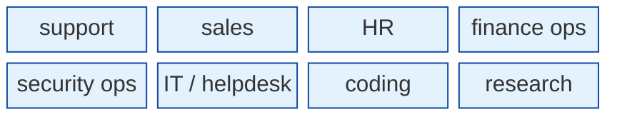
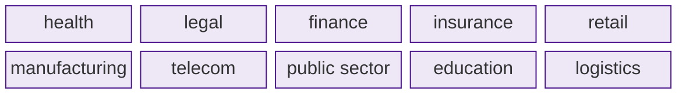
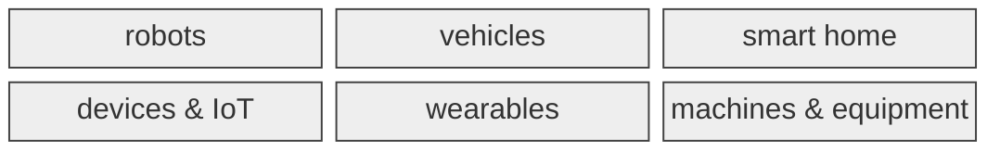
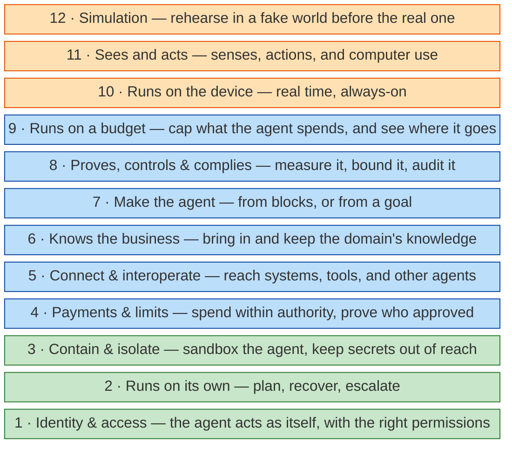
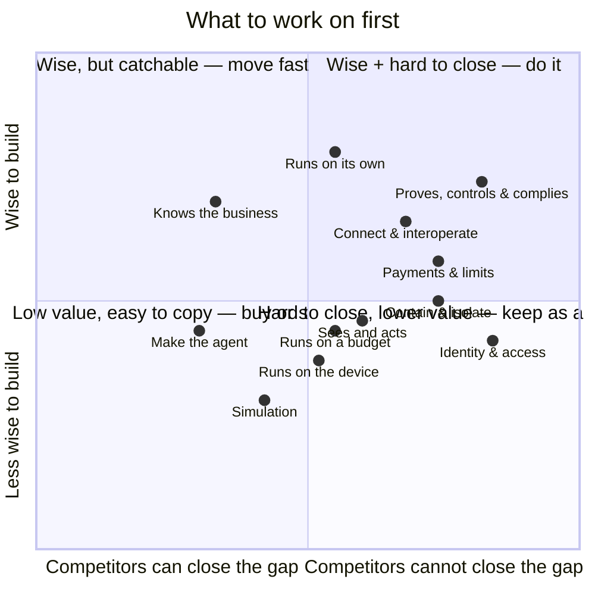

# What we build on top of Jiuwen

Jiuwen is the **brain**. We build **three parts** on top of it.

> **No body → software. Has a body → hardware.**

| Part | Software or hardware? | Who builds it |
|---|---|---|
| **1 · Products** | **software** — a brain in software | product teams, on Jiuwen's surfaces |
| **2 · Bodies** | **hardware** — a brain in a body | hardware / product teams |
| **3 · Enabling stack** | **neither** — it enables both | **us (R&D)** |

## 1 · Software products — a brain in software

**By job:**

**By industry:**

| Example product | Job / industry | Runs on (Jiuwen gives) |
|---|---|---|
| support triage agent | job · support | web / chat |
| helpdesk agent | job · IT | IDE / chat |
| claims processing agent | industry · insurance | software |
| contract review agent | industry · legal | software |
| month-end close agent | job · finance ops | software |

## 2 · Hardware bodies — a brain in a body

Jiuwen = the brain; the body team builds the senses, the acting, and the real-time loop.

## 3 · The enabling stack — ours (R&D)

These are the layers that turn Jiuwen into a real, deployable agent. Each is something we build: a service, a runtime, or code that sits around the agent.

The twelve layers are independent. **Green** = part of Jiuwen (inside the run). **Blue** = on top, for every agent. **Orange** = on top, for bodies only.

### A · Might become part of Jiuwen

These have to live **inside** the run — and Jiuwen owns the run. Build them now, but expect the framework to absorb them; bank only on the part it won't.

| Layer | Jiuwen already does | We build | The domain team adds | Example |
|---|---|---|---|---|
| **1 · Identity & access** | knows the user, acts "on their behalf", and swaps stored tool keys in per request | a separate identity for each agent and task, with keys that expire when the task ends | which systems and actions that agent may use | the agent uses a one-task CRM identity; the CRM log shows "claims-bot-3", and its key is dead minutes later |
| **2 · Runs on its own** | planning and retries | extra reliability: recover on its own, then ask for help | where to stop and hand over | a step fails, the agent recovers; if it still can't, it asks a person |
| **3 · Contain & isolate** | a basic sandbox | a hard sandbox: secrets hidden, network off by default | the allowed tools and data | a tricked agent still can't reach secrets or the network |

### B · Stays on top of Jiuwen — never part of it

None of these belong inside the framework — they sit on top. But agents can't work without them.

**For any agent — products and bodies:**

| Layer | Jiuwen already does | We build | The domain team adds | Example |
|---|---|---|---|---|
| **4 · Payments & limits** | — | safe agent payments (signed approvals) | spend limits | the agent pays up to $200 with a signed approval; more goes to a person |
| **5 · Connect & interoperate** | MCP (tool calling) | connectors to other systems, and agent-to-agent links | the links to their own systems | the agent updates the CRM and hands work to a partner's agent |
| **6 · Knows the business** | memory and search | tools to load and clean knowledge | the knowledge itself | the claims agent looks up the policy |
| **7 · Make the agent** | the runtime and tools | a no-code builder — drag blocks, or state a goal and get a draft agent | the tools, facts, and limits | a claims expert types "handle claims under $500, ask me above that" — the builder drafts the agent, and they approve it |
| **8 · Proves, controls & complies** | guardrails that block bad actions, and tracing that records them | tests, records, and audit reports built on top — not more guardrails | what "good" means and who reviews | every refund is logged; the agent passes an EU audit |
| **9 · Runs on a budget** | — | spending limits per agent and per task | the budget | one runaway agent can't use up everyone else's budget |

**For bodies only — on top of the above:**

| Layer | Jiuwen already does | We build | The domain team adds | Example |
|---|---|---|---|---|
| **10 · Runs on the device** | — | running the agent on the device, fast and offline | — | a voice helper answers in under 300 ms, even offline |
| **11 · Sees and acts** | vision and browser control | sensors and actions for hardware, plus computer use | the device drivers | a robot reads a camera and moves its arm; a software agent fills a web form |
| **12 · Simulation** | — | a fake world to test the agent first | the test scenarios | rehearse a warehouse robot on a fake floor |

**Which parts need which layer:**

| Layer | Jobs & industries (software) | Bodies (hardware) |
|---|---|---|
| **1 · Identity & access** | **yes** | **yes** |
| **2 · Runs on its own** | **yes** | **yes** |
| **3 · Contain & isolate** | **yes** | **yes** |
| **4 · Payments & limits** | if it buys | if it buys |
| **5 · Connect & interoperate** | **yes** | **yes** |
| **6 · Knows the business** | **yes** | **yes** |
| **7 · Make the agent** | **yes** | **yes** |
| **8 · Proves, controls & complies** | **yes** | **yes** |
| **9 · Runs on a budget** | **yes** | **yes** |
| **10 · Runs on the device** | voice only | **yes** |
| **11 · Sees and acts** | browser use only | **yes** |
| **12 · Simulation** | **yes** | **yes** |

Ours if it is reused across every domain; the domain team's if it serves one domain only. Billing, pricing and sales are business, not R&D — only the plumbing that lets agents pay is ours (layer 4).

## What NOT to build — Jiuwen already gives it

| Capability | Given by Jiuwen | Examples |
|---|---|---|
| Brain | model + agent loop | single agent · deep agent |
| Teams | multi-agent | leader · members · human |
| Tools | built-in + MCP | filesystem · shell · web · browser · code |
| Memory & retrieval | store + search | long-term · graph · vector · rerank |
| Guardrails & observability | safety + tracing | security rails · tracer |
| Sandbox (base) | execution isolation | container / microVM |
| Channels | user surfaces | web · desktop · mobile · IDE · chat/IM |
| Workflows | orchestration | graph/Pregel · task loop |
| Protocols | adopt, don't invent | MCP · A2A · AP2 · AG-UI |
| Models & inference | commodity | foundation models · inference hosts |

## The 2026 market check — what the industry built

We compared our layers against the published agent stacks and enterprise platforms of late 2026 — O'Reilly's six-layer agent stack, the eleven-layer landscape maps, the AWS / Microsoft / Google agent reference architectures, the agentic-commerce protocol stack, and the 2026 security, FinOps and EU AI Act guidance. Five things stood out:

- **Models are commodity; the moat moved up.** Foundation models and inference are low-defensibility. The durable value sits in **integrations**, **observability & eval**, and **memory/context** — our layers 5, 8, and 6.
- **Agentic payments became a real layer** (AP2 · ACP · UCP · x402 · MPP) — our layer 4.
- **A builder surface is now table stakes** (no-code / low-code assembly) — our layer 7.
- **Security became its own discipline.** Prompt injection is *unsolved*; the industry answers with **containment** — sandboxes, per-task secrets, egress-deny, authorization outside the model. That is our layer 3.
- **Cost and compliance turned mandatory.** 98% now track agent spend and 73% blow budget (our layer 9); EU AI Act high-risk rules bite from **2 Aug 2026** (our layer 8).

| 2026 industry layer | Ours | Commodity or moat? |
|---|---|---|
| Foundation models · inference | (providers) | **commodity** |
| Agent frameworks | (Jiuwen) | medium |
| Memory & vector DBs | **6 · Knows the business** | medium |
| Protocols — MCP · A2A · AG-UI | **5 · Connect & interoperate** | standard — adopt, don't invent |
| Tool integrations | **5 · Connect & interoperate** | **high moat** |
| Browser / computer use | **11 · Sees and acts** | medium |
| Observability & eval | **8 · Proves, controls & complies** | **high moat** |
| Agent security / sandboxing | **3 · Contain & isolate** | **high — unsolved** |
| Guardrails & safety | **8 · Proves, controls & complies** | high |
| Governance & compliance (EU AI Act) | **8 · Proves, controls & complies** | **mandatory** |
| AI FinOps / cost control | **9 · Runs on a budget** | **high — 73% blow budget** |
| Agentic commerce / payments | **4 · Payments & limits** | **emerging — whitespace** |
| No-code / low-code builders | **7 · Make the agent** | medium |
| Enterprise platforms / agent control plane | (product teams) | — |
| AI clouds · inference hosting | (providers) | **commodity** |
| Agent identity & access | **1 · Identity & access** | **underserved — whitespace** |
| Simulation · world models · sim2real | **12 · Simulation** | niche — ours |

*Sources (Oct 2026): O'Reilly "The AI Agents Stack (2026 Edition)"; Stack Archive "Agentic AI Stack 2026"; AWS / Microsoft / Google enterprise agent architectures (The New Stack, 2026); Agentic Commerce Atlas; OWASP MCP Top 10 and 2026 prompt-injection research; FinOps Foundation State of FinOps 2026; EU AI Act high-risk obligations.*

## Where to start

| Zone | Layers | Move |
|---|---|---|
| Top-right — earns money + hard to copy | Proves, controls & complies · Connect & interoperate · Payments & limits | **do it now** |
| Top-left — earns money, but rivals can catch up | Runs on its own · Knows the business | **build, but expect rivals** |
| Bottom-right — hard to copy, but earns indirectly | Identity & access · Contain & isolate · Sees and acts · Runs on the device | **keep it — that's our edge** |
| Bottom-left — earns indirectly, easy to copy | Make the agent · Runs on a budget | **buy, don't build** |
| Center | Simulation | **build a little** |

## Business lens

| Question | Meaning |
|---|---|
| **Who** | who builds, runs, and adopts it |
| **Who else** | who is already here; where the whitespace is |
| **How much** | unit economics, cost to enter, ROI |
| **How fast** | time-to-value, lock-in risk |
