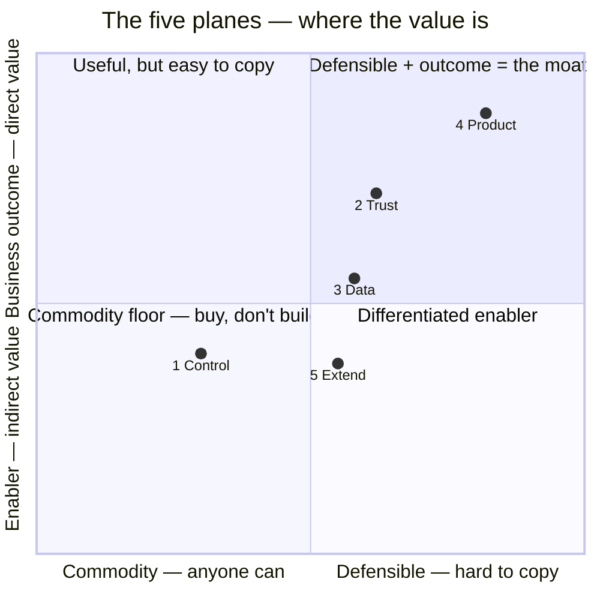
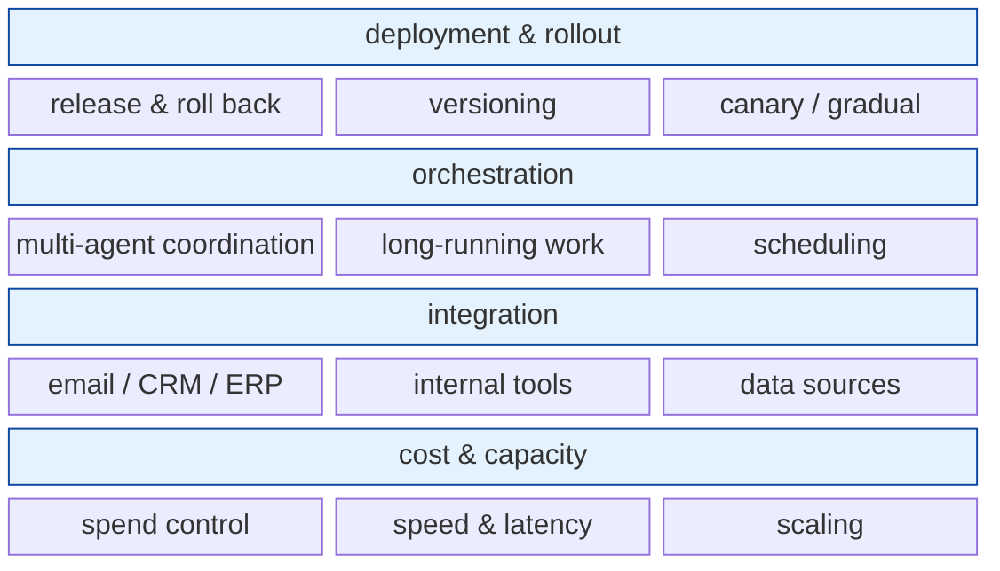
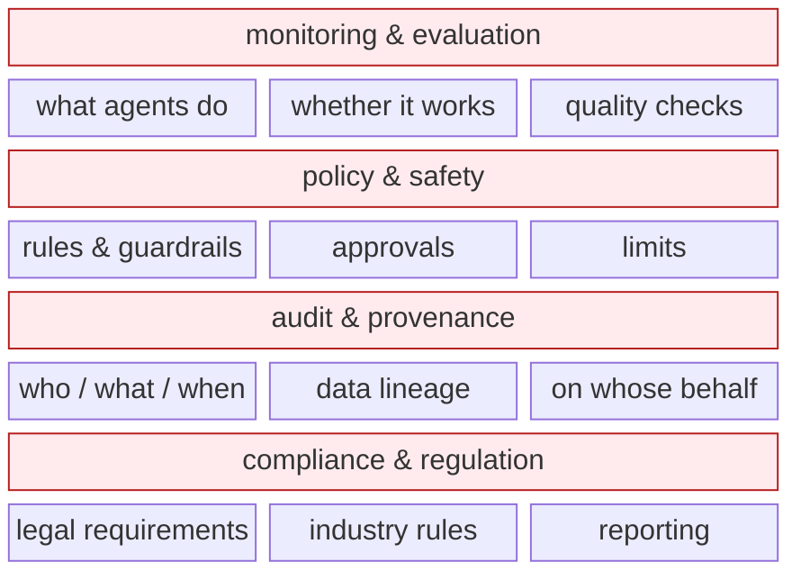
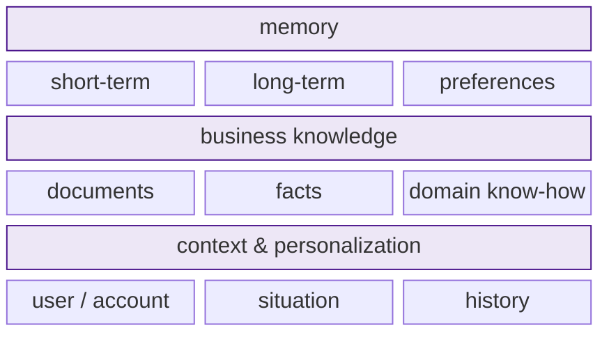
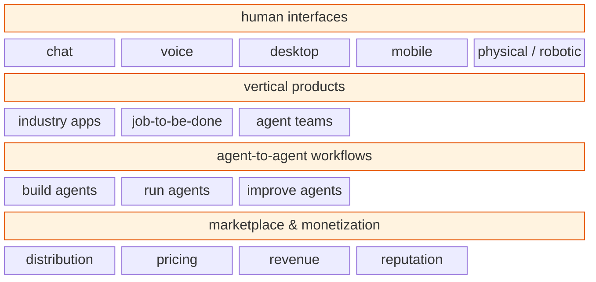
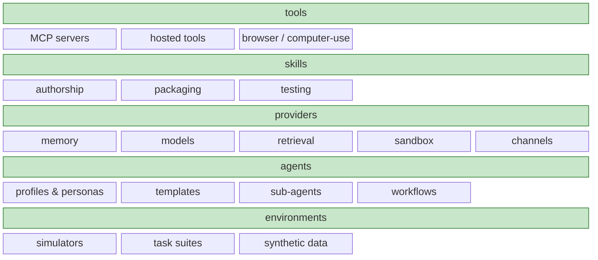

# Above the agentic platform — a working map

The agentic platform (agents, tools, memory, multi-agent) is a black box. Everything built on top of it sits in one of **five planes**: four describe what you **operate**, and one — **Extend** — is what you **build**. This is a map for gathering information, not a decision.

## Map of this document

- [The five planes at a glance](#the-five-planes-at-a-glance)
- [Where the value is](#where-the-value-is)
- [Business lens](#business-lens)
- [Plane 1 · Control](#plane-1--control)
- [Plane 2 · Trust](#plane-2--trust)
- [Plane 3 · Data](#plane-3--data)
- [Plane 4 · Product](#plane-4--product)
- [Plane 5 · Extend](#plane-5--extend)

## The five planes at a glance

| Plane | What it is | Who plays / buys | Defensibility |
|---|---|---|---|
| **1 · Control** | runs agents reliably, cheaply, and at scale | platform / IT teams | Low — commoditizes fast |
| **2 · Trust** | makes agents observable, safe, auditable, compliant | enterprises, risk & compliance, regulators | High — hard to fake |
| **3 · Data** | makes agents know your business | the business itself | Sticky — compounds with use |
| **4 · Product** | turns agents into products, services, and revenue | end customers and businesses | Where the money is |
| **5 · Extend** | builds the parts that plug into the platform | developers and research teams | Your own work — what we build |

## Where the value is

Control is the floor. Data compounds. Trust is what enterprises demand. Product is where revenue lives. Extend is where the building happens.

## Business lens

The planes describe what exists and what we'd build. These four questions apply to every plane.

- **Who** — who builds it, who runs it, who must adopt it (people, roles, org, change).
- **Who else** — who is already here: incumbents, startups, open source; where the whitespace is.
- **How much** — unit economics, cost to enter, ROI and payback.
- **How fast** — time-to-value, and dependency / lock-in risk.

## Plane 1 · Control

- **What it is:** runs agents reliably, cheaply, and at scale.
- **Who plays / buys:** platform and IT teams.
- **Why it matters:** table stakes — nothing runs without it, but it commoditizes fast.

**Open questions**
- Which parts can we buy, and which must we build?
- What are the real cost and latency drivers at scale?
- Who owns this today, inside and outside the org?

## Plane 2 · Trust

- **What it is:** makes agents observable, safe, auditable, compliant.
- **Who plays / buys:** enterprises, risk & compliance, regulators.
- **Why it matters:** the defensible layer; required to sell into enterprises.

**Open questions**
- Which compliance regimes actually apply to us?
- What can we prove today, and what can't we yet?
- Who holds the budget here — risk, compliance, or security?

## Plane 3 · Data

- **What it is:** makes agents know your business.
- **Who plays / buys:** the business itself; data and product owners.
- **Why it matters:** sticky — it compounds with use and is costly to switch away from.

**Open questions**
- Who owns the data, and under what privacy and permission constraints?
- What knowledge is hardest for competitors to replicate?
- What switching cost could we create?

## Plane 4 · Product

- **What it is:** turns agents into products, services, and revenue.
- **Who plays / buys:** end customers and businesses.
- **Why it matters:** where the money is — and where competition is fiercest.

**Open questions**
- Which vertical has the clearest, funded buyer?
- What interface do those users actually need?
- Where does defensibility come from — data, distribution, or workflow?

## Plane 5 · Extend

- **What it is:** the parts you build and plug into the black box.
- **Who plays / buys:** developers and research teams — this is our own work.
- **Why it matters:** the platform is a black box, so everything you add to it lives here.

**Open questions**
- Which providers and tools do we build first?
- Which environments and benchmarks do we need to evaluate them?
- What can we build that stays valuable if the platform is swapped?
