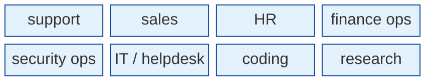
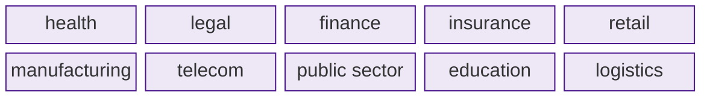
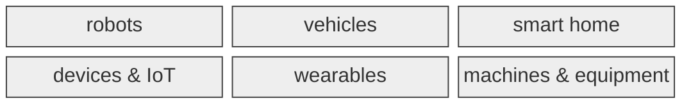
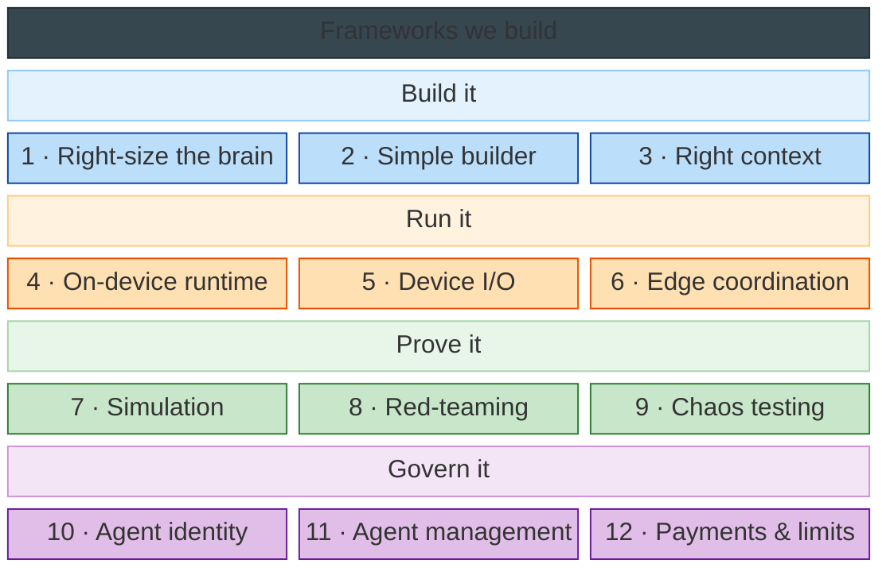
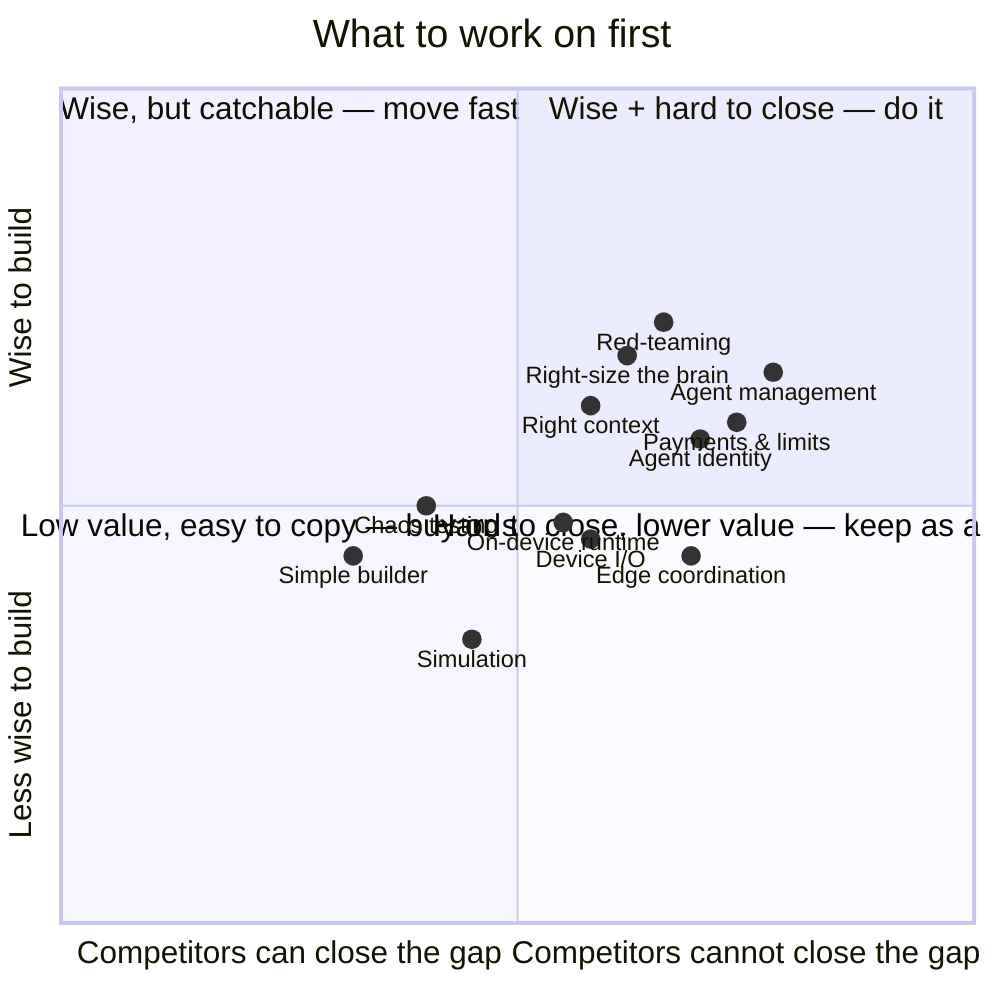

# What we build on top of Jiuwen

Jiuwen is the **brain**. We build **three parts** on top of it.

> **No body → software. Has a body → hardware.**

| Part | Software or hardware? | Who builds it |
|---|---|---|
| **1 · Products** | **software** — a brain in software | product teams, on Jiuwen's surfaces |
| **2 · Bodies** | **hardware** — a brain in a body | hardware / product teams |
| **3 · Enabling stack** | **neither** — it enables both | **us (R&D)** |

## 1 · Software products — a brain in software

**By job:**

**By industry:**

| Example product | Job / industry | Runs on (Jiuwen gives) |
|---|---|---|
| support triage agent | job · support | web / chat |
| helpdesk agent | job · IT | IDE / chat |
| claims processing agent | industry · insurance | software |
| contract review agent | industry · legal | software |
| month-end close agent | job · finance ops | software |

## 2 · Hardware bodies — a brain in a body

Jiuwen = the brain; the body team builds the senses, the acting, and the real-time loop.

## 3 · What we build — the enabling frameworks

Jiuwen already provides most of an agent's stack — the agent loop, memory and retrieval, connectors and their management, guardrails and tracing, evaluation, sandboxing, model routing and cost metering, permissions, channels, voice, privacy, and self-improvement. What is genuinely missing, and therefore ours, is a short list.

**How we decide what to build.** A framework is ours only if it passes three tests, not one:

| Test | Meaning |
|---|---|
| **Not in Jiuwen** | else it's already given |
| **Useful** | the industry actually wants it |
| **Ours to own** | we have the skills, and it isn't a specialist field, a standard, or a marketplace |

Agent payments passed the first two and failed the third — commerce is a specialist field.

**Why now — the industry's own framing.** Two 2026 readings shaped this list.

*First, the model is only half.* The field's shorthand is **Agent = Model + Harness**. The harness is **context + constraints + checks + governance**. Our frameworks are that harness:

| Harness part (industry) | Our frameworks |
|---|---|
| **Context** — what the agent sees | 3 · Right context |
| **Constraints** — what it may do and spend | 1 · Right-size the brain · 12 · Payments & limits |
| **Checks** — that verify its output | 7 · Simulation · 8 · Red-teaming · 9 · Chaos testing |
| **Governance** — how much autonomy it earns | 10 · Agent identity · 11 · Agent management |

*Second, the unsolved gap is distributed agent infrastructure.* The pieces that let agents run at the edge — local-first context, peer coordination, graceful degradation — are the ones nobody has built. The industry's own numbers: half of deployed agents are siloed, 96% hit data barriers, and only 11% reach production. This is where our hardware bet lives.

| Industry finding | Our answer |
|---|---|
| 50% of agents work in isolation | 6 · Edge coordination — peer-to-peer, offline |
| 96% hit data barriers | 3 · Right context — local-first context |
| 11% of agents reach production | 7–9 · prove it before it ships |

That harness covers nine of the twelve. The rest are about building and running the agent: 2 · Simple builder, 4 · On-device runtime, 5 · Device I/O, and 6 · Edge coordination.

### Frameworks we build

Jiuwen has **no counterpart** for these.

| # | Framework | Jiuwen has | We add | Example |
|---|---|---|---|---|
| 1 | **Right-size the brain** | a model router, a reasoning dial, a cost meter | a designer that fits the whole agent to its task, budget, data rules, risk, and deployment | a support team runs one agent that stays affordable |
| 2 | **Simple builder** | the full runtime | a compact SDK — an agent running in a few lines | a small team shipping an agent in a day |
| 3 | **Right context** | memory and retrieval | a layer that decides what the agent sees each step — assemble, compress, route | a long chat that stays sharp instead of drowning in its own history |
| 4 | **On-device runtime** | a server-side runtime | running the agent on the hardware, fast and offline | a voice helper answering in under 300 ms, offline |
| 5 | **Device I/O** | vision and browser control | sensors and motion for hardware | a robot that reads a camera and moves its arm |
| 6 | **Edge coordination** | a server-side runtime | many agents across many sites or devices — peer-to-peer, offline, data stays local | 500 store agents that keep working when the cloud drops |
| 7 | **Simulation** | multi-rollout evaluation | a fake world — and **simulated users** — to test the agent before the real one | a support agent rehearsed against a thousand fake customers |
| 8 | **Red-teaming** | guardrails that defend at run time | a framework that attacks the agent — injection, jailbreak, tool misuse — and reports the holes | an agent is stress-tested before it touches real data |
| 9 | **Chaos testing** | tracing and evaluation | breaks the agent on purpose — API failures, corruption, timeouts — and checks recovery | an agent loses a tool mid-task and still finishes |
| 10 | **Agent identity** | user auth and credential injection | a distinct identity per agent and job, with keys that expire when the job ends | a claims bot signs into the CRM as itself, for one job |
| 11 | **Agent management** | pools and a manager | run many agents — ownership, access, cost, failure, and a kill switch | an org runs 200 agents and knows what each does and costs |
| 12 | **Payments & limits** | — | a governed way for agents to spend — signed approvals, spend ceilings | a procurement agent that buys up to $200 and escalates anything higher |

**Which parts need which:**

| Framework | Jobs & industries (software) | Bodies (hardware) |
|---|---|---|
| **1 · Right-size the brain** | **yes** | **yes** |
| **2 · Simple builder** | **yes** | **yes** |
| **3 · Right context** | **yes** | **yes** |
| **4 · On-device runtime** | voice only | **yes** |
| **5 · Device I/O** | no | **yes** |
| **6 · Edge coordination** | multi-site | **yes** |
| **7 · Simulation** | **yes** | **yes** |
| **8 · Red-teaming** | **yes** | **yes** |
| **9 · Chaos testing** | **yes** | **yes** |
| **10 · Agent identity** | **yes** | **yes** |
| **11 · Agent management** | **yes** | **yes** |
| **12 · Payments & limits** | if it buys | if it buys |

## What NOT to build — Jiuwen already gives it

| Capability | Given by Jiuwen | Examples |
|---|---|---|
| Brain | agent loop | single agent · deep agent |
| Gateway & serving | runtime + gateway | agent gateway · policies · egress · MCP gateway |
| Teams | multi-agent | leader · members · human |
| Connectors & interoperability | MCP + management | tool calls · A2A · registry · credentials · marketplace |
| Knowledge & retrieval | full pipeline | KB · graph · indexing · embedding · rerank · vector store |
| Guardrails, tracing & eval | safety + observability | security rails · tracer · evaluator · compliance evidence |
| Sandbox | isolation is the default | network-deny · egress allowlists · filesystem (Landlock) |
| Model routing & cost | router + dial + meter | model groups · reasoning effort · usage |
| Planning & reliability | planning + rails | retries · recovery |
| Channels | user surfaces | web · desktop · mobile · IDE · chat/IM |
| Workflows | orchestration | graph/Pregel · task loop |
| Human in the loop | approvals & handoff | permission · plan · evolution approval |
| Voice | talk & listen | full-duplex · ASR/TTS |
| Privacy & PII | redact & proxy | inference privacy proxy · redaction |
| Moderation | content safety | guardrails · publish review |
| Self-improvement | learn & evolve | agent_evolving · RSI · skills |
| Discovery & marketplace | find agents & assets | Agent Cards · A2A discovery · skill / MCP hub |
| Protocols | adopt, don't invent | MCP · A2A · AP2 · AG-UI |
| Models & inference | commodity | foundation models · inference hosts |

## The 2026 market check — what the industry built

We compared our list against the published agent stacks and enterprise platforms of late 2026 — O'Reilly's six-layer agent stack, the eleven-layer landscape maps, the AWS / Microsoft / Google reference architectures, and the 2026 security, FinOps, and EU AI Act guidance. Three things stood out:

- **The industry's "moats" are already Jiuwen's.** Integrations, observability & eval, and memory/context are where the market sees durable value — and Jiuwen ships all three. So they are not our build.
- **What is genuinely ours is sharp, not broad:** designing the agent to its constraints (1), a compact SDK (2), shaping its context (3), running it on hardware (4, 5), coordinating it at the edge (6), rehearsing it (7), attacking it (8), breaking it on purpose (9), per-agent identity (10), and governing a fleet (11).
- **Payments are not ours** — commerce is a specialist field.

| 2026 industry layer | Ours | Note |
|---|---|---|
| Foundation models · inference | (providers) | commodity |
| Agent frameworks | (Jiuwen) | medium |
| Protocols — MCP · A2A · AG-UI | (Jiuwen) | standard |
| Agent gateway · runtime serving | (Jiuwen) | Jiuwen's |
| Tool integrations | (Jiuwen) | high moat — but Jiuwen's |
| Memory & vector DBs | (Jiuwen) | Jiuwen's |
| Observability & eval | (Jiuwen) | high moat — but Jiuwen's |
| Guardrails & safety | (Jiuwen) | Jiuwen's |
| Agent security / sandboxing | (Jiuwen) | Jiuwen's |
| Governance & compliance | (Jiuwen) | Jiuwen's |
| Red-teaming / adversarial testing | **8 · Red-teaming** | ours |
| Chaos engineering / fault injection | **9 · Chaos testing** | ours |
| Context engineering / context layer | **3 · Right context** | ours |
| Agent management / control plane | **11 · Agent management** | ours |
| Agent identity & access | **10 · Agent identity** | ours |
| Model routing · AI FinOps | **1 · Right-size the brain** | ours |
| No-code / low-code builders | **2 · Simple builder** | ours |
| On-device / edge | **4 · On-device runtime** | ours |
| Device I/O / robotics | **5 · Device I/O** | ours |
| Edge / distributed agents | **6 · Edge coordination** | ours |
| Simulation · sim2real · agent testing | **7 · Simulation** | ours |
| Browser / computer use | (Jiuwen) | Jiuwen's |
| Agentic commerce / payments | **12 · Payments & limits** | ours |

*Sources (Oct 2026): O'Reilly "The AI Agents Stack (2026 Edition)"; Stack Archive "Agentic AI Stack 2026"; AWS / Microsoft / Google enterprise agent architectures (The New Stack, 2026); Itexus "The AI Agent Infrastructure Stack in 2026"; Distributed Thoughts "The Agentic AI Infrastructure Gap"; Agentic Commerce Atlas; OWASP MCP Top 10 and 2026 prompt-injection research; FinOps Foundation State of FinOps 2026; EU AI Act high-risk obligations.*

## Where to start

| Zone | Frameworks | Move |
|---|---|---|
| Top-right — valuable + hard to copy | Right-size the brain · Payments & limits · Red-teaming · Agent management · Agent identity · Right context | **do it now** |
| Bottom-right — hard to copy, indirect value | On-device runtime · Device I/O · Edge coordination | **keep as our edge** |
| Bottom-left — easy to copy, indirect value | Simple builder | **buy or borrow** |
| Center | Simulation · Chaos testing | **build a little** |

## Business lens

| Question | Meaning |
|---|---|
| **Who** | who builds, runs, and adopts it |
| **Who else** | who is already here; where the whitespace is |
| **How much** | unit economics, cost to enter, ROI |
| **How fast** | time-to-value, lock-in risk |

## What each framework enables

**1 · Right-size the brain**
- **Jiuwen today:** routes each request across models, exposes a reasoning-effort setting, and meters cost.
- **New here:** a designer that fits the whole agent to its operating conditions — the kind of work, the budget, the data and provider rules, the acceptable error, the load, the deployment target, and the governing rules. It sets the models, how much the agent thinks, what it remembers, and what it may spend.
- **Unlocks:** a support team runs one agent that stays affordable — light on simple questions, deeper on hard ones.

**2 · Simple builder**
- **Jiuwen today:** the full runtime.
- **New here:** a compact SDK — an agent running in a few lines, in Python, TypeScript, or HTTP.
- **Unlocks:** a small team ships a working agent in days instead of months.

**3 · Right context**
- **Jiuwen today:** memory and retrieval.
- **New here:** a layer that decides what the agent sees each step — assembling, compressing, and routing context and memory.
- **Unlocks:** a long chat that stays sharp instead of drowning in its own history.

**4 · On-device runtime**
- **Jiuwen today:** a server-side runtime.
- **New here:** a runtime that runs the agent on the device itself — fast, and offline.
- **Unlocks:** a voice assistant answers in under 300 ms with no network.

**5 · Device I/O**
- **Jiuwen today:** vision and browser control.
- **New here:** sensors and motion for hardware.
- **Unlocks:** a robot reads a camera and moves its arm.

**6 · Edge coordination**
- **Jiuwen today:** a server-side runtime.
- **New here:** many agents across many sites or devices — coordinating peer-to-peer, working offline, keeping data local.
- **Unlocks:** 500 store agents that keep working when the cloud drops.

**7 · Simulation**
- **Jiuwen today:** multi-rollout evaluation.
- **New here:** a fake world — and simulated users — to test the agent before the real one.
- **Unlocks:** a robot is proven on a simulated floor, and a support agent against a thousand fake customers, before either ships.

**8 · Red-teaming**
- **Jiuwen today:** guardrails that defend at run time.
- **New here:** a framework that attacks the agent — prompt injection, jailbreak, tool misuse — and reports the holes.
- **Unlocks:** an agent is stress-tested, and its weak spots fixed, before it touches real data.

**9 · Chaos testing**
- **Jiuwen today:** tracing and evaluation.
- **New here:** breaking the agent on purpose — API failures, corrupted responses, timeouts — and checking it recovers.
- **Unlocks:** an agent loses a tool mid-task and still finishes the job.

**10 · Agent identity**
- **Jiuwen today:** user authentication and credential injection.
- **New here:** a distinct identity per agent and per job, with keys that expire when the job ends.
- **Unlocks:** a claims bot signs into the CRM as itself — never as a human, and only for the one job.

**11 · Agent management**
- **Jiuwen today:** pools of agents and a manager.
- **New here:** run many agents — know who owns each, what it can reach, what it costs, what happens when it fails, and a kill switch.
- **Unlocks:** an org runs 200 agents and can still answer, for each one, what it does and what it spends.

**12 · Payments & limits**
- **Jiuwen today:** nothing.
- **New here:** a governed way for an agent to spend — signed approvals and spend ceilings.
- **Unlocks:** an agent buys, books, and pays without open-ended financial risk.
