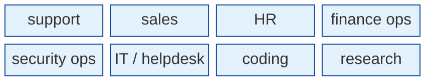
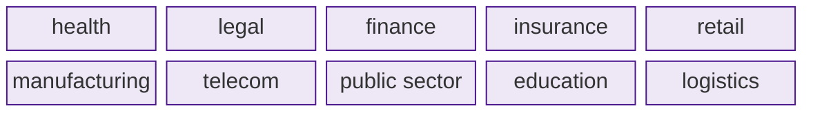
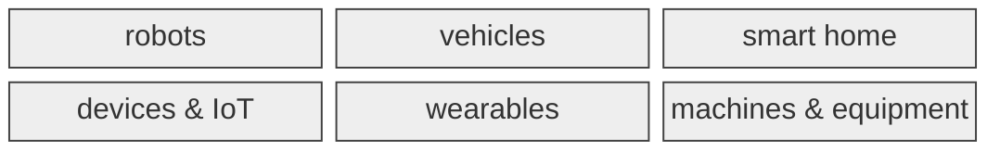
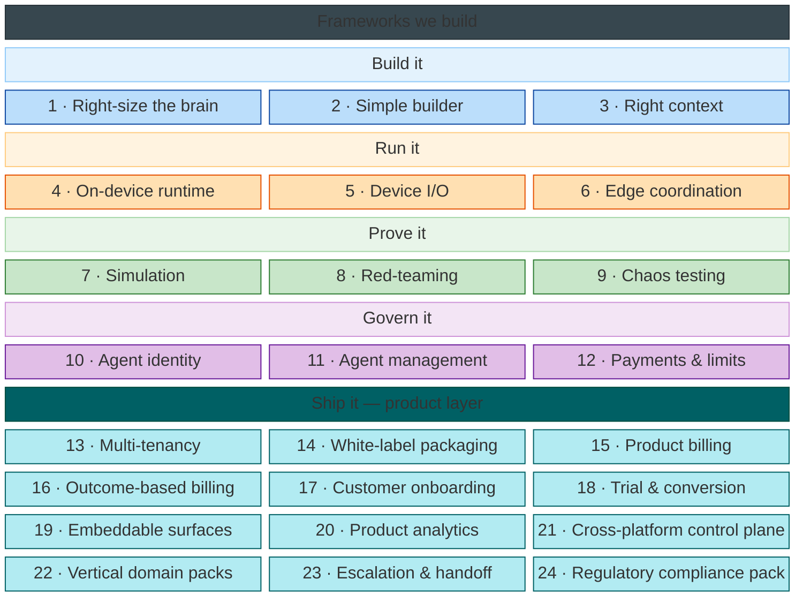
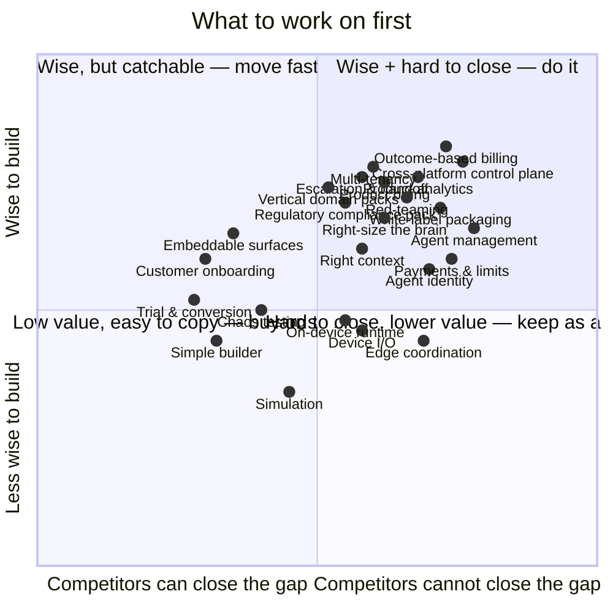

# What we build on top of Jiuwen

Jiuwen is the **brain**. We build **three parts** on top of it.

> **No body → software. Has a body → hardware.**

| Part | Software or hardware? | Who builds it |
|---|---|---|
| **1 · Products** | **software** — a brain in software | product teams, on Jiuwen's surfaces |
| **2 · Bodies** | **hardware** — a brain in a body | hardware / product teams |
| **3 · Enabling stack** | **neither** — it enables both | **us (R&D)** |

## 1 · Software products — a brain in software

**By job:**

**By industry:**

| Example product | Job / industry | Runs on (Jiuwen gives) |
|---|---|---|
| support triage agent | job · support | web / chat |
| helpdesk agent | job · IT | IDE / chat |
| claims processing agent | industry · insurance | software |
| contract review agent | industry · legal | software |
| month-end close agent | job · finance ops | software |

## 2 · Hardware bodies — a brain in a body

Jiuwen = the brain; the body team builds the senses, the acting, and the real-time loop.

## 3 · What we build — the enabling frameworks

Jiuwen already provides most of an agent's stack — the agent loop, memory and retrieval, connectors and their management, guardrails and tracing, evaluation, sandboxing, model routing and cost metering, permissions, channels, voice, privacy, and self-improvement. What is genuinely missing, and therefore ours, is a short list.

These frameworks divide into two layers. Frameworks 1–12 make the agent capable, trustworthy, and governable — they improve what is under the hood. Frameworks 13–24 do something different: they remove the plumbing a startup must otherwise build to turn an agent into a product their customers pay for. The first layer makes the agent work. The second layer makes the business.

**How we decide what to build.** A framework is ours only if it passes three tests, not one:

| Test | Meaning |
|---|---|
| **Not in Jiuwen** | else it's already given |
| **Useful** | the industry actually wants it |
| **Ours to own** | we have the skills, and it isn't a specialist field, a standard, or a marketplace |

Agent payments passed the first two and failed the third — commerce is a specialist field.

**Why now — the industry's own framing.** Two 2026 readings shaped this list.

*First, the model is only half.* The field's shorthand is **Agent = Model + Harness**. The harness is **context + constraints + checks + governance**. Our frameworks are that harness:

| Harness part (industry) | Our frameworks |
|---|---|
| **Context** — what the agent sees | 3 · Right context |
| **Constraints** — what it may do and spend | 1 · Right-size the brain · 12 · Payments & limits |
| **Checks** — that verify its output | 7 · Simulation · 8 · Red-teaming · 9 · Chaos testing |
| **Governance** — how much autonomy it earns | 10 · Agent identity · 11 · Agent management |

*Second, the unsolved gap is distributed agent infrastructure.* The pieces that let agents run at the edge — local-first context, peer coordination, graceful degradation — are the ones nobody has built. The industry's own numbers: half of deployed agents are siloed, 96% hit data barriers, and only 11% reach production. This is where our hardware bet lives.

| Industry finding | Our answer |
|---|---|
| 50% of agents work in isolation | 6 · Edge coordination — peer-to-peer, offline |
| 96% hit data barriers | 3 · Right context — local-first context |
| 11% of agents reach production | 7–9 · prove it before it ships |

That harness covers nine of the twelve. The rest are about building and running the agent: 2 · Simple builder, 4 · On-device runtime, 5 · Device I/O, and 6 · Edge coordination.

*Third, the product layer.* The harness makes an agent work. It does not make a business. A startup building on Jiuwen still has no framework for charging customers, isolating them from each other, onboarding them, or distributing the product. These are not agent problems — they are product problems, and they are currently a blank across the industry.

| Group | What it does | Framework |
|---|---|---|
| **Serve & isolate** | Serve multiple customers | 13 · Multi-tenancy |
| | Sell an enterprise a dedicated instance | 14 · White-label packaging |
| **Charge** | Bill per use | 15 · Product billing |
| | Bill per result | 16 · Outcome-based billing |
| **Acquire** | Onboard customers | 17 · Customer onboarding |
| | Convert trials | 18 · Trial & conversion |
| **Engage** | Embed the interface | 19 · Embeddable surfaces |
| | Measure business health | 20 · Product analytics |
| **Operate** | Govern agents you didn't build | 21 · Cross-platform control plane |
| **Verticalize** | Enter a vertical fast | 22 · Vertical domain packs |
| **Human & regulator** | Design the handoff | 23 · Escalation & handoff |
| | Generate regulatory evidence | 24 · Regulatory compliance pack |

### Frameworks we build

Jiuwen has **no counterpart** for these.

| # | Group | Framework | Jiuwen has | We add | Example |
|---|---|---|---|---|---|
| 1 | Build it | **Right-size the brain** | a model router, a reasoning dial, a cost meter | a designer that fits the whole agent to its task, budget, data rules, risk, and deployment | a support team runs one agent that stays affordable |
| 2 | Build it | **Simple builder** | the full runtime | a compact **backend** SDK — an agent running in a few lines | a small team shipping an agent in a day |
| 3 | Build it | **Right context** | memory and retrieval | a layer that decides what the agent sees each step — assemble, compress, route | a long chat that stays sharp instead of drowning in its own history |
| 4 | Run it | **On-device runtime** | a server-side runtime | running the agent on **a single device**, fast and offline | a voice helper answering in under 300 ms, offline |
| 5 | Run it | **Device I/O** | vision and browser control | sensors and motion for hardware | a robot that reads a camera and moves its arm |
| 6 | Run it | **Edge coordination** | a server-side runtime | many agents across many sites or devices — peer-to-peer, offline, data stays local (**not one device**) | 500 store agents that keep working when the cloud drops |
| 7 | Prove it | **Simulation** | multi-rollout evaluation | a fake world — and **simulated users** — to test the agent before the real one | a support agent rehearsed against a thousand fake customers |
| 8 | Prove it | **Red-teaming** | guardrails that defend at run time | a framework where **a malicious actor attacks** the agent — injection, jailbreak, tool misuse — and reports the holes | an agent is stress-tested before it touches real data |
| 9 | Prove it | **Chaos testing** | tracing and evaluation | breaks the agent with **random faults, not an attacker** — API failures, corruption, timeouts — and checks recovery | an agent loses a tool mid-task and still finishes |
| 10 | Govern it | **Agent identity** | user auth and credential injection | a distinct identity per agent and job, with keys that expire when the job ends | a claims bot signs into the CRM as itself, for one job |
| 11 | Govern it | **Agent management** | pools and a manager | run many of **your own** agents — ownership, access, cost, failure, and a kill switch | an org runs 200 agents and knows what each does and costs |
| 12 | Govern it | **Payments & limits** | — | a governed wallet for the **agent's own spending** (not customer billing) — signed approvals, spend ceilings | a procurement agent that buys up to $200 and escalates anything higher |

**Product layer — ship it as a business.** The frameworks below do not improve the agent. They remove the plumbing a startup must otherwise build before they have a product.

| # | Group | Framework | Jiuwen has | We add | Example |
|---|---|---|---|---|---|
| 13 | Serve & isolate | **Multi-tenancy** | single-tenant runtime | many customers share one runtime, logically isolated — separate data, agent instances, config, and billing per customer | a B2B startup onboards 50 companies; each sees only its own agents and data |
| 14 | Serve & isolate | **White-label packaging** | — | rebrand and deploy a **dedicated instance per enterprise client** (vs shared multi-tenant) — their SSO, their domain, their data residency | a startup wins an enterprise deal without building a custom deployment |
| 15 | Charge | **Product billing** | cost metering (internal) | turns customer usage into invoices — define the pricing model (per task, per seat, per minute) and wire it to a payment processor | a startup charges per task processed; billing is automatic, not hand-built |
| 16 | Charge | **Outcome-based billing** | cost metering (internal) | charges per verified outcome — defines what counts as a result, measures attribution, bills only when proof exists | a legal AI startup charges $4 per contract reviewed and signed off, not per token |
| 17 | Acquire | **Customer onboarding** | — | guided first-mile setup **after purchase** — connect data sources, configure agent, run first task | a new customer goes from signup to working agent without calling support |
| 18 | Acquire | **Trial & conversion** | — | bounded trial infrastructure **before purchase** — usage caps, time limits, instrumented conversion triggers | a startup runs a 14-day free trial with automatic upgrade prompts when limits are hit |
| 19 | Engage | **Embeddable surfaces** | channels for own products | drop-in UI components — chat, task status, history, **approval-status screens** — for embedding in a third-party product | a startup ships an agent interface inside their existing web app in hours, not months |
| 20 | Engage | **Product analytics** | agent eval and tracing | business-health metrics — activation, retention, feature adoption — built around agent interaction patterns | a startup sees which customers activated, which churned, and why |
| 21 | Operate | **Cross-platform control plane** | agent management (Jiuwen-only) | a neutral governance layer over agents built on **other** frameworks — LangChain, CrewAI, Agentforce, Copilot — with unified inventory, policy, cost, and kill switch | an enterprise runs 300 agents across four frameworks and sees all of them in one place |
| 22 | Verticalize | **Vertical domain packs** | — | pre-built knowledge, **industry rule structures**, industry connectors, and workflow blueprints for a specific vertical — a startup picks a pack and starts domain-ready | an insurance startup gets FNOL workflows, claims connectors, and state-rule structures on day one |
| 23 | Human & regulator | **Escalation & handoff** | human-in-the-loop primitives | configurable escalation logic above the HITL mechanism — trigger conditions, context packaging, routing rules, SLA per escalation type, workflow resumption | a claims agent escalates when confidence drops below 0.7 or a decision exceeds $5,000, packages context, routes to the right queue, resumes on approval |
| 24 | Human & regulator | **Regulatory compliance pack** | compliance evidence (raw traces) | a mapping layer that turns traces into regulation-specific evidence packages — EU AI Act Articles 9/13/14, GDPR Article 22/35, NIST AI RMF — **not runtime control, not domain content** | an EU-market agent auto-generates a conformity assessment and DPIA on every deployment, ready for a regulator |

**Which parts need which:**

| Group | Framework | Jobs & industries (software) | Bodies (hardware) |
|---|---|---|---|
| Build it | **1 · Right-size the brain** | **yes** | **yes** |
| Build it | **2 · Simple builder** | **yes** | **yes** |
| Build it | **3 · Right context** | **yes** | **yes** |
| Run it | **4 · On-device runtime** | voice only | **yes** |
| Run it | **5 · Device I/O** | no | **yes** |
| Run it | **6 · Edge coordination** | multi-site | **yes** |
| Prove it | **7 · Simulation** | **yes** | **yes** |
| Prove it | **8 · Red-teaming** | **yes** | **yes** |
| Prove it | **9 · Chaos testing** | **yes** | **yes** |
| Govern it | **10 · Agent identity** | **yes** | **yes** |
| Govern it | **11 · Agent management** | **yes** | **yes** |
| Govern it | **12 · Payments & limits** | if it buys | if it buys |
| Serve & isolate | **13 · Multi-tenancy** | **yes** | partial |
| Serve & isolate | **14 · White-label packaging** | **yes** | partial |
| Charge | **15 · Product billing** | **yes** | partial |
| Charge | **16 · Outcome-based billing** | **yes** | no |
| Acquire | **17 · Customer onboarding** | **yes** | no |
| Acquire | **18 · Trial & conversion** | **yes** | no |
| Engage | **19 · Embeddable surfaces** | **yes** | no |
| Engage | **20 · Product analytics** | **yes** | partial |
| Operate | **21 · Cross-platform control plane** | **yes** | **yes** |
| Verticalize | **22 · Vertical domain packs** | **yes** | partial |
| Human & regulator | **23 · Escalation & handoff** | **yes** | **yes** |
| Human & regulator | **24 · Regulatory compliance pack** | **yes** | **yes** |

## What NOT to build — Jiuwen already gives it

| Capability | Given by Jiuwen | Examples |
|---|---|---|
| Brain | agent loop | single agent · deep agent |
| Gateway & serving | runtime + gateway | agent gateway · policies · egress · MCP gateway |
| Teams | multi-agent | leader · members · human |
| Connectors & interoperability | MCP + management | tool calls · A2A · registry · credentials · marketplace |
| Knowledge & retrieval | full pipeline | KB · graph · indexing · embedding · rerank · vector store |
| Guardrails, tracing & eval | safety + observability | security rails · tracer · evaluator · compliance evidence (raw traces) |
| Sandbox | isolation is the default | network-deny · egress allowlists · filesystem (Landlock) |
| Model routing & cost | router + dial + meter | model groups · reasoning effort · usage |
| Planning & reliability | planning + rails | retries · recovery |
| Channels | user surfaces | web · desktop · mobile · IDE · chat/IM |
| Workflows | orchestration | graph/Pregel · task loop |
| Human in the loop | approve/reject mechanism | permission · plan · evolution approval |
| Voice | talk & listen | full-duplex · ASR/TTS |
| Privacy & PII | redact & proxy | inference privacy proxy · redaction |
| Moderation | content safety | guardrails · publish review |
| Self-improvement | learn & evolve | agent_evolving · RSI · skills |
| Discovery & marketplace | find agents & assets | Agent Cards · A2A discovery · skill / MCP hub |
| Protocols | adopt, don't invent | MCP · A2A · AP2 · AG-UI |
| Models & inference | commodity | foundation models · inference hosts |

## The 2026 market check — what the industry built

We compared our list against the published agent stacks and enterprise platforms of late 2026 — O'Reilly's six-layer agent stack, the eleven-layer landscape maps, the AWS / Microsoft / Google reference architectures, and the 2026 security, FinOps, and EU AI Act guidance. Three things stood out:

- **The industry's "moats" are already Jiuwen's.** Integrations, observability & eval, and memory/context are where the market sees durable value — and Jiuwen ships all three. So they are not our build.
- **What is genuinely ours is sharp, not broad:** designing the agent to its constraints (1), a compact SDK (2), shaping its context (3), running it on hardware (4, 5), coordinating it at the edge (6), rehearsing it (7), attacking it (8), breaking it on purpose (9), per-agent identity (10), and governing a fleet (11).
- **The agent as a merchant is not ours** — commerce is a specialist field. What we do own is the agent's spend limits (12) and the billing you build for customers (15, 16).

| 2026 industry layer | Ours | Note |
|---|---|---|
| Foundation models · inference | (providers) | commodity |
| Agent frameworks | (Jiuwen) | medium |
| Protocols — MCP · A2A · AG-UI | (Jiuwen) | standard |
| Agent gateway · runtime serving | (Jiuwen) | Jiuwen's |
| Tool integrations | (Jiuwen) | high moat — but Jiuwen's |
| Memory & vector DBs | (Jiuwen) | Jiuwen's |
| Observability & eval | (Jiuwen) | high moat — but Jiuwen's |
| Guardrails & safety | (Jiuwen) | Jiuwen's |
| Agent security / sandboxing | (Jiuwen) | Jiuwen's |
| Governance & compliance | (Jiuwen) | Jiuwen's |
| Red-teaming / adversarial testing | **8 · Red-teaming** | ours |
| Chaos engineering / fault injection | **9 · Chaos testing** | ours |
| Context engineering / context layer | **3 · Right context** | ours |
| Agent management / control plane | **11 · Agent management** | ours |
| Agent identity & access | **10 · Agent identity** | ours |
| Model routing · AI FinOps | **1 · Right-size the brain** | ours |
| No-code / low-code builders | **2 · Simple builder** | ours |
| On-device / edge | **4 · On-device runtime** | ours |
| Device I/O / robotics | **5 · Device I/O** | ours |
| Edge / distributed agents | **6 · Edge coordination** | ours |
| Simulation · sim2real · agent testing | **7 · Simulation** | ours |
| Browser / computer use | (Jiuwen) | Jiuwen's |
| Agentic commerce / payments | **12 · Payments & limits** | ours |
| Outcome-based pricing infrastructure | **16 · Outcome-based billing** | ours |
| Agent sprawl / cross-framework governance | **21 · Cross-platform control plane** | ours |
| Vertical AI domain packs | **22 · Vertical domain packs** | ours |
| Human escalation design / HITL patterns | **23 · Escalation & handoff** | ours |
| Regulatory evidence generation / AI Act compliance | **24 · Regulatory compliance pack** | ours |

*Sources (Oct 2026): O'Reilly "The AI Agents Stack (2026 Edition)"; Stack Archive "Agentic AI Stack 2026"; AWS / Microsoft / Google enterprise agent architectures (The New Stack, 2026); Itexus "The AI Agent Infrastructure Stack in 2026"; Distributed Thoughts "The Agentic AI Infrastructure Gap"; Agentic Commerce Atlas; OWASP MCP Top 10 and 2026 prompt-injection research; FinOps Foundation State of FinOps 2026; EU AI Act high-risk obligations. Frameworks 16, 21–22 additionally draw from: Fungies.io "AI Agent Billing Models 2026"; Flexprice "Top Solutions for Agentic Monetization 2026"; Innobu "AI Agent Sprawl 2026 — Why 94% of Enterprises Lose Control"; AgentLux "Agent Control Plane: Winning Enterprise AI in 2026"; Gartner six-step agent governance framework (Apr 2026); Dataiku Agent Management GA (Sep 2026); SaaS Mag "Vertical AI Agents Are Eating Horizontal SaaS"; Bessemer Venture Partners on Legora growth trajectory. Frameworks 23–24 additionally draw from: Digital Applied "Human-in-the-Loop Escalation Design for AI Agents 2026"; BuildMVPFast "Agent Handoff Patterns 2026"; EU AI Act and Autonomous Agents — The Regulatory Reckoning Arrives August 2026 (The Agent Report); EU-Startups "10 European compliance startups to watch as AI Act enforcement kicks in" (Aug 2026); Arthur AI "Best AI Governance Platforms for Agentic AI 2026"; Covasant "EU AI Act Compliance for Autonomous Agents in Enterprise 2026".*

## Where to start

| Zone | Frameworks | Move |
|---|---|---|
| Top-right — valuable + hard to copy | Right-size the brain · Payments & limits · Red-teaming · Agent management · Agent identity · Right context · **Multi-tenancy · Product billing · Product analytics · White-label packaging · Outcome-based billing · Cross-platform control plane · Vertical domain packs · Escalation & handoff · Regulatory compliance pack** | **do it now** |
| Top-left — valuable but catchable | **Embeddable surfaces · Customer onboarding · Trial & conversion** | **move fast** |
| Bottom-right — hard to copy, indirect value | On-device runtime · Device I/O · Edge coordination | **keep as our edge** |
| Bottom-left — easy to copy, indirect value | Simple builder | **buy or borrow** |
| Center | Simulation · Chaos testing | **build a little** |

## Business lens

| Question | Meaning |
|---|---|
| **Who** | who builds, runs, and adopts it |
| **Who else** | who is already here; where the whitespace is |
| **How much** | unit economics, cost to enter, ROI |
| **How fast** | time-to-value, lock-in risk |

## What each framework enables

#### Build it

**1 · Right-size the brain**
- **Jiuwen today:** routes each request across models, exposes a reasoning-effort setting, and meters cost.
- **New here:** a designer that fits the whole agent to its operating conditions — the kind of work, the budget, the data and provider rules, the acceptable error, the load, the deployment target, and the governing rules. It sets the models, how much the agent thinks, and what it may spend.
- **Unlocks:** a support team runs one agent that stays affordable — light on simple questions, deeper on hard ones.

**2 · Simple builder**
- **Jiuwen today:** the full runtime.
- **New here:** a compact backend SDK — an agent running in a few lines, in Python, TypeScript, or HTTP.
- **Unlocks:** a small team ships a working agent in days instead of months.

**3 · Right context**
- **Jiuwen today:** memory and retrieval.
- **New here:** a layer that decides what the agent sees each step — assembling, compressing, and routing context and memory.
- **Unlocks:** a long chat that stays sharp instead of drowning in its own history.

#### Run it

**4 · On-device runtime**
- **Jiuwen today:** a server-side runtime.
- **New here:** a runtime that runs the agent on a single device — fast, and offline.
- **Unlocks:** a voice assistant answers in under 300 ms with no network.

**5 · Device I/O**
- **Jiuwen today:** vision and browser control.
- **New here:** sensors and motion for hardware.
- **Unlocks:** a robot reads a camera and moves its arm.

**6 · Edge coordination**
- **Jiuwen today:** a server-side runtime.
- **New here:** many agents across many sites or devices (not one device) — coordinating peer-to-peer, working offline, keeping data local.
- **Unlocks:** 500 store agents that keep working when the cloud drops.

#### Prove it

**7 · Simulation**
- **Jiuwen today:** multi-rollout evaluation.
- **New here:** a fake world — and simulated users — to test the agent before the real one.
- **Unlocks:** a robot is proven on a simulated floor, and a support agent against a thousand fake customers, before either ships.

**8 · Red-teaming**
- **Jiuwen today:** guardrails that defend at run time.
- **New here:** a framework where a malicious actor attacks the agent — prompt injection, jailbreak, tool misuse — and reports the holes.
- **Unlocks:** an agent is stress-tested, and its weak spots fixed, before it touches real data.

**9 · Chaos testing**
- **Jiuwen today:** tracing and evaluation.
- **New here:** breaking the agent with random faults, not an attacker — API failures, corrupted responses, timeouts — and checking it recovers.
- **Unlocks:** an agent loses a tool mid-task and still finishes the job.

#### Govern it

**10 · Agent identity**
- **Jiuwen today:** user authentication and credential injection.
- **New here:** a distinct identity per agent and per job, with keys that expire when the job ends.
- **Unlocks:** a claims bot signs into the CRM as itself — never as a human, and only for the one job.

**11 · Agent management**
- **Jiuwen today:** pools of agents and a manager.
- **New here:** run many of your own agents — know who owns each, what it can reach, what it costs, what happens when it fails, and a kill switch.
- **Unlocks:** an org runs 200 agents and can still answer, for each one, what it does and what it spends.

**12 · Payments & limits**
- **Jiuwen today:** nothing.
- **New here:** a governed wallet for the agent's own spending (not customer billing) — signed approvals and spend ceilings.
- **Unlocks:** an agent buys, books, and pays without open-ended financial risk.

---

### Product layer — ship it as a business

These frameworks do not touch the agent's quality, safety, or cost. They close the gap between "working agent" and "product customers pay for."

#### Serve & isolate

**13 · Multi-tenancy**
- **Jiuwen today:** single-tenant runtime.
- **New here:** a framework for isolating customers from each other — many customers share one runtime with separate agent instances, separate memory and data, separate permissions, separate billing meters — configured rather than hand-built by the startup.
- **Unlocks:** a B2B startup onboards 50 companies; each sees only its own agents, data, and costs.

**14 · White-label packaging**
- **Jiuwen today:** nothing.
- **New here:** a framework to rebrand and deploy a dedicated instance per enterprise client (vs shared multi-tenant) — their SSO, their domain, their data residency requirements — as a configuration, not a custom project.
- **Unlocks:** a startup wins enterprise deals that would otherwise require months of bespoke deployment work.

#### Charge

**15 · Product billing**
- **Jiuwen today:** cost metering for internal use.
- **New here:** a layer that turns customer usage into invoices — the startup defines the pricing model (per task, per seat, per minute), the framework wires it to a payment processor.
- **Unlocks:** a startup earns revenue from agent usage without building billing logic from scratch.

**16 · Outcome-based billing**
- **Jiuwen today:** cost metering for internal use.
- **New here:** charges per verified outcome rather than per usage event. Defines what counts as a result for a given agent type, measures whether it happened, attributes it to the agent's action within a time window, and only bills when proof exists. Intercom charges $0.99 per resolved ticket; Zendesk $1.50–$2.00 with a 72-hour attribution window; Sierra built a $15.8B business on it. The attribution logic — tamper-proof, auditable, contestable — is the hard part that no startup should build twice.
- **Unlocks:** a startup aligns its pricing with customer value. Customers pay for problems solved, not for compute burned.
- **Market signal:** Intercom Fin, Zendesk AI, Sierra, Salesforce Agentforce; Flexprice and Nevermined as standalone infrastructure for it (Oct 2026).

#### Acquire

**17 · Customer onboarding**
- **Jiuwen today:** nothing.
- **New here:** a guided first-mile setup flow after purchase — connect data sources, configure the agent instance, verify access, run a first task — shaped by the startup, not built by them.
- **Unlocks:** a new customer goes from signup to a working agent without engineering involvement on either side.

**18 · Trial & conversion**
- **Jiuwen today:** nothing.
- **New here:** bounded trial infrastructure before purchase — usage caps, time limits, capability gates, instrumented conversion triggers and upgrade prompts — wired to the billing layer.
- **Unlocks:** a startup runs a free trial with automatic conversion, without building the gating and metering logic themselves.

#### Engage

**19 · Embeddable surfaces**
- **Jiuwen today:** channels for own products.
- **New here:** drop-in UI components — chat interface, task status, agent history, approval-status screens — that a startup embeds in their existing product, configured rather than built.
- **Unlocks:** a startup ships a polished agent interface inside their product in hours, not months.

**20 · Product analytics**
- **Jiuwen today:** agent eval and operational tracing.
- **New here:** business-health metrics built around agent interaction patterns — activation rates, feature adoption, retention signals, where customers drop off, what separates a healthy account from a churning one.
- **Unlocks:** a startup knows which customers are getting value from their product and which are not, without retrofitting a general-purpose analytics tool that does not understand agent interactions.

#### Operate

**21 · Cross-platform control plane**
- **Jiuwen today:** agent management for Jiuwen-native agents.
- **New here:** a neutral governance layer over agents built on other frameworks — LangChain, CrewAI, Salesforce Agentforce, Microsoft Copilot, Jiuwen. Unified inventory, ownership, policy enforcement, cost attribution, and kill switch across all of them — the agents it did not create. The critical property: must govern agents it did not build without forcing the enterprise into a closed stack.
- **Unlocks:** an enterprise that already has agents across four frameworks gets one place to see who owns each agent, whether it meets its targets, what it costs, and how to shut it down. Jiuwen becomes the governance hub for the whole fleet, not just its own slice.
- **Market signal:** 94% of enterprises report agent sprawl is a security risk; only 12% govern centrally. Microsoft Agent 365 went GA May 2026. Dataiku shipped Agent Management September 2026. Gartner published a six-step governance framework April 2026 (Oct 2026).

#### Verticalize

**22 · Vertical domain packs**
- **Jiuwen today:** nothing.
- **New here:** pre-built packs per industry vertical — domain knowledge, industry rule structures, industry-specific connectors, and workflow blueprints. A startup building for insurance gets FNOL workflows, claims connectors, state-rule structures, and underwriting rule structures. A legal startup gets contract review patterns, jurisdiction templates, and privilege-handling rules. The startup picks a pack and starts domain-ready instead of blank.
- **Unlocks:** a startup enters a regulated vertical in weeks rather than months. The domain knowledge that took Legora and Harvey years to accumulate becomes a starting point, not a moat to climb.
- **Market signal:** Legora (legal) $100M ARR in 18 months. Harvey $11B valuation. Avoca (HVAC/field service) $1B. FurtherAI (insurance) a16z Series A. Vertical AI growing at 23.9% CAGR, 3× faster than horizontal SaaS (Oct 2026).

#### Human & regulator

**23 · Escalation & handoff**
- **Jiuwen today:** human-in-the-loop primitives — approve, reject, handoff.
- **New here:** the configurable design layer above the HITL mechanism. Six trigger types are converging as industry standard: confidence threshold breach, irreversibility flag, action-risk-tier match, sentiment signal, SLA breach, and anomaly/injection detection. Each trigger needs its own routing rule, SLA expectation, context packet (current task state, trigger reason, recommended action, sentiment trend), and workflow resumption logic. A startup building a claims agent and one building an HR agent need completely different escalation designs — neither should build this from scratch.
- **Unlocks:** a startup ships a production-grade human-in-the-loop product — with the right escalations firing at the right moments, the right context reaching the right human, and the workflow resuming without loss — without designing any of that logic themselves.
- **Market signal:** Sierra, Intercom Fin, and Voiceflow each built their own escalation frameworks independently. Digital Applied "Human-in-the-Loop Escalation Design for AI Agents 2026"; BuildMVPFast "Agent Handoff Patterns 2026" — the pattern is documented but no platform owns it as a framework (Oct 2026).

**24 · Regulatory compliance pack**
- **Jiuwen today:** compliance evidence — raw traces and audit logs generated by the runtime.
- **New here:** a mapping layer that takes Jiuwen's traces and structures them into regulation-specific evidence packages — not runtime control, not domain content. EU AI Act Article 9 (risk management system documentation), Article 13 (transparency obligations), Article 14 (human oversight design evidence), Article 50 (AI-generated content marking). GDPR Article 22 (automated decision-making justification), Article 35 (DPIA). NIST AI RMF. ISO 42001. Each package has the correct artifact names, formats, and per-decision links that a data protection authority or market-surveillance authority expects to see.
- **Unlocks:** a startup selling into EU-regulated markets generates a conformity assessment, DPIA, and human oversight evidence package automatically on every agent deployment — without a lawyer reviewing traces. EU AI Act penalties reach €35M or 7% of global turnover; the compliance pack turns that risk into a checkbox.
- **Market signal:** EU AI Act Article 50 enforcement started August 2026. Arthur, Credo AI, IBM watsonx.governance, and Hybridity are all building this as standalone products — validating the demand while leaving the Jiuwen-native version open (Oct 2026).
