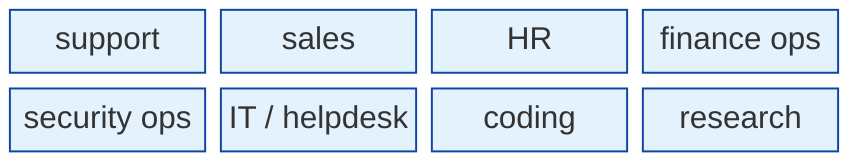
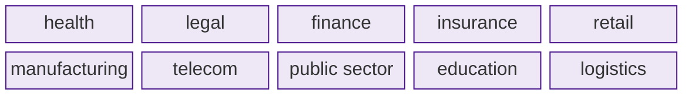
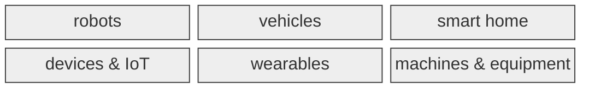
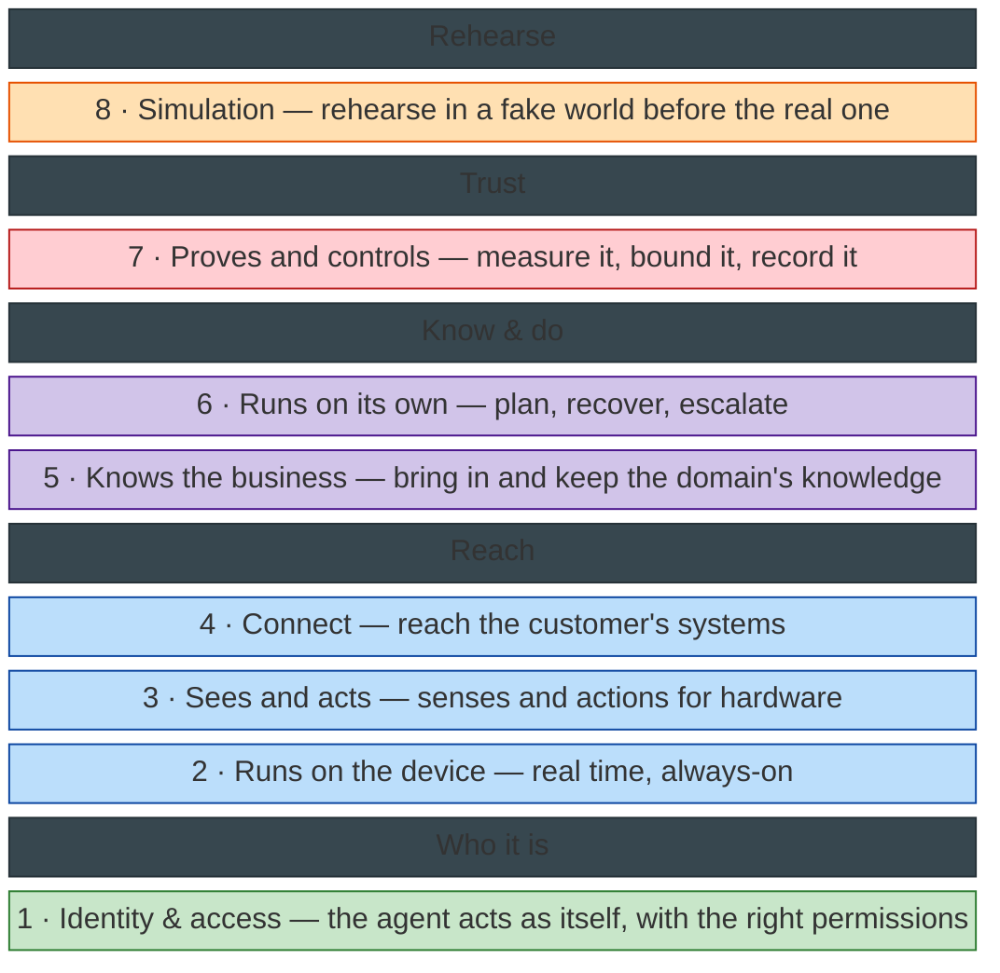
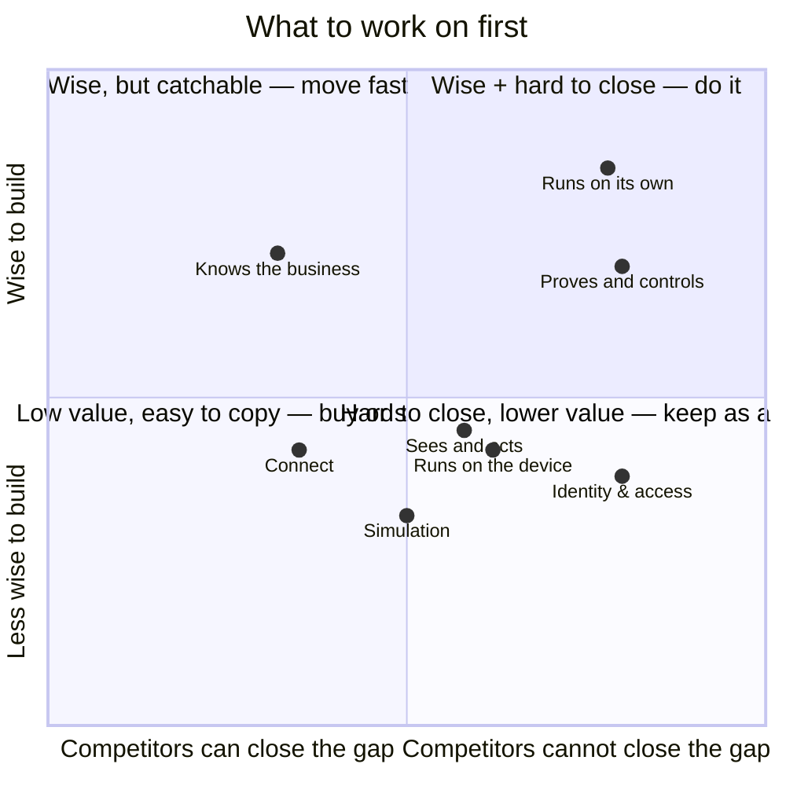

# What we build on top of Jiuwen

Jiuwen is the **brain**. On top, we build **three parts**. Simple rule:

> **No body → software. Has a body → hardware.** And **we make the engines, not the cars.**

| Part | Software or hardware? | Who builds it |
|---|---|---|
| **1 · Products** | **software** — a brain in software | product teams, on Jiuwen's surfaces |
| **2 · Bodies** | **hardware** — a brain in a body | hardware / product teams |
| **3 · Enabling stack** | **neither** — it enables both | **us (R&D)** |

## 1 · Software products — a brain in software

**By job:**

**By industry:**

| Example product | Job / industry | Runs on (Jiuwen gives) |
|---|---|---|
| support triage agent | job · support | web / chat |
| helpdesk agent | job · IT | IDE / chat |
| claims processing agent | industry · insurance | software |
| contract review agent | industry · legal | software |
| month-end close agent | job · finance ops | software |

## 2 · Hardware bodies — a brain in a body

Jiuwen = the brain; the body team builds the senses, the acting, and the real-time loop.

## 3 · The enabling stack — ours (R&D)

We build **frameworks and infrastructure** here — **not products, not content**.

| Layer | How it connects to Jiuwen | Jiuwen gives | Ours (R&D) | Example |
|---|---|---|---|---|
| **1 · Identity & access** | we **manage** the agent's identity | user auth, "on whose behalf" audit | cross-system agent-identity framework | the agent signs in as "robot-7" with only the permissions it needs |
| **2 · Runs on the device** | we **host** the agent on the device | — | real-time / on-device runtime | voice companion in <300 ms, offline |
| **3 · Sees and acts** | the agent **calls our** device tools | multimodal + browser/GUI | device-I/O framework | robot reads a camera, moves its arm |
| **4 · Connect** | the agent **calls our** connectors | MCP / tools | connector framework | the agent updates the case in the CRM |
| **5 · Knows the business** | the agent **calls our** knowledge | memory, retrieval | retrieval / connector engine | claims agent looks up the policy |
| **6 · Runs on its own** | **we control** the agent | planning, retry, approvals | autonomy & reliability framework | claims ≤ $500 auto; above → a human |
| **7 · Proves and controls** | **we watch** the agent | guardrails, observability | evaluation & assurance toolkit | refunds logged; monthly audit |
| **8 · Simulation** | we **run the agent in a fake world** | — | simulator / test-environment toolkit | rehearse a warehouse robot on a fake floor |

Read the connection column: **host** = we run Jiuwen; **calls our …** = Jiuwen uses our service; **we control / watch** = we use Jiuwen; **fake world** = we run Jiuwen in a simulator; **manage** = we give the agent its identity and access.

**Which parts need which layer:**

| Layer | Jobs & industries (software) | Bodies (hardware) |
|---|---|---|
| **1 · Identity & access** | **yes** | **yes** |
| **2 · Runs on the device** | voice only | **yes** |
| **3 · Sees and acts** | no | **yes** |
| **4 · Connect** | **yes** | **yes** |
| **5 · Knows the business** | **yes** | **yes** |
| **6 · Runs on its own** | **yes** | **yes** |
| **7 · Proves and controls** | **yes** | **yes** |
| **8 · Simulation** | **yes** | **yes** |

Test for ours: **reusable across every domain → ours; one domain only → the domain team's.** The commercial layer (accounts, billing, payments, sales) also exists, but it is a business function, not R&D.

## What NOT to build — Jiuwen already gives it

| Capability | Given by Jiuwen | Examples |
|---|---|---|
| Brain | model + agent loop | single agent · deep agent |
| Teams | multi-agent | leader · members · human |
| Tools | built-in + MCP | filesystem · shell · web · browser · code |
| Memory & retrieval | store + search | long-term · graph · vector · rerank |
| Guardrails & observability | safety + tracing | security rails · tracer |
| Channels | user surfaces | web · desktop · mobile · IDE · chat/IM |
| Workflows | orchestration | graph/Pregel · task loop |

## Where to start

| Zone | Layers | Move |
|---|---|---|
| Top-right — earns money + hard to copy | Runs on its own · Proves and controls | **do it now** |
| Top-left — earns money, but rivals can catch up | Knows the business | **build, but expect rivals** |
| Bottom-right — hard to copy, but earns indirectly | Identity & access · Runs on the device · Sees and acts | **keep it — that's our edge** |
| Bottom-left — earns indirectly, easy to copy | Connect | **buy, don't build** |
| Center | Simulation | **build a little** |

## Business lens

| Question | Meaning |
|---|---|
| **Who** | who builds, runs, and adopts it |
| **Who else** | who is already here; where the whitespace is |
| **How much** | unit economics, cost to enter, ROI |
| **How fast** | time-to-value, lock-in risk |
