# Unified Features Diagram

> **Blue** = agent-core feature &nbsp;|&nbsp; **Purple** = jiuwenswarm feature

```mermaid
flowchart TD
    classDef ac     fill:#2E86AB,color:#fff,stroke:#1a5f7a
    classDef jw     fill:#7B2D8B,color:#fff,stroke:#5a1f68
    classDef infra  fill:#455A64,color:#fff,stroke:#263238
    classDef init   fill:#00695C,color:#fff,stroke:#004D40
    classDef pre    fill:#E65100,color:#fff,stroke:#BF360C
    classDef post   fill:#BF360C,color:#fff,stroke:#7f2407
    classDef done   fill:#2E7D32,color:#fff,stroke:#1B5E20
    classDef io     fill:#37474F,color:#fff,stroke:#263238,shape:stadium
    classDef run    fill:#01579B,color:#fff,stroke:#003c74

    T(["📋 Task"]):::io

    %%──────────────── agent-core: stability ────────────────
    T --> EL28

    EL28["⚡ event-loop-blocking  #28
    Prevents async crash before
    any run starts"]:::ac

    %%──────────────── agent-core: scale ────────────────────
    EL28 --> MR38

    MR38["🔄 multi-rollout  #38
    Dispatches the same task
    to N independent runs"]:::ac

    %%── N parallel runs fan out ─────────────────────────────
    MR38 --> R1 & R2 & RN

    R1(["🤖 Run 1"]):::run
    R2(["🤖 Run 2"]):::run
    RN(["🤖 ··· Run N"]):::run

    %%──────────────── jiuwenswarm: infra ───────────────────
    R1 & R2 & RN --> EL119
    R1 & R2 & RN --> ACP139

    EL119["⚡ event-loop-blocking  #119
    Prevents async crash inside
    the jiuwenswarm runtime"]:::infra

    ACP139["🔒 acp-tool-blocking  #139
    Unblocks tools wrongly rejected
    by the ACP runtime layer"]:::infra

    EL119 & ACP139 --> Init

    %%──────────────── jiuwenswarm: session start ───────────
    subgraph Init["🚀  Session Start — pinned once, survive context compression"]
        direction LR
        TDR["📌 task-description-reinjection  #371
        Full task.md pinned as permanent
        system-prompt section"]:::init
        OFR["📋 output-format-reminder  #401
        Output format hints extracted
        from task.md and pinned"]:::init
        ESD["🔍 external-skill-discovery  #214
        Task-environment skill scripts
        discovered and exposed"]:::init
    end

    Init --> LoopLabel(["🔁  Iteration loop — repeats until done or budget exhausted"]):::io

    %%──────────────── jiuwenswarm: loop – before LLM ───────
    subgraph PreLLM["Before every LLM call"]
        direction LR
        IBA["⏳ iteration-budget-awareness  #368
        Warns when remaining
        iterations are low"]:::pre
        CHG["📊 context-headroom-guard  #397
        Conciseness nudge at 60 %,
        critical directive at 80 %"]:::pre
        FPM1["🧠 failure-pattern-memory  #396
        Injects list of failed
        calls — do not repeat"]:::pre
        SBR["↩️ step-back-rail  #399
        Forces full strategy rethink
        after N consecutive failures"]:::pre
    end

    LoopLabel --> PreLLM

    %%──────────────── LLM call (+ agent-core ReAct features) ─
    PreLLM --> LLM

    LLM(["🤖  LLM call
    ── agent-core ──
    #26  anti-repetition prompt fix
    #21  prompt serialisation"]):::ac

    %%──────────────── jiuwenswarm: loop – before tool ──────
    subgraph PreTool["Before tool executes"]
        direction LR
        DD["♻️ tool-call-dedup-cache  #372
        Returns cached result for
        identical repeated calls"]:::pre
        AU["🚀 autonomous-execution-mode  #370
        Replaces hedging language
        with autonomous directives"]:::pre
    end

    LLM --> PreTool

    PreTool --> ToolNode(["🔧  Tool executes"]):::io

    %%──────────────── jiuwenswarm: loop – after tool ───────
    subgraph PostTool["After tool returns"]
        direction LR
        TR["✂️ bash-output-truncation  #334
        Head + tail preserved —
        verifier errors never cut off"]:::post
        FPM2["🧠 failure-pattern-memory  #396
        Records error in session state
        if tool returned non-zero"]:::post
    end

    ToolNode --> PostTool
    PostTool -->|"not done — next iteration"| LoopLabel

    %%──────────────── jiuwenswarm: completion checks ───────
    subgraph Verify["✅  Completion Checks"]
        direction LR
        SV["🔎 self-verification-loop  #328
        Agent runs the verifier script
        itself before declaring done"]:::done
        TV["👥 team-verification-layer  #121
        Secondary agent independently
        reviews the final output"]:::done
    end

    PostTool -->|"done"| Verify

    %%── N results fan in ────────────────────────────────────
    Verify --> RS1 & RS2 & RSN

    RS1(["📄 Result 1"]):::run
    RS2(["📄 Result 2"]):::run
    RSN(["📄 ··· Result N"]):::run

    %%──────────────── agent-core: scoring then selection ───
    RS1 & RS2 & RSN --> Score

    Score["🔬 auto-harness scores each result
    Runs the benchmark verifier on every
    result and records pass rate / score"]:::ac

    Score --> BN37

    BN37["🏆 auto-harness-best-of-n  #37
    Selects the result with the
    highest verifier score"]:::ac

    BN37 --> Out(["🏁 Final Output"]):::io
```

---

## Phase summary

| Phase | Who | What fires | PR(s) |
|-------|-----|-----------|-------|
| **Stability** | agent-core | Event loop fix | #28 |
| **Scale** | agent-core | Multi-rollout — N parallel runs | #38 |
| **Runtime stability** | jiuwenswarm | Event loop fix, ACP tool unblock | #119, #139 |
| **Session start** | jiuwenswarm | Task pin, format pin, skill discovery | #371, #401, #214 |
| **Before LLM call** | jiuwenswarm | Budget warn, context guard, failure list, step-back | #368, #397, #396, #399 |
| **LLM call** | agent-core | Anti-repetition prompt, prompt serialisation | #26, #21 |
| **Before tool** | jiuwenswarm | Dedup cache, autonomous mode | #372, #370 |
| **After tool** | jiuwenswarm | Bash truncation, record failure | #334, #396 |
| **Completion** | jiuwenswarm | Self-verify, team-verify | #328, #121 |
| **Selection** | agent-core | Best-of-N across all runs | #37 |
