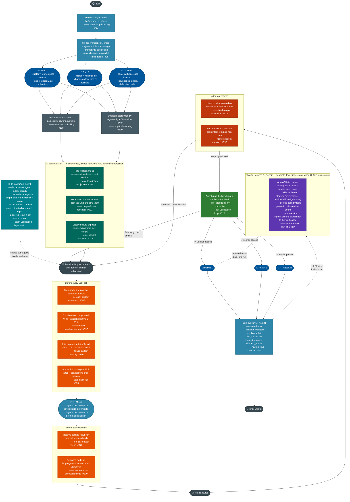

# Unified Features Diagram

> **Blue** = agent-core &nbsp;|&nbsp; **Dark green** = jiuwenswarm session &nbsp;|&nbsp; **Orange** = jiuwenswarm per-iteration &nbsp;|&nbsp; **Navy** = parallel run slot

---

## Phase summary

| Phase | Who | What fires | PR(s) |
|-------|-----|-----------|-------|
| **Stability** | agent-core | Event loop fix | #28 |
| **Scale** | agent-core | Clones workspace N times, different strategy per run | #38 |
| **Runtime stability** | jiuwenswarm | Event loop fix, ACP tool unblock | #119, #139 |
| **Session start** | jiuwenswarm | Task pin, format pin, skill discovery | #371, #401, #214 |
| **Leader/sub-agent mode** | jiuwenswarm | Reviewer scores each sub-agent; leader gets result + score | #121 |
| **Before LLM call** | jiuwenswarm | Budget warn, context guard, failure list, step-back | #368, #397, #396, #399 |
| **LLM call** | agent-core | Anti-repetition prompt, prompt serialisation | #26, #21 |
| **Before tool** | jiuwenswarm | Dedup cache, autonomous mode | #372, #370 |
| **After tool** | jiuwenswarm | Bash truncation, record failure | #334, #396 |
| **Self-verification** | jiuwenswarm | Runs verifier; loops back to fix if it fails | #328 |
| **Multi-rollout selector** | agent-core | Picks winner: first\_successful / longest / shortest | #38 |
| **CI repair (if CI fails)** | agent-core | N repair strategies → score → promote best patch | #37 |
