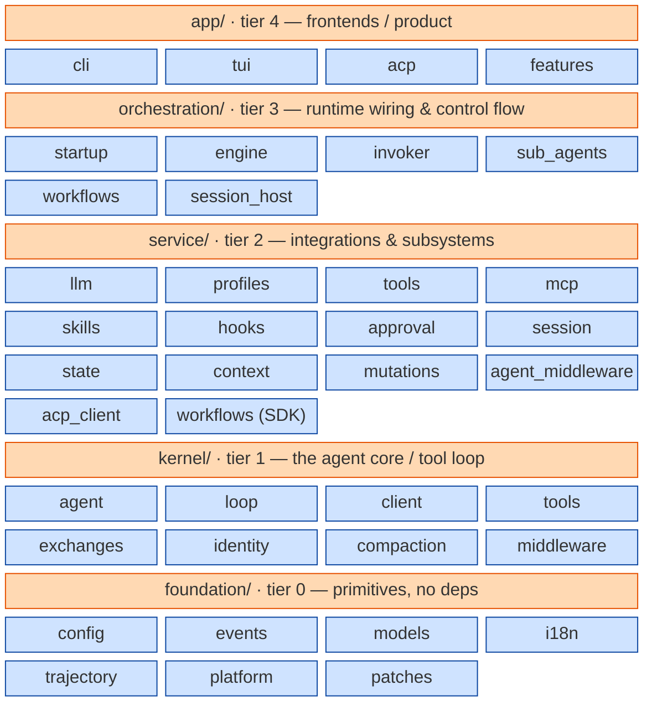

# iCode (Chrys) — Project Architecture

> Source: `C:\Workspace\openjiuwenothers\iCode` (repo `github.com/openJiuwen-ai/iCode`, package `chrys`, v0.28.0, Python 3.14+, Apache-2.0).
> "Chrys" is the internal code name; the user-facing brand is **iCode** / `icode`. Only the display name and command were renamed — the package, `~/.chrys`, `CHRYS_*`, wire/header names and data keys keep `chrys`.
> Primary author: Jiaqi Liu (`Ox7c13`). Owner: Huawei Technologies Co., Ltd. (2026).

## 1. One-liner

iCode is a **self-contained agent platform / harness**: a terminal-first coding agent (Textual TUI, headless CLI, ACP server) built on a strictly layered, one-way-dependency architecture. It does **not** use the `openjiuwen` (agent-core) SDK or `jiuwenswarm`; it is a sibling project in the same `openJiuwen-ai` org.

## 2. Layer DAG (enforced by `tests/architecture/test_layering.py`)

```
app/            (tier 4)  cli, tui, acp, features        <- frontends / product
      |  may import all below
orchestration/  (tier 3)  startup, engine, invoker,       <- runtime wiring & control flow
                          sub_agents, workflows,
                          session_host
      |
service/        (tier 2)  llm, profiles, tools, mcp,      <- integrations & subsystems
                          skills, hooks, approval,
                          session, state, context,
                          mutations, agent_middleware,
                          acp_client, workflows(SDK)
      |
kernel/         (tier 1)  agent, loop, client, tools,     <- the agent core / tool loop
                          exchanges, identity,
                          compaction, middleware
      |
foundation/     (tier 0)  config, events, models, i18n,   <- primitives, no deps
                          trajectory, platform, patches
```



Rules: no upward imports; same tier allowed; `if TYPE_CHECKING:` bodies exempt; `import chrys` fails (but `from chrys import __version__` is fine); a new top-level module needs a `TIER_ORDER` entry.

## 3. Tiers in detail

### foundation/ (tier 0 — no dependencies)
- Subpackages: `config`, `errors`, `events`, `i18n`, `io`, `models` (`session_env`, `workspace`, `turns`, `history_markers`), `net`, `observability`, `patches` (Textual/Windows workarounds), `platform`, `text`, `trajectory`, `util`, `vendor` (vendored ripgrep).
- Top-level tool primitives: `tool_kinds.py`, `tool_invocation_order.py`, `tool_result_metadata.py`, `hosted_tools.py`, `retry.py`, `recovery.py`, `branding.py`.
- `branding.py`: `APP_DISPLAY_NAME = "iCode"`, `APP_COMMAND = "icode"`.

### kernel/ (tier 1 — the agent core; flat, no subpackages)
- `loop.py` (tool loop; `_finalize` assembles the final Messages), `agent.py`, `client.py` (wire/storage-mode resolution), `tools.py`, `exchanges.py` (call<->result grammar), `middleware.py`, `compaction.py`, `identity.py`, `sessions.py`, `images.py`, `instrumentation.py`.
- `_*.py` modules are private: outside `kernel/` import through `chrys.kernel`.

### service/ (tier 2 — subsystems & integrations)
- `llm/` — `wire_client.py` + one package per wire protocol: `chat_completions/`, `openai_responses/`, `anthropic_messages/`.
- `profiles/` — agent & model profiles: `agents/builtins/{Code,QA,Explore,General}.yaml`, `models/`.
- `tools/` — builtin tools (filesystem, shell, search, web, todo, ask_user, sleep, doc_converter) + `registry.py`, `spill.py`, `result_metadata.py`.
- Also: `mcp/`, `skills/`, `hooks/`, `approval/`, `mutations/`, `context/` (compaction), `session/`, `state/`, `agent_middleware/`, `acp_client/`, `analytics/`, `trajectory/`, `todos/`, `workflows/` (SDK, graph, scheduler, protocol, worker host).

### orchestration/ (tier 3 — runtime control flow)
- `startup.py::bootstrap_runtime()` — every runtime entrypoint calls this (`serve`/`install` exempt).
- `engine/` — `assembly.py::assemble_agent_engine` (the only builder), `build/`, `run/` (turn passes), `state/`.
- `invoker/` — one contract, `contracts.py::InvocationConversation.run(RunRequest) -> Ok | Failed | Aborted`; two backends `KernelConversation` and `AcpConversation`.
- `sub_agents/` — `sub_agents/shell.py::SubAgentToolShell` (child's sole pause/Retry/Abort loop).
- `workflows/` — `agent_node.py::WorkflowAgentShell`, `agent_node_build.py::build_kernel_node`.
- `session_host.py` — one bus + engine + session per `icode run` / workflow run / ACP session.

### app/ (tier 4 — product surface)
- `cli/` — `app.py::main` is a hand-written if-chain on `argv[0]` (no argparse subparsers); commands: `run`, `acp`, `serve`, `agents`, `models`, `workflow`, `trajectory`, `install`; unmatched argv -> TUI. Progress text mode in `app/cli/progress.py`.
- `tui/` — Textual 8.2.7 UI: screens, widgets, chat rendering, diff/rollback/trajectory views, terminal emulator.
- `acp/` — Agent Client Protocol stdio server (`server.py`, `session_manager.py`, `bridge.py`, `history.py`, `content.py`, `tool_status.py`).
- `features/`, `installer.py`, `parsing.py`.

## 4. Runtime control flow (a turn)

1. Entrypoint calls `bootstrap_runtime()`; a `ChrysSessionHost` owns one EventBus + AgentEngine + session.
2. `AgentEngine` is built only by `assemble_agent_engine`, which wires component attributes (`engine.current`, `engine.turns`, ...). Components never receive the engine as a host. Rebuilds replace `engine.current.loaded` (`LoadedAgent`); call `current.require_loaded()` per use.
3. A turn runs through the **Invoker** — three caller shells (main turn `engine/run/`, `SubAgentToolShell`, `WorkflowAgentShell`) over two backends (`KernelConversation`, `AcpConversation`).
4. That drives the **kernel tool loop**, with middleware (system reminders, response validation, injection), tools, MCP, skills, compaction.
5. `ExecutionLease` owns the run task from admission to final save; `TurnBindings`/`TurnResumePolicy` handle resume/retry. Results finalize -> persist -> release.
6. **Three build paths must stay in sync**: main `engine/build/builder.py::build_agent`, sub-agent `sub_agents/tools.py`, workflow node `workflows/agent_node_build.py::build_kernel_node` — tool/MCP/skill/memory/web/start-hook wiring lands in all three.

### EventBus (the only frontend<->backend channel)
`foundation/events/bus.py`: `publish()` awaits `subscribe()` handlers inline (exact-type match; backpressure); `stream(*types)` is isinstance-matched and sees only events published after its `async with` is entered. Stream queues are unbounded on purpose (dropping would truncate streamed LLM output on headless/ACP).

## 5. Cross-cutting subsystems

- **Events**: `foundation/events/bus.py`.
- **Config/settings**: layered precedence — defaults < `<config_dir>/settings.yaml` < `<project>/.chrys/settings.yaml` (opt-in, per-key) < legacy `.env` < process env (snapshotted at bootstrap) < CLI flags < runtime < session pins < live changes. Config dir: `~/.chrys` (macOS/Linux), `%APPDATA%/chrys` (Windows).
- **Profiles**: builtin agents `{Code, QA, Explore, General}`; user `<config_dir>/agents/<Name>.yaml` shadows a builtin. Code/QA main-eligible; Explore/General `sub_agent_only`. Model providers: `openai`, `anthropic`, `deepseek-openai`, `glm-openai`, `mock` (+ OpenAI-compatible endpoints).
- **Observability**: optional OpenTelemetry extra; trajectory recording to `trajectory/events.jsonl` (F12 views; export perfetto/json/csv via `icode trajectory`).
- **Persistence**: per-session dirs `<session_root>/sessions/<short-id>/` with `session.json`, `.bak`, recovery sidecar `session.recovery.json`, and `.locks/`; fork copies the whole dir.
- **i18n**: `msg()` + compiled catalogs (English / Simplified Chinese), AST-guarded.
- **Platform**: `foundation/platform/` + `foundation/patches/` (Textual and Windows IOCP workarounds).
- **Supply chain**: exact `==` deps, SHA-pinned CI actions, `uv.lock` committed with dep changes.
- **Architecture guards**: many `tests/architecture/` AST/layering tests (import DAG, no `assert` in src, tool schema, i18n, copy freshness, entrypoint bootstrap, etc.).

## 6. Design principles

- **Agents are configuration, not code** — YAML profiles define instructions, model, tools, skills, MCP servers, sub-agents and memory; edited in the TUI (F2) or directly.
- **Async-first** on event/engine/invoker/tool/host paths; cancel-safe closes via `foundation/util/once_close.py::OnceClose`/`finish_close`.
- **Content-object identity** is the only stable state<->wire link: copy wrappers, share Content objects.
- **Fail-closed** tool classification (`HostedRetrySafety`, approval rules) and retry commit points.
- **Three build paths** parity (main / sub-agent / workflow node).

## 7. Builtin tools & kinds

Canonical kinds in `foundation/tool_kinds.py`:

| Kind | Builtin tools |
|---|---|
| `filesystem.read` | `read_file`, `view_image` |
| `filesystem.write` | `write_file`, `edit_file` |
| `shell` | `execute` (OS shell: bash / powershell / pwsh) |
| `search` | `grep`, `glob` (vendored ripgrep) |
| `web_search` | `web_search` |
| `web_fetch` | `web_fetch` |
| `ask_user` | `ask_user` |
| `sleep` | `sleep` |
| `todo` | `todo_write` |
| `doc_converter` | pdf/docx/pptx/xlsx/xls parsers |
| `mcp` | MCP servers (stdio/HTTP), profile-declared |
| `skill` | skill scripts |
| `sub_agent` | Explore / General / QA profiles |
| `context` | context/compaction operations |

Tool failures return `tool_error("<kind>", message)` (`service/tools/result_metadata.py`); a `raised` failure is shown to the model as `Error: <message>` only via `kernel/exceptions.py::ModelVisibleToolError`.

## 8. How it relates to agent-core / jiuwenswarm

- **Neither is a dependency.** A tree-wide search finds zero `openjiuwen` / `jiuwenswarm` / `agent-core` references in iCode.
- Same GitHub org (`openJiuwen-ai`) — sibling product, not a module.
- Role-wise: iCode is a **coding-app harness** (single-user, terminal-first, self-contained); agent-core is an **SDK** and jiuwenswarm is a **server platform** built on it.
- The only conceptual overlap is the generic agent loop every harness has; the only protocol interop is **ACP** (iCode is an ACP server and can act as an ACP client to external ACP agents) — an open protocol, not a specific link to the openjiuwen repos.
