# LLM foundations

14 unique questions, deduplicated from the archived docs. Each `##` is one question; identical questions from other docs were merged. Full source files are in `orig/`.

## 1. Explain how self-attention works in a transformer

**General:** Each token is projected into three vectors — query, key, value. The query of a token is dot-producted with the keys of all tokens (scaled by `1/√d_k`), softmaxed into attention weights, and used to take a weighted sum of the values. Doing this with multiple heads in parallel and stacking layers lets each token aggregate information from every other token, with the weights computed from content rather than position. The result is a context-dependent representation per token.

**Jiuwen:** Not implemented — attention is delegated entirely to provider APIs or to HuggingFace models loaded by name. There is no Q/K/V projection, scaled dot-product, or multi-head code anywhere; the only `torch.softmax` in the framework is used for token sampling, not attention. The framework's boundary is the model-client/config layer, which serializes request params and sends them to a provider; the local `transformers` client calls `AutoModelForCausalLM` and consumes logits.

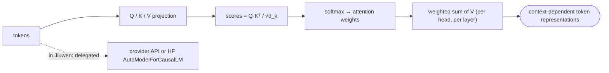

**Anchors:** &bull; `agent-core/openjiuwen/core/foundation/llm/schema/config.py:13` — `ProviderType` enum: the model-client provider boundary, no architecture logic &bull; `agent-core/openjiuwen/core/foundation/llm/model_clients/openai_model_client.py:865` — builds hosted request params, delegates computation &bull; `agent-core/openjiuwen/symphony/retrieval/llm/transformers_logit_selection/client.py:227` — `torch.no_grad()` forward; logit extraction only, no attention code &bull; `agent-core/openjiuwen/symphony/retrieval/llm/transformers_prefix_cached_generation/client.py:175` — `AutoModelForCausalLM.from_pretrained(...)`; attention delegated &bull; `agent-core/openjiuwen/symphony/retrieval/llm/transformers_prefix_cached_generation/generation.py:527` — `torch.softmax(...)` is sampling, not attention

**Gap.** Absent. The closest abstractions are `ModelClientConfig`/`ModelRequestConfig` (provider boundary) and the HF `AutoModelForCausalLM` load.

_Canonical source: `orig/llm-fundamentals-interview-questions_for_engineers.md`; also covered in: engineering, genai, llm-fund._

## 2. What does temperature actually control, mathematically, in the output distribution

**General:** The model produces logits `z_i` for the next token. Temperature `T` rescales them: `softmax(z_i / T)`. As `T → 0` the distribution collapses toward the argmax (greedy/deterministic); as `T` rises the distribution flattens, increasing diversity and the chance of lower-probability tokens. `T = 1` leaves the model's raw distribution unchanged. It does not change which tokens are possible, only their relative probabilities.

**Jiuwen:** Temperature is a **passthrough request parameter** — hosted APIs apply the math — with a local implementation on the HF/vLLM path. At the core client layer `temperature`/`top_p` default to `None` and are added only when set; request-level args override `ModelRequestConfig`. OpenAI-compatible calls targeting `openai.com` keep only one of temperature/top_p (temperature wins, top_p dropped); Anthropic routes sampling through `extra_body` and drops `top_p` when temperature is explicitly set. The local sampler divides logits by temperature and softmaxes, with `T <= 0` falling back to argmax. The local `GenerationConfig` default is `temperature=0.0`.

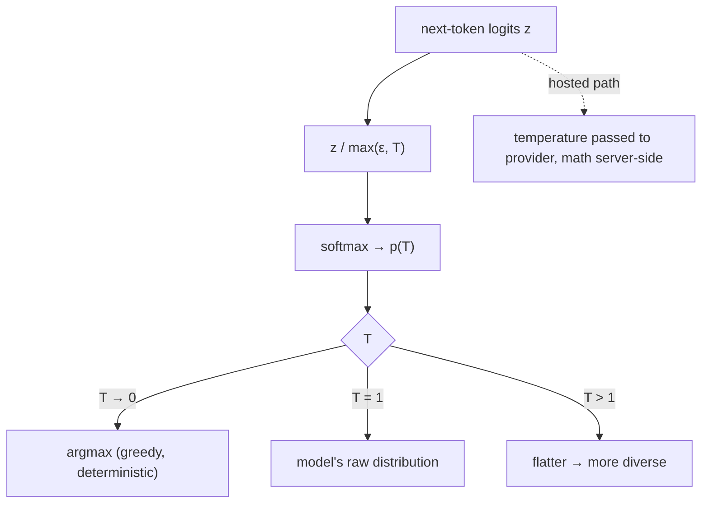

**Anchors:** &bull; `agent-core/openjiuwen/core/foundation/llm/schema/config.py:210` — `temperature: Optional[float] = None` &bull; `agent-core/openjiuwen/core/foundation/llm/model_clients/base_model_client.py:556` — `final_temperature = ...`; added only when not `None` &bull; `agent-core/openjiuwen/core/foundation/llm/model_clients/openai_model_client.py:944` — drops `top_p` when temperature present (openai.com) &bull; `agent-core/openjiuwen/core/foundation/llm/model_clients/anthropic_model_client.py:929` — temperature via `extra_body`; drops `top_p` if both set &bull; `agent-core/openjiuwen/symphony/retrieval/llm/transformers_prefix_cached_generation/generation.py:516` — `scores = next_token_logits / max(1e-6, temperature)` &bull; `agent-core/openjiuwen/symphony/retrieval/llm/base/types.py:60` — `GenerationConfig.temperature: float = 0.0`

_Canonical source: `orig/llm-fundamentals-interview-questions_for_engineers.md`; also covered in: engineering, genai, llm-applied, llm-fund._

## 3. What happens when a conversation exceeds the model's context window

**General:** Either the provider rejects the request, or the framework must shrink the prompt before sending. Robust systems pre-empt it: count tokens, then drop/truncate oldest history, offload large tool outputs, and/or summarize old turns into a compact memory block, always preserving recent turns. The goal is to keep the prompt within budget without losing the information needed for the next step.

**Jiuwen:** On every `add_messages`/`get_context_window`, the context engine counts tokens with a model-aware tokenizer and runs passive processors: offloaders persist oversized tool results to `{workspace}/context/{session_id}_context/offload/` and replace them with `<persisted-output>` previews, while compressors trigger at ratio/token thresholds (`RoundLevelCompressor` at 0.9×budget, `FullCompactProcessor` at 180k) and rewrite history into summary/memory blocks. If the model still rejects the request, `ContextEngine.recover_from_model_exception` matches overflow phrases, force-runs compaction, and retries only if context actually changed. A hard `max_context_message_num` provides a last-resort FIFO drop. `effective_context_budget` is the strictest positive bound across configured window, per-call budget, and resolved model window.

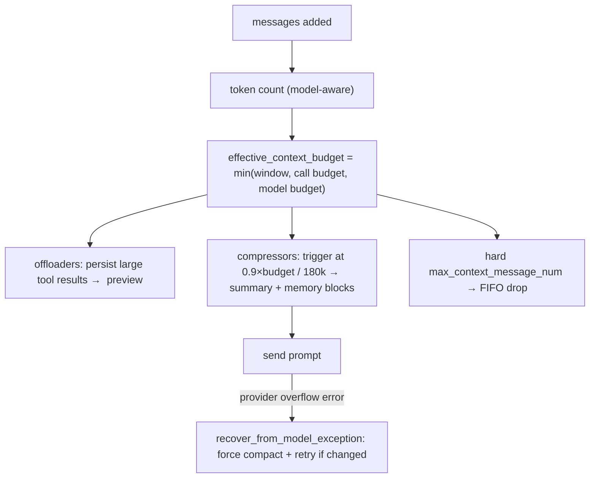

**Anchors:** &bull; `agent-core/openjiuwen/core/context_engine/context/context_utils.py:20` — `DEFAULT_CONTEXT_MAX_TOKENS = 200000`; `:404` `resolve_context_max()`; `:29` per-model window table &bull; `agent-core/openjiuwen/core/context_engine/processor/budget_guard.py:37` — `effective_context_budget()` = min of budgets &bull; `agent-core/openjiuwen/core/context_engine/context/message_buffer.py:71` — `_if_need_resize()` drops oldest beyond 2× &bull; `agent-core/openjiuwen/core/context_engine/processor/compressor/round_level_compressor.py:104` — `trigger_context_ratio=0.9`; `:1159` `_trigger_token_threshold()` &bull; `agent-core/openjiuwen/core/context_engine/processor/compressor/full_compact_processor.py:184` — `trigger_total_tokens=180000`; `:194` `messages_to_keep=10` &bull; `agent-core/openjiuwen/core/context_engine/context_engine.py:372` — `recover_from_model_exception()` &bull; `agent-core/openjiuwen/core/context_engine/processor/offloader/tool_result_budget_processor.py:34` — per-round `tokens_threshold=50000`; `agent-core/openjiuwen/core/context_engine/processor/offloader/message_offloader.py:45` `tokens_threshold=20000`

**Gap.** No pre-call hard rejection/backpressure before the provider call — overflow is discovered by proactive thresholds or the provider error path. Windowing (`default_window_message_num`/`round_num`) is opt-in and separate from compaction.

_Canonical source: `orig/llm-fundamentals-interview-questions_for_engineers.md`; also covered in: llm-applied, llm-fund._

## 4. What is hallucination, and why does it happen even in a well-trained model

**General:** Hallucination is fluent output that is not grounded in fact or in the provided context. It arises because the objective is next-token likelihood, not truth: the model optimizes plausibility, has no built-in fact database, generalizes patterns that sometimes fabricate specifics, and cannot reliably know the boundary of its own knowledge. Mitigations are grounding (retrieval/citations), verification, constrained formats, and abstention — not a property of the weights you can simply "fix".

**Jiuwen:** The repo does not model or detect low-level hallucination; it implements downstream mitigations: (1) retrieval-augmentation infrastructure to supply evidence; (2) a dedicated **verification agent** restricted to read-only/command tools that must show verbatim command output with a PASS/FAIL/PARTIAL verdict; (3) an LLM quality reviewer scoring CORRECTNESS/COMPLETENESS; (4) model-anomaly rails that catch degenerate repetition/loops (not false claims); and (5) security guardrails/sanitization for injection and secret leakage. There is no claim-to-source attribution checker.

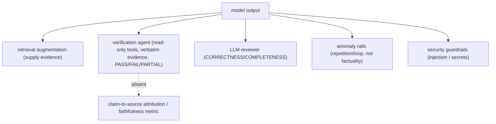

**Anchors:** &bull; `agent-core/openjiuwen/harness/rails/model_anomaly_detection_rail.py:110-117` — repeated stream output / timeouts / tool-call loops (degeneracy, not factual errors) &bull; `agent-core/openjiuwen/harness/rails/subagent/verification_rail.py:92-108` — `VerificationRail` tool allowlist; `:165-196` blocks disallowed tools, requires evidence &bull; `agent-core/openjiuwen/agent_teams/verification/reviewer.py:26-58` — LLM reviewer dimension "CORRECTNESS" &bull; `agent-core/openjiuwen/core/security/guardrail/backends.py:39-80` — guardrail detection backends; `agent-core/openjiuwen/core/security/guardrail/context.py:115-202` confidence thresholds → risk levels &bull; `agent-core/openjiuwen/harness/tools/web/paid_search.py:221-222` — extracts citation URLs (no claim linkage) &bull; `agent-core/openjiuwen/agent_evolving/tools/skill.py:284` — "then cite only the refs you actually read"

**Gap.** No hallucination detector and no claim-to-source attribution or faithfulness metric — the verification agent checks command output, not whether a claim is supported by retrieved sources. Retrieval is optional plumbing.

_Canonical source: `orig/llm-fundamentals-interview-questions_for_engineers.md`; also covered in: llm-fund._

## 5. What is positional encoding, and why do transformers need it if attention has no inherent sense of order

**General:** Self-attention is permutation-equivariant — without positional information it cannot distinguish token order, so "dog bites man" and "man bites dog" yield the same multiset of token representations, only reordered (not one identical output). Positional encoding injects order information — by adding a position-dependent signal to the token representations (sinusoidal/learned), or by rotating the query and key vectors inside attention (RoPE) — so the attention scores can depend on relative or absolute position. Without it the model cannot know sequence order.

**Jiuwen:** No positional-encoding implementation exists — no sinusoidal, learned, or RoPE code. The only positional-adjacent items are passthrough configuration: `attn_implementation` forwarded to HuggingFace and `rope_scaling_type`/`rope_scaling_factor` forwarded as vLLM engine args. In the RL data pipeline, `position_ids` are computed for padded training batches, which is batching metadata rather than an encoding scheme.

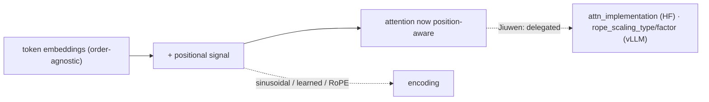

**Anchors:** &bull; `agent-core/openjiuwen/symphony/retrieval/llm/config.py:88` — `attn_implementation: str = ""` (HF passthrough) &bull; `agent-core/openjiuwen/symphony/retrieval/llm/transformers_prefix_cached_generation/client.py:171` — `model_kwargs["attn_implementation"]` &bull; `agent-core/openjiuwen/symphony/retrieval/search/service/serving.py:42` — `rope_scaling_type` / `rope_scaling_factor` vLLM defaults &bull; `agent-core/openjiuwen/symphony/retrieval/llm/vllm/client.py:584` — rope scaling passed through &bull; `agent-core/openjiuwen/agent_evolving/agent_rl/offline/coordinator/batch_builder.py:175` — `position_ids` from `cumsum(attention_mask)` (padding metadata)

**Gap.** Absent. Closest = passthrough config (`attn_implementation`, `rope_scaling_*`).

_Canonical source: `orig/llm-fundamentals-interview-questions_for_engineers.md`; also covered in: llm-fund._

## 6. What is the difference between tokens and embeddings?

**General:** A token is a unit of text (a sub-word piece) — the input/output alphabet of the model. An embedding is a vector representation of text that encodes meaning, used for similarity search. Tokens are discrete and count against cost/context; embeddings are continuous and live in a vector space. You embed chunks/tokens, but they are different abstractions.

**Jiuwen:** Tokens are counted by a pluggable `TokenCounter` (an ABC; the tiktoken-backed `TiktokenCounter` drives limits/cost); embeddings are produced by the `Embedding` ABC and compared in a vector store. The two are independent: the tokenizer sets chunk sizes, the embedder sets vector dimension.

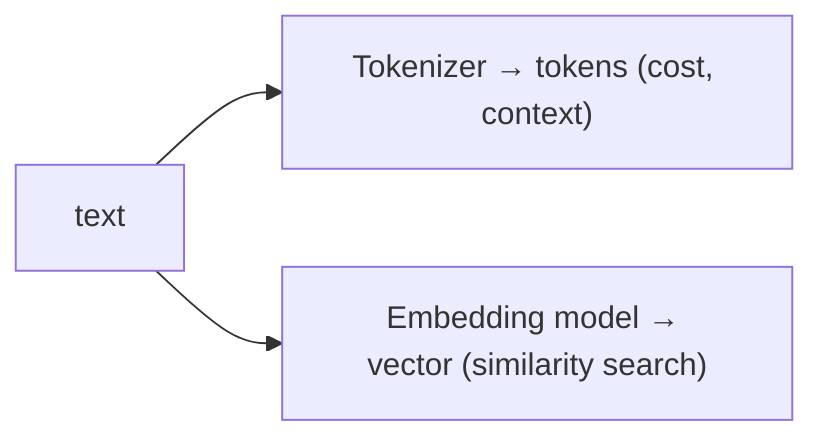

**Anchors:** &bull; `agent-core/openjiuwen/core/context_engine/token/tiktoken_counter.py:212` — `TiktokenCounter`; `:287` fallback &bull; `agent-core/openjiuwen/core/foundation/store/base_embedding.py:24` — `Embedding` ABC; `:29` `embed_query` &bull; `agent-core/openjiuwen/core/retrieval/indexing/indexer/embed_chunks.py:46` — `embed_documents`

_Canonical source: `orig/llm-applied-interview-questions_for_engineers.md`; also covered in: llm-applied._

## 7. What's the difference between a model's context window and its training data cutoff

**General:** The context window is how many tokens the model can attend to at once (a capacity limit). The training data cutoff is the date after which the model has no knowledge (a temporal limit). A model can have a large window but an old cutoff — it can read a long document you paste but still not know events after its training date. Confusing the two leads to expecting up-to-date answers from a frozen model.

**Jiuwen:** Model metadata here is operational only: model name, provider, context-window token counts, output `max_tokens`, auth/endpoint. The context engine resolves a window size per model but never stores, prompts, or exposes a training-data cutoff or knowledge date. Nothing distinguishes "the model does not know X" from "the window does not fit X".

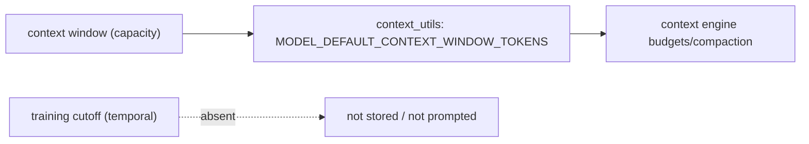

**Anchors:** &bull; `agent-core/openjiuwen/core/context_engine/context/context_utils.py:29` — builtin window table; `:275` `fetch_openrouter_model_context_window_tokens()` (window only) &bull; `agent-core/openjiuwen/core/context_engine/schema/config.py:137` — `model_name`; `:139` `model_context_window_tokens` &bull; `agent-core/openjiuwen/core/foundation/llm/schema/config.py:209` — `model_name`; `:214` `max_tokens` (output cap) &bull; `agent-core/openjiuwen/core/foundation/llm/schema/generation_response.py:20` — `created` timestamp (response, not cutoff)

**Gap.** Absent. No knowledge/training cutoff, knowledge date, or model-card release metadata anywhere; the closest is the model→window table and `ModelClientConfig`/`ModelRequestConfig`.

_Canonical source: `orig/llm-fundamentals-interview-questions_for_engineers.md`; also covered in: llm-fund._

## 8. What's the difference between a token and a word, and why does tokenization affect cost and context limits

**General:** A token is the model's atomic unit — typically a sub-word produced by a BPE/unigram vocabulary, so one word may be one or several tokens, and rare/long words and code fragment heavily. Cost and context limits are measured in tokens, not words, so a language or domain that fragments more costs more per word and fills the window faster. Tokenization also explains why models miscount letters and struggle with character-level tasks.

**Jiuwen:** The framework counts **tokens**, never words, via a pluggable `TokenCounter`. `TiktokenCounter` maps known model names to tiktoken encodings, falls back to `cl100k_base` for unknown models (marked `tiktoken_fallback`), and finally to a `len(text)//3` heuristic if tiktoken is unavailable. A separate `TiktokenModelCounter` loads a model-native BPE vocabulary, and `TokenizerManager` downloads HuggingFace/tiktoken artifacts per model/family. Token counts drive per-model context limits (`MODEL_DEFAULT_CONTEXT_WINDOW_TOKENS`, default 200,000), compression/offload thresholds, and cost via provider-reported `usage_metadata` (`input_tokens`/`output_tokens`/cache/reasoning tokens). Retrieval chunking is also token-based.

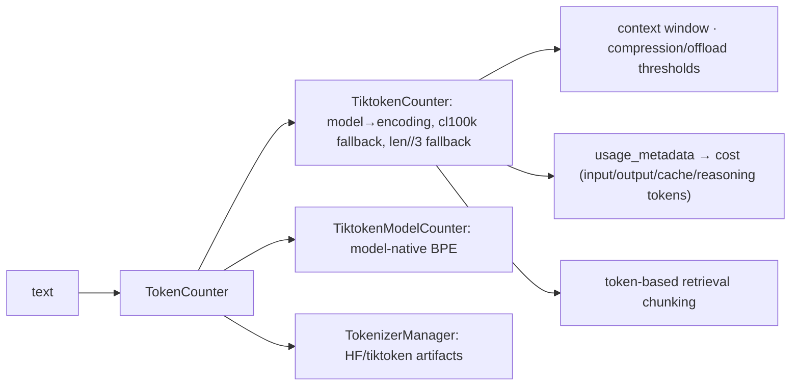

**Anchors:** &bull; `agent-core/openjiuwen/core/context_engine/token/tiktoken_counter.py:212` — `TiktokenCounter`; `:225` model→encoding map; `:287` `count()` with `len(text)//3` fallback &bull; `agent-core/openjiuwen/core/context_engine/token/tiktoken_model_counter.py:86` — model-native tiktoken BPE &bull; `agent-core/openjiuwen/core/context_engine/token/tokenizer_spec.py:34` — `TokenizerSpec`; `:50` fallback policy chain &bull; `agent-core/openjiuwen/core/context_engine/token/tokenizer_manager.py:60` — resolves/downloads tokenizer artifacts; `:124` &bull; `agent-core/openjiuwen/core/context_engine/context/context_utils.py:20` — `DEFAULT_CONTEXT_MAX_TOKENS = 200000` &bull; `agent-core/openjiuwen/core/context_engine/processor/offloader/tool_result_budget_processor.py:34` — per-round token budget &bull; `agent-core/openjiuwen/core/foundation/llm/schema/message.py:28` — `total_tokens` usage metadata

_Canonical source: `orig/llm-fundamentals-interview-questions_for_engineers.md`; also covered in: engineering, genai, llm-fund._

## 9. What's the difference between an encoder-only, decoder-only, and encoder-decoder model, and where does GPT fit

**General:** Encoder-only models (BERT) read bidirectional context and produce representations — good for classification, embedding, extraction. Decoder-only models (GPT) are autoregressive: they predict the next token attending only leftward, which makes them generators. Encoder-decoder models (T5, original Transformer) encode an input and generate an output, suited to translation/summarization. GPT is decoder-only.

**Jiuwen:** There is no architecture-type configuration, no `is_encoder_decoder`/`is_decoder` flag, and no encoder/decoder classification. Behavior is selected by **provider type** and **model-name string** (model-family patterns also drive reasoning/thinking wire protocols and tokenizer selection). The two HuggingFace classes named in the repo imply the intent: causal generation uses `AutoModelForCausalLM` (decoder-only), and guardrail classification uses `AutoModelForSequenceClassification` (typically an encoder-style classifier). GPT is handled purely as a provider/model name.

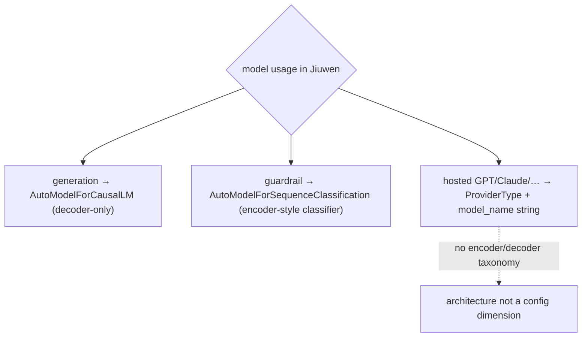

**Anchors:** &bull; `agent-core/openjiuwen/core/foundation/llm/schema/config.py:13` — `ProviderType`; architecture is not a config dimension &bull; `agent-core/openjiuwen/core/foundation/llm/reasoning_profiles.py:100` — model-family patterns used for reasoning-protocol selection (not architecture) &bull; `agent-core/openjiuwen/core/security/guardrail/backends.py:445` — `AutoModelForSequenceClassification` &bull; `agent-core/openjiuwen/core/security/guardrail/builtin.py:174` — `model_type` limited to `None | "bert" | "qwen"` &bull; `agent-core/openjiuwen/symphony/retrieval/llm/transformers_prefix_cached_generation/client.py:175` — `AutoModelForCausalLM` (decoder-only) &bull; `agent-core/openjiuwen/symphony/retrieval/search/service/serving.py:35` — vLLM `architectures` string

_Canonical source: `orig/llm-fundamentals-interview-questions_for_engineers.md`; also covered in: engineering, genai, llm-fund._

## 10. What's the difference between the model being "wrong" and the model being "uncertain," and can you tell the difference from the output alone

**General:** Wrong means the answer is factually incorrect; uncertain means the model's distribution is not confident, which may still yield a correct or incorrect answer. They are independent: a model can be confidently wrong, or rightly unsure. From the surface text alone you generally cannot tell — fluent text carries no calibrated confidence. Token log-probabilities, entropy, or self-consistency/vote checking can approximate uncertainty, but they are imperfect and need calibration; abstention only helps if it correlates with being wrong.

**Jiuwen:** The repo collects token **logprobs** but does not expose an uncertainty/abstention signal on ordinary agent answers. `ReactAgent` can request `logprobs`/`top_logprobs`, captured into canonical RL trajectory spans and validated (must be ≤ 0) for RL training. `ChatReranker` uses them for one specific binary decision: it exponentiates the top-logprobs of "yes"/"no" and normalizes to a relevance probability. The retrieval subsystem has an explicit abstain token ("0"), but that is retrieval-selection abstention, not output uncertainty. There is no confidence threshold at which an agent says "I don't know," and no calibration.

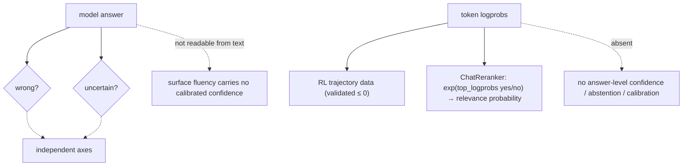

**Anchors:** &bull; `agent-core/openjiuwen/core/retrieval/reranker/chat_reranker.py:83-107` — `exp(logprob)` yes/no → normalized confidence; `:134-141` `logprobs=True`, `top_logprobs=5`, yes/no logit bias &bull; `agent-core/openjiuwen/core/single_agent/agents/react_agent.py:294-303` — `llm_logprobs`/`llm_top_logprobs`; `:1622-1624` passes to model call &bull; `agent-core/openjiuwen/agent_evolving/agent_rl/online/capture_pipeline.py:404-427` — parses per-token logprobs, rejects `> 0` &bull; `agent-core/openjiuwen/agent_evolving/trajectory/schema.py:36-47` — `RL_LOGPROBS`; `agent-core/openjiuwen/agent_evolving/trajectory/spans.py:849-873` — `read_rl_fields` &bull; `agent-core/openjiuwen/symphony/retrieval/search/runtime/selector.py:305-315` — `is_abstain` from output token "0" (retrieval only)

**Gap.** No answer-level confidence scoring, no uncertainty-based abstention, no calibration. Logprobs exist only as RL reward/trajectory data and for the reranker's binary judgment, so you cannot tell wrong from uncertain from the output alone here.

---

# Evaluation and comparison

_Canonical source: `orig/llm-fundamentals-interview-questions_for_engineers.md`; also covered in: llm-fund._

## 11. What's the difference between top-k sampling and top-p (nucleus) sampling

**General:** Both truncate the next-token distribution before sampling. Top-k keeps the `k` most probable tokens and renormalizes — a fixed candidate count regardless of how peaked the distribution is. Top-p keeps the smallest set of tokens whose cumulative probability reaches `p` — an adaptive count: few tokens when the model is confident, many when it is flat. Top-p usually adapts better; they are often combined.

**Jiuwen:** Top-p (nucleus) is implemented locally; top-k sampling is not. `GenerationConfig` exposes `top_p` (default `1.0`) but has no top-k sampling field. The local sampler sorts scores, masks tokens beyond the cumulative `top_p`, re-softmaxes, and multinomial-samples; `top_p == 1.0` samples the full distribution. Hosted providers receive `top_p` in the normal body; Anthropic additionally forwards `top_k` via `extra_body` if present. Note three unrelated `top_k` meanings in the codebase that are **not** LLM sampling: retrieval result count, trie-constraint allowed outputs, and logit-selection candidate scoring.

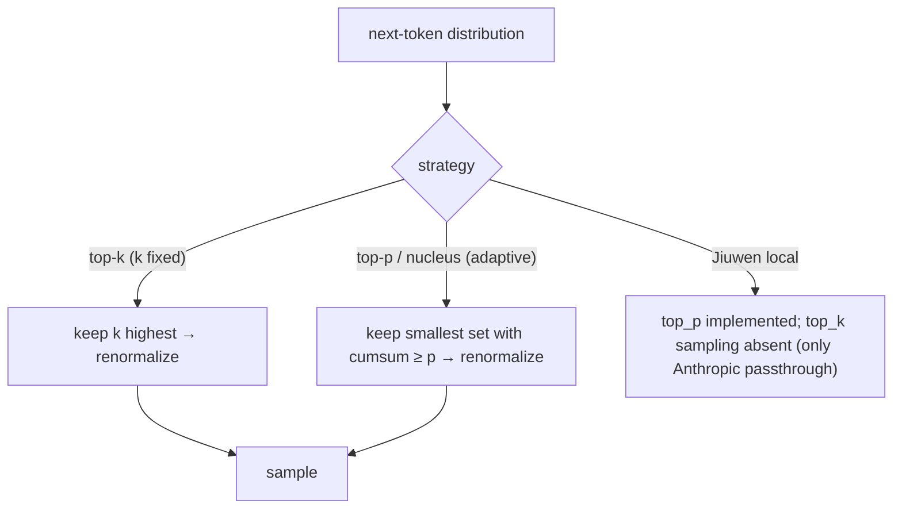

**Anchors:** &bull; `agent-core/openjiuwen/symphony/retrieval/llm/base/types.py:61` — `GenerationConfig.top_p: float = 1.0`; no top_k sampling field &bull; `agent-core/openjiuwen/symphony/retrieval/llm/transformers_prefix_cached_generation/generation.py:517` — nucleus `top_p` truncation; `:534` full-distribution softmax when `top_p` ∉ (0,1) &bull; `agent-core/openjiuwen/core/foundation/llm/model_clients/base_model_client.py:561` — `top_p` resolved/passed &bull; `agent-core/openjiuwen/core/foundation/llm/model_clients/anthropic_model_client.py:936` — `top_p` via `extra_body`; `:940` `top_k` forwarded if present &bull; `agent-core/openjiuwen/core/foundation/llm/schema/config.py:213` — `top_p: Optional[float] = None` (no `top_k`) &bull; `agent-core/openjiuwen/symphony/retrieval/llm/base/types.py:40` — `TrieConstraint.top_k` (allowed outputs, not sampling)

_Canonical source: `orig/llm-fundamentals-interview-questions_for_engineers.md`; also covered in: llm-fund._

## 12. Why do LLMs struggle with tasks like counting or basic arithmetic

**General:** The model operates on tokens, not characters or digits-as-numbers; counting letters requires character-level reasoning that BPE hides, and multi-digit arithmetic requires carrying/positional algorithms that are error-prone to learn implicitly. Models also have no scratchpad guarantee unless asked to show work. The reliable fix is tool use — call a calculator or run code — rather than expecting the forward pass to do exact math.

**Jiuwen:** The repo frames arithmetic/counting as a tool-augmentation problem. A canonical example trains a DeepAgent to call a `calculator` tool that evaluates arithmetic via `simpleeval` and solves/simplifies algebra/equations via `sympy`; the system prompt explicitly instructs tool use step by step. More generally, an `execute_code` sandbox operation (JiuwenBox/YuanRong/AIO providers plus a local provider) lets agents run code for math/logic. The RSI evidence analyzer encodes the principle "textual arithmetic is never accepted as execution" — verification must come from actual code execution.

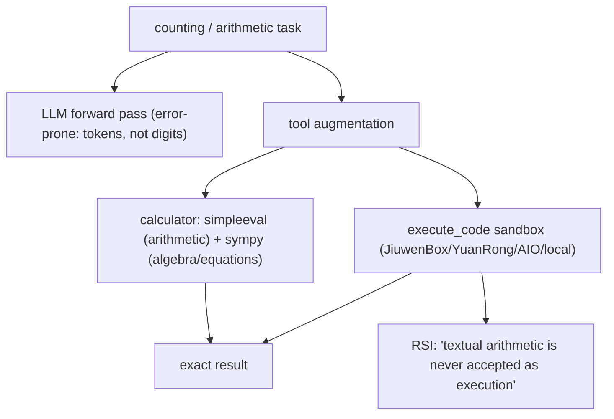

**Anchors:** &bull; `agent-core/examples/rl_calculator/tools.py:11-14` — `@tool(name="calculator")`; `:15-85` `simple_eval` + `sympy` &bull; `agent-core/examples/rl_calculator/prompts.py:7-16` — "Use the calculator tool … step by step" &bull; `agent-core/openjiuwen/core/sys_operation/code.py:16-49` — `execute_code` sys-operation &bull; `agent-core/openjiuwen/extensions/sys_operation/sandbox/providers/jiuwenbox.py:2927` — sandbox `execute_code` &bull; `agent-core/openjiuwen/rsi/harness_rsi/evaluation_result_analyzer/evidence_investigation.py:200` — "textual arithmetic is never accepted as execution"

**Gap.** No first-class arithmetic/counting tool in the core registry; math capability is delegated to user tools or the sandbox. No discussion of tokenization/subitizing causes — purely engineering mitigation.

_Canonical source: `orig/llm-fundamentals-interview-questions_for_engineers.md`; also covered in: llm-fund._

## 13. Why does greedy decoding sometimes produce worse output than sampling-based decoding

**General:** Greedy picks the single highest-probability token each step. That is locally optimal but not globally: it can lock into repetitive, degenerate, or bland sequences, and it cannot recover from one early bad choice. Sampling explores alternatives, which often yields more natural and diverse text; a moderate temperature with top-p is a common default. For tasks with a single correct answer (extraction, classification), greedy/`T=0` is usually preferred.

**Jiuwen:** Greedy is implemented but not argued. The local sampler returns `argmax` when `temperature <= 0.0`, and the generate path sets `do_sample=False` in that branch; since `GenerationConfig` defaults to `temperature=0.0`, the local default is greedy. Many framework call sites deliberately pass `temperature=0.0` for deterministic extraction/classification, while sampling is enabled (`do_sample=True`, temperature/top_p/seed) when temperature > 0. There is **no** comment, doc, or code discussion explaining why greedy can be worse than sampling — the choice is treated purely as a determinism knob.

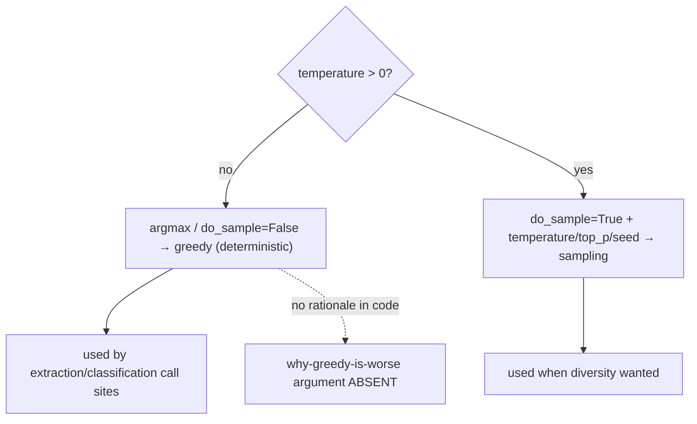

**Anchors:** &bull; `agent-core/openjiuwen/symphony/retrieval/llm/transformers_prefix_cached_generation/generation.py:514` — `if temperature <= 0.0: return int(torch.argmax(...))` &bull; `agent-core/openjiuwen/symphony/retrieval/llm/transformers_prefix_cached_generation/generation.py:335` — `do_sample=True` when `temperature > 0`; `:344` `do_sample=False` &bull; `agent-core/openjiuwen/symphony/retrieval/llm/base/types.py:60` — default `temperature = 0.0` ⇒ local default greedy &bull; `agent-core/openjiuwen/agent_evolving/agent_rl/rl_trainer/verl_executor.py:185` — `remax_input.meta_info["do_sample"] = False` (REMAX baseline, not an exploit path) &bull; `agent-core/openjiuwen/core/retrieval/indexing/processor/extractor/triple_extractor.py:31` — constructor default `temperature=0.0`

---

# Context and memory

_Canonical source: `orig/llm-fundamentals-interview-questions_for_engineers.md`; also covered in: llm-fund._

## 14. Why does model performance sometimes degrade with very long context, even when the context fits

**General:** Attention spreads over more tokens, diluting the signal for any one of them, and models are empirically better at using information at the beginning and end of the context than in the middle ("lost in the middle"). Irrelevant long context also introduces distractors and can override instructions. Fitting the window is necessary but not sufficient; relevance and ordering matter too.

**Jiuwen:** There is no explicit "lost-in-the-middle" mitigation; the system instead mechanically keeps the window small and biases toward recency. Compressors protect a newest-message tail (`keep_recent_messages`, `messages_to_keep`, `keep_last_round`), offloaders keep only the newest K results, and truncation helpers preserve head + tail (one also keeps a middle slice) rather than only a prefix. When enabled, `CompressionRecallConfig` archives replaced messages in overlapping token chunks and a two-stage BM25 retriever can re-surface relevant archived chunks by query — the closest thing to relevance-based long-context handling.

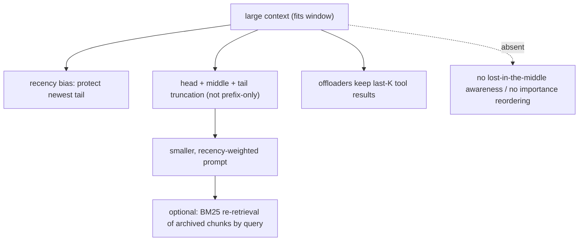

**Anchors:** &bull; `agent-core/openjiuwen/core/context_engine/processor/compressor/round_level_compressor.py:119` — `keep_recent_messages`; `:1088` `_build_head_tail_truncated_text()`; `:112` `target_total_tokens=160000` &bull; `agent-core/openjiuwen/core/context_engine/processor/compressor/full_compact_processor.py:194` — `messages_to_keep=10` &bull; `agent-core/openjiuwen/core/context_engine/processor/offloader/message_offloader.py:63` — `keep_last_round=True` &bull; `agent-core/openjiuwen/core/context_engine/processor/offloader/message_summary_offloader.py:697` — `_smart_truncate_content()` head/middle/tail &bull; `agent-core/openjiuwen/core/context_engine/processor/budget_guard.py:114` — `_build_head_tail()` &bull; `agent-core/openjiuwen/core/context_engine/processor/forked/compressor/recall/archive.py:48` — archive in 3000-token chunks / 300 overlap; `agent-core/openjiuwen/core/context_engine/processor/forked/compressor/recall/retriever.py:27` BM25 `recall_compressed_context()`

_Canonical source: `orig/llm-fundamentals-interview-questions_for_engineers.md`; also covered in: llm-applied, llm-fund._
