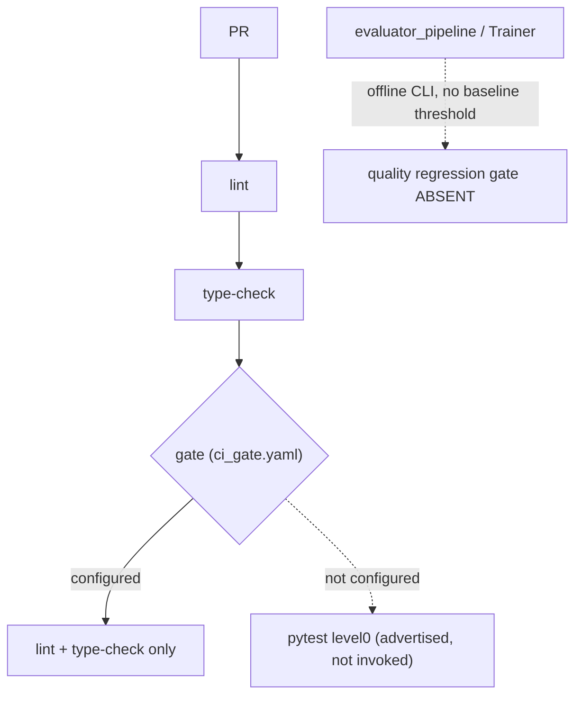
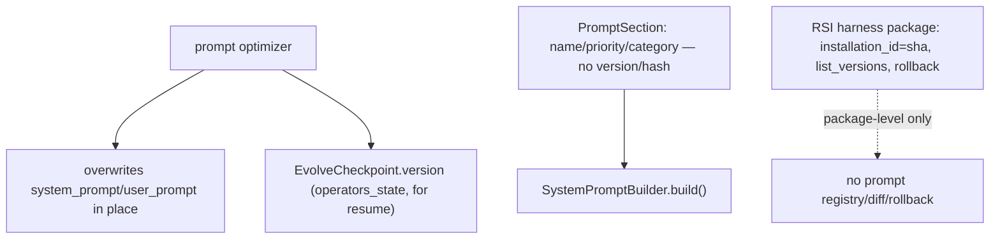
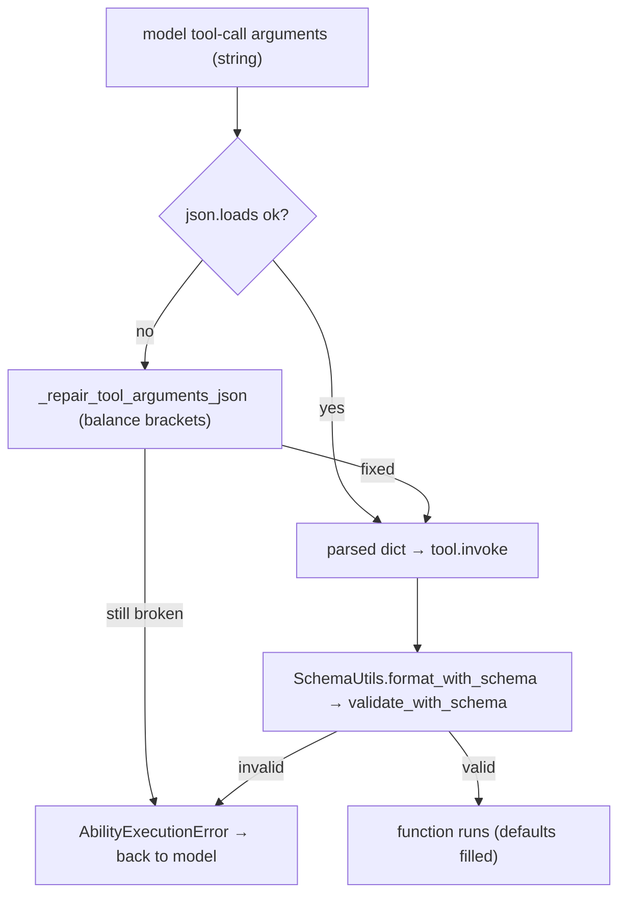
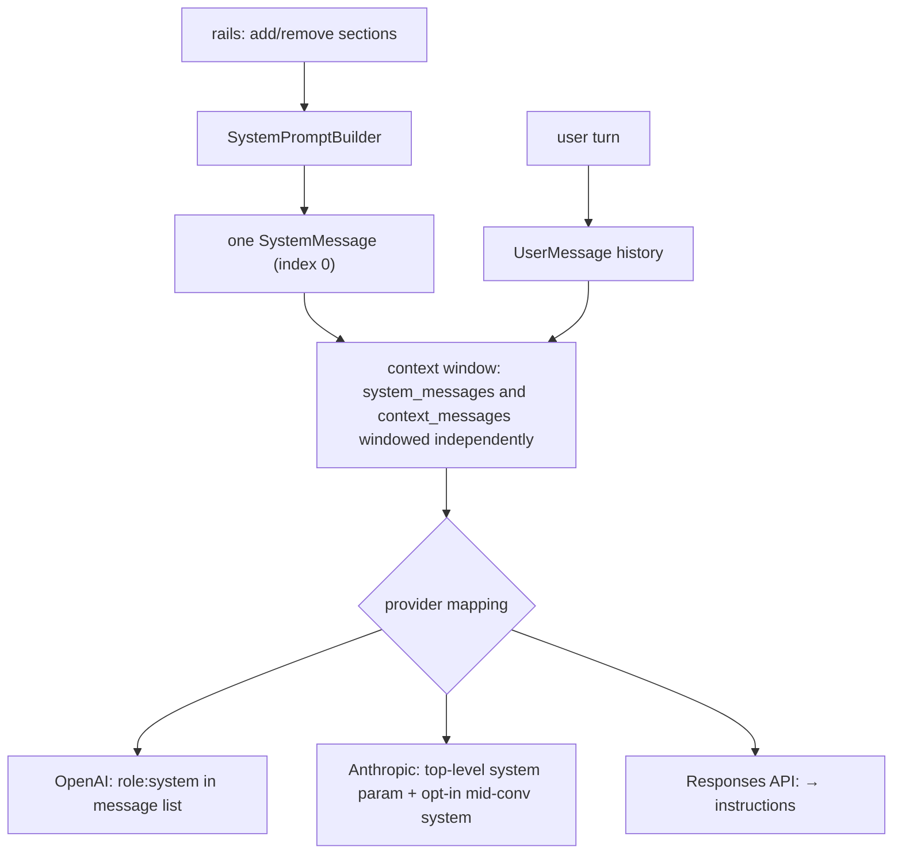
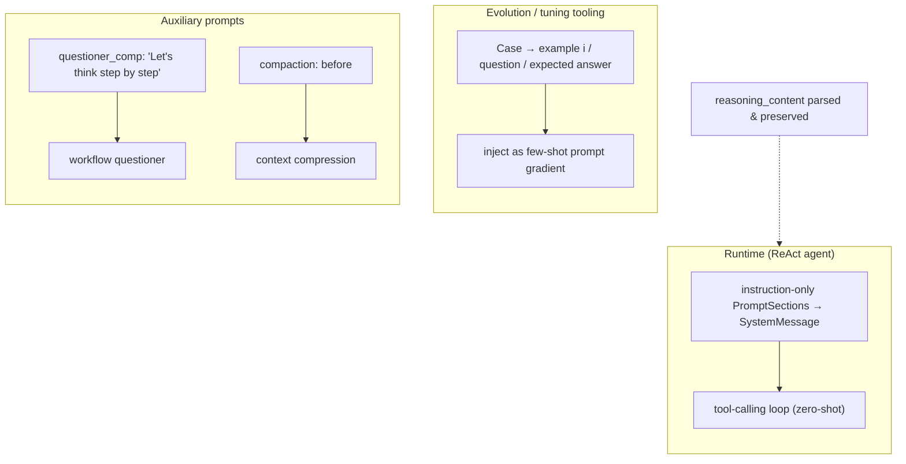

# Prompting and output control

5 unique questions, deduplicated from the archived docs. Each `##` is one question; identical questions from other docs were merged. Full source files are in `orig/`.

## 1. How do you get consistent, parseable output like JSON from an LLM

**General:** Layer the guarantees: prefer a provider JSON/schema mode or tool/function calling with a JSON Schema so the model is constrained at generation time; validate against the schema; on failure, return the validation error to the model for a retry; only then parse. Fenced or free-text JSON should be a last resort with tolerant extraction and repair.

**Jiuwen:** The core harness has **no native `response_format`/JSON mode**; structured output is enforced by giving the model a single-use `structured_output` tool whose `ToolCard.input_params` is the caller's JSON Schema, so the provider's tool-use layer constrains arguments. On success the arguments are captured on the tool instance and a finish rail ends the round; on failure the error tool-result is returned for self-correction, and the workflow engine retries then validates the captured object with pydantic `model_validate` or `jsonschema.validate`. For text-based JSON (compression summaries), `JsonOutputParser` strips a ```` ```json ```` fence when present and `json.loads` the payload, returning `None` on decode failure rather than raising.


<sub>**Anchors:**<br>&bull; `agent-core/openjiuwen/agent_teams/tools/structured_output_tool.py:46` — `StructuredOutputTool`; `:82` `input_params = schema_json`; `:117` `StructuredOutputFinishRail.after_tool_call`<br>&bull; `agent-core/openjiuwen/agent_teams/workflow/backends/team_worker_backend.py:230` — attaches one `StructuredOutputTool` per schema; `:484` finish rail; `:498` reminder<br>&bull; `agent-core/openjiuwen/agent_teams/workflow/engine/schema.py:55` — `resolve_schema()`; `:74` `coerce()` (pydantic/jsonschema)<br>&bull; `agent-core/openjiuwen/agent_teams/workflow/engine/primitives.py:693` — retries; `:763` `coerce(res.structured, ...)`; `agent-core/openjiuwen/agent_teams/workflow/engine/runtime.py:62` `retries: int = 2`<br>&bull; `agent-core/openjiuwen/core/foundation/llm/output_parsers/json_output_parser.py:15` — fence/bare extraction + `json.loads`; `:92` `stream_parse()`<br>&bull; `agent-core/openjiuwen/core/context_engine/processor/compressor/round_level_compressor.py:713` — `JsonOutputParser()`; `:1266` validates `{"blocks":[...]}`</sub>

**Gap.** No `response_format`/`json_schema`/grammar-constrained decoding in `core/foundation/llm`. No automatic JSON repair — invalid output is dropped/retried, not fixed. `StructuredOutputTool` lives in `agent_teams`, not a general core primitive.

---

# Fine-tuning

<sub>_Canonical source: `orig/llm-fundamentals-interview-questions_for_engineers.md`; also covered in: genai, llm-fund._</sub>

## 2. How do you version prompts the same way you'd version code

**General:** Treat prompts as versioned artifacts: store them in source control (or a prompt store), give each version an immutable ID/content hash, track diffs and metadata, allow activate/rollback without redeploying, and tie a version to the model/parameters it was tested with. Ideally prompts are assembled from composable, individually versioned pieces.

**Jiuwen:** Prompts are assembled from named `PromptSection`s ordered by priority (`SystemPromptBuilder.add_section`/`build`), extended by `harness.prompts.builder` with a `PromptMode` filter, and JiuwenSwarm supplies a static priority registry. Sections carry only name/priority/category — no version, hash, or ID. Diagnostics exist (`PromptReport`) but are not versioning. Prompt optimization overwrites the operator's `system_prompt`/`user_prompt` in place; the only persistence is `EvolveCheckpoint.version` storing `operators_state` for resume. Real versioning/rollback exists only at the RSI harness-package level (content-addressed `installation_id`, `list_versions`, `rollback` with hash re-validation) and config migration.





<sub>**Anchors:**<br>&bull; `agent-core/openjiuwen/core/single_agent/prompts/builder.py:24` — `PromptSection` (no version); `:97` `add_section`; `:219` `build`<br>&bull; `agent-core/openjiuwen/harness/prompts/builder.py:21` — `PromptMode` filtering; `agent-core/openjiuwen/harness/prompts/sections/__init__.py:6` — `SectionName` constants<br>&bull; `agent-core/openjiuwen/harness/prompts/report.py:58` — `PromptReport` diagnostics (no hash/version)<br>&bull; `agent-core/openjiuwen/harness/manifest/models.py:43` — `HarnessElementDescriptor` (no version field)<br>&bull; `jiuwenswarm/jiuwenswarm/agents/harness/common/prompt/priority_registry.py:19` — static priority registry<br>&bull; `agent-core/openjiuwen/core/operator/llm_call/base.py:107` — `get_state`/`load_state` snapshot prompt content<br>&bull; `agent-core/openjiuwen/agent_evolving/checkpointing/state.py:15` — `EvolveCheckpoint.version` for resume<br>&bull; `jiuwenswarm/jiuwenswarm/agents/harness/common/rsi/harness_activation.py:617` — `rollback`; `:587` `list_versions`; `jiuwenswarm/jiuwenswarm/server/rsi/rsi_handlers.py:218` — RPC list/rollback<br>&bull; `jiuwenswarm/jiuwenswarm/common/utils.py:882` — `config_version` migration</sub>

**Gap.** No prompt-as-code versioning: no prompt registry, per-section version/hash, diff, or activate/rollback for prompts. Optimization mutates in place; RSI versioning applies only to whole harness packages.

---

# Safety and ethics

<sub>_Canonical source: `orig/genai-interview-questions_for_engineers.md`; also covered in: genai, llm-applied._</sub>

## 3. How does the framework validate a tool call's structured output before executing it

**General:** Parse the model's arguments against the tool's JSON Schema; repair obviously damaged JSON (unbalanced brackets) when possible; reject with a readable error so the model can retry. Never run a function on unvalidated arguments.

**Jiuwen:** Before executing, `AbilityManager._execute_single_tool_call` parses the model's raw argument string with `_parse_tool_arguments_with_repair`, which first tries `json.loads`, then `_repair_tool_arguments_json` to balance brackets/braces; unrecoverable JSON raises an `AbilityExecutionError` fed back to the model. The parsed dict is passed to `tool.invoke`, where `LocalFunction`/`MCPTool` call `SchemaUtils.format_with_schema`, which runs `validate_with_schema` (jsonschema, falling back to a dynamically created Pydantic model) and then fills defaults. The `structured_output` tool uses the caller's JSON Schema as its own `input_params`, so the same validation path constrains captured results.



<sub>**Anchors:**<br>&bull; `agent-core/openjiuwen/core/single_agent/ability_manager.py:482` — `_repair_tool_arguments_json()`; `:537` `_parse_tool_arguments_with_repair()`; `:1419` execution path rewrites `tool_call.arguments`<br>&bull; `agent-core/openjiuwen/core/foundation/tool/function/function.py:76` — `LocalFunction.invoke`; `:82` validation via `SchemaUtils.format_with_schema`<br>&bull; `agent-core/openjiuwen/core/common/utils/schema_utils.py:115` — `validate_with_schema()` (jsonschema → Pydantic fallback); `:23` `format_with_schema()`; `:49` calls validate then fills defaults<br>&bull; `agent-core/openjiuwen/core/foundation/tool/mcp/base.py:208` — `MCPTool.invoke` validates MCP args via the same path<br>&bull; `agent-core/openjiuwen/agent_teams/tools/structured_output_tool.py:82` — `input_params = schema_json`; `:86` `invoke`<br>&bull; `agent-core/openjiuwen/core/foundation/tool/base.py:90` — `ToolCard.input_params` is the schema source</sub>

**Gap.** Validation is skipped only when `input_params` is `None` (the default `{}` still enters validation). The JSON repair only balances brackets/quotes — it does not fix unquoted barewords or trailing commas, which raise and round-trip an error to the model. Schema validation lives inside the tool (`LocalFunction`/`MCPTool`), so a raw `Tool` subclass that does not call `SchemaUtils` gets no automatic argument validation.

<sub>_Canonical source: `orig/ai-agent-framework-interview-questions_for_engineers.md`; also covered in: framework, ai-agent._</sub>

## 4. What's the difference between a system prompt and a user prompt

**General:** The system prompt sets persistent role, rules, persona, and constraints for the whole conversation; the user prompt is the per-turn request. Providers give the system message higher priority and apply it consistently, while user turns are the changing input. Some APIs (Anthropic) pass system content as a separate top-level field rather than a role in the message list.

**Jiuwen:** The system prompt is a single assembled string from priority-ordered, host-injectable sections; rails mutate the `SystemPromptBuilder` (add/remove sections) before the model call, and `ReActAgent` renders it once as a `SystemMessage` passed as `system_messages`. User turns are admitted separately as `UserMessage` history; the context engine windows `system_messages` and `context_messages` independently. Provider mapping differs: OpenAI chat keeps `role:"system"` in the list, Anthropic lifts system content to the top-level `system` parameter (with an opt-in mid-conversation system path), and the Responses API folds system/developer into `instructions`.



<sub>**Anchors:**<br>&bull; `agent-core/openjiuwen/core/single_agent/agents/react_agent.py:1504` — builds one `SystemMessage`; `:883` `_admit_user_message()` writes a `UserMessage`<br>&bull; `agent-core/openjiuwen/core/context_engine/context/context.py:574` — `get_context_window(system_messages, ...)`; `:718` `_get_window_messages()` windows independently<br>&bull; `agent-core/openjiuwen/harness/rails/task_planning_rail.py:154` — rail adds/removes a system-prompt section<br>&bull; `agent-core/openjiuwen/harness/rails/security/prompt_security_rail.py:17` — security section injection<br>&bull; `agent-core/openjiuwen/harness/prompts/prompt_attachment_manager.py:591` — user→system re-role per provider<br>&bull; `agent-core/openjiuwen/core/foundation/llm/model_clients/anthropic_model_client.py:379` — lifts system into top-level blocks; `:858` `params["system"]`<br>&bull; `agent-core/openjiuwen/core/foundation/llm/utils/responses_utils.py:142` — system/developer → `instructions`</sub>

<sub>_Canonical source: `orig/llm-fundamentals-interview-questions_for_engineers.md`; also covered in: genai, llm-fund._</sub>

## 5. Zero-shot vs. few-shot vs. chain-of-thought, when does each actually improve output

**General:** Zero-shot (instruction only) works for tasks the model saw in instruction tuning. Few-shot (worked examples) helps when the task has a specific format, label set, or edge-case convention the instruction can't fully specify. Chain-of-thought (ask for intermediate reasoning) helps multi-step reasoning/arithmetic, especially for smaller models, and is largely subsumed by native reasoning models. All three cost prompt tokens; examples and CoT are not free wins on simple tasks.

**Jiuwen:** The runtime agent is fundamentally zero-shot: the system prompt is assembled from instruction-only `PromptSection`s (identity, safety, skills, tools, task guidance) and the model is steered through the ReAct tool-calling loop, not worked examples. Few-shot machinery exists only in the evolution/tuning tooling (`agent_evolving`, `dev_tools/tune`), which formats cases into example blocks and injects them as prompt gradients. Chain-of-thought appears in auxiliary prompts (workflow `questioner_comp` has an explicit "Let's think step by step") and implicitly in the compaction prompt's `<analysis>`-then-`<summary>` structure. Reasoning-model output is preserved: clients parse `reasoning_content`, and DeepSeek profiles inject an empty `reasoning_content` into assistant history.



<sub>**Anchors:**<br>&bull; `agent-core/openjiuwen/core/single_agent/agents/react_agent.py:842` — renders `role=="system"` template messages; `:1504` `SystemMessage(content=prompt_builder.build())`<br>&bull; `agent-core/openjiuwen/core/single_agent/prompts/builder.py:219` — `build()` joins priority-ordered sections<br>&bull; `agent-core/openjiuwen/harness/prompts/sections/identity.py:11` — default identity prompt (zero-shot)<br>&bull; `agent-core/openjiuwen/agent_evolving/utils.py:238` — `convert_cases_to_examples()`<br>&bull; `agent-core/openjiuwen/dev_tools/tune/optimizer/example_optimizer.py:109` — `init_examples()` few-shot injection<br>&bull; `agent-core/openjiuwen/core/foundation/llm/model_clients/openai_model_client.py:347` — parses `reasoning_content`; `agent-core/openjiuwen/core/foundation/llm/utils/endpoint_profiles.py:33` — DeepSeek empty `reasoning_content`<br>&bull; `agent-core/openjiuwen/core/workflow/components/llm/questioner_comp.py:68` — explicit CoT instruction</sub>

**Gap.** No task-level few-shot examples are injected by `harness/` or `core/single_agent`; tool descriptions have occasional usage lines but no worked input/output demos. No global CoT instruction in the DeepAgent system prompt — reasoning is delegated to the model's native channel.

<sub>_Canonical source: `orig/llm-fundamentals-interview-questions_for_engineers.md`; also covered in: genai, llm-fund, llm-applied._</sub>
