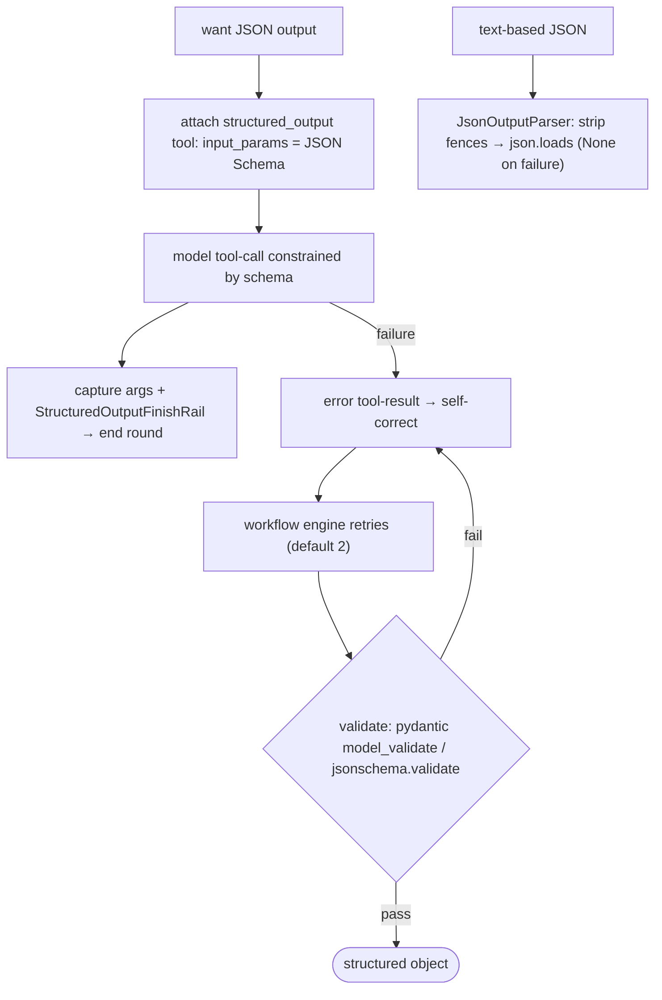
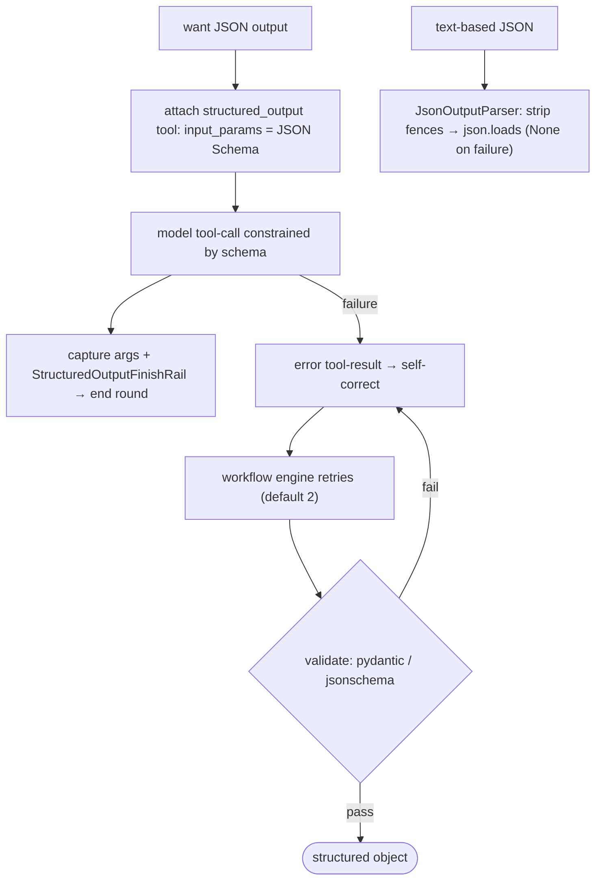
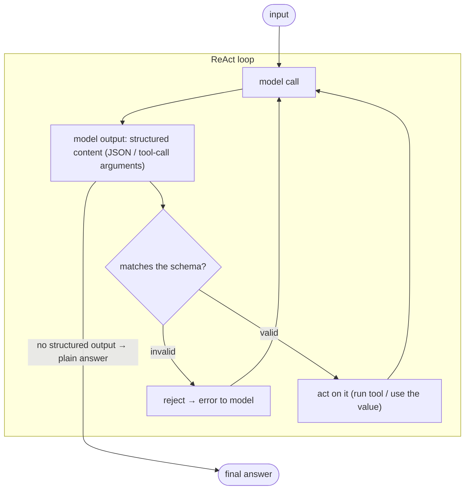
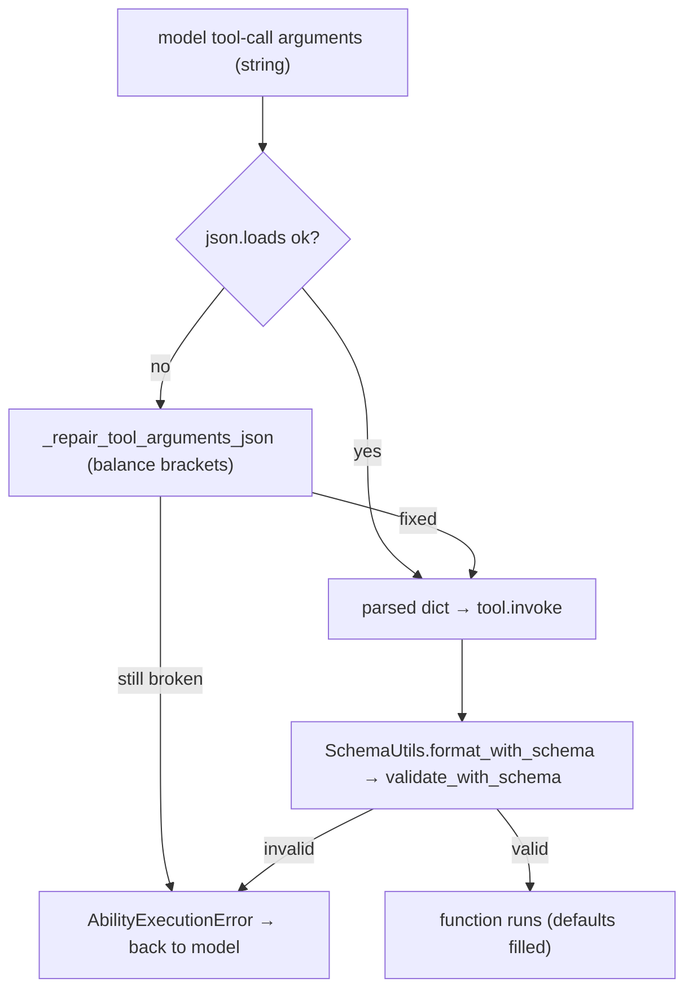
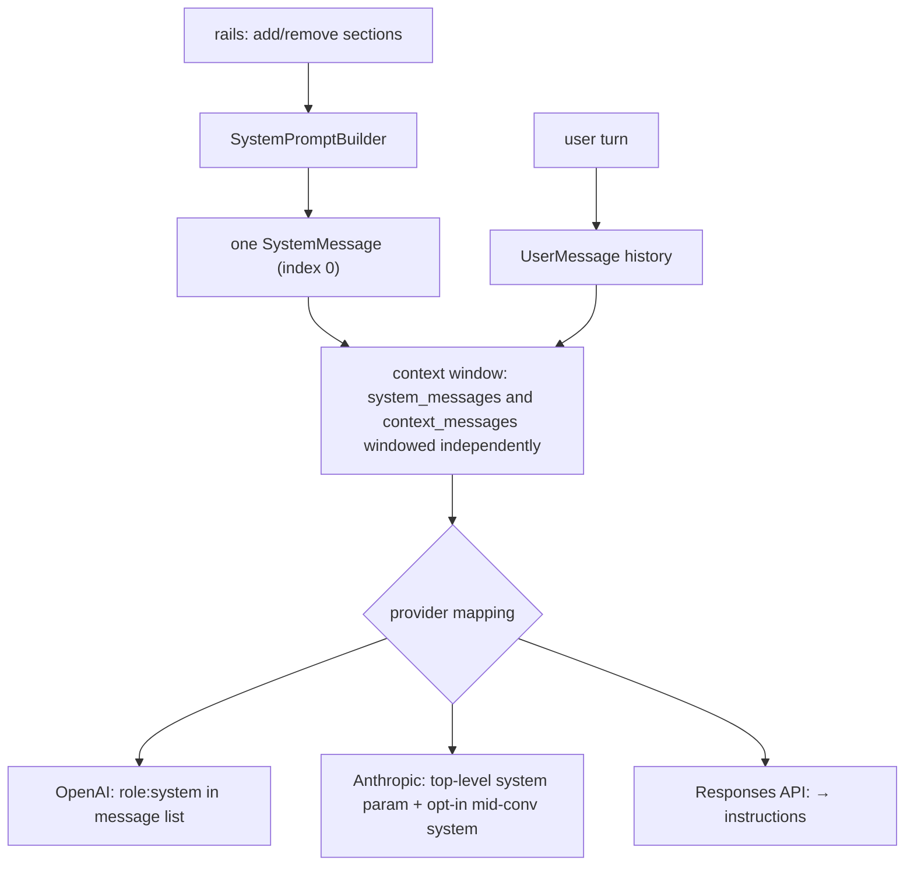
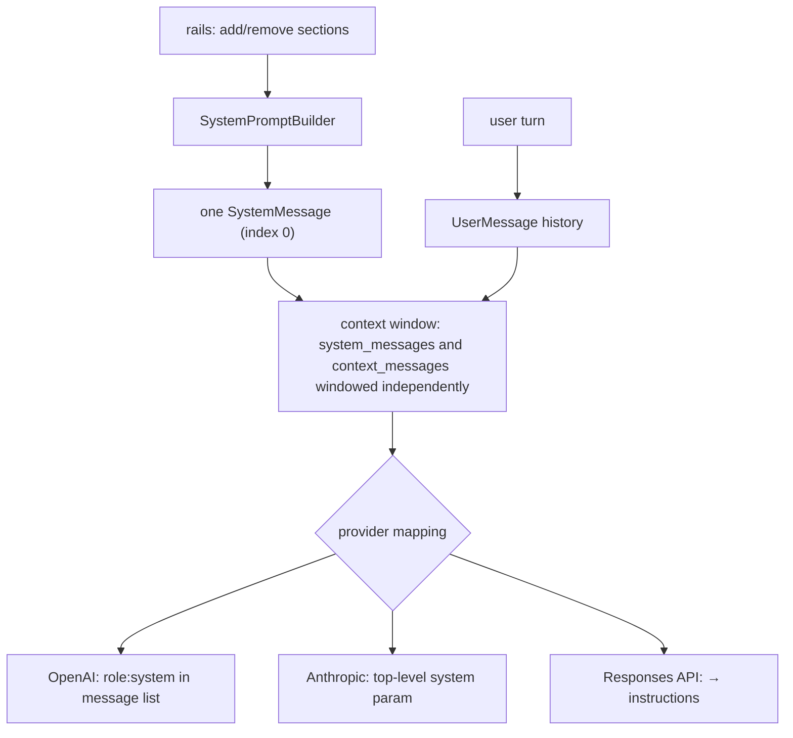
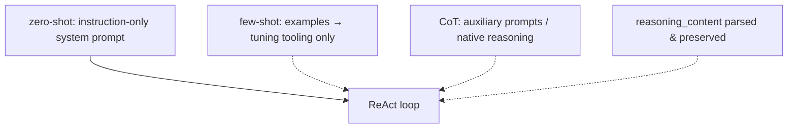
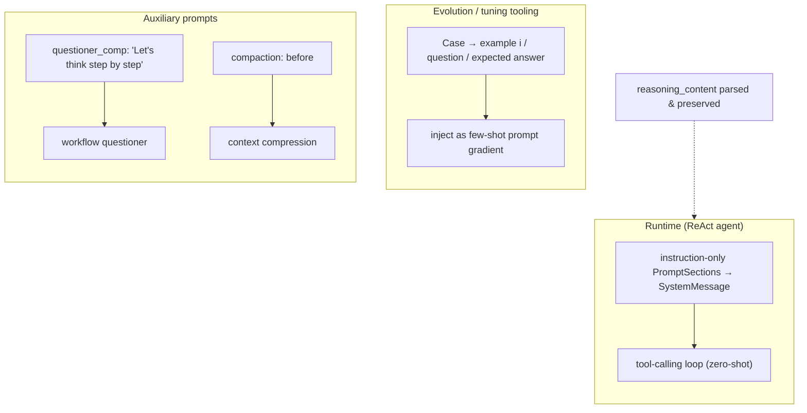

# Prompting and output control

8 unique questions, deduplicated from the archived docs. Each `##` is one question; identical questions from other docs were merged. Full source files are in `orig/`.

## 1. How do you get consistent, parseable output like JSON from an LLM

**General:** Layer the guarantees: prefer a provider JSON/schema mode or tool/function calling with a JSON Schema so the model is constrained at generation time; validate against the schema; on failure, return the validation error to the model for a retry; only then parse. Fenced or free-text JSON should be a last resort with tolerant extraction and repair.

**Jiuwen:** The core harness has **no native `response_format`/JSON mode**; structured output is enforced by giving the model a single-use `structured_output` tool whose `ToolCard.input_params` is the caller's JSON Schema, so the provider's tool-use layer constrains arguments. On success the arguments are captured on the tool instance and a finish rail ends the round; on failure the error tool-result is returned for self-correction, and the workflow engine retries then validates the captured object with pydantic `model_validate` or `jsonschema.validate`. For text-based JSON (compression summaries), `JsonOutputParser` strips code fences and `json.loads` the payload, returning `None` on decode failure rather than raising.

**Anchors:** &bull; `agent-core/openjiuwen/agent_teams/tools/structured_output_tool.py:46` — `StructuredOutputTool`; `:82` `input_params = schema_json`; `:97` `StructuredOutputFinishRail.after_tool_call` &bull; `agent-core/openjiuwen/agent_teams/workflow/backends/team_worker_backend.py:230` — attaches one `StructuredOutputTool` per schema; `:484` finish rail; `:498` reminder &bull; `agent-core/openjiuwen/agent_teams/workflow/engine/schema.py:55` — `resolve_schema()`; `:74` `coerce()` (pydantic/jsonschema) &bull; `agent-core/openjiuwen/agent_teams/workflow/engine/primitives.py:693` — retries; `:763` `coerce(res.structured, ...)`; `agent-core/openjiuwen/agent_teams/workflow/engine/runtime.py:62` `retries: int = 2` &bull; `agent-core/openjiuwen/core/foundation/llm/output_parsers/json_output_parser.py:15` — fence/bare extraction + `json.loads`; `:92` `stream_parse()` &bull; `agent-core/openjiuwen/core/context_engine/processor/compressor/round_level_compressor.py:713` — `JsonOutputParser()`; `:1266` validates `{"blocks":[...]}`

**Gap.** No `response_format`/`json_schema`/grammar-constrained decoding in `core/foundation/llm`. No automatic JSON repair — invalid output is dropped/retried, not fixed. `StructuredOutputTool` lives in `agent_teams`, not a general core primitive.

---

# Fine-tuning

_Canonical source: `orig/llm-fundamentals-interview-questions_for_engineers.md`; also covered in: llm-fund._

## 2. How do you structure a prompt to get consistent, parseable output like JSON

**General:** Layer the guarantees: prefer a provider JSON/schema mode or tool/function calling with a JSON Schema so the model is constrained at generation time; validate against the schema; on failure return the validation error to the model for a retry; only then parse. Fenced or free-text JSON should be a last resort with tolerant extraction and repair.

**Jiuwen:** The core harness has no native `response_format`/JSON mode; structured output is enforced by giving the model a single-use `structured_output` tool whose `ToolCard.input_params` is the caller's JSON Schema, so the provider's tool-use layer constrains arguments. On success the arguments are captured and a finish rail ends the round; on failure the error is returned for self-correction and the workflow engine retries then validates with pydantic/jsonschema. For text-based JSON, `JsonOutputParser` strips code fences and `json.loads`, returning `None` on failure.

**Anchors:** &bull; `agent-core/openjiuwen/agent_teams/tools/structured_output_tool.py:46` — `StructuredOutputTool`; `:82` `input_params = schema_json`; `:97` `StructuredOutputFinishRail.after_tool_call` &bull; `agent-core/openjiuwen/agent_teams/workflow/backends/team_worker_backend.py:230` — attaches one tool per schema; `:484` finish rail; `:498` reminder &bull; `agent-core/openjiuwen/agent_teams/workflow/engine/schema.py:55` — `resolve_schema()`; `:74` `coerce()` &bull; `agent-core/openjiuwen/agent_teams/workflow/engine/primitives.py:693` — retries; `:763` `coerce(res.structured, ...)`; `agent-core/openjiuwen/agent_teams/workflow/engine/runtime.py:62` `retries: int = 2` &bull; `agent-core/openjiuwen/core/foundation/llm/output_parsers/json_output_parser.py:15/92` — extraction + `stream_parse()`

_Canonical source: `orig/genai-interview-questions_for_engineers.md`; also covered in: genai._

## 3. How do you validate structured output from a model before acting on it

**General:** Never trust the model's structuring. Validate against a schema (Pydantic/JSON Schema), coerce or reject, and only act on validated data. Prefer constraining the model with a schema at generation time, then validate the result anyway.

**Jiuwen:** The model's structured output is validated before it is acted on. When that output is a tool call, `LocalFunction.invoke` validates the arguments via `SchemaUtils.validate_with_schema` before the function runs; `StructuredOutputTool` constrains the model to emit schema-shaped arguments and only force-finishes on success, so failures reach the model. Workflow and agent-team schemas validate their JSON output before use.

**Anchors:** &bull; `agent-core/openjiuwen/core/foundation/tool/function/function.py:65` — validate before invoking &bull; `agent-core/openjiuwen/core/common/utils/schema_utils.py:115` — `validate_with_schema` &bull; `agent-core/openjiuwen/agent_teams/tools/structured_output_tool.py:46` — schema-constrained structured output &bull; `agent-core/openjiuwen/agent_teams/workflow/engine/schema.py:74` — workflow/team schema coercion

_Canonical source: `orig/ai-agent-interview-questions_for_engineers.md`; also covered in: ai-agent._

## 4. How does the framework validate a tool call's structured output before executing it

**General:** Parse the model's arguments against the tool's JSON Schema; repair obviously damaged JSON (unbalanced brackets) when possible; reject with a readable error so the model can retry. Never run a function on unvalidated arguments.

**Jiuwen:** Before executing, `AbilityManager._execute_single_tool_call` parses the model's raw argument string with `_parse_tool_arguments_with_repair`, which first tries `json.loads`, then `_repair_tool_arguments_json` to balance brackets/braces; unrecoverable JSON raises an `AbilityExecutionError` fed back to the model. The parsed dict is passed to `tool.invoke`, where `LocalFunction`/`MCPTool` call `SchemaUtils.format_with_schema`, which runs `validate_with_schema` (jsonschema, falling back to a dynamically created Pydantic model) and then fills defaults. The `structured_output` tool uses the caller's JSON Schema as its own `input_params`, so the same validation path constrains captured results.

**Anchors:** &bull; `agent-core/openjiuwen/core/single_agent/ability_manager.py:482` — `_repair_tool_arguments_json()`; `:537` `_parse_tool_arguments_with_repair()`; `:1419` execution path rewrites `tool_call.arguments` &bull; `agent-core/openjiuwen/core/foundation/tool/function/function.py:76` — `LocalFunction.invoke`; `:82` validation via `SchemaUtils.format_with_schema` &bull; `agent-core/openjiuwen/core/common/utils/schema_utils.py:115` — `validate_with_schema()` (jsonschema → Pydantic fallback); `:23` `format_with_schema()`; `:49` calls validate then fills defaults &bull; `agent-core/openjiuwen/core/foundation/tool/mcp/base.py:208` — `MCPTool.invoke` validates MCP args via the same path &bull; `agent-core/openjiuwen/agent_teams/tools/structured_output_tool.py:82` — `input_params = schema_json`; `:86` `invoke` &bull; `agent-core/openjiuwen/core/foundation/tool/base.py:90` — `ToolCard.input_params` is the schema source

**Gap.** Validation is skipped when `input_params` is falsy. The JSON repair only balances brackets/quotes — it does not fix unquoted barewords or trailing commas, which raise and round-trip an error to the model. Schema validation lives inside the tool (`LocalFunction`/`MCPTool`), so a raw `Tool` subclass that does not call `SchemaUtils` gets no automatic argument validation.

_Canonical source: `orig/ai-agent-framework-interview-questions_for_engineers.md`; also covered in: framework._

## 5. What's the difference between a system prompt and a user prompt

**General:** The system prompt sets persistent role, rules, persona, and constraints for the whole conversation; the user prompt is the per-turn request. Providers give the system message higher priority and apply it consistently, while user turns are the changing input. Some APIs (Anthropic) pass system content as a separate top-level field rather than a role in the message list.

**Jiuwen:** The system prompt is a single assembled string from priority-ordered, host-injectable sections; rails mutate the `SystemPromptBuilder` (add/remove sections) before the model call, and `ReActAgent` renders it once as a `SystemMessage` passed as `system_messages`. User turns are admitted separately as `UserMessage` history; the context engine windows `system_messages` and `context_messages` independently. Provider mapping differs: OpenAI chat keeps `role:"system"` in the list, Anthropic lifts system content to the top-level `system` parameter (with an opt-in mid-conversation system path), and the Responses API folds system/developer into `instructions`.

**Anchors:** &bull; `agent-core/openjiuwen/core/single_agent/agents/react_agent.py:1504` — builds one `SystemMessage`; `:883` `_admit_user_message()` writes a `UserMessage` &bull; `agent-core/openjiuwen/core/context_engine/context/context.py:574` — `get_context_window(system_messages, ...)`; `:718` `_get_window_messages()` windows independently &bull; `agent-core/openjiuwen/harness/rails/task_planning_rail.py:154` — rail adds/removes a system-prompt section &bull; `agent-core/openjiuwen/harness/rails/security/prompt_security_rail.py:17` — security section injection &bull; `agent-core/openjiuwen/harness/prompts/prompt_attachment_manager.py:591` — user→system re-role per provider &bull; `agent-core/openjiuwen/core/foundation/llm/model_clients/anthropic_model_client.py:379` — lifts system into top-level blocks; `:858` `params["system"]` &bull; `agent-core/openjiuwen/core/foundation/llm/utils/responses_utils.py:142` — system/developer → `instructions`

_Canonical source: `orig/llm-fundamentals-interview-questions_for_engineers.md`; also covered in: llm-fund._

## 6. What's the difference between a system prompt and a user prompt, and why does that separation matter

**General:** The system prompt sets persistent role, rules, persona, and constraints for the whole conversation; the user prompt is the per-turn request. Providers give the system message higher priority and apply it consistently, while user turns are the changing input. Some APIs (Anthropic) pass system content as a separate top-level field.

**Jiuwen:** The system prompt is a single assembled string from priority-ordered, host-injectable sections; rails mutate the `SystemPromptBuilder` before the model call, and `ReActAgent` renders it once as a `SystemMessage` passed as `system_messages`. User turns are admitted separately as `UserMessage` history; the context engine windows `system_messages` and `context_messages` independently. Provider mapping differs: OpenAI keeps `role:"system"`, Anthropic lifts it to a top-level `system` parameter, and the Responses API folds system/developer into `instructions`.

**Anchors:** &bull; `agent-core/openjiuwen/core/single_agent/agents/react_agent.py:1504` — builds one `SystemMessage`; `:883` `_admit_user_message()` &bull; `agent-core/openjiuwen/core/context_engine/context/context.py:574` — `get_context_window(system_messages, ...)`; `:718` `_get_window_messages()` &bull; `agent-core/openjiuwen/harness/rails/task_planning_rail.py:154` — rail adds/removes a system-prompt section &bull; `agent-core/openjiuwen/harness/rails/security/prompt_security_rail.py:17` — security section injection &bull; `agent-core/openjiuwen/harness/prompts/prompt_attachment_manager.py:591` — user→system re-role per provider &bull; `agent-core/openjiuwen/core/foundation/llm/model_clients/anthropic_model_client.py:379` — lifts system into top-level blocks; `:858` `params["system"]` &bull; `agent-core/openjiuwen/core/foundation/llm/utils/responses_utils.py:142` — system/developer → `instructions`

_Canonical source: `orig/genai-interview-questions_for_engineers.md`; also covered in: genai._

## 7. What's the difference between zero-shot, few-shot, and chain-of-thought prompting?

**General:** Zero-shot (instruction only) works for tasks seen in instruction tuning. Few-shot (worked examples) helps when format/label conventions are hard to specify. Chain-of-thought (step-by-step) helps multi-step reasoning, largely subsumed by native reasoning models. All cost tokens.

**Jiuwen:** The runtime agent is zero-shot (instruction-only `PromptSection`s + ReAct loop). Few-shot lives only in tuning tooling; CoT appears in auxiliary prompts and implicitly in compaction; reasoning-model output is preserved via `reasoning_content`.

**Anchors:** &bull; `agent-core/openjiuwen/harness/prompts/sections/identity.py:11` — zero-shot identity &bull; `agent-core/openjiuwen/dev_tools/tune/optimizer/example_optimizer.py:109` — few-shot injection (tuning) &bull; `agent-core/openjiuwen/core/workflow/components/llm/questioner_comp.py:68` — explicit CoT &bull; `agent-core/openjiuwen/core/foundation/llm/model_clients/openai_model_client.py:347` — `reasoning_content`

---

# RAG

_Canonical source: `orig/llm-applied-interview-questions_for_engineers.md`; also covered in: llm-applied._

## 8. Zero-shot vs. few-shot vs. chain-of-thought, when does each actually improve output

**General:** Zero-shot (instruction only) works for tasks the model saw in instruction tuning. Few-shot (worked examples) helps when the task has a specific format, label set, or edge-case convention the instruction can't fully specify. Chain-of-thought (ask for intermediate reasoning) helps multi-step reasoning/arithmetic, especially for smaller models, and is largely subsumed by native reasoning models. All three cost prompt tokens; examples and CoT are not free wins on simple tasks.

**Jiuwen:** The runtime agent is fundamentally zero-shot: the system prompt is assembled from instruction-only `PromptSection`s (identity, safety, skills, tools, task guidance) and the model is steered through the ReAct tool-calling loop, not worked examples. Few-shot machinery exists only in the evolution/tuning tooling (`agent_evolving`, `dev_tools/tune`), which formats cases into example blocks and injects them as prompt gradients. Chain-of-thought appears in auxiliary prompts (workflow `questioner_comp` has an explicit "Let's think step by step") and implicitly in the compaction prompt's `<analysis>`-then-`
` structure. Reasoning-model output is preserved: clients parse `reasoning_content`, and DeepSeek profiles inject an empty `reasoning_content` into assistant history.

**Anchors:** &bull; `agent-core/openjiuwen/core/single_agent/agents/react_agent.py:842` — renders `role=="system"` template messages; `:1504` `SystemMessage(content=prompt_builder.build())` &bull; `agent-core/openjiuwen/core/single_agent/prompts/builder.py:219` — `build()` joins priority-ordered sections &bull; `agent-core/openjiuwen/harness/prompts/sections/identity.py:11` — default identity prompt (zero-shot) &bull; `agent-core/openjiuwen/agent_evolving/utils.py:238` — `convert_cases_to_examples()` &bull; `agent-core/openjiuwen/dev_tools/tune/optimizer/example_optimizer.py:109` — `init_examples()` few-shot injection &bull; `agent-core/openjiuwen/core/foundation/llm/model_clients/openai_model_client.py:347` — parses `reasoning_content`; `agent-core/openjiuwen/core/foundation/llm/utils/endpoint_profiles.py:33` — DeepSeek empty `reasoning_content` &bull; `agent-core/openjiuwen/core/workflow/components/llm/questioner_comp.py:68` — explicit CoT instruction

**Gap.** No task-level few-shot examples are injected by `harness/` or `core/single_agent`; tool descriptions have occasional usage lines but no worked input/output demos. No global CoT instruction in the DeepAgent system prompt — reasoning is delegated to the model's native channel.

_Canonical source: `orig/llm-fundamentals-interview-questions_for_engineers.md`; also covered in: genai, llm-fund._
