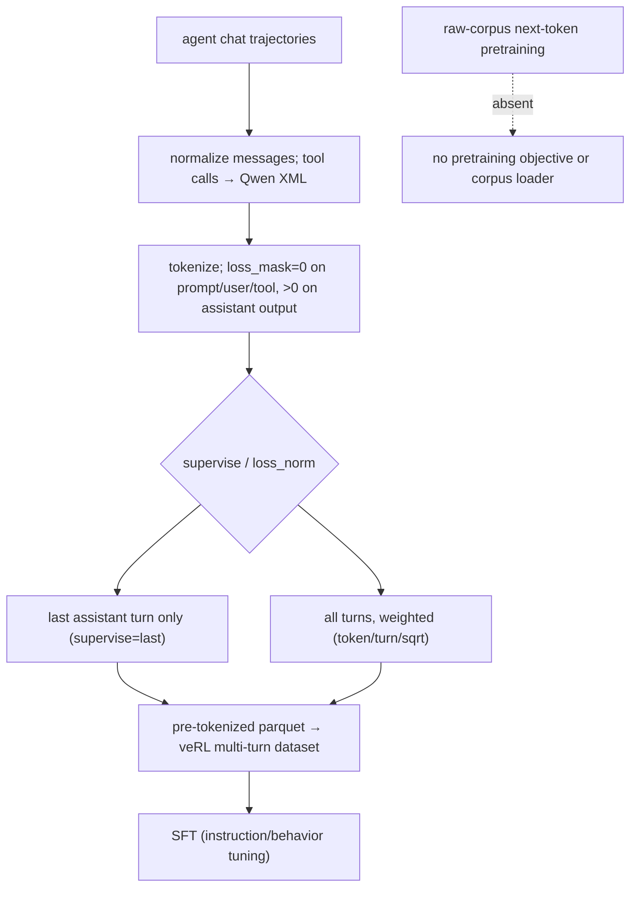
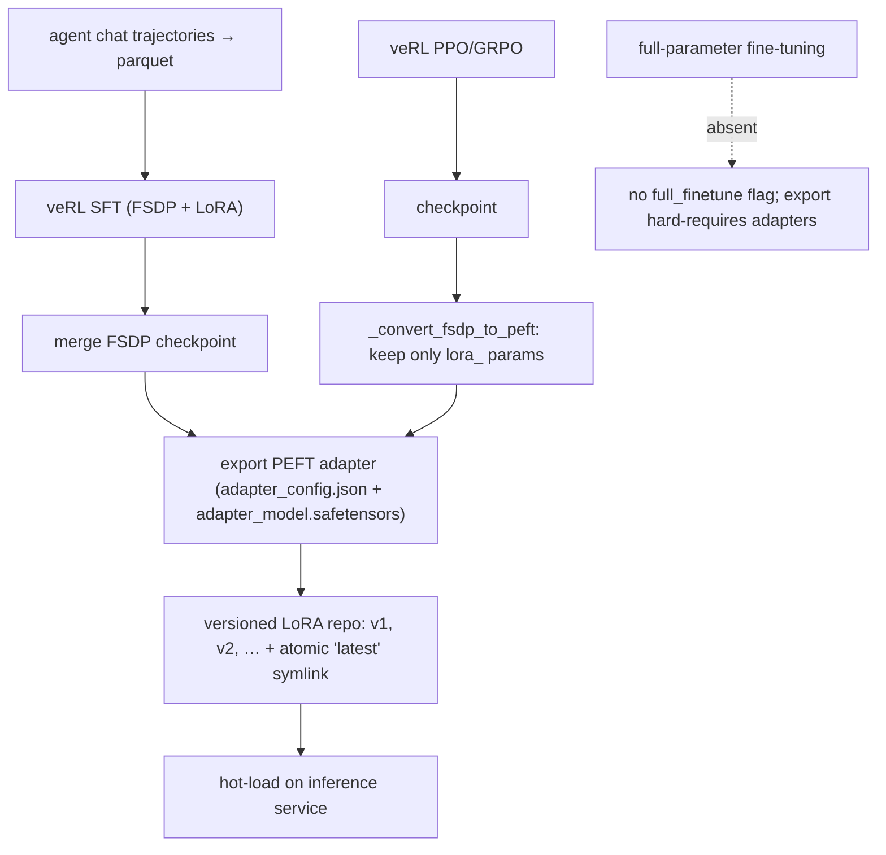
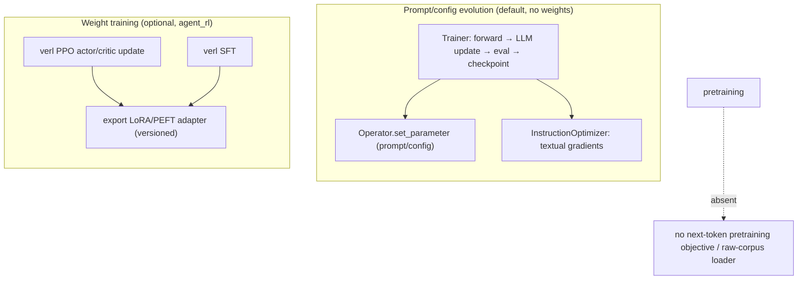
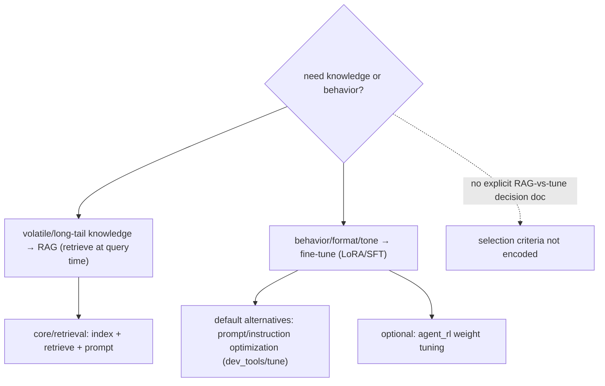
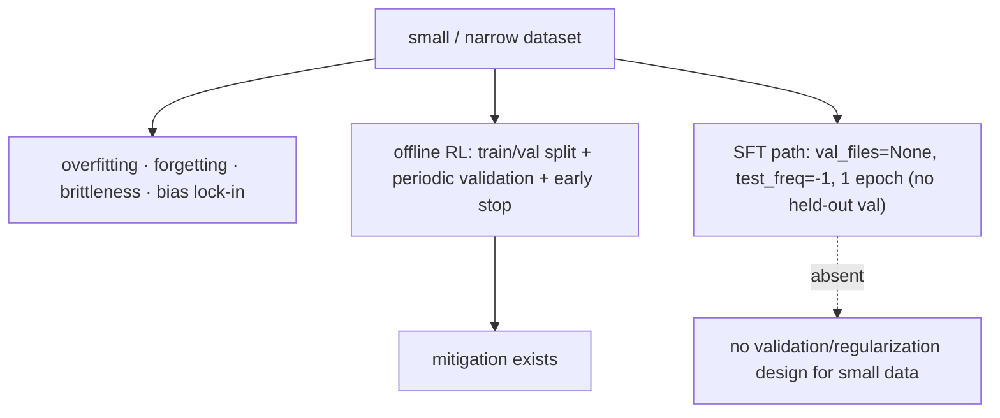
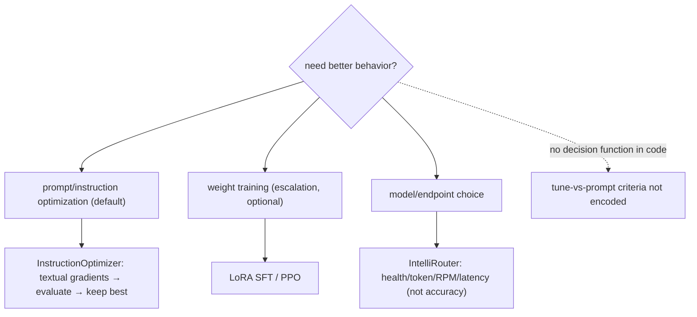

# Fine-tuning and customization

6 unique questions, deduplicated from the archived docs. Each `##` is one question; identical questions from other docs were merged. Full source files are in `orig/`.

## 1. What is instruction tuning, and how is it different from base model pretraining

**General:** Pretraining is self-supervised on raw text (predict the next/masked token) and produces a base model that completes text but does not follow instructions. Instruction tuning is supervised fine-tuning on (instruction, response) pairs that teaches the base model to follow commands, formats, and safety behavior. It is a small, high-quality stage relative to pretraining.

**Jiuwen:** Instruction tuning is implemented as **SFT over agent chat trajectories**: messages are normalized, tool calls are rendered into Qwen XML, and each assistant turn is tokenized with a `loss_mask` that is 0 for prompt/user/tool tokens and non-zero only on assistant output tokens. `supervise="last"` trains only the final assistant turn; `loss_norm` (`token`/`turn`/`sqrt`) controls per-turn weighting. The output is a pre-tokenized parquet consumed by a custom multi-turn dataset in veRL. This is behavior tuning on demonstrations, not continued pretraining.

**Anchors:** &bull; `agent-core/openjiuwen/agent_evolving/agent_rl/online/backends/sft/sft_data_formatter.py:201-249` — `build_sft_tokenized_sample`, loss mask on assistant only; `:270-345` `write_sft_parquet`; `:101-133` `convert_message_openai`; `:50-60` Qwen `<tool_call>` XML; `:77-84` `<think>` → `reasoning_content` &bull; `agent-core/openjiuwen/agent_evolving/agent_rl/online/backends/sft/trainer.py:136-176` — `train_batch`; `:395-398` `QwenMultiTurnSFTDataset`; `:270-276` parquet write

**Gap.** Pretraining is absent — no next-token objective, no raw-corpus dataloader; `from_pretrained` hits only load existing base/tokenizer weights.

_Canonical source: `orig/llm-fundamentals-interview-questions_for_engineers.md`; also covered in: genai, llm-fund._

## 2. What's the difference between full fine-tuning and parameter-efficient fine-tuning like LoRA

**General:** Full fine-tuning updates every weight in the model — highest capacity to adapt but needs the full model in memory per training run, large checkpoints, and is easy to overfit/drift. LoRA freezes the base weights and trains small low-rank adapter matrices injected into the attention/MLP projections, so you store and serve only the adapters, need far less memory, and can keep many task adapters over one base model. Quality is often close to full FT for style/format/domain adaptation; full FT is preferred when the task needs deep capability change.

**Jiuwen:** The repo trains weights, but only via **LoRA/PEFT adapters** — there is no full-parameter fine-tuning mode. Two backends exist: an online SFT backend and an online/offline RL/PPO backend (veRL). The SFT trainer writes a parquet dataset, invokes veRL's SFT trainer (FSDP + LoRA), then merges the FSDP checkpoint and exports a PEFT adapter directory (`adapter_config.json` + `adapter_model.safetensors`). The RL path saves a checkpoint and `_convert_fsdp_to_peft` filters only `lora_` params and writes a PEFT `adapter_config.json` (`peft_type: LORA`, `r`, `target_modules: all-linear`). Published adapters are versioned (`v1`, `v2`, …) with an atomic `latest` symlink, then hot-loaded on the inference service.

**Anchors:** &bull; `agent-core/openjiuwen/agent_evolving/agent_rl/online/backends/sft/trainer.py:44` — `SFTTrainingExecutor` (owns SFT + LoRA publish); `:328-345` lora_rank/alpha/target_modules; `:455-482` `_export_sft_lora_adapter`; `:577-586` `_is_publishable_lora_dir` &bull; `agent-core/openjiuwen/agent_evolving/agent_rl/optimizer/task_runner.py:438-470` — `export_lora`; `:543-579` PEFT `adapter_config.json`; `:550-552` warn+fallback if no LoRA params &bull; `agent-core/openjiuwen/agent_evolving/agent_rl/storage/lora_repo.py:56-131` — versioned publish + atomic `latest` &bull; `agent-core/openjiuwen/agent_evolving/agent_rl/config/online_config.py:42-45` — PPO overlay `lora_rank: 16`, `lora_alpha: 32`, `target_modules: all-linear` &bull; `agent-core/openjiuwen/agent_evolving/agent_rl/rl_trainer/ppo_step.py:146` — `update_actor` (PPO)

**Gap.** No full-parameter fine-tuning support and no direct `peft` import (the PEFT artifact format is hand-written). The primary self-evolution loop is textual prompt optimization, not weight training.

_Canonical source: `orig/llm-fundamentals-interview-questions_for_engineers.md`; also covered in: genai, llm-fund._

## 3. What's the difference between pretraining and fine-tuning

**General:** Pretraining learns general language structure from a huge unlabeled corpus with a self-supervised objective (next-token or masked-token); it is expensive and done once per base model. Fine-tuning adapts a pretrained model to a task/domain/behavior on a much smaller labeled or demonstration dataset, updating some or all weights. Instruction tuning is a specific kind of fine-tuning on instruction→response pairs.

**Jiuwen:** Two distinct things live here. The default "evolution" path does **not** train weights: `agent_evolving.Trainer` runs evaluate → LLM-generated update → validate → checkpoint and writes back **operators/parameters** (system/user prompts, configs) via `Operator.set_parameter` using "textual gradients" — prompt optimization, not gradient descent. `rsi/` and `auto_harness` evolve harness code/prompt sections. Separately, the optional `agent_evolving/agent_rl/` subsystem genuinely trains weights with veRL (PPO actor/critic updates, SFT) and exports **LoRA/PEFT adapters**. There is no from-scratch pretraining.

**Anchors:** &bull; `agent-core/openjiuwen/agent_evolving/trainer/trainer.py:145` — `train()` loop; `:356` `op.set_parameter(target, value)` &bull; `agent-core/openjiuwen/agent_evolving/optimizer/llm_call/instruction_optimizer.py:30` — prompt rewrite via textual gradients &bull; `agent-core/openjiuwen/rsi/__init__.py:2` — recursive self-improvement over harness/prompt/code &bull; `agent-core/openjiuwen/agent_evolving/agent_rl/rl_trainer/ppo_step.py:146` — `update_actor` / `:145` `update_critic` (real PPO) &bull; `agent-core/openjiuwen/agent_evolving/agent_rl/online/backends/sft/trainer.py:211` — async SFT producing a LoRA &bull; `agent-core/openjiuwen/agent_evolving/agent_rl/optimizer/task_runner.py:438` — `export_lora(...)`; `:489` `_convert_fsdp_to_peft(...)` &bull; `agent-core/openjiuwen/agent_evolving/agent_rl/storage/lora_repo.py:51` — versioned adapter store

**Gap.** Pretraining and full fine-tuning are absent. Weight training is confined to the optional RL subsystem (`agent_rl`, requires veRL/Ray/GPU, lazily imported).

---

# Tokens and sampling

_Canonical source: `orig/llm-fundamentals-interview-questions_for_engineers.md`; also covered in: llm-fund._

## 4. What's the difference between RAG and fine-tuning, and when would you use each

**General:** RAG supplies knowledge at query time by retrieving relevant passages and putting them in the prompt — it is cheap to update, auditable, and handles fresh or long-tail facts, but it costs tokens per call and cannot change the model's behavior/style. Fine-tuning changes the weights to teach behavior, format, tone, or a reasoning pattern, and can compress a long prompt into the model, but it is expensive, slow to iterate, can't cite, and won't reliably store volatile facts. Use RAG for knowledge, fine-tuning for behavior; often both. Reaching for fine-tuning to "add knowledge" is usually the wrong tool because updating the weights to change a fact is costly and unverifiable.

**Jiuwen:** The repo does not implement a decision rule, but it does encode the rationale. The self-optimizing-agent design argues against fine-tuning on bad cases because implementation cost is high and the fix cycle is tied to the model's fine-tuning version (slow intervention), so the default is automatic prompt/instruction-and-example optimization (`InstructionOptimizer`/`JointOptimizer`). Retrieval (`core/retrieval`) and self-evolution (`agent_evolving`) are separate, composable capabilities, and `dev_tools` positions prompt tuning as offline/dev-time iteration with "solidified" configs in production. Weight tuning exists as an optional heavier path (`agent_rl`, LoRA/SFT).

**Anchors:** &bull; `agent-core/openjiuwen/dev_tools/tune/optimizer/instruction_optimizer.py:30` — prompt rewrite via textual gradients &bull; `agent-core/openjiuwen/agent_evolving/trainer/trainer.py:241` — candidate prompt updates, keep best &bull; `agent-core/openjiuwen/agent_evolving/agent_rl/online/backends/sft/trainer.py:44` — alternate weight-training (SFT/LoRA) path &bull; `agent-core/openjiuwen/core/retrieval/retriever/vector_retriever.py:78` — retrieval path (knowledge at query time) &bull; `agent-core/openjiuwen/dev_tools/tune/optimizer/example_optimizer.py:109` — few-shot/example optimization

**Gap.** No document or comment compares RAG vs. fine-tuning or gives selection criteria; the only stated contrast is fine-tuning vs. *prompt* tuning (one paragraph).

_Canonical source: `orig/genai-interview-questions_for_engineers.md`; also covered in: genai, llm-applied, rag-1, rag-practical._

## 5. What's the risk of fine-tuning on a small, narrow dataset

**General:** Small/narrow data risks overfitting (memorizing the sample rather than generalizing), catastrophic forgetting of general ability, brittleness to slightly different inputs, and amplified bias/format lock-in from the narrow distribution. Mitigations: held-out validation with early stopping, regularization (weight decay, LoRA's low rank), data augmentation/diversity, and evaluating on a broader set than you trained on. The smaller the data, the more you should prefer PEFT and prompt engineering over full fine-tuning.

**Jiuwen:** The offline RL trainer has a real train/val pipeline (`train_data_path`/`val_data_path`, `val_before_train`, periodic `test_freq` validation with metric persistence), and the `dev_tools.tune.Trainer` has an `early_stop_score` gate. But the SFT path has **no held-out validation** at all: `_build_sft_config` sets `val_files: None` and `test_freq: -1`, and `total_epochs` defaults to 1. The only SFT data-quality gate is external (`resolved=true`). `weight_decay`/`clip_grad`/warmup are exposed only as raw veRL knobs, not framed as overfitting controls.

**Anchors:** &bull; `agent-core/openjiuwen/agent_evolving/agent_rl/config/offline_config.py:32` — `train_data_path`/`val_data_path`; `:53/69` `test_freq=20`, `val_before_train=True` &bull; `agent-core/openjiuwen/agent_evolving/agent_rl/offline/main_trainer.py:160` — `validate()` full pass + metric persistence; `:232` validate before train &bull; `agent-core/openjiuwen/agent_evolving/agent_rl/offline/coordinator/processors.py:55` — rollout validate gating &bull; `agent-core/openjiuwen/dev_tools/tune/trainer/trainer.py:38` — `early_stop_score`; `:99` val gate &bull; `agent-core/openjiuwen/agent_evolving/agent_rl/online/backends/sft/trainer.py:377` — `val_files: None`; `:420` `test_freq: -1`; `:359` `weight_decay`/`clip_grad` knobs &bull; `agent-core/examples/agent_evolving/react_agent_evolving.py:156` — `split(ratio=0.6)` train/val; `:202` `early_stop_score=0.95`

**Gap.** No overfitting/validation/regularization guidance for small data; the SFT path lacks held-out validation and early stopping and runs 1 epoch by default.

---

# Agents and tool use

_Canonical source: `orig/genai-interview-questions_for_engineers.md`; also covered in: genai._

## 6. When would you fine-tune instead of using a longer, more detailed prompt

**General:** Fine-tune when the behavior is hard to specify in words (style, tone, domain jargon, strict output schema), when you need to compress a long few-shot prompt into the weights for latency/cost, when you have many labeled examples of the desired behavior, or when the task is high-volume and a smaller tuned model is cheaper. Prefer prompting when the task is general, examples are few, the requirement changes often, or you need to iterate quickly — prompt changes ship in seconds, fine-tunes in hours/days.

**Jiuwen:** The repo contains conceptual guidance plus two separate mechanisms, not a decision function. A design doc states the rationale directly: fine-tuning on bad cases is expensive and its fix cycle is tied to model release versions, so openJiuwen instead does automatic prompt/instruction-and-example optimization. The practical default is `Trainer` + `InstructionOptimizer`/`JointOptimizer` (rewrite prompts via textual gradients, evaluate candidates, keep the best). For choosing *which model/endpoint* serves a task, IntelliRouter routes among deployments by adaptive health/token/RPM/latency scoring — availability/cost routing, not "tune vs prompt" reasoning. Weight-level SFT/LoRA exists as a heavier escalation path, but no selection criteria are encoded in code.

**Anchors:** &bull; `agent-core/openjiuwen/agent_evolving/optimizer/llm_call/instruction_optimizer.py:30-38` — prompt rewriting via textual gradients &bull; `agent-core/openjiuwen/agent_evolving/trainer/trainer.py:241-272` — evaluates candidate prompt-config updates, keeps best &bull; `agent-core/openjiuwen/agent_evolving/agent_rl/online/backends/sft/trainer.py:44-45` — alternate weight-training (SFT/LoRA) path &bull; `agent-core/openjiuwen/agent_teams/models/pool.py:133-235` — `ModelRouterConfig`; `agent-core/openjiuwen/agent_teams/models/allocator.py:176/240/357/452/559` — allocator strategies / `build_model_allocator` &bull; `agent-core/examples/intelli_router/intelliRouter_demo.py:142-160` — adaptive routing weights (`w_health`, `w_token`, `w_rpm`, `w_latency`)

**Gap.** No explicit "fine-tune vs longer prompt" decision guidance beyond one conceptual paragraph; no cost/benefit calculator or context-length-vs-tuning trigger.

---

# Model behavior

_Canonical source: `orig/llm-fundamentals-interview-questions_for_engineers.md`; also covered in: genai, llm-fund._
