# RAG system design

13 unique questions, deduplicated from the archived docs. Each `##` is one question; identical questions from other docs were merged. Full source files are in `orig/`.

## 1. Design a document search system for a legal firm with millions of confidential documents

**General:** The dominant requirement is access control, then scale. Every chunk must carry an ACL (owner, matter, tenant) and every query must be filtered by the caller's permissions *inside* the vector search (pre-filter), not after. Combine that with hybrid retrieval, a reranker, encryption at rest, audit logging, and per-matter isolation. Confidentiality also means no cross-matter leakage in the prompt context.

**Jiuwen:** Supports metadata filtering at the **store** layer (Milvus expr, Chroma `where`, PG JSONB) and per-KB collections (`kb_{kb_id}_chunks`), plus a permission engine and audit logging. But the retriever layer **drops** `RetrievalConfig.filters` — concrete retrievers hardcode `filters=None` — so permission-aware retrieval is not reachable through the KB path, and there is no document/chunk ACL field. Permission-aware retrieval would require re-plumbing filters through the retriever.

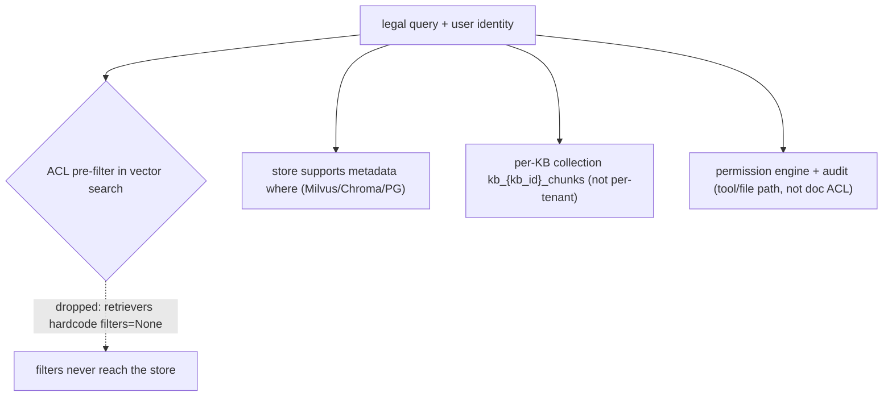

**Anchors:** &bull; `agent-core/openjiuwen/core/retrieval/common/config.py:53` — `RetrievalConfig.filters`; `agent-core/openjiuwen/core/retrieval/retriever/base.py:19` — abstract `retrieve` has no `filters`; `agent-core/openjiuwen/core/retrieval/simple_knowledge_base.py:186` — KB passes `filters`; `agent-core/openjiuwen/core/retrieval/retriever/vector_retriever.py:88` / `agent-core/openjiuwen/core/retrieval/retriever/hybrid_retriever.py:81` — hardcoded `filters=None` &bull; `agent-core/openjiuwen/core/retrieval/vector_store/milvus_store.py:215` — Milvus filter expr; `agent-core/openjiuwen/core/retrieval/vector_store/chroma_store.py:265` — `where`; `agent-core/openjiuwen/core/retrieval/vector_store/pg_store.py:474` — JSONB &bull; `agent-core/openjiuwen/core/retrieval/simple_knowledge_base.py:102` — `kb_{kb_id}_chunks` &bull; `agent-core/openjiuwen/harness/security/permission_engine/core.py:272` — `check_permission` (tool/file/net, not retrieval) &bull; `agent-core/openjiuwen/core/common/security/user_config.py:69` — sensitive-path config (filesystem, not doc ACL)

_Canonical source: `orig/rag-system-design-interview-questions_for_engineers.md`; also covered in: rag-system._

## 2. Design a RAG pipeline for a codebase assistant that needs to stay current as code changes daily

**General:** Make re-indexing incremental and event-driven: a stable ID per file/chunk, delete-by-ID on change, append new chunks, and a trigger on commit/CI. Avoid full re-embeds except on model/index changes. Keep chunk boundaries structure-aware (functions/classes) and include file paths/branches as metadata so the assistant can cite and filter.

**Jiuwen:** The contract is delete-by-`doc_id` + rebuild: indexers scan a doc's chunk IDs, delete them, then re-chunk/re-embed/write (Milvus flushes between to defeat eventual consistency); new documents append into the pre-existing ANN index (no full re-index). `doc_id` is a first-class, scalar-inverted field. Chunking supports char/token/hybrid but has no code-aware/function-boundary chunker.

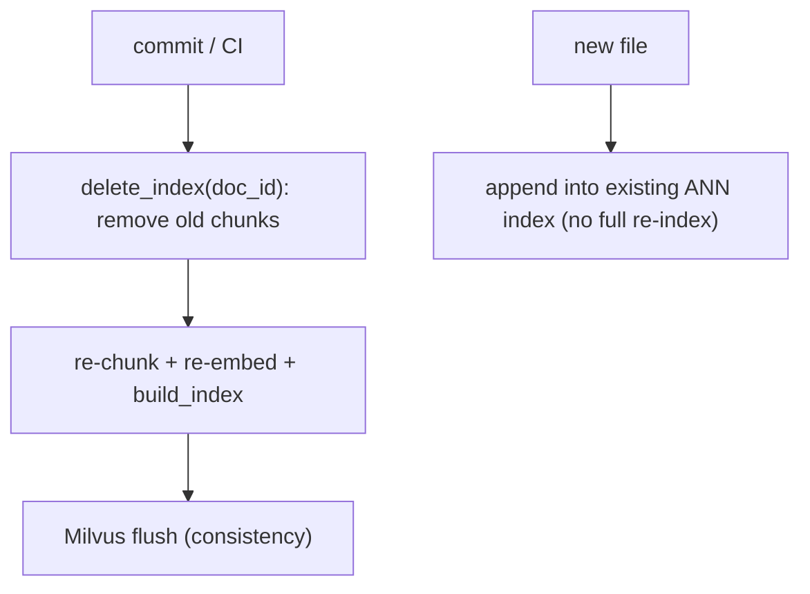

**Anchors:** &bull; `agent-core/openjiuwen/core/retrieval/simple_knowledge_base.py:219` — `update_documents`; `:74` `add_documents` appends &bull; `agent-core/openjiuwen/core/retrieval/indexing/indexer/chroma_indexer.py:198` — `update_index` = delete + build; `:217` delete by `doc_id` &bull; `agent-core/openjiuwen/core/retrieval/indexing/indexer/milvus_indexer.py:209` — delete + flush + rebuild; `:346` `INVERTED` scalar index &bull; `agent-core/openjiuwen/core/retrieval/indexing/processor/chunker/hybrid_chunker.py:19` — structural no-split guard

_Canonical source: `orig/rag-system-design-interview-questions_for_engineers.md`; also covered in: rag-system._

## 3. Design a RAG system for a customer support chatbot handling 100,000 queries a day

**General:** Start from the request rate and SLA, then choose components: ingestion (parse → chunk → embed → index), retrieval (hybrid dense+sparse), a reranker, a generation layer, caching, and observability. 100k/day is ~1.2 QPS average (bursts higher), so a single server-class vector DB is fine; the real work is cache hit rate, top-k tuning, guardrails, and a feedback loop. Size context and cost per query, then multiply.

**Jiuwen:** Provides the ingestion pipeline (`parse_files` → `chunk_documents` → `build_index`), hybrid retrieval with RRF, optional rerankers (graph store only), and the context/generation path via `KnowledgeRetrievalComponent` + `LLMComponent`. Product adds session cost tracking and a per-session cost cap. Gaps a design must cover: no packaged end-to-end RAG agent, no token budgeting on retrieved context, no quality monitoring (only error/latency tracing), and no semantic response cache.

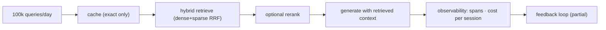

**Anchors:** &bull; `agent-core/openjiuwen/core/retrieval/simple_knowledge_base.py:96/110/182` — ingest/retrieve pipeline &bull; `agent-core/openjiuwen/core/retrieval/utils/fusion.py:15` — RRF hybrid merge &bull; `agent-core/openjiuwen/core/workflow/components/resource/knowledge_retrieval_comp.py:109/243` — context assembly &bull; `jiuwenswarm/jiuwenswarm/server/runtime/usage_cost.py:171` — session cost cap &bull; `jiuwenswarm/jiuwenswarm/agents/harness/common/rails/tool_dedup_rail.py:47` — exact tool result cache

_Canonical source: `orig/rag-system-design-interview-questions_for_engineers.md`; also covered in: rag-system._

## 4. Handling a document updated or deleted after it's already indexed

**General:** You need a stable document id and a delete-by-id path; updates are delete-then-insert (or upsert). Chunk ids must be derived from the document id so all chunks of a document can be found and removed atomically. The hard parts are atomicity (a crash between delete and reinsert loses the doc) and eventual consistency in the vector store.

**Jiuwen:** The contract is delete-by-`doc_id` + rebuild. Chroma/Milvus indexers do **not** upsert: they scan a doc's chunk IDs, delete them, then re-chunk/re-embed/write (Milvus flushes between to defeat eventual consistency). `doc_id` is a first-class field (`document_id`, scalar-inverted in Milvus) enabling filter deletes. PG is the only store with native upsert-by-primary-key (`INSERT ... ON CONFLICT (id) DO UPDATE`), but no PG indexer wraps it. There is no atomic/transactional replace — a crash between delete and rebuild loses the document, and chunk IDs are regenerated UUIDs each run so "same document" relies solely on `doc_id`.

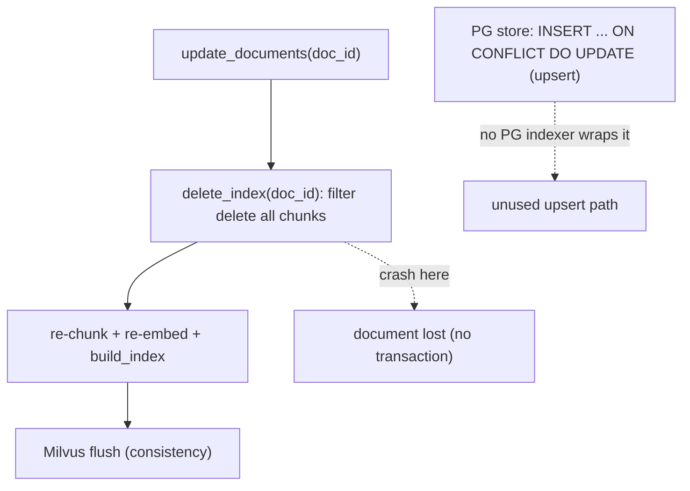

**Anchors:** &bull; `agent-core/openjiuwen/core/retrieval/knowledge_base.py:176/184` — abstract `delete_documents` / `update_documents` &bull; `agent-core/openjiuwen/core/retrieval/simple_knowledge_base.py:192` — `delete_documents`; `:219` `update_documents` &bull; `agent-core/openjiuwen/core/retrieval/indexing/indexer/chroma_indexer.py:198` — `update_index` = delete + build; `:217` delete by `doc_id`; `:142` duplicate guard &bull; `agent-core/openjiuwen/core/retrieval/indexing/indexer/milvus_indexer.py:209` — delete + flush + rebuild; `:231` filter delete `document_id == doc_id` &bull; `agent-core/openjiuwen/core/retrieval/vector_store/pg_store.py:300` — `INSERT ... ON CONFLICT DO UPDATE` &bull; `agent-core/openjiuwen/core/retrieval/graph_knowledge_base.py:253` — delete chunk + triple index; `:294` update = delete + re-add

_Canonical source: `orig/rag-retrieval-interview-questions_for_engineers.md`; also covered in: rag-1, rag-practical, rag-retrieval, rag-system._

## 5. How do you decide between a hosted vector database and a self-managed one at scale

**General:** Hosted (Pinecone/Zilliz Cloud): less ops, elastic scaling, predictable latency, but cost scales with data/queries and there is vendor lock-in. Self-managed (Milvus/Qdrant/pgvector): control, cost at steady state, data residency, but you own scaling, backups, upgrades, and on-call. Decide by team ops capacity, data sensitivity, query volume, and elasticity needs — not by the library API.

**Jiuwen:** `create_vector_store` dispatches Chroma (local/embedded), Milvus (server, fits hosted or self-managed), and PostgreSQL+pgvector (self-managed relational). The choice is pure config; there is no autoscaling, managed-service integration, or ops tooling in-repo. Chroma local cannot do hybrid, so production hybrid means Milvus or PG.

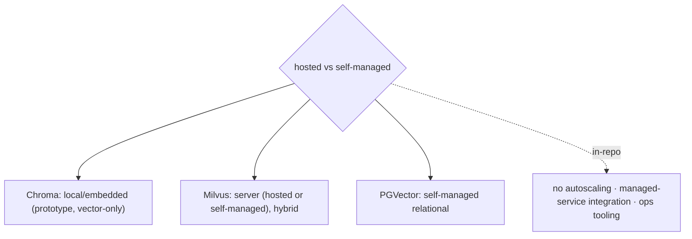

**Anchors:** &bull; `agent-core/openjiuwen/core/retrieval/vector_store/store.py:16` — factory &bull; `agent-core/openjiuwen/core/retrieval/vector_store/chroma_store.py:129` — local; `agent-core/openjiuwen/core/retrieval/vector_store/milvus_store.py:108` — server; `agent-core/openjiuwen/core/retrieval/vector_store/pg_store.py:108` — relational &bull; `agent-core/openjiuwen/core/retrieval/knowledge_base.py:59` — Chroma rejects hybrid &bull; `agent-core/openjiuwen/core/retrieval/common/config.py:67` — `StoreType`

---

# Data freshness and consistency

_Canonical source: `orig/rag-system-design-interview-questions_for_engineers.md`; also covered in: rag-system._

## 6. How do you design for the case where retrieval returns zero relevant documents

**General:** Detect it (score threshold or answerability) and abstain: return "I don't have enough information" or ask a clarifying question, rather than answering from noise. Optionally fall back to a broader retrieval (sparse), a knowledge-graph hop, or parametric knowledge with a caveat. Log zero-result queries — they signal coverage gaps.

**Jiuwen:** The KB path implements **dense-empty → sparse** fallback, but has **no abstention**: when both are empty it returns `[]` and the workflow component concatenates an empty context with no "no answer" signal. Explicit abstention (`is_abstain`, `abstain_no_backfill`) exists only in the separate Symphony progressive-retrieval engine, not in `core/retrieval` KB retrieval. `score_threshold` defaults to `None`.

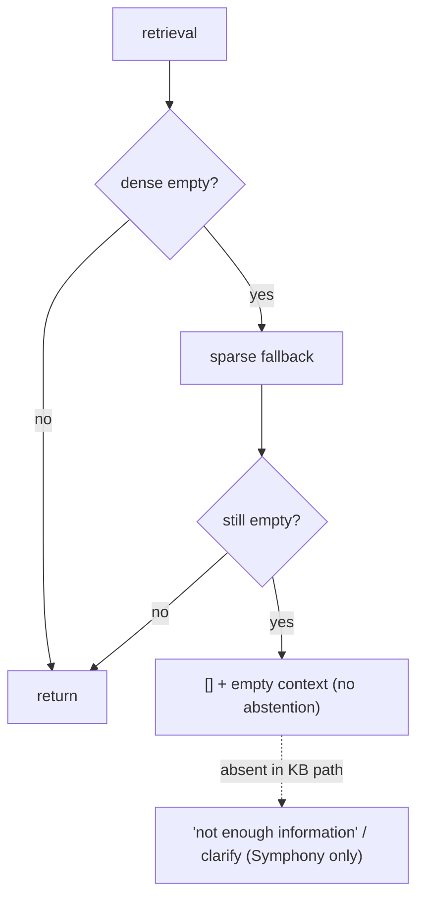

**Anchors:** &bull; `agent-core/openjiuwen/core/retrieval/retriever/vector_retriever.py:83` — dense-empty → sparse; `agent-core/openjiuwen/core/retrieval/retriever/hybrid_retriever.py:97` — same &bull; `agent-core/openjiuwen/core/workflow/components/resource/knowledge_retrieval_comp.py:241` — empty results → empty context &bull; `agent-core/openjiuwen/core/retrieval/common/config.py:47` — `score_threshold` defaults `None` &bull; `agent-core/openjiuwen/symphony/retrieval/search/runtime/selector.py:305` — `is_abstain`; `agent-core/openjiuwen/symphony/retrieval/search/runtime/engine.py:94`; `agent-core/openjiuwen/symphony/retrieval/search/runtime/progressive.py:1060` — `abstain_no_backfill`

_Canonical source: `orig/rag-system-design-interview-questions_for_engineers.md`; also covered in: rag-system._

## 7. How do you shard or partition a vector database as it grows

**General:** Options: partition by a key (tenant/category) so queries hit one partition; shard by hash/range across nodes; or replicate + route by collection. Most vector DBs expose partition keys or collections; plan for metadata routing and rebalancing. Sharding trades query fan-out for per-shard size.

**Jiuwen:** **No sharding or hash/range partitioning.** The only partition-like unit is the per-KB collection (`kb_{kb_id}_chunks`/`_triples`) plus the `database_name` field. There are no Milvus partition keys, shard config, or tenant-hash routing.

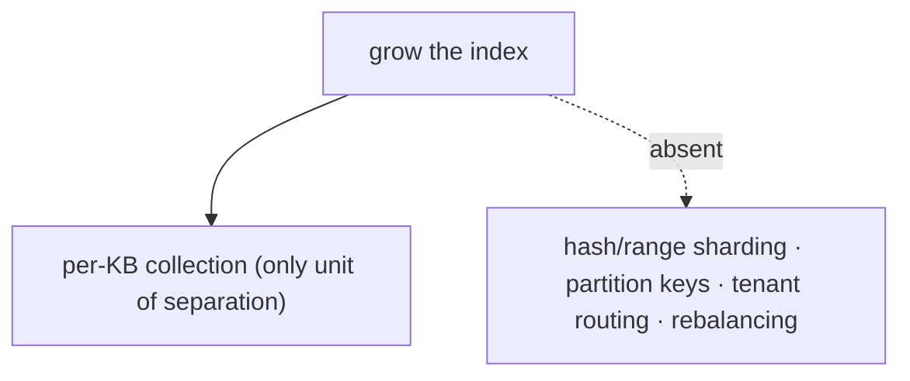

**Anchors:** &bull; `agent-core/openjiuwen/core/retrieval/simple_knowledge_base.py:102` — `kb_{kb_id}_chunks` &bull; `agent-core/openjiuwen/core/retrieval/common/config.py:79` — `database_name` &bull; `agent-core/openjiuwen/core/retrieval/vector_store/milvus_store.py:512` — `delete_table`/drop granularity only

_Canonical source: `orig/rag-system-design-interview-questions_for_engineers.md`; also covered in: rag-system._

## 8. How retrieval architecture changes from 10,000 to 10 million documents

**General:** At small scale, a local in-process index (FAISS/Chroma) is fine. At large scale you need a dedicated vector DB with tuned ANN indexes (HNSW/IVF/quantization), sharding/partitioning, replication, and batch ingestion; you also start caring about memory, index build time, and recall/latency tuning per query. The interface stays the same but the operational envelope changes.

**Jiuwen:** Scale-out is delegated to the backend: Chroma = local persistent HNSW (small/medium), Milvus = server ANN with selectable AUTO/HNSW/IVF/SCANN and quantization variants (large), PGVector = pgvector HNSW (relational; the field type also declares `ivfflat`, but no IVFFlat index branch is implemented). Writes are batched (128) and flushed. Milvus BM25 for hybrid is native (`SPARSE_INVERTED_INDEX`) plus a jieba analyzer. The architecture is a single collection per KB (`kb_{kb_id}_chunks`) with one ANN index created once at collection creation. There is no sharding, partitioning, replica, or multi-collection fan-out anywhere.

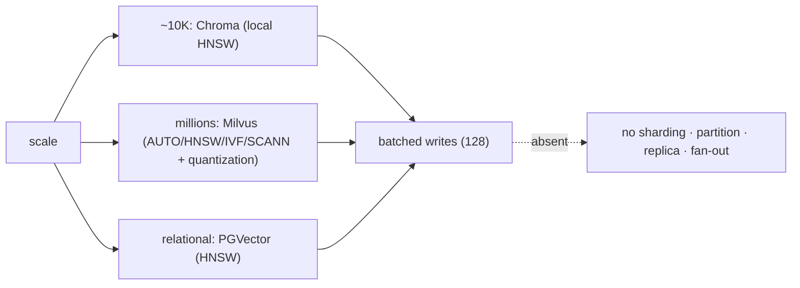

**Anchors:** &bull; `agent-core/openjiuwen/core/retrieval/vector_store/store.py:16` — `create_vector_store` (Milvus/Chroma/PGVector); `agent-core/openjiuwen/core/retrieval/common/config.py:67` — store type enum &bull; `agent-core/openjiuwen/core/retrieval/indexing/indexer/milvus_indexer.py:433` — index type AUTOINDEX/HNSW/IVF/FLAT/SCANN; `:346` inverted scalar indexes &bull; `agent-core/openjiuwen/core/foundation/store/vector_fields/milvus_fields.py:282` — `MilvusHNSW` (M=30, efConstruction=360); `:100` IVFFlat defaults; `:164` SCANN &bull; `agent-core/openjiuwen/core/retrieval/vector_store/pg_store.py:203` — HNSW index; `agent-core/openjiuwen/core/foundation/store/vector_fields/pg_fields.py:37` — pgvector defaults &bull; `agent-core/openjiuwen/core/foundation/store/vector_fields/chroma_fields.py:47` — Chroma HNSW defaults &bull; `agent-core/openjiuwen/core/retrieval/vector_store/base.py:57` — `add(..., batch_size=128)`

_Canonical source: `orig/rag-retrieval-interview-questions_for_engineers.md`; also covered in: rag-1, rag-retrieval, rag-system._

## 9. How would you design the system so users never get an answer based on stale, outdated information

**General:** Attach timestamps/versions to documents, prefer recency in ranking (or hard-filter to a freshness window), tombstone superseded versions, and surface recency to the generator. Propagate deletes promptly from the source (event-driven) so the index matches source-of-truth, and reconcile periodically.

**Jiuwen:** The retrieval layer has **no notion of document time**: `RetrievalResult`/`TextChunk` carry only text/score/metadata, parsers populate no timestamp, and ranking is score/rank only (RRF, max-score) — no recency boost or outdated filter. Conflict handling is memory-write-only (`MemUpdateChecker`, newest wins); a freshness/time-decay notion exists only for experience records.

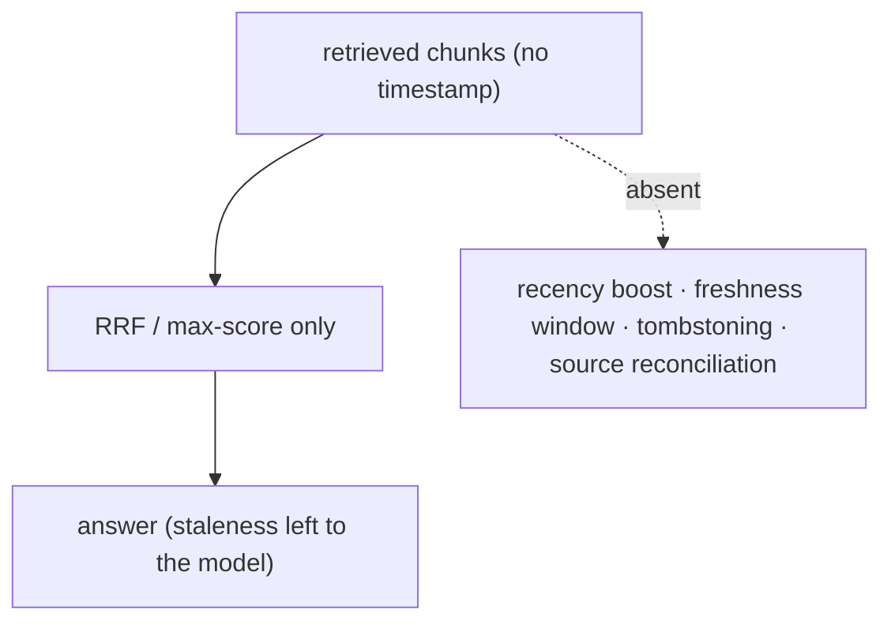

**Anchors:** &bull; `agent-core/openjiuwen/core/retrieval/common/retrieval_result.py:23` — no timestamp field; `agent-core/openjiuwen/core/retrieval/common/document.py:30` — `TextChunk` &bull; `agent-core/openjiuwen/core/retrieval/utils/fusion.py:39` — RRF by text/rank; `agent-core/openjiuwen/core/retrieval/simple_knowledge_base.py:313` — max-score merge &bull; `agent-core/openjiuwen/core/memory/manage/update/mem_update_checker.py:22/252` — memory-only conflict (newest wins) &bull; `agent-core/openjiuwen/agent_evolving/experience/scorer.py:219` — `calc_freshness` (experiences only)

_Canonical source: `orig/rag-system-design-interview-questions_for_engineers.md`; also covered in: rag-system._

## 10. Keeping retrieval fast as the vector database grows, without a full re-index

**General:** Append-only incremental indexing into a pre-built ANN index avoids full rebuilds; deletes/filters stay fast with scalar/inverted indexes; search-time parameters (efSearch, nprobe) tune the recall/latency dial without reindexing. At some point you need compaction/merge of segments and periodic index rebuilds — that is an operational concern, not a query-time one.

**Jiuwen:** Growth is handled by append-only batched writes into a pre-existing ANN index; existing vectors are untouched, so adding documents triggers no full re-index. Fast deletes/filters use the Milvus inverted scalar index on `document_id`/`chunk_id`. `get_search_params` derives `ef = top_k * efSearchFactor` per query (a search-time recall knob). `lazy_load` defers heavy module imports (Milvus/Chroma/parsers), not data. There is **no query result cache**, no reindex/compaction trigger, and no `ALTER INDEX` path — once the collection is created, ANN algorithm/params cannot change.

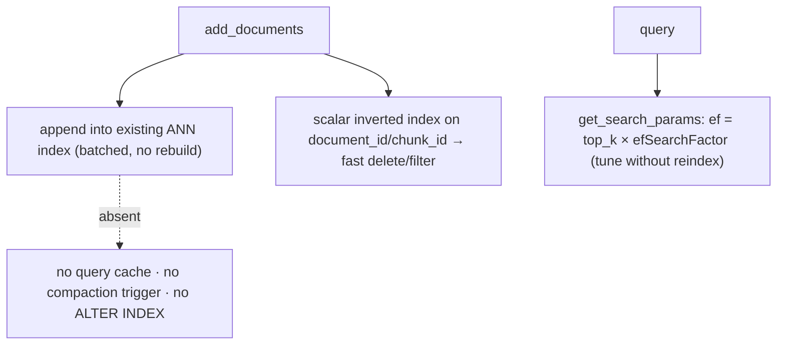

**Anchors:** &bull; `agent-core/openjiuwen/core/retrieval/vector_store/milvus_store.py:519` — `_ensure_loaded` lazy load; `:144` index_type change guard; `:117` `get_search_params` ef dial; `:199` flush after write &bull; `agent-core/openjiuwen/core/retrieval/indexing/indexer/milvus_indexer.py:321` — `_ensure_collection` no-op if exists; `:346` inverted scalar indexes &bull; `agent-core/openjiuwen/core/retrieval/vector_store/pg_store.py:157` — reflects existing table; `:203` index created once &bull; `agent-core/openjiuwen/core/retrieval/lazy_load.py:143` — `lazy_load` (module imports) &bull; `agent-core/openjiuwen/core/retrieval/simple_knowledge_base.py:74` — `add_documents` appends via `build_index`

_Canonical source: `orig/rag-retrieval-interview-questions_for_engineers.md`; also covered in: rag-retrieval._

## 11. What database would you choose for the vector store, and why that one over the alternatives

**General:** Choose by scale and features, not familiarity: local/embedded (FAISS/Chroma) for prototypes; a managed vector DB (Pinecone / Zilliz Cloud) for scale and hybrid search; or pgvector when you already run Postgres and want one datastore, transactions, and metadata joins. Evaluate hybrid support, filtering, operational cost, and lock-in.

**Jiuwen:** Three backends behind one factory: Chroma (local persisted, **vector-only** — sparse/hybrid rejected), Milvus (server, native BM25 + hybrid with RRF), PostgreSQL+pgvector (server, `tsvector` sparse + vector). The KB selects the index type (`hybrid` default). So hybrid/RRF requires Milvus or PG; Chroma is the small/local choice.

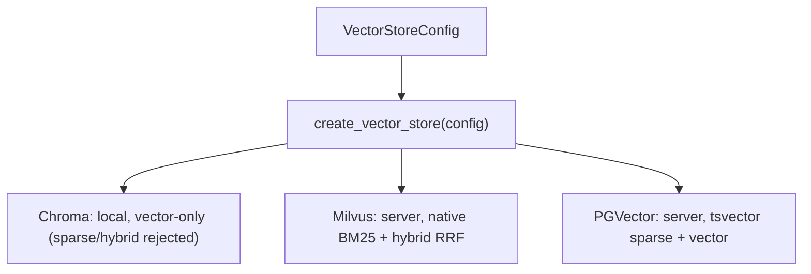

**Anchors:** &bull; `agent-core/openjiuwen/core/retrieval/vector_store/store.py:16` — factory dispatch; `agent-core/openjiuwen/core/retrieval/common/config.py:67` — `StoreType = Milvus | Chroma | PGVector` &bull; `agent-core/openjiuwen/core/retrieval/vector_store/chroma_store.py:129` — `PersistentClient` (local); `agent-core/openjiuwen/core/retrieval/vector_store/milvus_store.py:108` — `MilvusClient(uri=...)` (server); `agent-core/openjiuwen/core/retrieval/vector_store/pg_store.py:108` — `create_async_engine(...)` &bull; `agent-core/openjiuwen/core/retrieval/knowledge_base.py:59` — Chroma rejects sparse/hybrid in local mode &bull; `agent-core/openjiuwen/core/retrieval/common/config.py:32/60` — index types `hybrid`/`bm25`/`vector`

_Canonical source: `orig/rag-system-design-interview-questions_for_engineers.md`; also covered in: rag-system._

## 12. What happens to the user experience if the vector database is down, what's your fallback

**General:** Decide the degradation: fail fast with a clear message, serve cached results, fall back to a secondary index (sparse/BM25 or a replica), or disable retrieval and answer from parametric knowledge with a caveat. Add a circuit breaker, health checks, and timeouts so one dependency cannot hang the request. Replicate the index so a single node is not a SPOF.

**Jiuwen:** There is **no availability fallback** for a down vector DB. Dense `search()` does not catch exceptions — a store failure propagates through the retriever and fails the workflow node. Sparse searches silently return `[]` on error, Milvus hybrid has a same-DB split-search fallback, and `retrieve_multi_kb` swallows per-KB errors (empty list), which contains blast radius across KBs. There is no circuit breaker, health probe, or result cache.

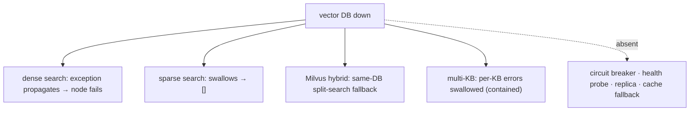

**Anchors:** &bull; `agent-core/openjiuwen/core/retrieval/vector_store/milvus_store.py:357` — `hybrid_search` → `_hybrid_search_fallback`; `:284` `sparse_search` returns `[]`; `:519` `_ensure_loaded` timeouts &bull; `agent-core/openjiuwen/core/retrieval/vector_store/chroma_store.py:326` — sparse/text returns `[]` on error &bull; `agent-core/openjiuwen/core/retrieval/simple_knowledge_base.py:300` — `retrieve_multi_kb` swallows per-KB errors &bull; `agent-core/openjiuwen/core/workflow/components/resource/knowledge_retrieval_comp.py:123` — re-raises `build_error`

_Canonical source: `orig/rag-system-design-interview-questions_for_engineers.md`; also covered in: rag-system._

## 13. Your system needs sub-500ms responses, walk me through where you'd spend that budget across retrieval, reranking, and generation

**General:** Budget roughly: embedding + vector search tens of ms, rerank tens–low-hundreds of ms, generation the rest (and generation dominates when you stream, because TTFT is what the user perceives). To hit 500ms: stream tokens, cache embeddings/results, keep top-k small, rerank only when it pays, route to a fast model, and parallelize independent steps. Measure TTFT, not total.

**Jiuwen:** Provides streaming (ReAct → session → WebSocket frames) with per-call `ttft_ms`, parallel tool execution with resource lanes, KV/prefix cache affinity, a model backup/failover rail, and IntelliRouter for deployment selection. Reranking is **optional and absent from the default KB path** (graph store only), so the rerank budget is not spent unless wired. There is no latency/SLA-based routing or result cache.

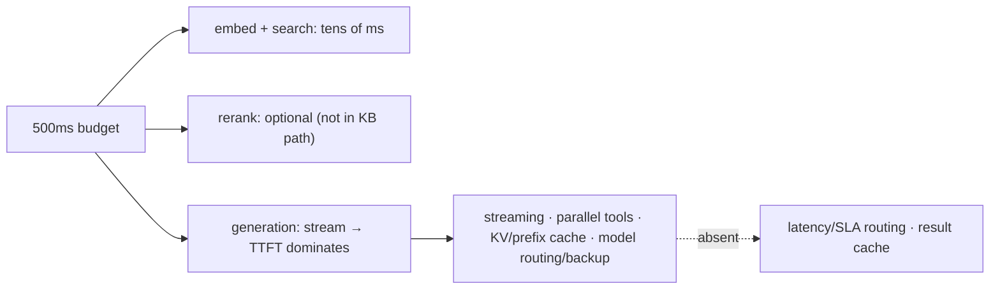

**Anchors:** &bull; `agent-core/openjiuwen/core/single_agent/agents/react_agent.py:336` — `parallel_tool_calls`; `:1758` `ttft_ms`; `:2938` `stream` &bull; `agent-core/openjiuwen/core/single_agent/ability_manager.py:431/467` — parallel batches + `parallel_safe` lanes &bull; `agent-core/openjiuwen/core/single_agent/rail/model_backup.py:9` — `ModelBackupRail.on_model_exception` failover &bull; `jiuwenswarm/jiuwenswarm/server/runtime/session/kv_cache/kv_cache_model_provider.py:80` — KV/prefix affinity &bull; `agent-core/openjiuwen/core/retrieval/simple_knowledge_base.py:182` — KB path calls no reranker

_Canonical source: `orig/rag-system-design-interview-questions_for_engineers.md`; also covered in: rag-system._
