# Evaluation

21 unique questions, deduplicated from the archived docs. Each `##` is one question; identical questions from other docs were merged. Full source files are in `orig/`.

## 1. Building a regression test suite to catch a quality drop before it ships

**General:** Combine fast deterministic unit tests on the pipeline components with a quality eval suite on a fixed dataset scored by the same metrics each time; store a baseline and fail the build when the score drops beyond a threshold. Add golden/snapshot tests for prompts and outputs, and gate merges on the suite.

**Jiuwen:** Tests split into `tests/unit_tests/` (fast, deterministic, CI) and `tests/system_tests/` (E2E, usually skipped). `pytest` defines markers `level0` ("smoke / happy-path; PR gate must stay green") and `level1`, with `testpaths=["tests"]`. Quality evaluation exists separately: `evaluator_pipeline` emits `pass_rate`/`improvement`/`converged`, and `Trainer` compares a candidate's validation score against `best_score` and commits only improvements. But the CI gate that blocks merges (`ci_gate.yaml`) declares only `lint` and `type-check` — no pytest gate and no eval threshold.

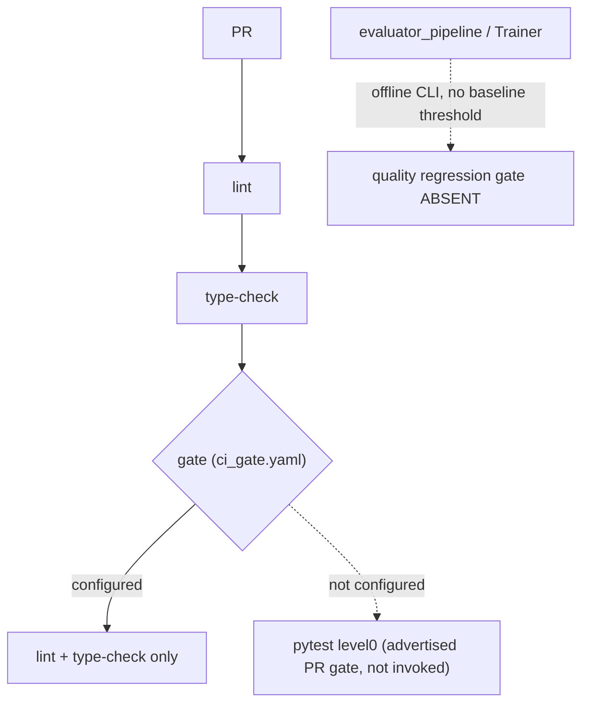
```mermaid
flowchart TD
    PR["PR"] --> L["lint"] --> TC["type-check"] --> G{"gate (ci_gate.yaml)"}
    G -->|"configured"| LINT["lint + type-check only"]
    G -.->|"not configured"| PY["pytest level0 (advertised PR gate, not invoked)"]
    EVAL["evaluator_pipeline / Trainer"] -.->|"offline CLI, no baseline threshold"| Q["quality regression gate ABSENT"]
```

**Anchors:** &bull; `agent-core/pyproject.toml:230` — pytest config + `level0`/`level1` markers &bull; `agent-core/openjiuwen/auto_harness/resources/ci_gate.yaml:21` — gates are only `lint` and `type-check` &bull; `agent-core/openjiuwen/auto_harness/infra/ci_gate_runner.py:1098` — gate dispatch; `agent-core/openjiuwen/auto_harness/stages/verify.py:451` `ci_gate.run("all")`; `:509` revert on exhaustion &bull; `agent-core/openjiuwen/agent_evolving/trainer/trainer.py:217` — `improved = val_score > progress.best_score` &bull; `agent-core/openjiuwen/agent_evolving/evaluator/evaluator_pipeline/pipeline.py:664` — `_compute_evolution_metrics`

**Gap.** No model/agent-quality regression gate in CI, no golden/snapshot tests for prompts/retrieval/outputs, and credential-requiring system tests are skipped. A quality drop would not be caught before ship by the configured automation.

_Canonical source: `orig/ai-engineer-technical-questions_for_engineers.md`; also covered in: engineering, genai, llm-applied, rag-eval, rag-1._

## 2. Computing faithfulness: decomposing an answer into atomic claims, scoring each against the source with an NLI model or LLM-as-judge

**General:** Faithfulness = supported claims / total claims. Decompose the answer into atomic, verifiable claims; for each, ask an NLI model or LLM judge whether the retrieved source entails it; average. It needs the source context and is claim-level, not answer-level. Low faithfulness with high relevance points at the generator skipping or distorting retrieved evidence.

**Jiuwen:** **Absent.** No judge receives a retrieved source context for faithfulness. `agent_evolving`'s judge template has fields `[Question]`, `[Expected Answer]`, `[Model Response]` with no context/evidence slot; RSI's judge receives task/reference/rubric/evidence artifacts but no retrieval context and does no claim decomposition. Symphony's judge payload can incidentally include the message trace, but it is not a faithfulness pipeline.

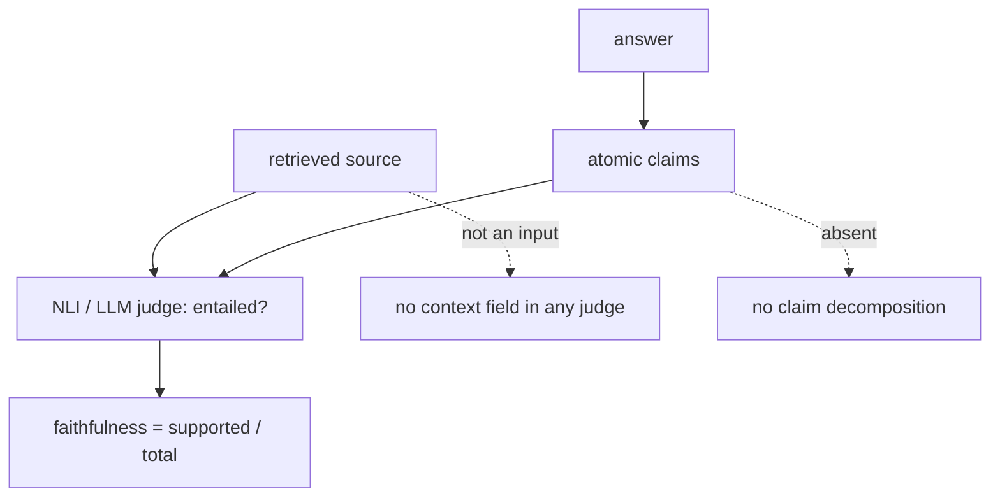
```mermaid
flowchart TD
    ANS["answer"] --> ATOMS["atomic claims"]
    CTX["retrieved source"] --> NLI["NLI / LLM judge: entailed?"]
    ATOMS --> NLI
    NLI --> F["faithfulness = supported / total"]
    CTX -.->|"not an input"| X["no context field in any judge"]
    ATOMS -.->|"absent"| Y["no claim decomposition"]
```

**Anchors:** &bull; `agent-core/openjiuwen/agent_evolving/evaluator/templates.py:32` — template fields `[Question]`/`[Expected Answer]`/`[Model Response]`; no context &bull; `agent-core/openjiuwen/agent_evolving/evaluator/metrics/llm_as_judge.py:47` — prompt formatted with three fields only &bull; `agent-core/openjiuwen/agent_evolving/evaluator/evaluator.py:116` — same three fields &bull; `agent-core/openjiuwen/symphony/evaluation/base.py:336` — redacted fingerprint+case (incidental context) &bull; `agent-core/openjiuwen/symphony/evaluation/evaluators.py:546` — payload filters trace

_Canonical source: `orig/rag-evaluation-interview-questions_for_engineers.md`; also covered in: rag-eval._

## 3. Evaluating continuously in production, not just once before launch

**General:** Sample live traffic, score it on a schedule or on feedback, and alert on quality drops — separate from error/latency monitoring. Look for drift in query distribution and retrieval hit rates, track online metrics (thumbs, task success, escalation), and periodically re-run the offline suite on fresh data. The goal is to detect degradation before users report it.

**Jiuwen:** There is a live capture-and-score path, but it serves **online RL training, not quality monitoring**: `CapturePipeline` stages each production completion and a judge later attaches an LLM score or user reward, persisting to a trajectory sample store. The product writes all spans into a per-session SQLite trajectory store (diagnostic, 7-day retention) for replay. There is no drift detection, no eval traffic-sampling policy, no dashboard, and no quality alert.

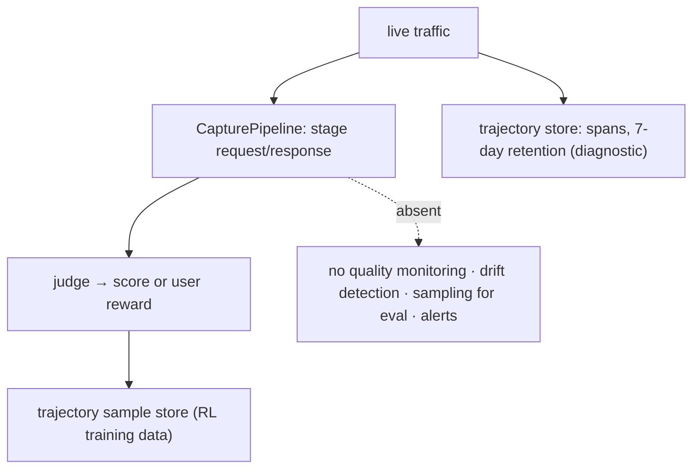
```mermaid
flowchart TD
    LIVE["live traffic"] --> CAP["CapturePipeline: stage request/response"]
    CAP --> JUD["judge → score or user reward"]
    JUD --> STORE["trajectory sample store (RL training data)"]
    LIVE --> TRJ["trajectory store: spans, 7-day retention (diagnostic)"]
    CAP -.->|"absent"| X["no quality monitoring · drift detection · sampling for eval · alerts"]
```

**Anchors:** &bull; `agent-core/openjiuwen/agent_evolving/agent_rl/online/capture_pipeline.py:59` — `CapturePipeline`; `:73` before; `:110` after; `:170` `submit_reward` &bull; `agent-core/openjiuwen/agent_evolving/agent_rl/online/gateway/trajectory/judge_dispatcher.py:30` — flush + judge on follow-up/session end &bull; `agent-core/openjiuwen/agent_evolving/agent_rl/online/judge/judge_scorer.py:28` — live LLM judge score &bull; `jiuwenswarm/jiuwenswarm/observability/store.py:304` — `TrajectoryStore`; `:307` 7-day retention (diagnostic) &bull; `jiuwenswarm/jiuwenswarm/observability/sink.py:578` — `TrajectorySessionSinkRouter`; `jiuwenswarm/jiuwenswarm/observability/runtime.py:69` — runtime &bull; `agent-core/openjiuwen/harness/observability/rail.py:355` — span emission

_Canonical source: `orig/rag-evaluation-interview-questions_for_engineers.md`; also covered in: ai-agent, rag-eval, rag-system._

## 4. Faithfulness vs. relevance in RAG evaluation

**General:** Relevance asks whether retrieved passages are on-topic for the query (context precision/recall). Faithfulness/groundedness asks whether the answer's claims are actually supported by the retrieved context (does it hallucinate beyond the evidence). A system can retrieve relevant context and still be unfaithful, or be faithful to irrelevant context. Measuring faithfulness requires giving the judge the context and checking claim support/citations, not just answer-vs-reference correctness.

**Jiuwen:** There is no retrieval-groundedness, faithfulness, attribution, or context-relevance metric. The closest concepts: symphony's `AccuracyEvaluator` judges factual correctness with a rubric about hallucination but does not receive the retrieved context, so it cannot detect unsupported-but-plausible claims; the reviewer rubric lists a `Correctness` dimension ("no hallucination") at weight 0.3; and the RSI judge accepts arbitrary `rubric`/`required_behaviors`, so a user *could* encode a groundedness rule, but none is defined.

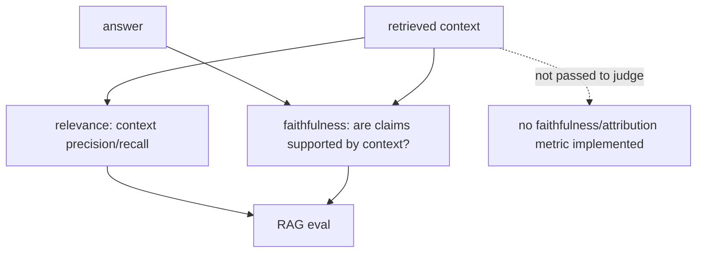
```mermaid
flowchart TD
    CTX["retrieved context"] --> REL["relevance: context precision/recall"]
    ANS["answer"] --> FAITH["faithfulness: are claims supported by context?"]
    CTX --> FAITH
    REL --> JUDGE["RAG eval"]
    FAITH --> JUDGE
    CTX -.->|"not passed to judge"| X["no faithfulness/attribution metric implemented"]
```

**Anchors:** &bull; `agent-core/openjiuwen/symphony/evaluation/evaluators.py:438` — `AccuracyEvaluator` (correctness, no context input); `:560` `Completeness`; `:621` `CapabilitySelection` &bull; `agent-core/openjiuwen/agent_evolving/evaluator/metrics/llm_as_judge.py:58` — parses only `result: true/false`, no context/attribution input &bull; `agent-core/openjiuwen/rsi/harness_rsi/evaluator/judger/scoring.py:68` — generic rubric contract (no built-in faithfulness dimension) &bull; `agent-core/openjiuwen/harness/tools/web/free_search.py:299` — "simple relevance checks" (lexical, not RAG relevance)

**Gap.** Fully absent. No metric receives retrieved passages alongside the answer; no citation extraction or attribution check.

_Canonical source: `orig/ai-engineer-technical-questions_for_engineers.md`; also covered in: engineering, llm-applied, rag-1, genai, rag-eval._

## 5. High eval scores but users still complaining — what does that gap tell you about your eval set

**General:** The gap means the eval set does not represent real usage: too-easy or synthetic queries, no adversarial or long-tail cases, missing slices (language, domain, intent), a metric that rewards style over usefulness, or unmeasured dimensions (latency, verbosity, tone, refusals). The fix is to mine real complaints/failed sessions for queries, add them to the set, and re-baseline — the eval set is a moving target aligned to production.

**Jiuwen:** Feedback capture is partial, so the gap is not detectable in-product. Explicit like/dislike exists only for **proactive recommendations** (`feedback_collector.record_feedback`); for normal chat, feedback is inferred (an LLM classifying whether a user message is corrective, and the online-RL judge consuming the next user turn as feedback). Session tracking records runtime outcome (`succeeded/failed/waiting_user`), which is execution success, not answer quality. There is no general thumbs-up/down or satisfaction signal to reconcile against eval scores.

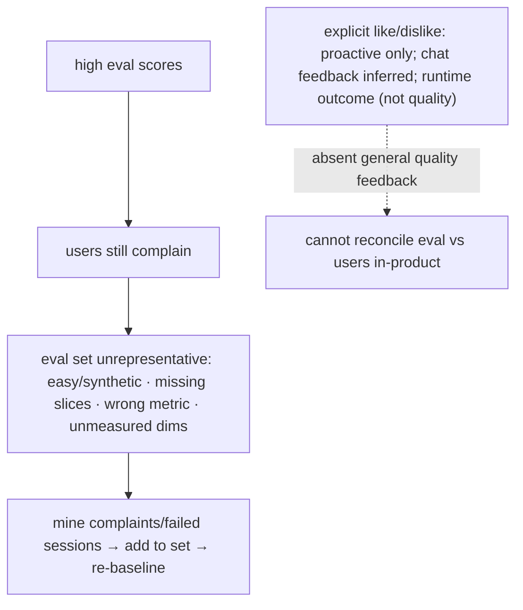
```mermaid
flowchart TD
    HIGH["high eval scores"] --> GAP["users still complain"]
    GAP --> WHY["eval set unrepresentative: easy/synthetic · missing slices · wrong metric · unmeasured dims"]
    WHY --> MINE["mine complaints/failed sessions → add to set → re-baseline"]
    FB["explicit like/dislike: proactive only; chat feedback inferred; runtime outcome (not quality)"] -.->|"absent general quality feedback"| X["cannot reconcile eval vs users in-product"]
```

**Anchors:** &bull; `jiuwenswarm/jiuwenswarm/agents/harness/common/recommendation/feedback_collector.py:47` — `record_feedback` (explicit, proactive only); `jiuwenswarm/jiuwenswarm/common/schema/message.py:141` — `PROACTIVE_FEEDBACK` &bull; `agent-core/openjiuwen/agent_evolving/signal/from_conv.py:327` — `detect_user_intent` infers corrective feedback &bull; `agent-core/openjiuwen/agent_evolving/agent_rl/online/judge/evaluator.py:39` — judge takes `followup_user_feedback`; `agent-core/openjiuwen/agent_evolving/agent_rl/online/gateway/trajectory/judge_dispatcher.py:30` &bull; `jiuwenswarm/jiuwenswarm/server/agent_ws_server.py:544` — `_TurnOutcomeTracker` (runtime outcome) &bull; `agent-core/openjiuwen/agent_evolving/signal/review_feedback.py:117` — `ReviewFeedbackAttributor`

_Canonical source: `orig/rag-evaluation-interview-questions_for_engineers.md`; also covered in: rag-eval._

## 6. How do you detect when your retrieval quality has degraded over time

**General:** Monitor retrieval-specific signals over time — zero-result rate, top-score distributions, click/select rate, and a periodic re-run of a frozen labeled set (Recall@k/NDCG) — and alert on shifts. Slice by query type/tenant/language, since degradation is often localized (a new format, a corpus change, an embedding-model update). Pair it with generation-side faithfulness/relevance tracking so you can tell a retrieval regression from a generation one.

**Jiuwen:** There is no retrieval-quality monitoring and no drift detection. Production observability is span-based: OTel spans with an error flag, a per-session trajectory store, and cost/usage facts — error/latency/trajectory, not quality. Offline evaluation exists (`rsi/evaluator`, `evaluator_pipeline`) but is not an online quality monitor, and there is no frozen retrieval metric to trend.

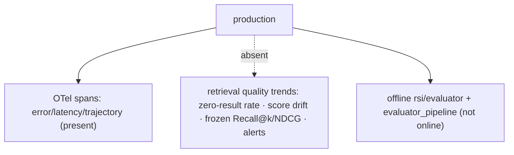
```mermaid
flowchart TD
    P["production"] --> SP["OTel spans: error/latency/trajectory (present)"]
    P -.->|"absent"| Q["retrieval quality trends: zero-result rate · score drift · frozen Recall@k/NDCG · alerts"]
    P --> OFF["offline rsi/evaluator + evaluator_pipeline (not online)"]
```

**Anchors:** &bull; `agent-core/openjiuwen/harness/observability/run_span.py:289` — error status recorded; `agent-core/openjiuwen/harness/observability/setup.py:54` — OTel lifecycle &bull; `jiuwenswarm/jiuwenswarm/observability/store.py:102` — `has_error`; `:137` `trajectory_current_records` &bull; `agent-core/openjiuwen/agent_evolving/evaluator/evaluator_pipeline/pipeline.py:167` — offline `bench.evaluate`; `:668` `_compute_evolution_metrics` &bull; `agent-core/openjiuwen/agent_evolving/trainer/trainer.py:217` — validation-score gate (offline)

---

# Scale and production

_Canonical source: `orig/rag-part1-interview-questions_for_engineers.md`; also covered in: rag-1._

## 7. How do you evaluate an LLM's output beyond "it looks correct"

**General:** Combine automatic metrics (exact match, F1, ROUGE/BLEU where applicable, functional/tests for code), an LLM-as-judge with a rubric for open-ended quality, and human review for a sample. Build a held-out eval set with representative and adversarial cases, score consistently, and track regressions across changes. The judge itself must be validated against human agreement; a single metric rarely captures "quality".

**Jiuwen:** Several independent eval layers exist. `agent_evolving/evaluator/` provides `BaseEvaluator`/`DefaultEvaluator` plus `Metric`s: `ExactMatchMetric` (normalized string match) and `LLMAsJudgeMetric` (model judge returns 0/1 with a template). The RSI subsystem has a rigorous LLM-as-judge contract requiring a structured JSON verdict with per-behavior scores, evidence, weights, and forbidden-behavior penalties. The online RL judge scores single turns as reward with `num_votes` voting. PerStream uses GPT-3.5 as a judge and aggregates accuracy/score/latency/VRAM, and `rsi best_of_n` scores workspaces by test pass counts, diff size, and lint errors. `EvolutionPipeline` runs an agent against a benchmark for N iterations and reports pass rate/convergence.

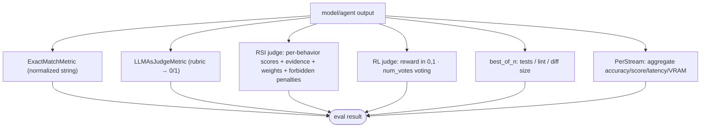
```mermaid
flowchart TD
    OUT["model/agent output"] --> M1["ExactMatchMetric (normalized string)"]
    OUT --> M2["LLMAsJudgeMetric (rubric → 0/1)"]
    OUT --> M3["RSI judge: per-behavior scores + evidence + weights + forbidden penalties"]
    OUT --> M4["RL judge: reward in 0,1 · num_votes voting"]
    OUT --> M5["best_of_n: tests / lint / diff size"]
    OUT --> M6["PerStream: aggregate accuracy/score/latency/VRAM"]
    M1 --> AGG(["eval result"])
    M2 --> AGG
    M3 --> AGG
    M4 --> AGG
    M5 --> AGG
    M6 --> AGG
```

**Anchors:** &bull; `agent-core/openjiuwen/agent_evolving/evaluator/metrics/llm_as_judge.py:17-66` — `LLMAsJudgeMetric`; `agent-core/openjiuwen/agent_evolving/evaluator/metrics/exact_match.py:12-45` — `ExactMatchMetric`; `agent-core/openjiuwen/agent_evolving/evaluator/metrics/__init__.py:7-11` registry &bull; `agent-core/openjiuwen/agent_evolving/evaluator/evaluator.py:1-9` — `DefaultEvaluator` / `MetricEvaluator` &bull; `agent-core/openjiuwen/rsi/harness_rsi/evaluator/judger/scoring.py:57-88` — rubric/required/forbidden contract; `:167-214` weighted scoring + evidence &bull; `agent-core/openjiuwen/agent_evolving/agent_rl/online/judge/judge_scorer.py:28-104` — judge reward, `num_votes` &bull; `agent-core/examples/PerStream/src/eval/score_passive_judge.py:28-124` GPT-3.5 judge; `:247-366` aggregate metrics &bull; `agent-core/openjiuwen/rsi/auto_harness/pipelines/best_of_n/attempt_scorer.py:17-119` — tests/lint/diff scoring &bull; `agent-core/openjiuwen/symphony/evaluation/evaluators.py:1-16` — static/trace evaluators incl. `LLMJudgeEvaluator`

**Gap.** No unified/standard benchmark harness, no statistical-significance testing, and no inter-rater agreement validation for the LLM judge; eval is spread across three subsystems with different contracts.

_Canonical source: `orig/llm-fundamentals-interview-questions_for_engineers.md`; also covered in: engineering, genai, llm-applied, llm-fund, rag-eval, rag-1._

## 8. How do you evaluate when there's no ground truth answer, only a query and a corpus

**General:** Bootstraps without gold labels: (a) generate synthetic queries from known documents and treat the source document as the gold retrieval target (cheap, works well for retrieval metrics); (b) use an LLM to answer and treat cited passages as relevant (RAGAS-style); (c) judge faithfulness against the retrieved context rather than a reference answer; (d) sample and label by hand a small set to calibrate. The key is that retrieval can be graded with synthetic (query, source-doc) pairs even when answers are unlabeled.

**Jiuwen:** Synthetic dataset generation is largely not runnable. The advertised `rsi/dataset_generator` (`DatasetGenerator`, "model-driven synthetic evaluation dataset generation") exists only as compiled bytecode; its `case_generator`/`task_analyzer`/`coverage_validator` sources are stubs raising `NotImplementedError`, and the harness explicitly "never generates a dataset". The one runnable label-free builder is the PerStream example, which generates QA/memory pairs from source datasets using GPT-4o-mini. There is no query-generation loop tied to the core evaluator.

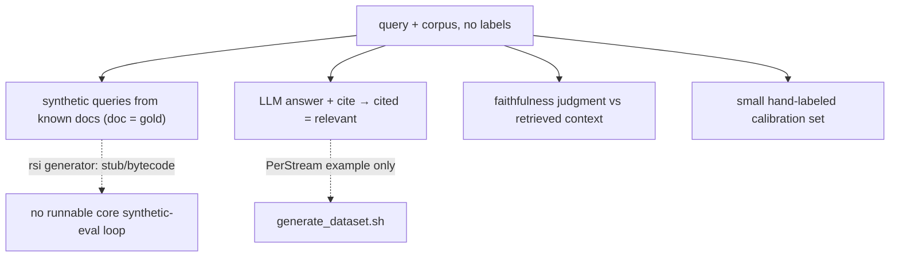
```mermaid
flowchart TD
    CORPUS["query + corpus, no labels"] --> S1["synthetic queries from known docs (doc = gold)"]
    CORPUS --> S2["LLM answer + cite → cited = relevant"]
    CORPUS --> S3["faithfulness judgment vs retrieved context"]
    CORPUS --> S4["small hand-labeled calibration set"]
    S1 -.->|"rsi generator: stub/bytecode"| X["no runnable core synthetic-eval loop"]
    S2 -.->|"PerStream example only"| Y["generate_dataset.sh"]
```

**Anchors:** &bull; `agent-core/openjiuwen/rsi/harness_rsi/single_harness/iterative.py:134` — "never generates a dataset" &bull; `agent-core/examples/PerStream/scripts/generate_dataset.sh:31` — LLM-driven QA/memory generation (example only) &bull; `agent-core/openjiuwen/agent_evolving/evaluator/metrics/llm_as_judge.py:47` — LLM judge usable on unlabeled answers but no context &bull; `agent-core/openjiuwen/rsi/dataset_generator/__pycache__/case_generator.cpython-311.pyc` — `NotImplementedError` stubs (no `.py` source)

---

# Retrieval evaluation

_Canonical source: `orig/rag-evaluation-interview-questions_for_engineers.md`; also covered in: rag-eval._

## 9. How many examples before eval results are statistically meaningful, not just noise

**General:** It depends on the effect size and metric variance. As a rule of thumb, ~100–200 examples give a usable signal for a common metric, but if you are comparing two systems you need enough to detect the delta above noise — report confidence intervals (bootstrap) and use paired significance tests on the same examples. For rare events (e.g. hallucination) you need far more, and minority-slice analysis needs hundreds per slice. Never quote a bare average without an error bound.

**Jiuwen:** There is no statistical reasoning. The closest construct is Symphony's `_confidence(sample_count)`, which buckets counts into qualitative labels (0→NONE, 1→LOW, <10→NORMAL, ≥10→HIGH) — a hard-coded heuristic, not a confidence interval. Aggregation reports `sample_count` and pass/fail counts but computes no standard error, bootstrap, or significance test.

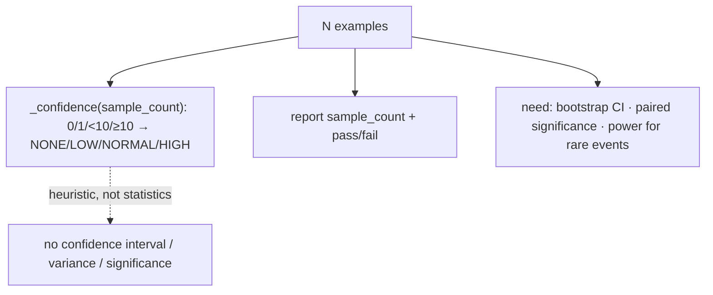
```mermaid
flowchart TD
    N["N examples"] --> C["_confidence(sample_count): 0/1/<10/≥10 → NONE/LOW/NORMAL/HIGH"]
    N --> AGG["report sample_count + pass/fail"]
    N --> NEED["need: bootstrap CI · paired significance · power for rare events"]
    C -.->|"heuristic, not statistics"| X["no confidence interval / variance / significance"]
```

**Anchors:** &bull; `agent-core/openjiuwen/symphony/evaluation/suite.py:560` — `_confidence(sample_count)` heuristic; `:362` `sample_count` attached &bull; `agent-core/openjiuwen/rsi/harness_rsi/evaluator/metrics_collector.py:34` — `total_cases`/`passed_cases`/`average_score` (no variance/CI) &bull; `agent-core/openjiuwen/symphony/orchestration/config.py:50` — `min_successes_verified` (threshold, not statistics) &bull; `agent-core/openjiuwen/symphony/retrieval/build/tree/schema.py:232` — `structure_sample_size` (sampling config)

_Canonical source: `orig/rag-evaluation-interview-questions_for_engineers.md`; also covered in: rag-eval._

## 10. How would you build an eval dataset from scratch if you don't have one yet

**General:** Mine queries from real logs or user questions, then label relevance by (a) synthetic queries generated from known documents (the document is the gold target), (b) LLM answering and treating cited chunks as relevant, or (c) a small hand-labeled calibration set. Start small (50–200 queries), cover query types including exact-match and multi-hop, and iterate. For retrieval you can bootstrap (query, source-doc) pairs with no answer labels at all.

**Jiuwen:** The advertised `rsi/dataset_generator` is not runnable source: `DatasetGenerator` exists only as compiled bytecode, and `case_generator`/`task_analyzer`/`coverage_validator` are stubs raising `NotImplementedError`; the harness "never generates a dataset". The one runnable label-free builder is the PerStream example (`generate_dataset.sh` → GPT-4o-mini QA/memory generation). There is no query-generation loop integrated with the core evaluator.

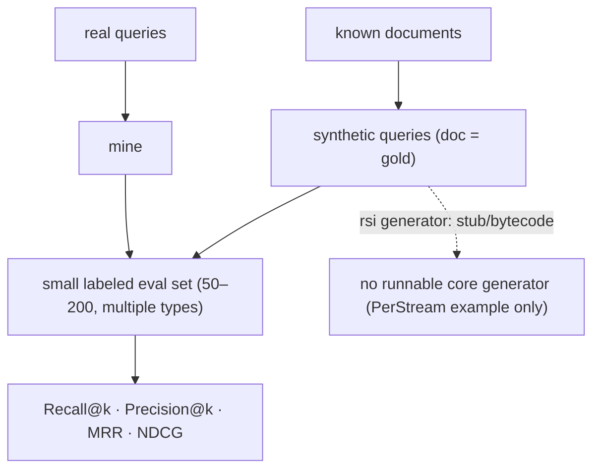
```mermaid
flowchart TD
    LOGS["real queries"] --> MINE["mine"]
    DOCS["known documents"] --> SYN["synthetic queries (doc = gold)"]
    MINE --> SET["small labeled eval set (50–200, multiple types)"]
    SYN --> SET
    SET --> MET["Recall@k · Precision@k · MRR · NDCG"]
    SYN -.->|"rsi generator: stub/bytecode"| X["no runnable core generator (PerStream example only)"]
```

**Anchors:** &bull; `agent-core/openjiuwen/rsi/harness_rsi/single_harness/iterative.py:134` — "never generates a dataset" &bull; `agent-core/examples/PerStream/scripts/generate_dataset.sh:31` — LLM-driven QA/memory generation (example) &bull; `agent-core/openjiuwen/rsi/dataset_generator/__pycache__/case_generator.cpython-311.pyc` — `NotImplementedError` stubs (no source) &bull; `agent-core/openjiuwen/agent_evolving/evaluator/metrics/base.py:42` — metric interface lacks ranked-list eval

_Canonical source: `orig/rag-evaluation-interview-questions_for_engineers.md`; also covered in: rag-eval._

## 11. How would you compare two models for a specific task, not just a general leaderboard score

**General:** Run both models on the same held-out task set with the same prompts/decoding, score with task-appropriate metrics (exact match, tests, rubric judge), and compare accuracy plus latency and cost; check statistical significance and inspect failure cases. A leaderboard is a prior, not a decision — task fit, cost, latency, and controllability often matter more than a few points of general score.

**Jiuwen:** Model selection here is infrastructure routing, not benchmark comparison. `agent_teams/models/pool.py` defines `ModelRouterConfig` (one endpoint, many model names) and `IntelliRouterConfig` (many deployments behind a reliable client router), with allocator strategies chosen by `build_model_allocator`. IntelliRouter routes by adaptive multi-factor scoring (health, tokens, RPM, latency) and fails over — it does **not** choose by task accuracy. For comparing configs/attempts there is real per-task evaluation: `Trainer` evaluates each candidate on a validation set and keeps the highest score; `rsi best_of_n` ranks attempts by tests/diff/lint; the online judge uses `num_votes` voting. Comparing two models for a task therefore means running your own eval, not a leaderboard feature.

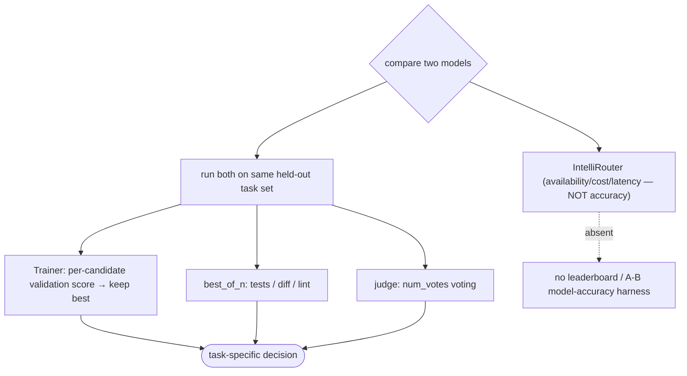
```mermaid
flowchart TD
    CMP{"compare two models"} --> ROUTE["IntelliRouter (availability/cost/latency — NOT accuracy)"]
    CMP --> EVAL["run both on same held-out task set"]
    EVAL --> TR["Trainer: per-candidate validation score → keep best"]
    EVAL --> BON["best_of_n: tests / diff / lint"]
    EVAL --> JUDGE["judge: num_votes voting"]
    TR --> DEC(["task-specific decision"])
    BON --> DEC
    JUDGE --> DEC
    ROUTE -.->|"absent"| X["no leaderboard / A-B model-accuracy harness"]
```

**Anchors:** &bull; `agent-core/openjiuwen/agent_teams/models/pool.py:133-235` — `ModelRouterConfig`; `:314-392` — `IntelliRouterConfig` / deployments &bull; `agent-core/openjiuwen/agent_teams/models/allocator.py:176/240/357/452/559` — allocator strategies + `build_model_allocator` &bull; `agent-core/examples/intelli_router/intelliRouter_demo.py:142-160` — adaptive routing weights; `:249-264` route within a pinned model pool &bull; `agent-core/openjiuwen/agent_evolving/trainer/trainer.py:241-272` — per-candidate validation scoring, commits best &bull; `agent-core/openjiuwen/rsi/auto_harness/pipelines/best_of_n/attempt_scorer.py:17-119` — rank by tests/lint/diff &bull; `agent-core/openjiuwen/agent_evolving/agent_rl/online/judge/judge_scorer.py:38/58` — `num_votes` judge voting

**Gap.** No leaderboard, no A/B model-comparison harness, no per-task model-accuracy registry. Routing optimizes availability/cost/latency, not task quality.

_Canonical source: `orig/llm-fundamentals-interview-questions_for_engineers.md`; also covered in: llm-fund._

## 12. Known limitations of using an LLM as a judge

**General:** LLM judges are biased (position/order, verbosity, self-preference), noisy, non-deterministic, and can be gamed or prompt-injected. They need position-swapping, multiple votes, agreement reporting, human calibration on a golden set, and must distinguish "judge failed" from "answer wrong". A single unvalidated judge score is a weak signal.

**Jiuwen:** Four judge implementations exist. `agent_evolving`'s `LLMAsJudgeMetric` is a single call, parses to `true/false`, and converts exceptions to `0.0` (conflating "judge failed" with "answer wrong"). RSI's judge does one format retry on frozen evidence and guards against injecting "prior output" as trusted data, but is still single-judgment. Symphony's `LLMJudgeEvaluator` is `temperature=0.0` with one repair retry. Only the online RL `JudgeScorer` uses `num_votes` parallel votes averaged together. None handles position bias or reports agreement.

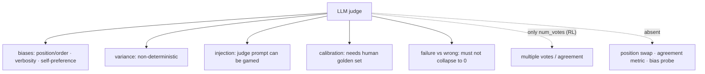
```mermaid
flowchart TD
    J["LLM judge"] --> B["biases: position/order · verbosity · self-preference"]
    J --> V["variance: non-deterministic"]
    J --> I["injection: judge prompt can be gamed"]
    J --> C["calibration: needs human golden set"]
    J --> F["failure vs wrong: must not collapse to 0"]
    J -.->|"only num_votes (RL)"| MULTI["multiple votes / agreement"]
    J -.->|"absent"| SWAP["position swap · agreement metric · bias probe"]
```

**Anchors:** &bull; `agent-core/openjiuwen/agent_evolving/evaluator/metrics/llm_as_judge.py:53` — single invoke, exception → `0.0`; `agent-core/openjiuwen/agent_evolving/evaluator/evaluator.py:123` — same failure pattern &bull; `agent-core/openjiuwen/rsi/harness_rsi/evaluator/judger/llm_as_judge.py:121` — two-attempt loop; `:152` untrusted prior-output guard &bull; `agent-core/openjiuwen/symphony/evaluation/base.py:262` — single judge call + one repair retry; `:401` `temperature=0.0` &bull; `agent-core/openjiuwen/agent_evolving/agent_rl/online/judge/evaluator.py:66` — `num_votes` averaged; `:92` raw votes retained &bull; `agent-core/openjiuwen/agent_evolving/agent_rl/online/judge/judge_scorer.py:38` — `num_votes` &bull; `agent-core/openjiuwen/rsi/harness_rsi/evaluator/judger/scoring.py:127` — strict single-verdict parsing

**Gap.** No position/order-bias control, no inter-rater agreement (Cohen/Krippendorff), no variance threshold, and no human calibration. Most paths convert judge/infra failure to `0.0`.

---

# System design and scale

_Canonical source: `orig/ai-engineer-technical-questions_for_engineers.md`; also covered in: engineering, genai, rag-eval._

## 13. Measuring hallucination rate: claim extraction from the output, then verification against retrieved context

**General:** Extract atomic claims from the answer, then verify each against the retrieved context (LLM-judge or NLI). Hallucination rate = unsupported claims / total claims (or fraction of answers with any unsupported claim). This is stricter than "is the answer correct": it catches answers that are plausible but not grounded, and it requires passing the retrieved context to the checker.

**Jiuwen:** Claim extraction and verification are **absent**. There is no atomic-claim decomposition, NLI/entailment model, or groundedness/attribution scorer. The closest is the RSI judge, which is instructed to cite concrete evidence and not invent observations, but grades supplied rubric behaviors rather than extracted claims; Symphony's `AccuracyEvaluator` asks an LLM to find factual errors but produces a single score with no claim-level decomposition.

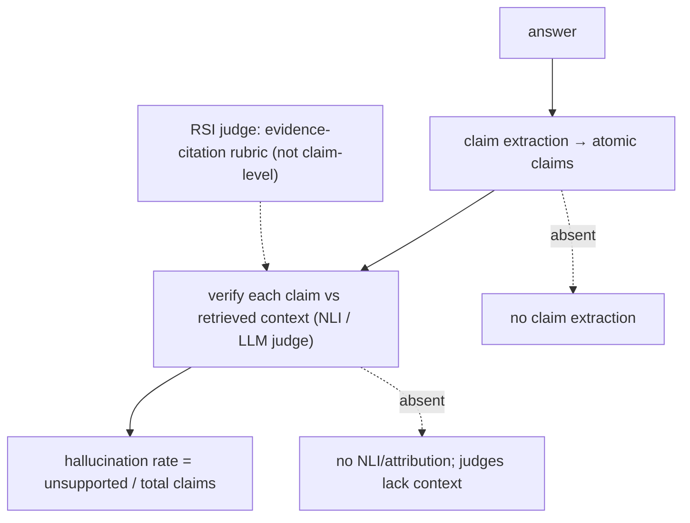
```mermaid
flowchart TD
    ANS["answer"] --> CE["claim extraction → atomic claims"]
    CE --> V["verify each claim vs retrieved context (NLI / LLM judge)"]
    V --> HR["hallucination rate = unsupported / total claims"]
    CE -.->|"absent"| X["no claim extraction"]
    V -.->|"absent"| Y["no NLI/attribution; judges lack context"]
    RSI["RSI judge: evidence-citation rubric (not claim-level)"] -.-> V
```

**Anchors:** &bull; `agent-core/openjiuwen/rsi/harness_rsi/evaluator/judger/judge_prompt.md:61` — "Cite concrete evidence for every verdict… Do not invent observations" &bull; `agent-core/openjiuwen/rsi/harness_rsi/evaluator/judger/judge_evidence.py:90` — `prepare_judge_workspace` (evidence snapshot, no claim checker) &bull; `agent-core/openjiuwen/symphony/evaluation/evaluators.py:438` — `AccuracyEvaluator`; `:447` factual-error rubric &bull; `agent-core/openjiuwen/agent_evolving/evaluator/templates.py:7` — judge compares response vs expected answer (no context)

_Canonical source: `orig/rag-evaluation-interview-questions_for_engineers.md`; also covered in: rag-eval._

## 14. MRR, and when it matters more than Recall@k

**General:** MRR is the mean of `1/rank` of the first relevant result. It matters when the user/system mostly needs the single best hit and the position of the first correct answer is what counts (FAQ lookup, "open the right doc", navigation). Recall@k matters when a set of results is consumed together (context stuffing). MRR ignores everything after the first relevant hit, so it is blind to recall.

**Jiuwen:** MRR is not implemented anywhere; there is no reciprocal-rank or first-relevant-rank helper. The retrieval stack uses Reciprocal **Rank Fusion** (`rrf_fusion`, `1/(k+rank)`) and weighted RRF in the graph store — rank-fusion algorithms, not an evaluation metric. The product's `bm25_rank_to_score` converts an FTS5 rank to a similarity score, also not MRR.

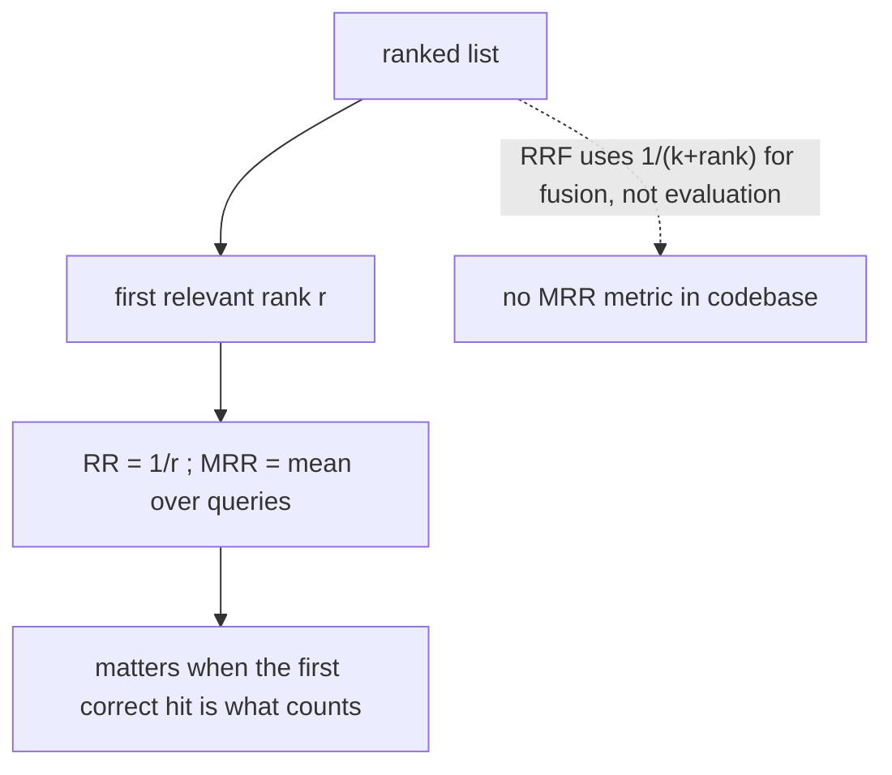
```mermaid
flowchart TD
    R["ranked list"] --> F["first relevant rank r"]
    F --> M["RR = 1/r ; MRR = mean over queries"]
    M --> USE["matters when the first correct hit is what counts"]
    R -.->|"RRF uses 1/(k+rank) for fusion, not evaluation"| X["no MRR metric in codebase"]
```

**Anchors:** &bull; `agent-core/openjiuwen/core/retrieval/utils/fusion.py:15` — `rrf_fusion` (rank fusion, not MRR) &bull; `agent-core/openjiuwen/core/foundation/store/graph/result_ranking.py:85` — `RRFRankConfig` (k=40 fusion config); `:61` `WeightedRankConfig` &bull; `jiuwenswarm/jiuwenswarm/agents/harness/common/memory/internal.py:165` — `bm25_rank_to_score` (rank→score) &bull; `agent-core/openjiuwen/core/foundation/store/index/simple_memory_index.py:348` — sorts by score only

_Canonical source: `orig/rag-retrieval-interview-questions_for_engineers.md`; also covered in: rag-eval, rag-retrieval._

## 15. NDCG: weights relevant results by position against an ideal ranking — why position matters beyond "was it retrieved"

**General:** NDCG discounts each relevant result by `log2(rank+1)` and normalizes by the ideal (best-possible) ordering, so it rewards putting the most relevant documents at the top and supports graded relevance (not just binary). It matters when ranking quality — not just presence — drives the user experience, and is the standard metric for reranker comparisons. Recall@k treats all positions within k equally; NDCG does not.

**Jiuwen:** NDCG is **absent** — no discounted cumulative gain, no gain/discount term, and no graded relevance anywhere. Ranking code produces cross-encoder scores and RRF fusion scores used to sort, but never evaluates an ordering against relevance grades.

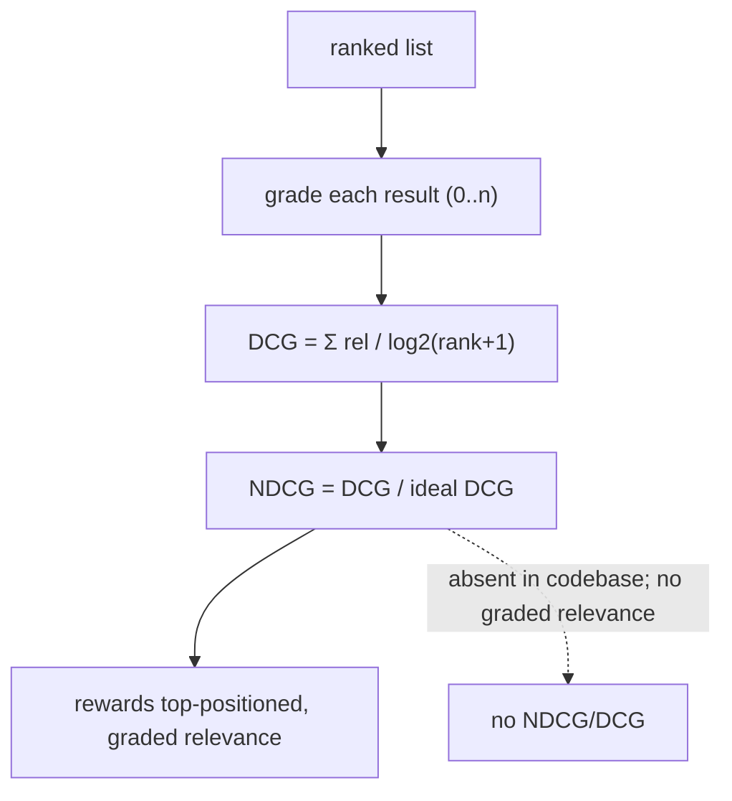
```mermaid
flowchart TD
    R["ranked list"] --> G["grade each result (0..n)"]
    G --> D["DCG = Σ rel / log2(rank+1)"]
    D --> N["NDCG = DCG / ideal DCG"]
    N --> USE["rewards top-positioned, graded relevance"]
    N -.->|"absent in codebase; no graded relevance"| X["no NDCG/DCG"]
```

**Anchors:** &bull; `agent-core/openjiuwen/core/foundation/store/graph/milvus/milvus_support.py:87` — cross-encoder re-rank produces scores, no DCG &bull; `agent-core/openjiuwen/core/foundation/store/graph/result_ranking.py:85` — RRF/WeightedRank configs; no gain/discount &bull; `agent-core/openjiuwen/core/retrieval/utils/fusion.py:20` — RRF only &bull; `agent-core/openjiuwen/agent_evolving/evaluator/metrics/__init__.py:11` — only three metrics exported

_Canonical source: `orig/rag-evaluation-interview-questions_for_engineers.md`; also covered in: rag-eval._

## 16. Precision@k = relevant docs in top k / k — how it differs from Recall@k, and why both can be low even when the pipeline "looks" fine

**General:** Precision@k is the fraction of the top-k that are relevant; recall@k is the fraction of all relevant docs that were retrieved. They trade off: raising k raises recall but usually lowers precision. Both can be low if the embedding/chunking is wrong (nothing relevant ranked) or if the corpus lacks the answer. "Looks fine" is exactly why you need numbers — a plausible top-3 can still be mostly irrelevant.

**Jiuwen:** Precision@k is **absent**. The only precision present is classification/answer precision: PerStream's "TV (Precision)" = TP/(TP+FP) (how many predicted proactive moments were correct) and sklearn `precision_score` in a gate test. The retrieval stack returns an ordered candidate list and a cross-encoder can re-sort it, but never compares the ordering to graded relevance.

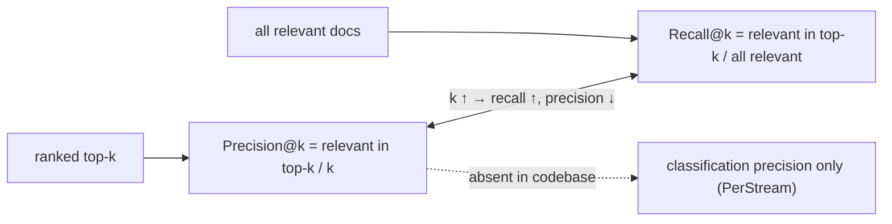
```mermaid
flowchart LR
    R["ranked top-k"] --> P["Precision@k = relevant in top-k / k"]
    G["all relevant docs"] --> RC["Recall@k = relevant in top-k / all relevant"]
    P <-->|"k ↑ → recall ↑, precision ↓"| RC
    P -.->|"absent in codebase"| X["classification precision only (PerStream)"]
```

**Anchors:** &bull; `agent-core/examples/PerStream/src/eval/score_proactive_judge.py:362` — `get_tv_precision()` = `tp / total_pred_not_nil` &bull; `agent-core/examples/PerStream/src/eval/eval_proactive_reduction.py:188` — `tv_precision` &bull; `agent-core/examples/PerStream/src/eval/test_remember_gate.py:22` — sklearn `precision_score` &bull; `agent-core/openjiuwen/core/foundation/store/graph/milvus/milvus_support.py:87` — `rerank(...)` re-sorts, no precision measurement &bull; `agent-core/openjiuwen/agent_evolving/evaluator/metrics/base.py:60` — `compute_batch` zips predictions/labels, no relevance-per-rank

_Canonical source: `orig/rag-evaluation-interview-questions_for_engineers.md`; also covered in: rag-eval, rag-1, rag-retrieval._

## 17. Recall@k, and what a low score tells you about your retrieval setup

**General:** Recall@k is the fraction of queries whose relevant document appears in the top-k. A low score means retrieval (not generation) is the failure: relevant content is missing from the candidate set, so no reranker or prompt can recover it. Diagnose by checking chunking (answer split/lost), embedding fit, whether the query and index use the same model, and whether exact-match terms need a sparse leg.

**Jiuwen:** There is no `Recall@k` implementation. The only recall-looking code is a **classification** evaluator for the proactive-memory gate in `examples/PerStream/src/eval/` ("TA (Recall)" = TP/(TP+FN) over proactive-memory moments), which is not ranking retrieval against gold documents. `recall_compressed_context` is named "recall" but is a BM25 lookup returning chunks, not a metric. Nothing computes retrieved-vs-relevant overlap at rank k.

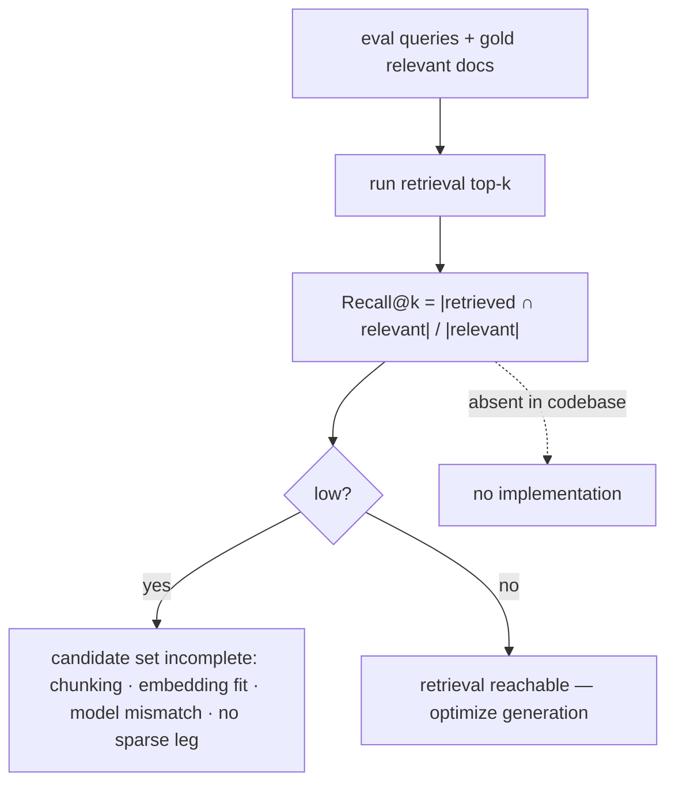
```mermaid
flowchart TD
    Q["eval queries + gold relevant docs"] --> R["run retrieval top-k"]
    R --> M["Recall@k = |retrieved ∩ relevant| / |relevant|"]
    M --> LOW{"low?"}
    LOW -->|yes| DIAG["candidate set incomplete: chunking · embedding fit · model mismatch · no sparse leg"]
    LOW -->|no| OK["retrieval reachable — optimize generation"]
    M -.->|"absent in codebase"| X["no implementation"]
```

**Anchors:** &bull; `agent-core/examples/PerStream/src/eval/score_proactive_judge.py:355` — `get_ta_recall` = TP/(TP+FN) (classification, not retrieval@k) &bull; `agent-core/examples/PerStream/src/eval/test_remember_gate.py:180` — sklearn `recall_score` (gate classifier) &bull; `agent-core/examples/PerStream/src/eval/eval_proactive_reduction.py:92` — LLM-judged memory metrics &bull; `agent-core/openjiuwen/core/context_engine/processor/forked/compressor/recall/retriever.py:27` — `recall_compressed_context` (name only)

**Gap.** Recall@k is absent. The closest thing is the PerStream proactive-memory classification recall, a different task.

_Canonical source: `orig/rag-retrieval-interview-questions_for_engineers.md`; also covered in: rag-eval, rag-retrieval._

## 18. Tying an eval metric back to a business outcome a stakeholder actually cares about

**General:** Translate model quality into the business proxy it moves: task success rate, deflection/containment, time-to-resolution, conversion, retention, or cost-per-resolution. Build a labeled bridge — correlate your offline metric with the business KPI on a sample — and report both. A metric no stakeholder can act on will not survive budget season; pick one that maps to money or time saved.

**Jiuwen:** Metrics here are engineering/task-completion, not business KPIs. `GoalEvaluator` scores whether an agent objective is `complete`/`blocked`; `SuccessDetector` maps a task to `success/partial/fail`; `evaluator_pipeline`/team verification aggregate `pass_rate`/`avg_score`. The only stakeholder-adjacent signal is **cost**: per-session tracking with an optional limit (`CostLimitExceededError`). There is no conversion, retention, engagement, or user-satisfaction mapping.

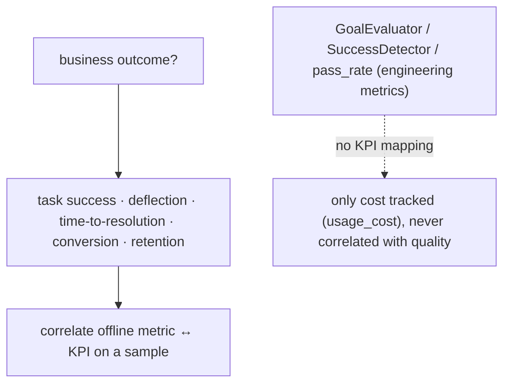
```mermaid
flowchart TD
    Q["business outcome?"] --> KPI["task success · deflection · time-to-resolution · conversion · retention"]
    KPI --> BRIDGE["correlate offline metric ↔ KPI on a sample"]
    EVAL["GoalEvaluator / SuccessDetector / pass_rate (engineering metrics)"] -.->|"no KPI mapping"| X["only cost tracked (usage_cost), never correlated with quality"]
```

**Anchors:** &bull; `agent-core/openjiuwen/harness/goal/evaluation.py:74` — `GoalEvaluator` (goal completion) &bull; `agent-core/openjiuwen/agent_evolving/ttse/success.py:267` — `SignalBasedSuccessDetector` (`success/partial/fail`); `:92` `classify_explicit_score` &bull; `agent-core/openjiuwen/agent_evolving/evaluator/evaluator_pipeline/base.py:232` — `aggregate()` &bull; `agent-core/openjiuwen/agent_teams/verification/memory.py:160` — aggregates `pass_rate`/`avg_score` &bull; `jiuwenswarm/jiuwenswarm/server/runtime/usage_cost.py:32` — cost settings; `:65` `CostLimitExceededError`

_Canonical source: `orig/rag-evaluation-interview-questions_for_engineers.md`; also covered in: rag-eval._

## 19. What is perplexity, and what does a lower score actually tell you

**General:** Perplexity is the exponentiated average negative log-likelihood the model assigns to a token sequence: `exp(-(1/N)·Σ log p(token_i))`. Lower means the model finds the text more predictable — useful for comparing language models on the same data or detecting distribution shift/overfitting. It does not measure factuality, reasoning, instruction-following, or usefulness, and it is only comparable across models that share a tokenizer and data.

**Jiuwen:** Perplexity is absent as a concept or metric — no `perplexity`/`ppl`/loss-based language-modeling metric is computed anywhere. The nearest primitives are token log-probabilities and a softmax over candidate logits: candidate logits are normalized to probabilities for retrieval selection, per-completion `cumulative_logprob` is captured (used for generation summaries/RL) but not converted to perplexity, and `ChatReranker` exponentiates token logprobs for a yes/no rerank score. The only literal "perplexity" strings are the Perplexity web-search vendor, not the metric.

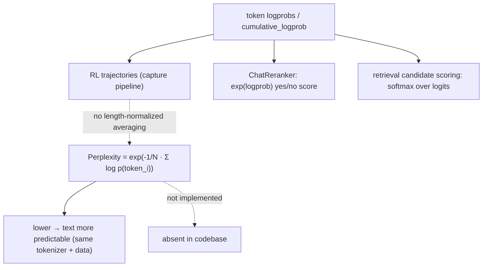
```mermaid
flowchart TD
    PPL["Perplexity = exp(-1/N · Σ log p(token_i))"] --> LOWER["lower → text more predictable (same tokenizer + data)"]
    PPL -.->|"not implemented"| X["absent in codebase"]
    LP["token logprobs / cumulative_logprob"] --> USE1["RL trajectories (capture pipeline)"]
    LP --> USE2["ChatReranker: exp(logprob) yes/no score"]
    LP --> USE3["retrieval candidate scoring: softmax over logits"]
    USE1 -.->|"no length-normalized averaging"| PPL
```

**Anchors:** &bull; `agent-core/openjiuwen/symphony/retrieval/llm/base/scoring.py:98-115` — softmax over candidate logits → probability (retrieval) &bull; `agent-core/openjiuwen/symphony/retrieval/llm/vllm/client.py:847` — `cumulative_logprob` per completion (not perplexity) &bull; `agent-core/openjiuwen/core/retrieval/reranker/chat_reranker.py:94-107` — `exp(logprob)` yes/no &bull; `agent-core/openjiuwen/agent_evolving/agent_rl/online/capture_pipeline.py:408-418` — stores token logprobs for RL &bull; `agent-core/openjiuwen/harness/tools/web/paid_search.py:44` — "Perplexity" is the search vendor, not the metric

**Gap.** No token-loss averaging, no length normalization, no corpus-level perplexity.

_Canonical source: `orig/llm-fundamentals-interview-questions_for_engineers.md`; also covered in: llm-fund._

## 20. Why evaluate retrieval and generation as two separate stages instead of one end-to-end score

**General:** An end-to-end score tells you "the answer was wrong" but not why. If retrieval missed the document, no generator can fix it; if the document was retrieved but the answer is wrong, the generator (or grounding) is at fault. Stage-level metrics — Recall@k / precision@k / NDCG for retrieval, faithfulness / correctness for generation — let you attribute the failure and fix the right component. End-to-end stays as the final acceptance check.

**Jiuwen:** The stages are structurally separate but also separately un-instrumented. Retrieval (`core/retrieval`) has no quality metric of any kind (no Recall@k/Precision@k/MRR/NDCG). Generation has answer-level judges that do not receive the retrieved context. So the codebase can produce end-to-end grader scores (`evaluator_pipeline` `pass_rate`, RSI weighted score) but cannot say whether a failure was retrieval or generation.

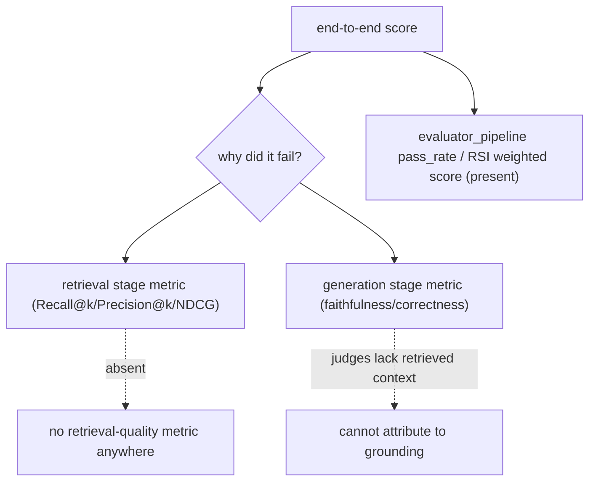
```mermaid
flowchart TD
    E2E["end-to-end score"] --> Q{"why did it fail?"}
    Q --> R["retrieval stage metric (Recall@k/Precision@k/NDCG)"]
    Q --> G["generation stage metric (faithfulness/correctness)"]
    R -.->|"absent"| X["no retrieval-quality metric anywhere"]
    G -.->|"judges lack retrieved context"| Y["cannot attribute to grounding"]
    E2E --> AGG["evaluator_pipeline pass_rate / RSI weighted score (present)"]
```

**Anchors:** &bull; `agent-core/openjiuwen/agent_evolving/evaluator/metrics/base.py:42` — `Metric.compute(prediction, label)`, no ranked-list/k signature &bull; `agent-core/openjiuwen/agent_evolving/evaluator/metrics/__init__.py:11` — exports only `Metric`, `ExactMatchMetric`, `LLMAsJudgeMetric` &bull; `agent-core/openjiuwen/agent_evolving/evaluator/metrics/llm_as_judge.py:47` — judge gets question/expected/answer, not retrieved context &bull; `agent-core/openjiuwen/agent_evolving/evaluator/evaluator_pipeline/pipeline.py:314` — end-to-end `pass_rate` &bull; `agent-core/openjiuwen/rsi/harness_rsi/evaluator/judger/scoring.py:193` — end-to-end weighted score

_Canonical source: `orig/rag-evaluation-interview-questions_for_engineers.md`; also covered in: rag-eval._

## 21. Why exact-match scoring fails when a correct answer can be phrased multiple valid ways

**General:** Exact match requires the output string to equal the reference, so "Paris" vs "The capital is Paris" both fail even when correct. It is brittle to wording, formatting, articles, and ordering. Use it only for tasks with a canonical form (classification labels, IDs, single tokens); otherwise use semantic/normalized metrics (LLM judge, embedding similarity, or task-specific parsers).

**Jiuwen:** Two exact-match implementations exist. `ExactMatchMetric` normalizes lowercase/strip/whitespace but still requires full-string equality; RSI's `ExactMatchJudger` is strict `==` with no normalization. The LLM judges cover paraphrase — the `LLMAsJudgeMetric` prompt judges semantic consistency, and PerStream's GPT judge explicitly accepts synonyms/paraphrases — but they are non-deterministic and uncalibrated, and there is no deterministic paraphrase-robust metric (e.g. normalized/embedding similarity).

```mermaid
flowchart TD
    ANS["answer"] --> EM{"exact match?"}
    EM -->|"normalized == (ExactMatchMetric)"| OK["pass only on identical form"]
    EM -->|"strict == (RSI)"| OK
    ANS --> LLM["LLM semantic judge (accepts paraphrase)"]
    LLM --> N["non-deterministic, uncalibrated"]
    ANS -.->|"absent"| X["deterministic paraphrase-robust metric"]
```

**Anchors:** &bull; `agent-core/openjiuwen/agent_evolving/evaluator/metrics/exact_match.py:36` — normalized equality; `:40` `_normalize` (lower/strip/collapse) &bull; `agent-core/openjiuwen/rsi/harness_rsi/evaluator/judger/exact_match.py:50` — strict `== expected`; `:30` rejects rubric/files &bull; `agent-core/openjiuwen/agent_evolving/evaluator/metrics/llm_as_judge.py:4` — semantic consistency judge &bull; `agent-core/openjiuwen/symphony/evaluation/evaluators.py:520` — exact-match shortcut then LLM fallback &bull; `agent-core/examples/PerStream/src/eval/score_passive_judge.py:57` — "Consider synonyms or paraphrases as valid matches"

_Canonical source: `orig/rag-evaluation-interview-questions_for_engineers.md`; also covered in: rag-eval._
