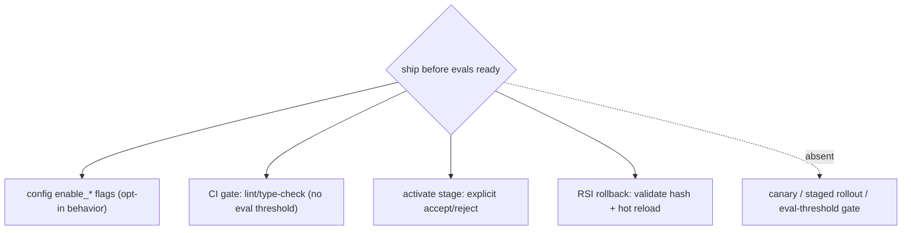
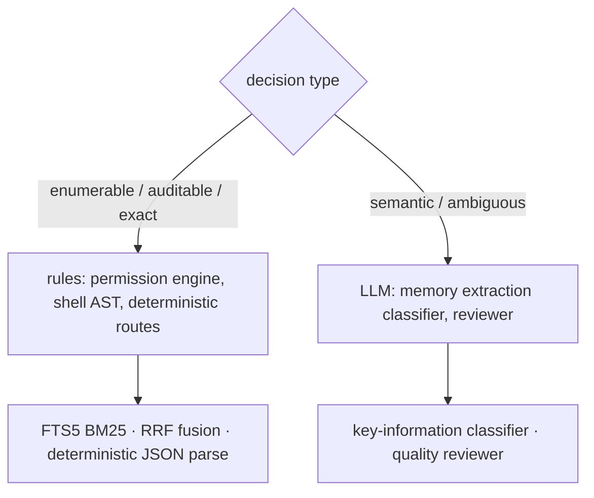
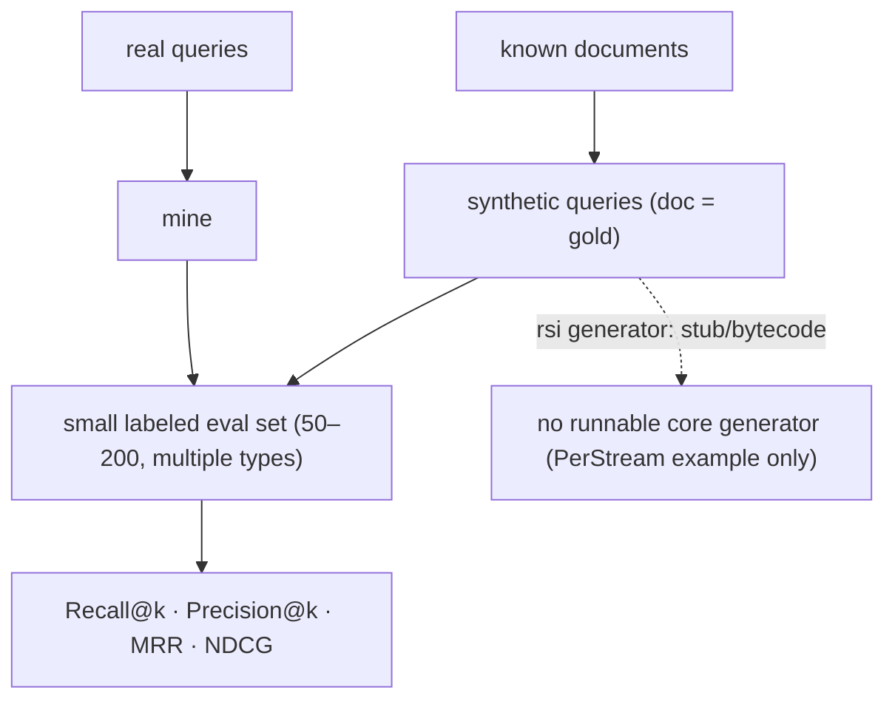
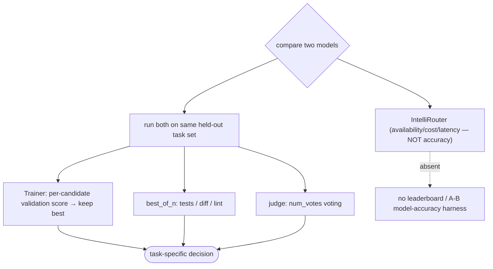
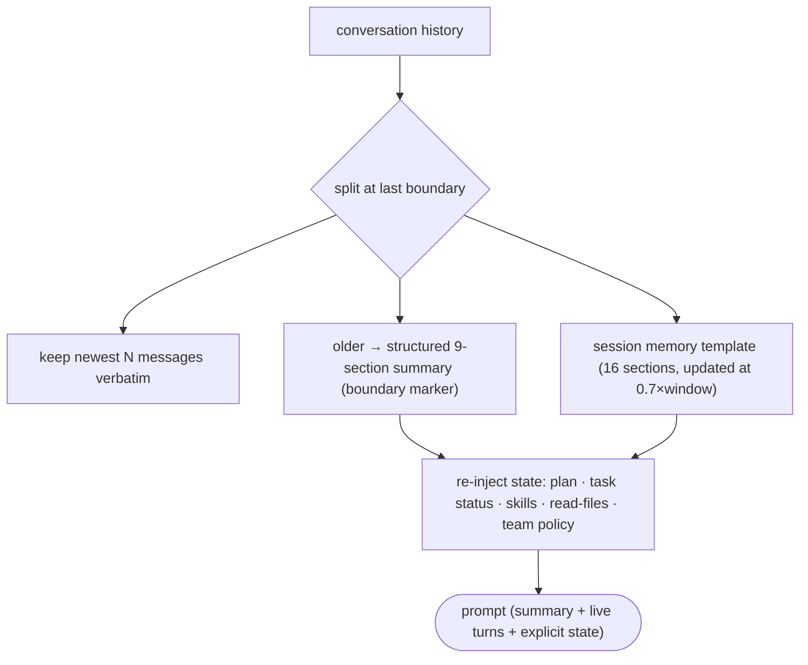
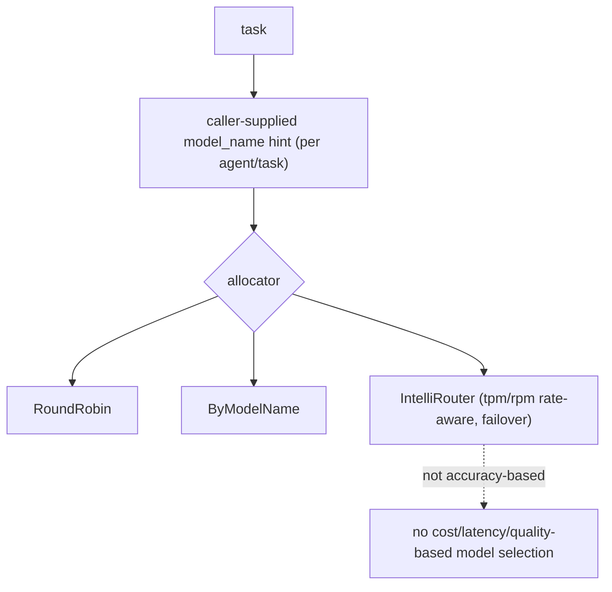
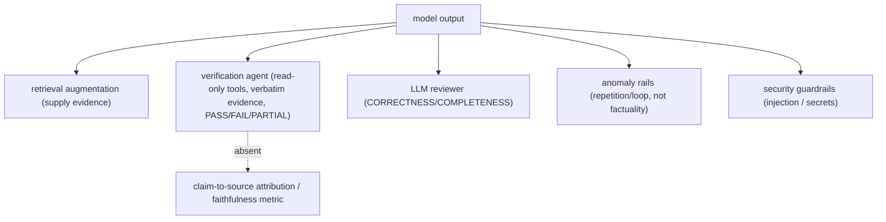
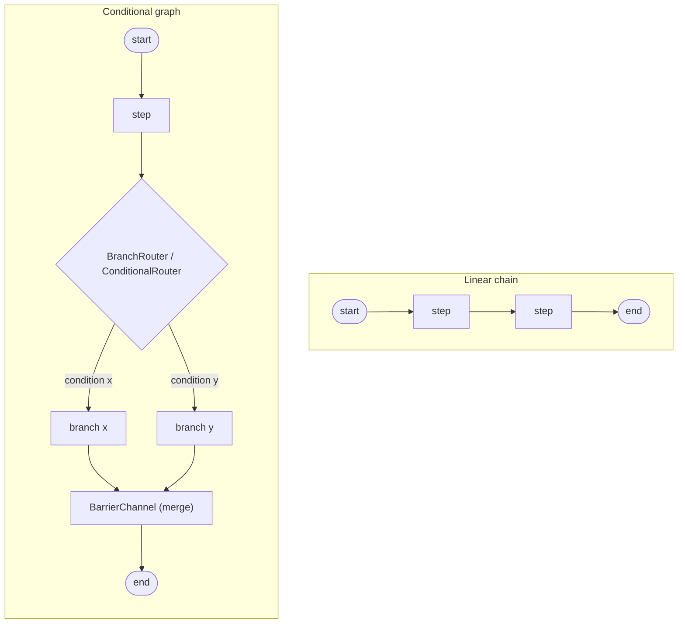
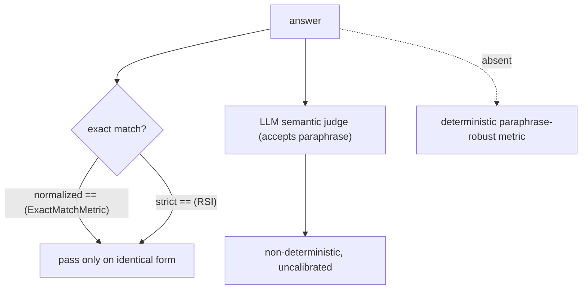

# General engineering

9 unique questions, deduplicated from the archived docs. Each `##` is one question; identical questions from other docs were merged. Full source files are in `orig/`.

## 1. A stakeholder wants to ship before your eval scores are ready, how do you handle it

**General:** This is mostly process. De-risk instead of refusing: ship behind a flag or to a small canary, define a rollback path, cap the blast radius, agree on a minimal offline eval before broad rollout, and add monitoring so a quality drop is caught quickly. Make the tradeoff explicit (what's unmeasured, what the fallback is) and put a date on the missing eval.

**Jiuwen:** The closest code mechanisms are CI gates and explicit human activation, not an eval-score gate. The auto-harness `CIGateRunner` loads gates from `ci_gate.yaml` and returns pass/fail; the activate stage requires an explicit user `accept`/`reject` before an extension is hot-loaded; and the product's RSI harness activation supports rollback (refuses while tasks are active, validates the target hash, hot-loads the old version). Behavior gating is done with `enable_*` config flags. There is no release gate tied to eval thresholds and no canary/percentage rollout.

**Anchors:** &bull; `agent-core/openjiuwen/auto_harness/infra/ci_gate_runner.py:168` load gates; `:1064` run + aggregate `passed` &bull; `agent-core/openjiuwen/auto_harness/stages/activate.py:99` — explicit `accept`/`reject` interaction before hot-load &bull; `agent-core/openjiuwen/auto_harness/stages/merge.py:91` — static-check retry (max 3) then fail-fast &bull; `jiuwenswarm/jiuwenswarm/agents/harness/common/rsi/harness_activation.py:617` `rollback`; `:682` `_assert_rollback_allowed`; `:694` validate target hash &bull; `agent-core/openjiuwen/harness/schema/deep_agent_spec.py:448` — `enable_*` config flags

**Gap.** No eval-threshold release gate and no canary/percentage rollout; the decision is human process, supported only by feature flags, explicit activation, CI checks, and manual rollback.

_Canonical source: `orig/ai-engineer-technical-questions_for_engineers.md`; also covered in: engineering._

## 2. Deciding when a problem actually needs an LLM versus a simpler rule-based system

**General:** Use a rule-based/deterministic system when the logic is enumerable, must be auditable, or needs exact reproducibility (validation, routing by known patterns, permission checks, arithmetic, parsing). Use an LLM when the task is semantic, open-ended, or handles ambiguity that rules cannot enumerate (summarization, intent, extraction from messy text). Rules for control, LLM for meaning; often both.

**Jiuwen:** The codebase deliberately routes many decisions through deterministic code. The permission engine is a pure rule/AST engine — its docstring notes the model is not used on the permission path — evaluating tiered regex rules and a tree-sitter shell AST before falling back to ASK. The product's auto-permission layer has deterministic routes that hard-block/ask by URL scheme, egress fields, and capability side-effects before any reviewer is consulted. Lexical/deterministic retrieval coexists with vector paths (SQLite FTS5 BM25, RRF rank fusion), and structured JSON is extracted with deterministic parsers. Conversely, memory extraction uses an LLM key-information classifier because judging "is this worth remembering" is semantic.

**Anchors:** &bull; `agent-core/openjiuwen/harness/security/permission_engine/core.py:192` — docstring: LLM not used on the permission path &bull; `agent-core/openjiuwen/harness/security/permission_engine/toolguard/tool_policy.py:588` — rule-based tiered policy; `agent-core/openjiuwen/harness/security/permission_engine/toolguard/shell_ast.py:82` — deterministic parse &bull; `jiuwenswarm/jiuwenswarm/agents/harness/common/rails/permissions/auto_decision.py:73` `deterministic_guard_route`; `:116` `deterministic_domain_route` &bull; `jiuwenswarm/jiuwenswarm/agents/harness/common/memory/internal.py:165` `bm25_rank_to_score`; `jiuwenswarm/jiuwenswarm/agents/harness/common/memory/manager.py:1044` FTS BM25 &bull; `agent-core/openjiuwen/core/retrieval/utils/fusion.py:15` `rrf_fusion`; `agent-core/openjiuwen/core/foundation/store/index/simple_memory_index.py:348` sort by score &bull; `agent-core/openjiuwen/core/context_engine/context/message_buffer.py:74` — deterministic drop beyond 2× &bull; `agent-core/openjiuwen/rsi/harness_rsi/auto_harness/infra/parsers.py:339` — deterministic JSON extraction &bull; `agent-core/openjiuwen/core/memory/process/extract/memory_analyzer.py:26` — LLM classifier (semantic)

**Gap.** The boundary is principled but implicit — no single "classifier vs LLM" decision function or policy table exists; each subsystem chooses independently.

_Canonical source: `orig/ai-engineer-technical-questions_for_engineers.md`; also covered in: engineering._

## 3. How would you build an eval dataset from scratch if you don't have one yet

**General:** Mine queries from real logs or user questions, then label relevance by (a) synthetic queries generated from known documents (the document is the gold target), (b) LLM answering and treating cited chunks as relevant, or (c) a small hand-labeled calibration set. Start small (50–200 queries), cover query types including exact-match and multi-hop, and iterate. For retrieval you can bootstrap (query, source-doc) pairs with no answer labels at all.

**Jiuwen:** The advertised `rsi/dataset_generator` is not runnable source: `DatasetGenerator` exists only as compiled bytecode, and `case_generator`/`task_analyzer`/`coverage_validator` are stubs raising `NotImplementedError`; the harness "never generates a dataset". The one runnable label-free builder is the PerStream example (`generate_dataset.sh` → GPT-4o-mini QA/memory generation). There is no query-generation loop integrated with the core evaluator.

**Anchors:** &bull; `agent-core/openjiuwen/rsi/harness_rsi/single_harness/iterative.py:134` — "never generates a dataset" &bull; `agent-core/examples/PerStream/scripts/generate_dataset.sh:31` — LLM-driven QA/memory generation (example) &bull; `agent-core/openjiuwen/rsi/dataset_generator/__pycache__/case_generator.cpython-311.pyc` — `NotImplementedError` stubs (no source) &bull; `agent-core/openjiuwen/agent_evolving/evaluator/metrics/base.py:42` — metric interface lacks ranked-list eval

_Canonical source: `orig/rag-evaluation-interview-questions_for_engineers.md`; also covered in: rag-eval._

## 4. How would you compare two models for a specific task, not just a general leaderboard score

**General:** Run both models on the same held-out task set with the same prompts/decoding, score with task-appropriate metrics (exact match, tests, rubric judge), and compare accuracy plus latency and cost; check statistical significance and inspect failure cases. A leaderboard is a prior, not a decision — task fit, cost, latency, and controllability often matter more than a few points of general score.

**Jiuwen:** Model selection here is infrastructure routing, not benchmark comparison. `agent_teams/models/pool.py` defines `ModelRouterConfig` (one endpoint, many model names) and `IntelliRouterConfig` (many deployments behind a reliable client router), with allocator strategies chosen by `build_model_allocator`. IntelliRouter routes by adaptive multi-factor scoring (health, tokens, RPM, latency) and fails over — it does **not** choose by task accuracy. For comparing configs/attempts there is real per-task evaluation: `Trainer` evaluates each candidate on a validation set and keeps the highest score; `rsi best_of_n` ranks attempts by tests/diff/lint; the online judge uses `num_votes` voting. Comparing two models for a task therefore means running your own eval, not a leaderboard feature.

**Anchors:** &bull; `agent-core/openjiuwen/agent_teams/models/pool.py:133-235` — `ModelRouterConfig`; `:314-392` — `IntelliRouterConfig` / deployments &bull; `agent-core/openjiuwen/agent_teams/models/allocator.py:176/240/357/452/559` — allocator strategies + `build_model_allocator` &bull; `agent-core/examples/intelli_router/intelliRouter_demo.py:142-160` — adaptive routing weights; `:249-264` route within a pinned model pool &bull; `agent-core/openjiuwen/agent_evolving/trainer/trainer.py:241-272` — per-candidate validation scoring, commits best &bull; `agent-core/openjiuwen/rsi/auto_harness/pipelines/best_of_n/attempt_scorer.py:17-119` — rank by tests/lint/diff &bull; `agent-core/openjiuwen/agent_evolving/agent_rl/online/judge/judge_scorer.py:38/58` — `num_votes` judge voting

**Gap.** No leaderboard, no A/B model-comparison harness, no per-task model-accuracy registry. Routing optimizes availability/cost/latency, not task quality.

_Canonical source: `orig/llm-fundamentals-interview-questions_for_engineers.md`; also covered in: llm-fund._

## 5. How would you summarize conversation history without losing important details

**General:** Keep the most recent turns verbatim, summarize older turns into a structured note (goal, decisions, files/state, open tasks, next step) rather than free prose, and re-inject the durable state (plan, task status, key artifacts) separately so it is not lost inside a summary. Boundary markers separate summary from live turns, and the summary should be updated incrementally so each pass only processes new messages.

**Jiuwen:** Compaction replaces the active segment with a structured summary plus a boundary `SystemMessage`, then re-injects high-value state as separate `UserMessage` blocks: plan/task status, recent skill-read rounds, read-file snapshots, and the team collaboration policy (returned as messages so they escape `state_snapshot_max_chars` truncation). `FullCompactProcessor` uses a 9-section summary prompt and boundary markers (`[FULL_COMPACT_BOUNDARY]`, `[FULL_COMPACT_STATE]`, `[SESSION_MEMORY_BOUNDARY]`). The session-memory path runs a background updater triggered at 0.7×context window, summarizes only completed API rounds, writes to a pending file and atomically renames on commit, and records `notes_upto_message_id` so only un-summarized messages are processed next time.

**Anchors:** &bull; `agent-core/openjiuwen/core/context_engine/processor/compressor/full_compact_processor.py:69` — `BASE_COMPACT_PROMPT`; `:167` boundary markers; `:342` `_build_replacement_messages()`; `:774` `build_reinjected_state_messages()` &bull; `agent-core/openjiuwen/core/context_engine/processor/compressor/util.py:242` — `build_skill_reinjected_content()`; `:294` `build_task_status_reinjected_content()`; `:105` `build_team_policy_reinjected_messages()` &bull; `agent-core/openjiuwen/core/context_engine/context/session_memory_manager.py:37` — 16-section template; `:738` `should_update()`; `:824` `_update_background()`; `:529` `invalidate_session_memory_anchor()` &bull; `agent-core/openjiuwen/core/context_engine/processor/forked/compressor/reinjection/builders.py:29` — forked reinjection builders

**Gap.** The non-session-memory fallback re-injects only plan/skills/task status; `build_plan_reinjected_content` in the non-forked `util.py` is a stub returning `""`. No automatic verification that the summary retained all critical facts beyond the prompt's structured sections.

---

# Prompting

_Canonical source: `orig/llm-fundamentals-interview-questions_for_engineers.md`; also covered in: llm-fund._

## 6. Larger model vs. smaller, faster one for a given task

**General:** Match model capability to task difficulty: use a large model for reasoning/ambiguity and a small/fast one for classification, extraction, routing, and formatting. Measure quality per task and weigh latency and cost; route by task, and fall back to the larger model only when needed. A leaderboard score is a prior, not a per-task decision.

**Jiuwen:** Model selection here is about availability and endpoint distribution, not task quality. A team can declare a `model_pool` of endpoints or a `ModelRouterConfig`/`IntelliRouterConfig` convenience shape; allocators (`RoundRobin`, `ByModelName`, `Router`, `IntelliRouter`) pick an entry by rotation or an explicit `model_name` hint supplied per agent/task. IntelliRouter is rate-aware only through `tpm`/`rpm` budgets. The `ModelPoolEntry` metadata comment ("weights, affinity hints") is documented but not implemented.

**Anchors:** &bull; `agent-core/openjiuwen/agent_teams/models/pool.py:38` — `ModelPoolEntry`; `:133` `ModelRouterConfig`; `:241` `IntelliRouterDeployment`; `:314` `IntelliRouterConfig`; `:278` tpm/rpm rate-aware; `:95` "weights/affinity hints" (documented, not implemented) &bull; `agent-core/openjiuwen/agent_teams/models/allocator.py:176` round-robin; `:240` by-model-name; `:452` IntelliRouter; `:559` `build_model_allocator`; `:13` allocation-vs-reliability docstring &bull; `agent-core/openjiuwen/harness/schema/config.py:248` / `agent-core/openjiuwen/harness/schema/deep_agent_spec.py:448` — per-agent/task model config

**Gap.** Routing is not accuracy-based and has no cost/latency/quality-based selection. Choosing a smaller cheap model is a caller/human decision expressed as a `model_name` hint.

_Canonical source: `orig/ai-engineer-technical-questions_for_engineers.md`; also covered in: engineering._

## 7. What is hallucination, and why does it happen even in a well-trained model

**General:** Hallucination is fluent output that is not grounded in fact or in the provided context. It arises because the objective is next-token likelihood, not truth: the model optimizes plausibility, has no built-in fact database, generalizes patterns that sometimes fabricate specifics, and cannot reliably know the boundary of its own knowledge. Mitigations are grounding (retrieval/citations), verification, constrained formats, and abstention — not a property of the weights you can simply "fix".

**Jiuwen:** The repo does not model or detect low-level hallucination; it implements downstream mitigations: (1) retrieval-augmentation infrastructure to supply evidence; (2) a dedicated **verification agent** restricted to read-only/command tools that must show verbatim command output with a PASS/FAIL/PARTIAL verdict; (3) an LLM quality reviewer scoring CORRECTNESS/COMPLETENESS; (4) model-anomaly rails that catch degenerate repetition/loops (not false claims); and (5) security guardrails/sanitization for injection and secret leakage. There is no claim-to-source attribution checker.

**Anchors:** &bull; `agent-core/openjiuwen/harness/rails/model_anomaly_detection_rail.py:110-117` — repeated stream output / timeouts / tool-call loops (degeneracy, not factual errors) &bull; `agent-core/openjiuwen/harness/rails/subagent/verification_rail.py:92-108` — `VerificationRail` tool allowlist; `:165-196` blocks disallowed tools, requires evidence &bull; `agent-core/openjiuwen/agent_teams/verification/reviewer.py:26-58` — LLM reviewer dimension "CORRECTNESS" &bull; `agent-core/openjiuwen/core/security/guardrail/backends.py:39-80` — guardrail detection backends; `agent-core/openjiuwen/core/security/guardrail/context.py:115-202` confidence thresholds → risk levels &bull; `agent-core/openjiuwen/harness/tools/web/paid_search.py:221-222` — extracts citation URLs (no claim linkage) &bull; `agent-core/openjiuwen/agent_evolving/tools/skill.py:284` — "cite only available evidence"

**Gap.** No hallucination/attribution detector, no grounded-claim verification, no faithfulness metric. Retrieval is optional plumbing.

_Canonical source: `orig/llm-fundamentals-interview-questions_for_engineers.md`; also covered in: llm-fund._

## 8. What's the difference between a linear chain and a graph with conditional branches

**General:** A linear chain is a fixed sequence where each step always activates the next. A graph adds branching and merging: a router selects successors based on state at runtime, and a join/barrier decides when a merge node is ready (all predecessors, or any of an exclusive group).

**Jiuwen:** Both are built on the same `PregelGraph`. `add_connection` registers a static edge; at compile time `PregelGraph._compile` turns static edges into `StaticRouter` (1→N) or `BarrierChannel` (N→1, with CNF OR-groups for mutually exclusive predecessors). `add_conditional_connection` registers a branch router compiled to `ConditionalRouter`, whose `dispatch` calls the user selector and emits `TriggerMessage`s only for the chosen targets. A linear chain always activates its single successor; a conditional graph activates only the selector's targets, and `BranchRouter` raises `COMPONENT_BRANCH_EXECUTION_ERROR` if none match.

**Anchors:** &bull; `agent-core/openjiuwen/core/workflow/workflow.py:279` — `add_connection` (static); `:311` — `add_conditional_connection` &bull; `agent-core/openjiuwen/core/workflow/_workflow.py:221` — `BaseWorkflow.add_connection` → `self._graph.add_edge`; `:255` — `add_conditional_connection` wraps `BranchRouter` + `register_branch_targets` &bull; `agent-core/openjiuwen/core/graph/graph.py:103` — `add_edge`; `:122` — `add_conditional_edges`; `:267` `_compile`; `:300` adds branches to the Pregel builder &bull; `agent-core/openjiuwen/core/graph/pregel/builder.py:28` — `add_edge` (N→1 `BarrierChannel`, 1→N `StaticRouter`); `:67` `add_branch` &bull; `agent-core/openjiuwen/core/graph/pregel/router.py:11` — `StaticRouter.dispatch`; `:26` `ConditionalRouter.dispatch` &bull; `agent-core/openjiuwen/core/graph/pregel/channels.py:104` — `TriggerChannel`; `:129` `BarrierChannel`; `:166` `is_ready` (CNF OR-groups) &bull; `agent-core/openjiuwen/core/workflow/components/flow/branch_router.py:92` — `BranchRouter.__call__`

**Gap.** `branch_targets` (used for CNF OR-group resolution) is only populated for `BranchRouter`; arbitrary callable routers go through a `new_router` wrapper and never register target sets, so exclusive-branch merging degrades to plain AND barriers. There is no static validation that a conditional router's targets are declared nodes, and `ConditionalRouter.dispatch` passes `state=None` to selectors, so selectors cannot read graph state directly.

_Canonical source: `orig/ai-agent-framework-interview-questions_for_engineers.md`; also covered in: framework._

## 9. Why exact-match scoring fails when a correct answer can be phrased multiple valid ways

**General:** Exact match requires the output string to equal the reference, so "Paris" vs "The capital is Paris" both fail even when correct. It is brittle to wording, formatting, articles, and ordering. Use it only for tasks with a canonical form (classification labels, IDs, single tokens); otherwise use semantic/normalized metrics (LLM judge, embedding similarity, or task-specific parsers).

**Jiuwen:** Two exact-match implementations exist. `ExactMatchMetric` normalizes lowercase/strip/whitespace but still requires full-string equality; RSI's `ExactMatchJudger` is strict `==` with no normalization. The LLM judges cover paraphrase — the `LLMAsJudgeMetric` prompt judges semantic consistency, and PerStream's GPT judge explicitly accepts synonyms/paraphrases — but they are non-deterministic and uncalibrated, and there is no deterministic paraphrase-robust metric (e.g. normalized/embedding similarity).

**Anchors:** &bull; `agent-core/openjiuwen/agent_evolving/evaluator/metrics/exact_match.py:36` — normalized equality; `:40` `_normalize` (lower/strip/collapse) &bull; `agent-core/openjiuwen/rsi/harness_rsi/evaluator/judger/exact_match.py:50` — strict `== expected`; `:30` rejects rubric/files &bull; `agent-core/openjiuwen/agent_evolving/evaluator/metrics/llm_as_judge.py:4` — semantic consistency judge &bull; `agent-core/openjiuwen/symphony/evaluation/evaluators.py:520` — exact-match shortcut then LLM fallback &bull; `agent-core/examples/PerStream/src/eval/score_passive_judge.py:57` — "Consider synonyms or paraphrases as valid matches"

_Canonical source: `orig/rag-evaluation-interview-questions_for_engineers.md`; also covered in: rag-eval._
