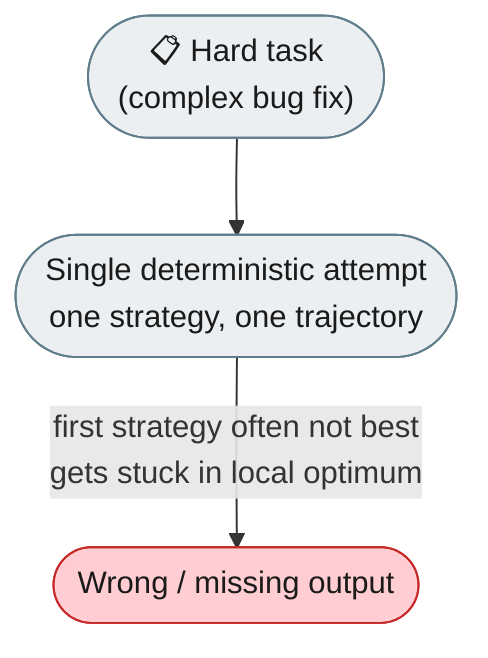
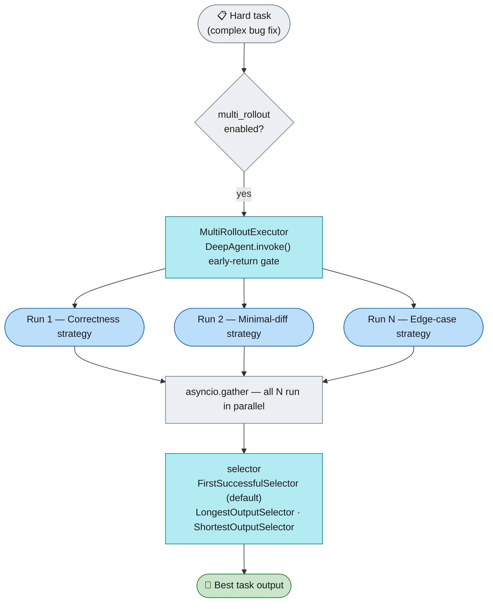

# [Feature]: Multi-Rollout Task Execution — run N strategies in parallel and keep the best result

## Executive Summary

A single agent attempt on a hard task often gets stuck in a local optimum —
the first strategy isn't the best, so the task fails even though another approach
would have succeeded. Multi-Rollout runs N subagents in parallel, each with a
different strategy, and a selector returns the best result, lifting the pass rate
from `p` to `1-(1-p)^N`.

Issue #764 https://github.com/openJiuwen-ai/agent-core/issues/764<br>
PR #38 https://github.com/openJiuwen-ai/agent-core/pull/38

## Background Description

A single agent execution trajectory can get stuck in a **local optimum**: for
complex tasks (e.g. hard bug fixes) the agent's first strategy is often not the
best one, and restarting the whole task manually is slow and wastes the context
already built up.

The motivation is to apply the "try N variants, keep the best" principle at the
level of a **regular user task**: spawn several subagents, each instructed with a
different strategy (correctness, minimal-diff, edge-case), run them in parallel,
and return only the best output — converting single-attempt into pass@k without
changing the user-facing `invoke()` contract.



## Design Ideas

### Proposed design

- **Early-return gate in `DeepAgent.invoke()`** — if `multi_rollout.enabled` and
  `n_rollouts > 1`, the standard pipeline is bypassed before
  `ReActAgent.before_invoke` fires, and the task is delegated to
  `MultiRolloutExecutor`.
- **Isolated subagents** — each attempt is spawned via
  `parent.create_subagent("general-purpose", subsession_id=f"rollout-{i:03d}")`
  and receives its own isolated workspace under `sub_agents/`; the parent
  workspace is never touched.
- **Strategy-prefixed subagents** — each subagent gets a strategy hint injected
  into its query: correctness/thoroughness, minimal changes, or edge-case
  defensive programming. Custom strategies are supported via
  `strategy_variants`; real divergence between attempts also depends on
  **LLM temperature > 0**.
- **Parallel execution** — all N runs use `asyncio.gather` for concurrent
  execution, bounded by `max_parallel` (default `0` = unlimited), each with an
  individual `timeout_per_rollout` (default 600 s).
- **Pluggable selector** — the winner is chosen from `RolloutResult` objects via
  `FirstSuccessfulSelector` (fastest, safest default), `LongestOutputSelector`
  (prefers completeness), or `ShortestOutputSelector` (prefers minimal diffs).



### Rejected alternatives

- **Sequential retries** — simpler, but multiplies wall-clock latency by N and
  provides no cross-attempt concurrency. Parallelism was chosen for latency.
- **Selecting by internal confidence score** — requires a reliable per-attempt
  self-score, which the model does not reliably produce; a selector over
  observable output (success flag / length) is deterministic.

## Involved Public APIs

New classes (all public additions):

| API | Kind |
|---|---|
| `MultiRolloutExecutor` | new class |
| `MultiRolloutConfig` | new config model |
| `RolloutResult` | new data model |
| `FirstSuccessfulSelector` / `LongestOutputSelector` / `ShortestOutputSelector` | new selectors |

Config additions (on `DeepConfig.multi_rollout`):

| Field | Type | Default |
|---|---|---|
| `multi_rollout.enabled` | bool | `False` |
| `multi_rollout.n_rollouts` | int | `3` |
| `multi_rollout.max_parallel` | int | `0` (unlimited) |
| `multi_rollout.timeout_per_rollout` | float | `600.0` |
| `multi_rollout.selector_kind` | str | `"first_successful"` |
| `multi_rollout.strategy_variants` | list[str] | 3 default strategies |

**Impact:** additive and opt-in (`enabled` defaults to `False`). No existing
`invoke()` signature, return type, or hook contract changes. When disabled, the
early-return gate is a no-op and behaviour is identical to before.

## Description of Relevance to Other Modules

- **`openjiuwen/harness/deep_agent.py`** — hosts the early-return gate in
  `invoke()`; must remain a strict no-op when `multi_rollout.enabled` is `False`.
- **`openjiuwen/harness/schema/config.py`** — gains the `multi_rollout` field on
  `DeepConfig`; config validation must accept the new block.
- **`openjiuwen/core/single_agent`** — subagents are ordinary `ReActAgent`
  instances; no change, but subagent isolation must not leak session state into
  siblings.

## Test Design and Test Plan

Unit tests (`tests/unit_tests/harness/multi_rollout/`):

1. **No-op path** — `multi_rollout.enabled=False` → `invoke()` runs the standard
   pipeline; executor never constructed.
2. **N subagents created** — `n_rollouts=3` → exactly 3 subagents, each with the
   correct strategy prefix in its query.
3. **Selector behaviour** — `FirstSuccessfulSelector` returns the first
   successful `RolloutResult`; `LongestOutputSelector` / `ShortestOutputSelector`
   compare by output length.
4. **Timeout** — a subagent exceeding `timeout_per_rollout` is cancelled and the
   remaining attempts still complete.
5. **Concurrency bound** — with `max_parallel=2` and `n_rollouts=5`, at most 2
   attempts run concurrently (assert via a spy); `max_parallel=0` means
   unlimited.

Integration tests:

- **End-to-end** — a task whose "correctness" strategy is known to succeed while
  "minimal-diff" fails; assert the returned output is the correct one.
- **Isolation** — concurrent subagents must not observe each other's session
  state or tool results.

Performance/reliability checks:

- **Latency** — wall-clock time for N parallel runs is ~max(single-attempt) not
  ~N×single-attempt.
- **Cost** — `n_rollouts=3` implies ~3× LLM cost; documented as a trade-off.

## Additional Information

## Solution

Paired: [GitHub #38](https://github.com/openJiuwen-ai/agent-core/pull/38) ↔ [GitCode !1977](https://gitcode.com/openJiuwen/agent-core/merge_requests/1977)

**What type of PR is this?**
/kind feature

---

## **What does this PR do / why do we need it**

This PR introduces **Task-Layer Multi-Rollout**, a new parallel-execution mechanism for DeepAgent that allows multiple independent strategies to be explored simultaneously for a single task.

Issue #764 

### **The problem**

A single agent execution trajectory can get stuck in a **local optimum**. For complex coding tasks (e.g., hard bug fixes), the agent's first strategy is often not the best one. Restarting the entire task manually is slow and wastes the context already built up.

Auto-Harness Best-of-N solves this for **CI repair**, but there was no mechanism for **task-level strategy exploration** during normal DeepAgent.invoke().

### **The solution: Multi-Rollout**

When enabled, DeepAgent.invoke() transparently switches to a multi-attempt pipeline:

1. **Spawn N subagents** with isolated workspaces
2. **Inject different strategy prompts** into each attempt
3. **Run all attempts in parallel**
4. **Collect RolloutResult(success, exception, output_text)**
5. **Select the best result** via a pluggable selector
6. **Return the winning output** to the caller

This gives the agent multiple "shots" at the same task without losing context or requiring manual restarts.


---

## **How it works**

### **Invoke path**

```
User calls DeepAgent.invoke()
  └─ normalize inputs
  └─ if multi_rollout.enabled and n_rollouts > 1:
        spawn N subagents
        inject strategy variants
        run attempts in parallel
        collect RolloutResult objects
        selector.pick() → best result
        return best result
     else:
        normal invoke()
```

### **Workspace isolation**

Each subagent is created via:

```
parent.create_subagent(
    agent_type="general-purpose",
    subsession_id=f"rollout-{i:03d}"
)
```

Each attempt receives its own workspace under `sub_agents/`.

### **Strategy diversity**

Each attempt receives the same task, prefixed with a different strategy instruction:

- correctness-focused
- minimal-diff
- edge-case-focused

Real divergence also depends on LLM temperature > 0.

### **Selectors**

Three built-in selection strategies:

- **first_successful** — fastest, safest default
- **longest_output** — prefers completeness
- **shortest_output** — prefers minimal diffs

---

## **Files changed**

### **agent-core**

| File | What |
|---|---|
| `MultiRolloutConfig` dataclass | config |
| `RolloutResult`, selectors, factory | result + selection |
| `MultiRolloutExecutor` | orchestrating clone → run → select |
| Package exports | public API |
| `DeepAgentConfig` | added `MultiRolloutConfig` |
| `invoke()` | hook delegating to `MultiRolloutExecutor` |
| Lazy exports | lazy imports |
| 19 unit tests | tests |
| English docs | docs |
| Chinese docs | docs |
| Navigation links | docs |

---

## **Caveats**

- **Streaming:** Multi-rollout works only with `invoke()`, not `stream()`.
- **Cost:** n_rollouts = 3 → ~3× LLM cost.
- **Workspace state:** Parent workspace is untouched; caller must copy files if needed.

---

## **How to enable**

### Via DeepAgentConfig

```python
from openjiuwen.harness import DeepAgentConfig, MultiRolloutConfig

config = DeepAgentConfig(
    multi_rollout=MultiRolloutConfig(
        enabled=True,
        n_rollouts=3,
        max_parallel=3,
        timeout_per_rollout=600.0,
        selector_kind="first_successful",
    )
)
```

### Standalone executor

```python
from openjiuwen.harness.multi_rollout import MultiRolloutExecutor, MultiRolloutConfig

executor = MultiRolloutExecutor(
    parent_agent,
    MultiRolloutConfig(enabled=True, n_rollouts=3),
)
result = await executor.invoke({"query": "fix bug"})
```

---

## **Tests**

19 unit tests covering:

- Config defaults and validation
- All selector strategies
- Factory error handling
- Disabled path (delegates to parent)
- Parallel spawn + selection
- Partial failure recovery
- Complete failure propagation
- Strategy prefix injection

---

## **Self-checklist**

- [x] **Design**: Reviewed with maintainers
- [x] **Test**: 19 unit tests added
- [x] **Verification**: Parallel attempts validated across multiple task types
- [ ] **Interface**: No external API changes
- [x] **Document**: Full docs added in EN + CN
