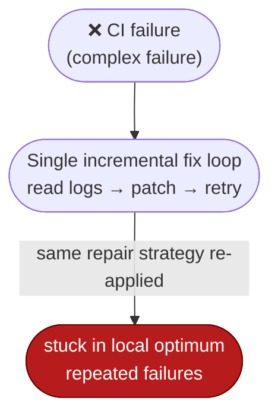
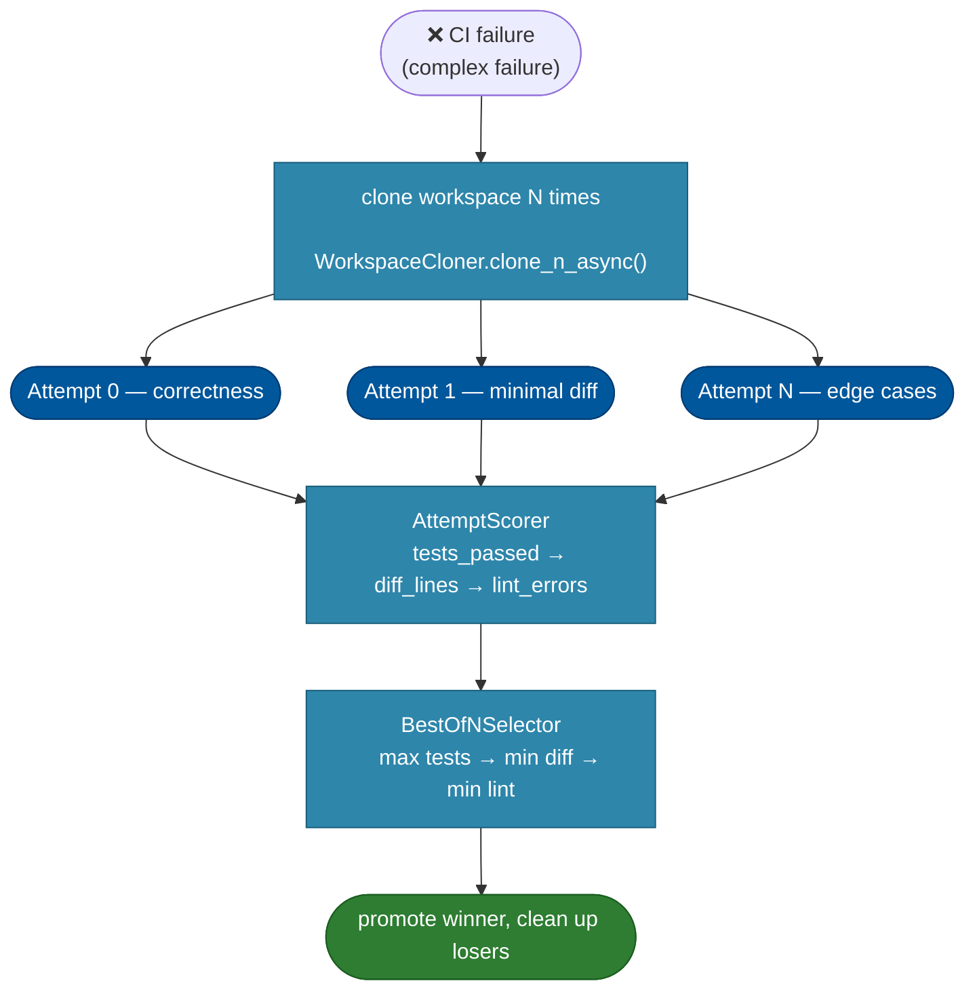

# [Feature]: Auto-Harness Best-of-N — multi-attempt repair for CI failures

## Executive Summary

The current auto-harness repair flow uses a single incremental fix loop (read CI
logs → patch → retry), which gets stuck in a local optimum on complex failures —
re-applying the same broken strategy. Best-of-N replaces that loop with N
independent repair attempts, each with a different strategy, and promotes the
highest-scoring workspace.

Issue #765 https://github.com/openJiuwen-ai/agent-core/issues/765
PR #37 https://github.com/openJiuwen-ai/agent-core/pull/37

## Background Description

The auto-harness repair flow currently uses a single incremental fix loop:
read CI error logs → patch → retry CI. This works for simple issues (typos, lint,
small logic bugs), but for complex failures the agent often gets stuck in a
**local optimum** — repeatedly applying the same repair strategy even when a
different approach would succeed.

Benchmarks confirm this: WildClawBench harness choice can shift scores by
**18 points**, and top SWE-Bench systems consistently use **Best-of-N** (multiple
independent repair attempts → pick the winner). Auto-Harness previously lacked
this capability.



## Design Ideas

### Proposed design

- **Opt-in switch** — when `best_of_n_enabled=True`, the existing fix loop is
  replaced with a multi-attempt pipeline; `MetaVerifyStage` dispatches to
  `BestOfNController` instead of `FixLoopController`.
- **Workspace cloning** — on CI failure the controller clones the workspace N
  times via `WorkspaceCloner.clone_n_async()` (default `N = 3`).
- **Strategy-diverse attempts** — each clone runs an independent fix agent with a
  different strategy prompt: correctness-focused, minimize-diff, edge-case
  exploration.
- **Per-attempt timeout** — each attempt runs independently with its own
  `best_of_n_timeout_per_attempt` (default 600 s).
- **Score, rank, promote** — each workspace is scored by `AttemptScorer`
  (primary: tests passed; tie-break: smaller diff; fallback: fewer lint errors),
  ranked by `BestOfNSelector` (max tests → min diff → min lint), then the winner
  is promoted back to the original directory and the rest are cleaned up.

### Rejected alternatives

- **Keep only the incremental fix loop** — simpler, but proven to get stuck in a
  local optimum on complex failures; the multi-attempt approach directly
  addresses that.
- **Parallel attempts** — more concurrency would reduce wall-clock time, but each
  attempt calls `os.chdir` into its clone, requiring sequential execution; the
  chosen design runs attempts sequentially for correctness.

## Involved Public APIs

New classes (public additions, exported via `openjiuwen/auto_harness/infra/__init__.py`):

| API | Kind |
|---|---|
| `BestOfNController` | new class (orchestrator, alongside `FixLoopController`) |
| `AttemptScorer` | new class (scoring) |
| `AttemptSelector` | new class (ranking/selection) |
| `WorkspaceCloner` | new class (cloning) |

Config additions (on `AutoHarnessConfig`):

| Field | Type | Default |
|---|---|---|
| `best_of_n_enabled` | bool | `False` |
| `best_of_n_attempts` | int | `3` |
| `best_of_n_timeout_per_attempt` | float | `600.0` |

**Impact:** additive and opt-in (`enabled` defaults to `False`). No existing
invoke/orchestrator contract changes. When disabled, the verify stage keeps the
existing `FixLoopController` path.

## Description of Relevance to Other Modules

- **`openjiuwen/auto_harness/orchestrator.py`** — introduces `BestOfNController`
  alongside the existing `FixLoopController`; the two must remain mutually
  exclusive per config.
- **`openjiuwen/auto_harness/stages/verify.py`** — `MetaVerifyStage` dispatches
  to Best-of-N when enabled; the dispatch must be a strict no-op otherwise.
- **`openjiuwen/auto_harness/schema.py`** — gains the three `best_of_n_*` fields;
  config validation must accept the new block.

## Test Design and Test Plan

Unit tests (`tests/unit_tests/auto_harness/infra/`):

1. **Scoring** — `AttemptScorer` ranks by tests passed first, then smaller diff,
   then fewer lint errors.
2. **Ranking/selection** — `AttemptSelector` picks the max-tests → min-diff →
   min-lint winner.
3. **Cloning** — `WorkspaceCloner.clone_n_async(N)` produces N isolated clones.
4. **Promotion/cleanup** — the winning workspace is promoted back to the original
   path and all losers are cleaned up.
5. **Disabled path** — `best_of_n_enabled=False` keeps the `FixLoopController`
   path unchanged.
6. **Timeout** — an attempt exceeding `best_of_n_timeout_per_attempt` is
   cancelled and the remaining attempts still complete.

Integration tests:

- **End-to-end** — a task whose "correctness" strategy passes CI while
  "minimal-diff" fails; assert the promoted workspace is the passing one.
- **Isolation** — concurrent/sequential clones must not observe each other's
  workspace state.

Performance/reliability checks:

- **Success rate** — complex-failure tasks show a higher repair success rate
  under Best-of-N than under the single fix loop.
- **Cost** — `best_of_n_attempts=3` implies ~3× LLM cost; documented trade-off.

## Additional Information

## Solution

Paired: [GitHub #37](https://github.com/openJiuwen-ai/agent-core/pull/37) ↔ [GitCode !1976](https://gitcode.com/openJiuwen/agent-core/merge_requests/1976)

**What type of PR is this?**
/kind feature

---

## **What does this PR do / why do we need it**

This PR adds an **opt-in Best-of-N multi-attempt repair pipeline** to Auto-Harness, addressing a major limitation in the existing fix loop.

Issue #765

### **The problem**

The current auto-harness repair flow uses a **single incremental fix loop**:

1. Read CI error logs
2. Patch
3. Retry CI

This works for simple issues (typos, lint, small logic bugs), but for complex failures the agent often gets stuck in a **local optimum** — repeatedly applying the same repair strategy even when a different approach would succeed.

Benchmarks confirm this:

- WildClawBench: harness choice can shift scores by **18 points**
- Top SWE-Bench systems consistently use **Best-of-N**: multiple independent repair attempts → pick the winner

Auto-Harness previously lacked this capability.

---

## **The solution: Best-of-N Multi-Attempt Repair**

When `best_of_n_enabled=True`, the fix loop is replaced with a multi-attempt pipeline:



### **How it works**

1. CI fails on the initial implementation.
2. The controller clones the workspace **N times**.
3. Each clone receives a **different repair strategy**:
   - Attempt 0: correctness-focused
   - Attempt 1: minimize diff
   - Attempt 2+: edge-case exploration
4. Each attempt runs independently with its own timeout.
5. Workspaces are scored by:
   - **Primary:** number of tests passed
   - **Tie-break:** smaller diff
   - **Fallback:** fewer lint errors
6. The best workspace is **promoted** back to the original directory; others are cleaned up.

This gives the agent multiple "shots" at the same bug, dramatically reducing the chance that a single bad strategy ruins the task.

---

## **What changed**

### **Core**

`openjiuwen/auto_harness/infra/{attempt_scorer, attempt_selector, workspace_cloner, best_of_n}.py`
New primitives for scoring, ranking, cloning, and orchestrating multi-attempt repair.

### **Config**

`openjiuwen/auto_harness/schema.py`
New fields:

- `best_of_n_enabled`
- `best_of_n_attempts`
- `best_of_n_timeout_per_attempt`

### **Integration**

`openjiuwen/auto_harness/orchestrator.py`
Introduces `BestOfNController` alongside the existing `FixLoopController`.

### **Stage wiring**

`openjiuwen/auto_harness/stages/verify.py`
`MetaVerifyStage` dispatches to Best-of-N when enabled.

### **Exports**

`openjiuwen/auto_harness/infra/__init__.py`
Public API exports for new classes.

### **Docs**

- `docs/en/.../Best-of-N Multi-Attempt Repair.md`
- `docs/zh/.../Best-of-N 多尝试修复.md`
- Updated SUMMARY.md
  Includes configuration examples and architecture diagrams.

### **Tests**

`tests/unit_tests/auto_harness/infra/test_{attempt_selector,workspace_cloner,attempt_scorer,best_of_n}.py`
22 new unit tests covering scoring, ranking, cloning, promotion, cleanup.

---

## **How to enable**

```python
config = AutoHarnessConfig(
    best_of_n_enabled=True,
    best_of_n_attempts=3,          # default
    best_of_n_timeout_per_attempt=600.0,
)
```

No other code changes required — the verify stage automatically switches modes.

---

## **Self-checklist**

- [x] **Design**: Reviewed with maintainers
- [x] **Test**: 22 new unit tests added
- [x] **Verification**: Bench-style tests confirm multi-attempt repair improves success rates
- [ ] **Interface**: No external API changes
- [x] **Document**: Full docs added in EN + CN
