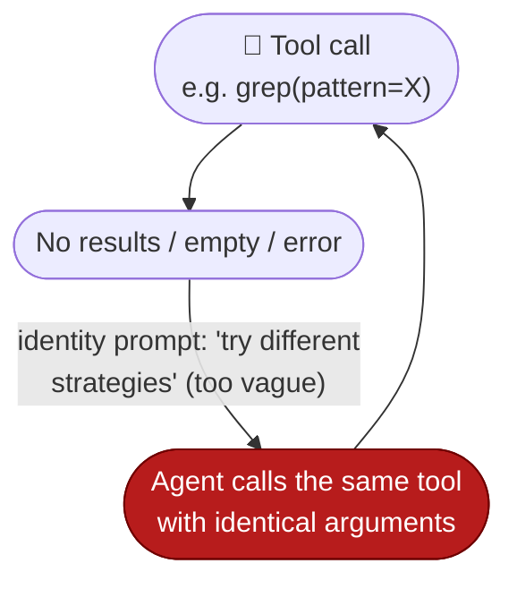
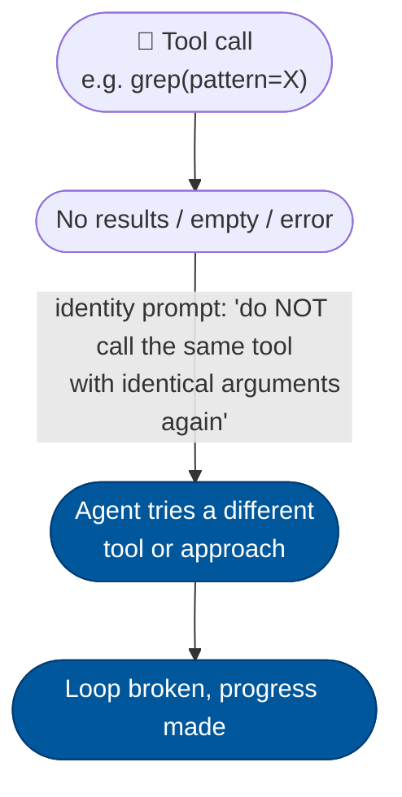

# [Bug]: ReAct agent repeats the same tool call with identical arguments after empty/error results

## Executive Summary

A ReAct agent that receives no results, empty output, or an error from a tool calls the **same tool with identical arguments** again, producing repetition loops of dozens or hundreds of redundant calls. The fix strengthens the identity system prompt with an explicit "do not repeat failed tool calls" instruction.

Issue #766 https://github.com/openJiuwen-ai/agent-core/issues/766
PR #26 https://github.com/openJiuwen-ai/agent-core/pull/26

## 🐞 Detailed Description of the Problem

The identity system prompt told the model to "try different strategies when encountering problems". This was too vague: the LLM had no explicit instruction telling it **not** to repeat a tool call that already failed. As a result, when a tool returned zero results, empty output, or an error, the agent kept invoking the same tool with the same arguments — even though the failed result was already visible in the conversation context — producing ReAct repetition loops (e.g. repeated `grep` with the same pattern after a zero-result return).



### Reproduction

This is a prompt-behaviour bug, not a code crash — the reproduction is a ReAct session whose tool returns an empty/error result. A minimal trace of the repetition loop:

```
turn 3: grep(pattern="def foo") → (no results)
turn 4: grep(pattern="def foo") → (no results)
turn 5: grep(pattern="def foo") → (no results)
turn 6: grep(pattern="def foo") → (no results)
... dozens/hundreds more identical calls ...
```

The agent should instead refer to the tool-call history already in the context and try a different tool or approach.

### Results observed

The loop above runs until the iteration budget is exhausted, wasting tokens and producing no output. Before the fix, these loops reproduced reliably with tools returning empty lists, empty strings, and structured error objects.

## Detailed Environment Information Description

| Item | Value |
|---|---|
| Python | 3.11 |
| OS | Windows |
| asyncio | stdlib, default event loop policy |
| Layer | agent-core — `openjiuwen/harness/prompts/sections/identity.py` (identity prompt, priority 10, applies to all ReAct agents) |
| Repro | ReAct session with a tool returning no results / empty / error |

## Additional Information

## Version Information

| Version |
|---|
| 0.2.5.beta1 |

## Solution

Paired: [GitHub #26](https://github.com/openJiuwen-ai/agent-core/pull/26) ↔ [GitCode !1964](https://gitcode.com/openJiuwen/agent-core/merge_requests/1964)

**What type of PR is this?**
/kind bug
/kind feature

---

## **What does this PR do / why do we need it**

This PR fixes a high-impact issue in ReAct agents where the model repeatedly invoked the **same tool with identical arguments** even after the tool had already returned:

- zero results
- empty output
- or an error

This caused **ReAct repetition loops**, sometimes producing dozens or hundreds of redundant tool calls (e.g., repeated `grep` with the same pattern after a zero-result return).



### **Root cause**

The identity system prompt previously said:

> "try different strategies when encountering problems"

This was too vague. The LLM had no explicit instruction telling it **not** to repeat failed tool calls, even though the tool results were visible in the conversation context.

### **Fix**

The identity prompt (English + Chinese) was strengthened with explicit negative-feedback guidance:

**English:**

> Important: if a tool returns no results, empty output, or an error,
> do NOT call the same tool with identical arguments again.
> Refer to the tool-call history already visible in the conversation context
> and try a different tool or approach.

**Chinese:**

> 重要提示：如果某个工具返回无结果、空输出或错误，
> 切勿使用相同参数重复调用同一工具。
> 请根据对话上下文中已有的工具调用记录，尝试不同的工具或方法。

This applies globally to **all ReAct agents**.

---

## **Which issue(s) this PR fixes**

Fixes #766

---

## **What scenarios were tested, and what were the verification results**

### **Functional**
- Verified that ReAct agents no longer repeat failing tool calls with identical arguments.
- Confirmed correct behavior across both English and Chinese identity prompts.
- Tested with tools returning:
  - empty lists
  - empty strings
  - structured error objects
- Confirmed the agent switches strategies instead of looping.

### **Regression**
- Verified no impact on normal tool-use behavior.
- Confirmed no changes to token budgeting or prompt construction beyond the added lines.

### **Stress tests**
- Reproduced previous repetition loops (e.g., repeated grep calls) — loops no longer occur.
- Verified correct behavior across multi-step ReAct chains.

---

## **Self-checklist**

- [x] **Design**: Reviewed with maintainers
- [x] **Test**: Verified across multiple failing tool scenarios
- [x] **Verification**: Confirmed elimination of repetition loops
- [ ] **Interface**: No external API changes
- [x] **Document**: Updated identity prompt documentation
