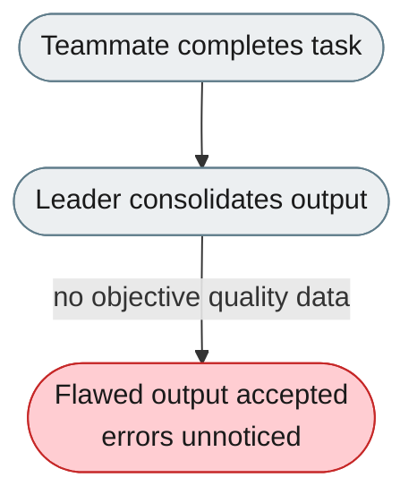
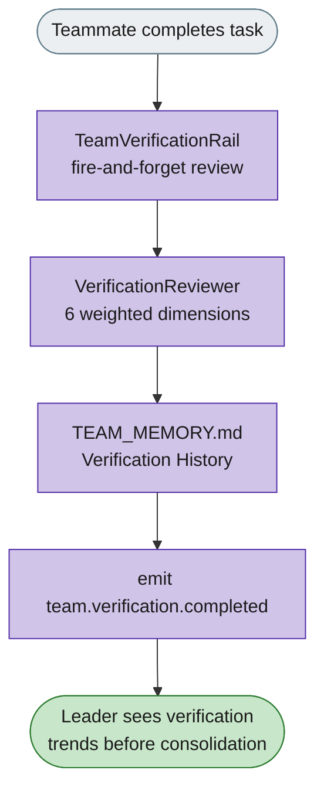

# [Feature]: Team Verification Layer — automatic quality-review of teammate outputs (agent-core)

## Executive Summary

In Agent Team mode the Leader consolidates teammate outputs without any objective quality data, so flawed submissions are accepted unnoticed. This feature adds a Team Verification Layer that automatically reviews each completed teammate task across six weighted quality dimensions, persists the results to `TEAM_MEMORY.md`, and emits events for the frontend and the Leader.

Issue #770 https://github.com/openJiuwen-ai/agent-core/issues/770 
PR #123 https://github.com/openJiuwen-ai/agent-core/pull/123

## Background Description

In Agent Team (Cluster) mode, the Leader receives teammate outputs and consolidates results, but has no objective quality data on each submission. Errors pass through unnoticed, consistency across teammates is not enforced, and there is no persistent record of verification for accountability or trend analysis. This is the agent-core part of the fix: the verification subsystem itself (`TeamVerificationRail`, `VerificationReviewer`, `VerificationMemory`, and typed config) that the jiuwenswarm layer later mounts onto the Leader.

## Design Ideas

### Proposed design

- **Rail-based, not a sub-agent** — `TeamVerificationRail` is a `DeepAgentRail` mounted exclusively on the Leader, with standard lifecycle hooks (`before_model_call` injects verification trends; `after_model_call` is a placeholder for `block_on_fail`).
- **Model-based reviewer** — `VerificationReviewer` makes a single model call with a structured JSON prompt scoring six weighted dimensions: correctness (25%), completeness (20%), consistency (20%), clarity (15%), security (10%), performance (10%).
- **Thresholds** — score ≥ 70 → PASS, 40–69 → NEEDS_REWORK, < 40 → FAIL.
- **Persistent memory** — `VerificationMemory` writes results to `TEAM_MEMORY.md` under a "Verification History" section, enabling trend queries (pass rate, average score, weak dimensions, per-agent breakdown).
- **Async fire-and-forget** — verification runs via `asyncio.create_task()`, so it never blocks the Leader's consolidation.
- **Mock fallback** — when no model client is configured, the reviewer returns PASS with score 75, so the system works out of the box.

### Rejected alternatives

- **Sub-agent post-processor** — spawning a reviewer sub-agent per task adds latency and lifecycle complexity; a rail with a single model call is lighter and reuses the existing rail/event/memory infrastructure.
- **Blocking (synchronous) verification** — guarantees verification before consolidation but stalls the whole team; async fire-and-forget was chosen so quality review never blocks workflow.

## Involved Public APIs

New classes (public additions):

| API | Kind |
|---|---|
| `TeamVerificationRail` | new class (DeepAgentRail) |
| `VerificationReviewer` | new class (model-based scoring) |
| `VerificationMemory` | new class (TEAM_MEMORY.md persistence) |
| Verification result data models (`result.py`) | new data models |
| Verification config (`config.py`) | new typed config |

Config additions (under `team.verification`):

| Field | Type | Default |
|---|---|---|
| `enabled` | bool | `true` |
| `pass_threshold` | float | `70` |
| `rework_threshold` | float | `40` |
| `block_on_fail` | bool | `false` |
| `auto_rework` | bool | `false` |
| `skip_patterns` | list[str] | heartbeat/ping/status |

**Impact:** additive and enabled by default; graceful degradation (mock PASS when no model). No existing contract changes.

## Description of Relevance to Other Modules

- **`openjiuwen/agent_teams/verification/`** — the new subsystem (rail, reviewer, result, memory, config); self-contained and unit-testable without a live model.
- **`openjiuwen/agent_teams` rail/event systems** — the rail plugs into the existing `DeepAgentRail` lifecycle; events use the existing team-event types.

## Test Design and Test Plan

Unit tests:

1. **Reviewer** — structured JSON parsing for dimension scores, summary, and suggestions; default team model, dedicated verification model alias, and mock fallback (no model → PASS 75).
2. **Threshold logic** — score ≥ pass_threshold → PASS; between thresholds → NEEDS_REWORK; < rework_threshold → FAIL.
3. **Memory persistence** — results written to `TEAM_MEMORY.md` under "Verification History"; chronological grouping and formatting; trend queries (pass rate, average score, weak dimensions, per-agent).
4. **Config** — typed config validation for all `team.verification.*` fields.
5. **Rail** — `before_model_call` injects trends; no-op when disabled.

Integration tests:

- **Event flow** — `team.verification.completed` emitted with full payload; `team.verification.error` on model/parsing failure.

Performance/reliability:

- **Concurrency** — 20+ rapid task completions: no blocking, no event-loop stalls, verification tasks run concurrently without interference.
- **Failure isolation** — verification errors never block team workflow.

## Additional Information

## Solution

Paired: [GitHub #123](https://github.com/openJiuwen-ai/agent-core/pull/123) ↔ [GitCode !2074](https://gitcode.com/openJiuwen/agent-core/merge_requests/2074)

**What type of PR is this?**
/kind feature

---

## **What does this PR do / why do we need it**

This PR introduces the **Team Verification Layer**, a new quality-assurance subsystem for Agent Team (Cluster) mode. It automatically reviews teammate task outputs across six quality dimensions — correctness, completeness, consistency, clarity, security, and performance — and stores results in `TEAM_MEMORY.md` for accountability, trend analysis, and improved team reliability.

### **Why this matters**

- **Catches errors early** before the Leader consolidates flawed outputs
- **Enforces consistency** across teammates and tasks
- **Builds accountability** through persistent verification history
- **Enables data-driven improvement** via trend analysis
- **Improves team output quality** without blocking workflow (async, fire-and-forget)

Verification runs automatically on `TASK_COMPLETED` events and integrates seamlessly with the existing rail, event, and memory systems.

---

## **Which issue(s) this PR fixes**

Fixes #770

---

## **What scenarios were tested, and what were the verification results（Function, performance, reliability, etc.）**

### **Functional verification**
- Confirmed that `TeamMonitorHandler` correctly triggers verification on `TASK_COMPLETED`.
- Verified asynchronous execution via `asyncio.create_task()` — no blocking of Leader consolidation.
- Ensured skip patterns (`heartbeat`, `ping`, `status`) correctly bypass verification.
- Confirmed correct threshold logic:
  - Score ≥ pass_threshold → PASS
  - Between thresholds → NEEDS_REWORK
  - Score < rework_threshold → FAIL

### **Model-based assessment**
- Tested `VerificationReviewer` with:
  - Default team model
  - Dedicated verification model alias
  - Mock mode fallback (no model configured → PASS 75)
- Verified structured JSON parsing for dimension scores, summary, and suggestions.

### **Memory persistence**
- Confirmed `VerificationMemory` writes results to `TEAM_MEMORY.md` under "Verification History".
- Verified chronological grouping and formatting consistency.
- Tested trend queries: pass rate, average score, weak dimensions, per-agent breakdown.

### **Event system integration**
- Verified emission of:
  - `team.verification.completed` with full result payload
  - `team.verification.error` on model or parsing failure
- Confirmed frontend displays verification badges in task detail panel and activity feed.

### **Performance & reliability**
- Stress-tested with 20+ rapid task completions:
  - No blocking
  - No event-loop stalls
  - Verification tasks run concurrently without interference
- Verified that verification errors do not block team workflow.

---

## **Self-checklist**

- [x] **Design**: Reviewed with maintainers; all feedback addressed
- [x] **Test**: Unit tests for reviewer, memory, config, and rail; integration tests for event flow
- [x] **Verification**: PR includes detailed verification results and scenarios
- [ ] **Interface**: No external API changes
- [x] **Document**: Added documentation for configuration, architecture, and usage
