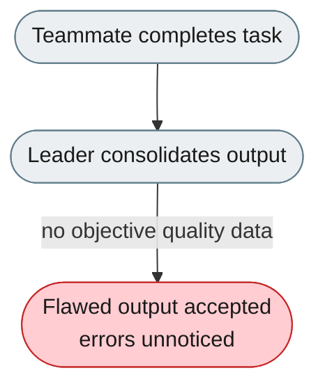
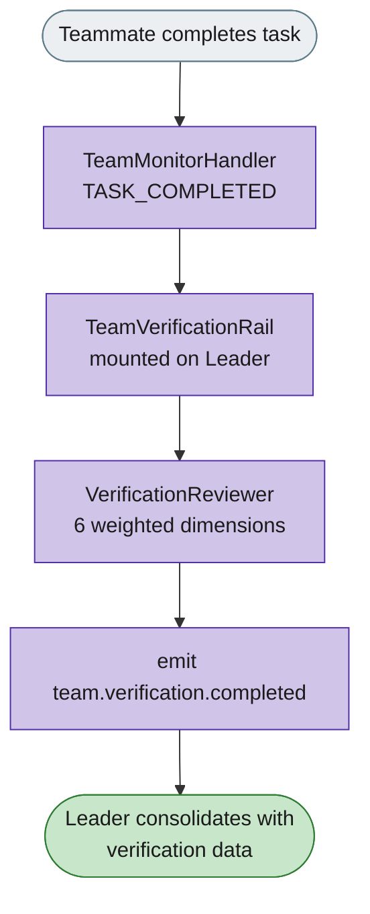

# [Feature]: Team Verification Layer — mount verification on the Leader (jiuwenswarm)

## Executive Summary

This is the jiuwenswarm half of the Team Verification Layer. It mounts the agent-core verification subsystem (`TeamVerificationRail`, `VerificationReviewer`, `VerificationMemory`) onto the Leader, and triggers it on teammate task-completion events.

Issue #3472 https://github.com/openJiuwen-ai/jiuwenswarm/issues/3472 
PR #121 https://github.com/openJiuwen-ai/jiuwenswarm/pull/121

## Background Description

In Agent Team mode the Leader consolidates teammate outputs without objective quality data, so flawed submissions are accepted unnoticed. This jiuwenswarm part wires the quality-review subsystem into the team runtime: it mounts the rail on the Leader, and triggers verification on task-completion events.

## Design Ideas

This part **depends on the agent-core part** ([Issue #770]([https://github.com/openJiuwen-ai/agent-core/pull/123](https://github.com/openJiuwen-ai/agent-core/issues/770)), [PR #123](https://github.com/openJiuwen-ai/agent-core/pull/123)), which provides the verification rail, reviewer, memory, and config. The jiuwenswarm PR should be approved **after** the agent-core part is approved.

### Proposed design

- **Mount the rail on the Leader** — `TeamVerificationRail` is attached to the Leader via `build_member_rails()` only when `role == "leader"` and `verification.enabled` is true.
- **Trigger on task-completion events** — `TeamMonitorHandler` fires verification asynchronously (`asyncio.create_task()`) on `TASK_COMPLETED`, so the Leader's consolidation is never blocked.
- **Skip patterns** — heartbeat/ping/status tasks bypass verification.
- **Event publishing** — emit `team.verification.completed` (with full payload) and `team.verification.error` (on model/parsing failure).
- **Graceful degradation** — verification errors never block the team workflow.

### Rejected alternatives

- **Blocking verification before consolidation** — guarantees review but stalls the team; async fire-and-forget was chosen so quality review never blocks workflow.

## Involved Public APIs

New/changed integration points (jiuwenswarm side; the verification primitives themselves live in agent-core):

| Area | Change |
|---|---|
| `team_runtime_inheritance.py` | mounts `TeamVerificationRail` on the Leader |
| `team_monitor_handler.py` | triggers verification on `TASK_COMPLETED` |
| `event_types.py` | new `team.verification.completed` / `team.verification.error` event types |
| `team_manager.py` | stores `_team_verification_rails` |

**Impact:** additive; reuses agent-core's rail/reviewer/memory. No existing team workflow contract changes.

## Description of Relevance to Other Modules

- **agent-core** (`agent_teams/verification/`) — provides the rail, reviewer, memory, and config that this PR mounts and triggers (see [PR #123](https://github.com/openJiuwen-ai/agent-core/pull/123)); this PR depends on it.
- **`team_monitor_handler.py`** — the handler must trigger verification only on task-completion events and honor skip patterns.

## Test Design and Test Plan

Unit/integration tests:

1. **Trigger** — `TeamMonitorHandler` triggers verification on `TASK_COMPLETED`; skip patterns (`heartbeat`, `ping`, `status`) bypass it.
2. **Async** — `asyncio.create_task()` execution; Leader consolidation is never blocked.
3. **Event emission** — `team.verification.completed` with full payload; `team.verification.error` on model/parsing failure.

Performance/reliability:

- **Concurrency** — 20+ rapid task completions: no blocking, no event-loop stalls, concurrent verification without interference.
- **Failure isolation** — verification errors never block team workflow.

## Additional Information

## Solution

Paired: [GitHub #121](https://github.com/openJiuwen-ai/jiuwenswarm/pull/121) ↔ [GitCode !3689](https://gitcode.com/openJiuwen/jiuwenswarm/merge_requests/3689)

**What type of PR is this?**
/kind feature

---

## **What does this PR do / why do we need it**

This PR introduces the **Team Verification Layer**, a new quality-assurance subsystem for Agent Team (Cluster) mode. It automatically reviews teammate task outputs across six quality dimensions — correctness, completeness, consistency, clarity, security, and performance — and stores results in `TEAM_MEMORY.md` for accountability, trend analysis, and improved team reliability.

### **Why this matters**

- **Catches errors early** before the Leader consolidates flawed outputs
- **Enforces consistency** across teammates and tasks
- **Builds accountability** through persistent verification history
- **Enables data-driven improvement** via trend analysis
- **Improves team output quality** without blocking workflow (async, fire-and-forget)

Verification runs automatically on `TASK_COMPLETED` events and integrates seamlessly with the existing rail, event, and memory systems.

---

## **Which issue(s) this PR fixes**

Fixes #3472

---

## **What scenarios were tested, and what were the verification results（Function, performance, reliability, etc.）**

### **Functional verification**
- Confirmed that `TeamMonitorHandler` correctly triggers verification on `TASK_COMPLETED`.
- Verified asynchronous execution via `asyncio.create_task()` — no blocking of Leader consolidation.
- Ensured skip patterns (`heartbeat`, `ping`, `status`) correctly bypass verification.
- Confirmed correct threshold logic:
  - Score ≥ pass_threshold → PASS
  - Between thresholds → NEEDS_REWORK
  - Score < rework_threshold → FAIL

### **Model-based assessment**
- Tested `VerificationReviewer` with:
  - Default team model
  - Dedicated verification model alias
  - Mock mode fallback (no model configured → PASS 75)
- Verified structured JSON parsing for dimension scores, summary, and suggestions.

### **Memory persistence**
- Confirmed `VerificationMemory` writes results to `TEAM_MEMORY.md` under "Verification History".
- Verified chronological grouping and formatting consistency.
- Tested trend queries: pass rate, average score, weak dimensions, per-agent breakdown.

### **Event system integration**
- Verified emission of:
  - `team.verification.completed` with full result payload
  - `team.verification.error` on model or parsing failure

### **Performance & reliability**
- Stress-tested with 20+ rapid task completions:
  - No blocking
  - No event-loop stalls
  - Verification tasks run concurrently without interference
- Verified that verification errors do not block team workflow.

---

## **Self-checklist**

- [x] **Design**: Reviewed with maintainers; all feedback addressed
- [x] **Test**: Unit tests for reviewer, memory, config, and rail; integration tests for event flow
- [x] **Verification**: PR includes detailed verification results and scenarios
- [ ] **Interface**: No external API changes
- [x] **Document**: Added documentation for configuration, architecture, and usage
