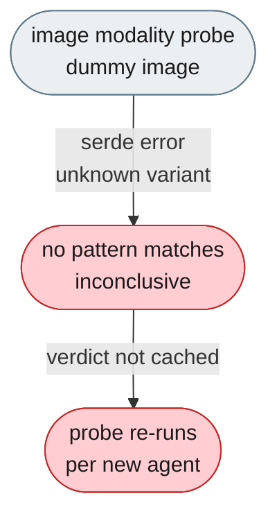
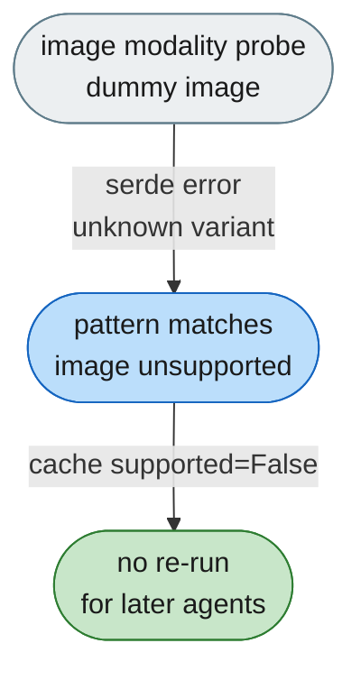

# [Bug]: Image-modality probe fails to detect text-only models and re-runs on every new agent

## Executive Summary

The image-modality probe sends a dummy image to detect whether a model supports native image input, and on rejection it should classify the failure as "image unsupported" and cache the verdict. Text-only gateways reject the probe with a serde-style deserialization error (`unknown variant \`image_url\``) that no rejection pattern matched, so the probe treated the failure as inconclusive and re-ran on every newly created agent. The fix adds the `"unknown variant"` pattern so the rejection is cached as image-unsupported after the first failure.

Issue #498 https://github.com/openJiuwen-ai/agent-core/issues/498
PR #500 https://github.com/openJiuwen-ai/agent-core/pull/500

## 🐞 Detailed Description of the Problem

The image-modality probe (`schedule_image_support_probe`) detects whether a model supports native image input by sending one test message with a dummy image. On text-only models/gateways the request is rejected, and `is_image_modality_rejection()` is supposed to classify that as "image unsupported" so the verdict is cached. Some providers reject the payload with a serde-style deserialization error — `Failed to deserialize the JSON body into the target type: messages[0]: unknown variant \`image_url\`, expected \`text\`` — which none of the existing rejection patterns matched. The probe therefore treated the failure as inconclusive, cached nothing, and re-ran its failed probe on every newly created agent, wasting up to 2 extra API calls per agent.



### Reproduction

1. Configure a text-only model (e.g. `deepseek-v4-flash` via an OpenAI-compatible gateway that validates request bodies).
2. Create a DeepAgent/sub-agent (which triggers the background probe).
3. Server log shows the probe's `llm.invoke` (a single user message with an `image_url`) failing with the "unknown variant" 400, and no `"[ImageModalityProbe] image modality probed: ... supported=False"` line.
4. Create another agent → the probe fires again.

### Results observed

The probe's rejection was treated as inconclusive, so the `supported=False` verdict was never cached and the failed probe call repeated for every new agent.

## Detailed Environment Information Description

Running JiuwenSwarm

## Additional Information

## Version Information

| Version |
|---|
| 0.2.4.beta4 |

## Solution

Paired: [GitHub #500](https://github.com/openJiuwen-ai/agent-core/pull/500) ↔ [GitCode !2307](https://gitcode.com/openJiuwen/agent-core/merge_requests/2307)

**What type of PR is this?**
/kind bugfix

---

## **What does this PR do / why do we need it**

This PR updates the image-modality probe so that serde-style deserialization errors (`unknown variant \`image_url\``) are correctly classified as **image-input unsupported**.
Without this pattern, text-only gateways reject the probe payload but the failure is treated as inconclusive, causing the probe to re-run on every new agent and waste extra API calls.

---

## **Problem**

Text-only models reject the probe's dummy image payload with a clear error, but the probe fails to recognize it. Because the rejection is not classified as "image unsupported", the probe never caches a verdict and fires again for every newly created agent, resulting in unnecessary repeated calls and noisy logs.

Under the hood, `is_image_modality_rejection()` matches against `_IMAGE_INPUT_UNSUPPORTED_ERROR_PATTERNS`. Serde-style errors look like:

```
unknown variant `image_url`, expected `text`
```

but this string was not included in the patterns. The probe therefore treated the failure as inconclusive, skipped caching, and re-ran the probe on every agent initialization.

---

## **Solution**

Add the `"unknown variant"` pattern so the probe immediately recognizes the rejection as "image unsupported" and caches the verdict after the first failure. This eliminates redundant probe calls and correctly marks text-only gateways as non-image-capable.



The fix adds `"unknown variant"` to `_IMAGE_INPUT_UNSUPPORTED_ERROR_PATTERNS` in `image_modality_probe.py`. Once matched, the probe caches `supported=False` and will not re-run for subsequent agents.

---

## **Validation**

- `python -m py_compile openjiuwen/harness/image_modality_probe.py` passes
- Behavior confirmed against text-only OpenAI-compatible gateways
- Matches the reproduction steps described in issue **#498**

---

## **Expected Impact**

- Probe correctly detects text-only models on the first attempt
- Verdict is cached; no repeated probe calls
- Reduced API usage and cleaner logs
- Aligns behavior with other rejection patterns already handled by the probe

<!-- bot1-related-issues -->
Linked Closing Issues:
- Fixes #498
<!-- /bot1-related-issues -->
