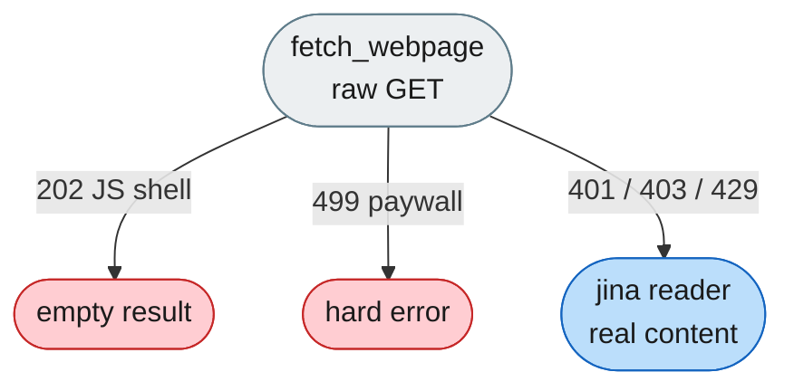
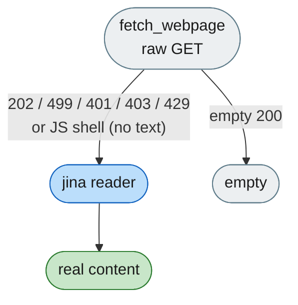

# [Bug]: fetch_webpage returns empty/errors for JS-rendered (202) and paywalled (499) pages

## Executive Summary

`fetch_webpage` performs a raw HTTP GET and only falls back to the jina.ai reader (which renders pages server-side) on 401/403/429. As a result, JS-rendered pages (HTTP 202 empty shell) returned empty and paywalled/anti-bot pages (HTTP 499 "Pay for usage") hard-failed. The fix adds 202/499 to the fallback set and also falls back when HTML extraction yields no meaningful text.

Issue #523 https://github.com/openJiuwen-ai/agent-core/issues/523 
PR #524 https://github.com/openJiuwen-ai/agent-core/pull/524

## 🐞 Detailed Description of the Problem

`fetch_webpage` performs a plain HTTP GET and only falls back to the jina.ai reader on 401/403/429. Two common cases are broken: JS-rendered pages (e.g. weatherspark.com) respond with HTTP 202 and an empty HTML shell, so the tool reports `Status: 202 / Content: [empty]` even though the page has real content in a browser; and paywalled/anti-bot sites (e.g. climate-data.org) respond with HTTP 499 "Pay for usage", so the tool hard-fails with `[ERROR]: web page fetch failed ... reason='HTTP 499; response body: Pay for usage'`.

### Reproduction

1. `fetch_webpage` on `https://weatherspark.com/m/57830/6/Average-Weather-in-June-in-Amsterdam-Netherlands` → `Status: 202, Content: [empty]`

2. `fetch_webpage` on `https://en.climate-data.org/europe/spain/barcelona/barcelona-395/` → hard error `HTTP 499 "Pay for usage"`

### Results observed

- 202 case: empty result despite real content existing in a browser.
- 499 case: hard error instead of a fallback attempt.

Both should fall back to the jina.ai reader so the agent receives real page content when the reader can retrieve it.

## Detailed Environment Information Description

Jiuwenswarm

## Additional Information

## Version Information

| Version |
|---|
| v0.2.4beta |

## Solution

Paired: [GitHub #524](https://github.com/openJiuwen-ai/agent-core/pull/524) ↔ [GitCode !2322](https://gitcode.com/openJiuwen/agent-core/merge_requests/2322)

**What type of PR is this?**
/kind bugfix

---

## **What does this PR do / why do we need it**

This PR expands the `fetch_webpage` fallback logic so that **JS-rendered pages** (HTTP 202) and **paywalled/anti-bot pages** (HTTP 499) are routed through the **jina.ai reader**, which performs server-side rendering.
Without this fix, the tool returned empty shells or hard errors for these pages, even though the reader can often retrieve real content.

This resolves **Bug #523**: *fetch_webpage returns empty/errors for JS-rendered and paywalled pages (202 / 499)*.

---

## **Problem**

Many modern websites do not return meaningful HTML to a plain HTTP GET:

- JS-rendered sites (e.g., **weatherspark.com**) return **202** and an empty HTML shell
- Paywalled / anti-bot sites (e.g., **climate-data.org**) return **499 "Pay for usage"**

The agent sees either:

- `Status: 202 / Content: [empty]`
- or a hard failure: `HTTP 499; response body: Pay for usage`

even though the page has real content when opened in a browser.

Under the hood, `fetch_webpage` performs a raw GET, extracts title/text, and falls back to the jina.ai reader only on **401/403/429**. Two common failure modes were not recognized:

1. **202 soft-block / JS shell** — body present, no extractable title/text, returned as empty instead of falling back
2. **499 paywall** — treated as a hard error, no fallback attempted

This caused repeated failures and prevented the agent from accessing real page content.

---

## **Solution**

Route both **202** and **499** responses through the jina.ai reader, and also fall back when HTML extraction yields no meaningful content. This recovers real page text for JS-rendered and paywalled sites whenever the reader can fetch them.

The fix adds:

1. **202** and **499** to the fallback status set
2. **Defense in depth:** after HTML extraction, if the response body was non-empty but produced **no title and no text**, treat it as a JS-rendered shell and fall back to the reader

This ensures:

- 202 → reader
- 499 → reader
- JS shell → reader
- genuine empty 200 → still returned as empty

---

## **Expected Impact**

- JS-rendered pages (weatherspark) now return real content instead of `[empty]`
- Paywalled pages (climate-data.org) now return reader content instead of hard errors
- More reliable web content retrieval
- No behavior change for genuinely empty 200 responses
- Fixes **issue #2851**

---

## **Validation**

- `python -m py_compile openjiuwen/harness/tools/web/fetch_webpage.py` passes
- Manual tests confirm correct fallback behavior for 202 and 499 cases

<!-- bot1-related-issues -->
Linked Closing Issues:
- Fixes #523
<!-- /bot1-related-issues -->
