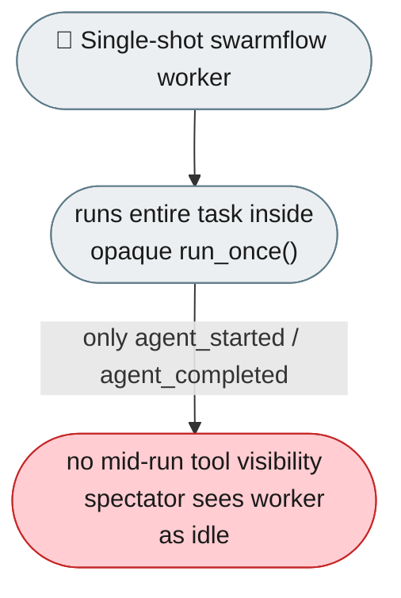
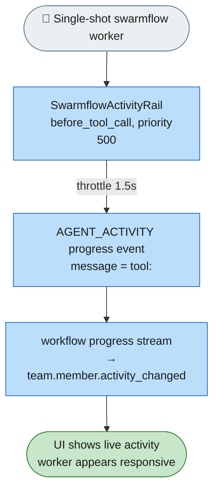

# [Feature]: Emit live AGENT_ACTIVITY events for single-shot swarmflow team-workers

## Executive Summary

Single-shot swarmflow workers executed their whole run inside one opaque `run_once` call, so spectators only saw `agent_started` and `agent_completed` with no visibility into mid-run tool calls. This feature adds a lightweight activity rail that streams each worker's throttled tool-call activity into the workflow progress stream, so the UI shows workers as live and responsive.

Issue #773 https://github.com/openJiuwen-ai/agent-core/issues/773<br>
PR #748 https://github.com/openJiuwen-ai/agent-core/pull/748

## Background Description

Single-shot swarmflow workers often perform multiple tool calls internally, but none of those actions were visible to the UI — to spectators the worker appeared idle until it suddenly completed, which made debugging hard and made the Swarm Map feel opaque. Technically, the workflow engine only emitted start/end events for single-shot workers, with no mechanism to capture mid-run tool calls, throttle bursts, attach activity to the correct worker instance, or forward it through the progress stream.



## Design Ideas

### Proposed design

- **`SwarmflowActivityRail`** — a new `AgentRail(priority=500)` hooks `before_tool_call` and forwards the tool name to an activity sink; attached only when a deterministic `agent_id` is present.
- **Throttling** — minimum 1.5 s between emissions, so bursts of tool calls produce at most one activity event per interval.
- **New progress kind** — `ProgressKind.AGENT_ACTIVITY`, so downstream consumers can group activity under the correct workflow node.
- **Backend progress-sink seam** — `progress_sink` property and `bind_progress_sink()` on the backend base let backends emit mid-run progress events, not just start/end hooks; a `None` sink makes activity emission a no-op.
- **Wiring** — `agent()` passes a deterministic `agent_id`; the backend injects it into a copy of opts; `run_workflow` binds the run's sink to the backend.
- **Fire-and-forget** — the activity emitter builds `WorkflowProgressEvent(kind=AGENT_ACTIVITY, ...)` with `message=f"tool: {tool_name}"`, swallowing exceptions so worker execution is never broken.


### Rejected alternatives

- **Emit every tool call without throttling** — gives maximum detail but spams the stream on tool-call bursts; the 1.5 s throttle was chosen to keep the UI responsive.
- **Attach the rail unconditionally** — simpler, but risks mis-attributing activity when no deterministic `agent_id` exists; strict attribution was chosen over simplicity.

## Involved Public APIs

| API | Kind |
|---|---|
| `ProgressKind.AGENT_ACTIVITY` | new kind |
| `SwarmflowActivityRail` | new class (`AgentRail`, priority 500) |
| `progress_sink` property / `bind_progress_sink()` | new backend base seam |

**Impact:** additive. No existing event kind, backend hook contract, or `agent()` call signature changes. When `progress_sink` is `None`, activity emission is a silent no-op (existing tests keep passing).

## Description of Relevance to Other Modules

- **`agent_teams/workflow/backends/team_worker_backend.py`** — hosts `SwarmflowActivityRail` and the activity emitter; attaches the rail only when `agent_id` is present.
- **`agent_teams/workflow/engine/progress.py`** — gains `ProgressKind.AGENT_ACTIVITY`; docs updated for `agent_id`/`phase`/`label`/`message` semantics.
- **`agent_teams/workflow/engine/backends/base.py`** — new `progress_sink` seam; a `None` sink is a no-op.
- **`agent_teams/workflow/engine/primitives.py`** / **`agent_teams/workflow/engine/runner.py`** — `agent()` passes `agent_id`; `run_workflow` binds the sink to the backend.

## Test Design and Test Plan

Unit tests (`test_worker_backend.py`):

1. **Rail emits tool name** — `before_tool_call` forwards the tool name to the activity sink.
2. **Throttling** — bursts of tool calls produce at most one activity event per 1.5 s interval.
3. **Emitter shape** — builds a correctly shaped `WorkflowProgressEvent(kind=AGENT_ACTIVITY, agent_id, phase, label, message)`.
4. **No-sink no-op** — when `progress_sink` is `None`, activity emission is a silent no-op.
5. **Attribution** — the rail is attached only when a deterministic `agent_id` is present.

Integration tests:

- **End-to-end** — a single-shot worker's tool calls flow through the progress stream and surface as `team.member.activity_changed` events attributed to the correct workflow node.

Performance/reliability:

- **Throttle behaviour** — verify no spam under tool-call bursts; worker execution is never broken by a failing emitter (exceptions swallowed).

## Additional Information

## Solution

Paired: [GitHub #748](https://github.com/openJiuwen-ai/agent-core/pull/748) ↔ [GitCode !2403](https://gitcode.com/openJiuwen/agent-core/merge_requests/2403)

**What type of PR is this?**
/kind feature

---

## **What does this PR do / why do we need it**

This PR makes **single-shot swarmflow workers** fully observable by streaming their **live tool activity** into the workflow progress stream.
Previously, a one-shot worker executed its entire run inside a single opaque `run_once` call, so spectators only saw `agent_started` and `agent_completed` with no visibility into mid-run actions.
With this change, spectators now see each worker's current tool call in real time, just like multi-step workers.

Issue #773

---

## **Problem**

Single-shot workers often perform multiple tool calls internally, but none of these actions were visible to the UI — to spectators the worker appeared idle until it suddenly completed, which made debugging hard and made the Swarm Map feel unresponsive and opaque. Under the hood, the workflow engine only emitted `agent_started`/`agent_completed` start/end events for these single-shot workers, so there was no mechanism to capture mid-run tool calls, throttle bursts of activity, attach activity to the correct worker instance, or forward it through the workflow progress stream. As a result, single-shot workers had **no live telemetry**.

---

## **Solution**

Introduce a lightweight activity rail that listens for tool calls and emits throttled activity events. These events flow through the workflow progress stream and appear in the UI as `team.member.activity_changed`, giving spectators a real-time view of what the worker is doing.



The feature consists of several coordinated changes:

---

## **1. SwarmflowActivityRail (team_worker_backend.py)**

A new `AgentRail(priority=500)` hooks `before_tool_call` and forwards the tool name to an activity sink.

Key behaviors:

- **Throttling:** minimum 1.5s between emissions
- **Strict attribution:** rail is attached only when a deterministic `agent_id` is present
- **Fire-and-forget:** failures are debug-logged only

This ensures bursts of tool calls produce at most one activity event per interval.

---

## **2. New progress kind: `AGENT_ACTIVITY` (progress.py)**

Adds:

- `ProgressKind.AGENT_ACTIVITY`
- Updated docs clarifying that `agent_id`, `phase`, `label`, and `message` apply to this kind

Downstream consumers can now group activity under the correct workflow node.

---

## **3. Backend progress-sink seam (base.py)**

Adds:

- `progress_sink` property
- `bind_progress_sink()` method

This allows backends to emit mid-run progress events, not just engine start/end hooks.
If `progress_sink` is `None`, activity emission becomes a no-op (used in tests).

---

## **4. Wiring (primitives.py, runner.py, team_worker_backend.py)**

- `agent()` passes deterministic `agent_id` into `_call_backend`
- Backend injects `agent_id` into a **copy** of opts (not the journaled original)
- `run_workflow` binds the run's sink to the backend
- Worker attaches the activity rail when `agent_id` is present

This ensures activity events are correctly routed and attributed.

---

## **5. Activity emitter closure**

`_make_activity_emitter` builds:

```
WorkflowProgressEvent(
    kind=AGENT_ACTIVITY,
    agent_id=...,
    phase=...,
    label=...,
    message=f"tool: {tool_name}",
)
```

Exceptions are swallowed (debug-logged only) to avoid breaking worker execution.

---

## **6. Tests (test_worker_backend.py)**

Three new tests verify:

- rail emits the tool name
- rail throttles bursts correctly
- emitter builds a properly shaped `AGENT_ACTIVITY` event
- no-sink case is a silent no-op

Existing worker backend tests were updated for the new signature.

---

## **Expected Impact**

- Single-shot workers now show **live tool activity** during execution
- Activity is correctly attributed to the right workflow node
- Bursts are throttled to avoid spam
- UI spectators (e.g., Swarm Map) see workers as active and responsive
- Debugging and workflow introspection become significantly easier

---

## **Self-checklist**

- [x] **Design**: Reviewed with maintainers
- [x] **Test**: New tests added and passing
- [x] **Verification**: Confirmed correct activity flow end-to-end
- [ ] **Interface**: No external API changes
- [x] **Document**: Updated progress kind docs
