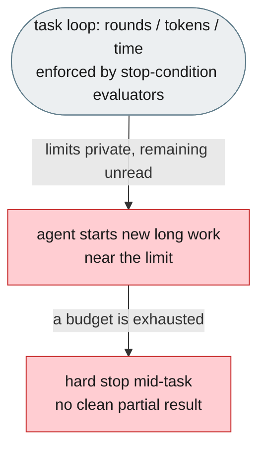
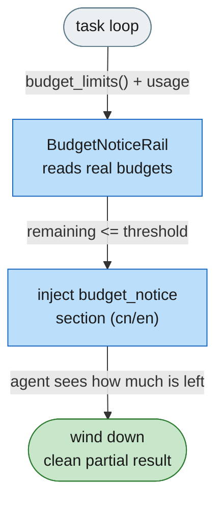
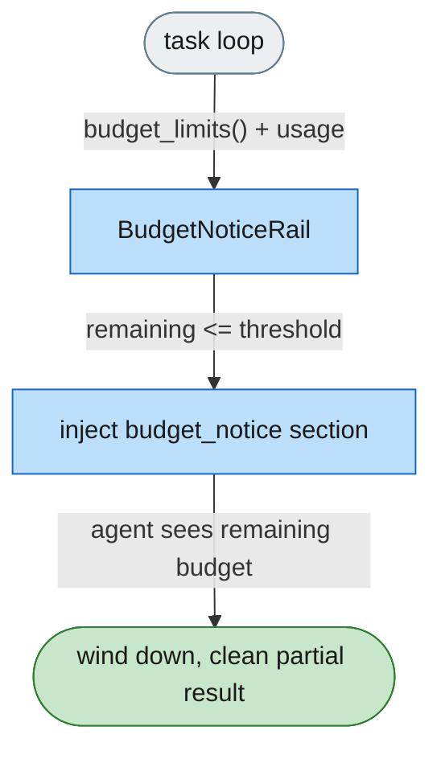

# [Feature]: Budget-notice rail — multi-resource wind-down warnings for the task loop (agent-core)

## Executive Summary

Agents run under three hard budgets — task-loop rounds, cumulative tokens, and wall-clock time — all enforced by the stop-condition evaluators, but nothing tells the model how much remains, so long runs are cut off mid-task with no clean wrap-up. This feature adds a generic, host-agnostic `BudgetNoticeRail` that reads the loop's *actual* budgets through a new `LoopCoordinator.budget_limits()` and injects a localized "wind down" prompt section when any resource is near its limit. The rail is passive: the evaluators still own stopping; the rail only helps the run land gracefully.

Issue #1348 https://github.com/openJiuwen-ai/agent-core/issues/1348 
PR #1349 https://github.com/openJiuwen-ai/agent-core/pull/1349

## Background Description

DeepAgent's outer task loop is bounded by a chain of `StopConditionEvaluator`s (`openjiuwen/harness/schema/stop_condition.py`): `MaxRoundsEvaluator` (rounds), `TokenBudgetEvaluator` (cumulative tokens), `TimeoutEvaluator` (wall-clock), plus predicate evaluators (`CompletionPromiseEvaluator`, `NoProgressAnswerEvaluator`, `CustomPredicateEvaluator`). `LoopCoordinator.should_continue()` ORs them, so whichever budget is exhausted first ends the run.

`LoopCoordinator` tracks `_iteration`, `_token_usage`, and `_start_time`, but the hard limits live as private attributes on the evaluators and are never exposed. No component reads the remaining budget and no prompt section communicates it to the model, so agents start new long work late in a run and are terminated abruptly — no graceful degradation, no partial result.

This is the agent-core part of the fix: a reusable rail plus the small plumbing that makes the loop's budgets observable. The jiuwenswarm layer only maps host config onto this rail.

## Design Ideas

### Proposed design

- **Single source of truth for limits** — add `StopConditionEvaluator.budget() -> BudgetLimit | None`; the three resource evaluators return `rounds` / `tokens` / `seconds` limits, predicate evaluators return `None`. `LoopCoordinator` aggregates them via `budget_limits()` and exposes `token_usage` / `elapsed_seconds`. The rail never carries its own copy of a limit, so its warnings cannot drift from what actually stops the loop.
- **Passive warning rail** — `BudgetNoticeRail(DeepAgentRail)` fires on `before_model_call`, computes `remaining = limit - used` per budget, and injects a system-prompt section only when a resource is near its limit. It never stops the loop and never mutates evaluators.
- **Multi-resource thresholds** — per-kind threshold, absolute or ratio: `round_remaining` (absolute remaining rounds, overrides `round_ratio`), `round_ratio` (default 20%), `token_ratio` (default 15%), `time_ratio` (default 15%). Only near-limit resources are listed; a healthy run gets no section.
- **Localized section** — `build_budget_notice_section(language, notices)` in `prompts/sections/budget_notice.py` renders `cn` / `en` templates into `PromptSection(name=SectionName.BUDGET_NOTICE, priority=95)`.
- **Declarative assembly** — register `@harness_element(ElementKind.RAIL, name="core.budget_notice")` with `BudgetNoticeInput` so hosts using manifest assembly can include it by name; the rail can also be constructed directly.
- **TaskCompletionRail override** — when `enable_task_loop`, `DeepAgent` injects a default `TaskCompletionRail` only if the caller supplied none, so a host can pass a `TaskCompletionRail(max_rounds=…, timeout_seconds=…)` to make the loop budgets real.
- **Cleanup** — `before_invoke` clears any stale notice and `uninit` removes the section so nothing bleeds across invocations.

### Rejected alternatives

- **Rail-owned `max_iterations` / thresholds** — recreates a parallel limit that can drift from the real cap.
- **Rail participating in stopping** — overlaps the evaluators' responsibility and breaks the "stop conditions own stopping" boundary.
- **One rail per resource** — three sections competing for one prompt slot, duplicated lifecycle, no benefit.
- **Rounds-only** — tokens and time get hard-stopped too and deserve the same wind-down signal.

## Involved Public APIs

New public classes / symbols:

| API | Kind |
|---|---|
| `BudgetNoticeRail` | new class (`DeepAgentRail`) |
| `BudgetLimit` | new dataclass (`kind`, `limit`) in `schema/stop_condition.py` |
| `StopConditionEvaluator.budget()` | new method on the evaluator ABC |
| `LoopCoordinator.token_usage` / `elapsed_seconds` / `budget_limits()` | new read-only accessors |
| `build_budget_notice_section` | new section builder (`prompts/sections/budget_notice.py`) |
| `SectionName.BUDGET_NOTICE` | new section-name constant |
| `core.budget_notice` | new manifest rail element |

Config additions (rail element parameters):

| Field | Type | Default |
|---|---|---|
| `enabled` | bool | `true` |
| `round_remaining` | int \| null | `null` (falls back to ratio) |
| `round_ratio` | float \| null | `0.20` |
| `token_ratio` | float \| null | `0.15` |
| `time_ratio` | float \| null | `0.15` |

**Impact:** additive. No existing rail, prompt, or stop-condition contract changes; the rail only mutates the system prompt when a budget is near its limit. `budget()` defaults to `None`, so third-party evaluators are unaffected. The `TaskCompletionRail` auto-inject guard is a bug fix so caller-supplied instances are honored.

## Description of Relevance to Other Modules

- **`openjiuwen/harness/rails/budget_notice_rail.py`** — the new rail; self-contained, no host dependency.
- **`openjiuwen/harness/schema/stop_condition.py`** — `BudgetLimit` + `budget()` overrides on `MaxRoundsEvaluator` / `TokenBudgetEvaluator` / `TimeoutEvaluator`.
- **`openjiuwen/harness/task_loop/loop_coordinator.py`** — the observability accessors the rail reads.
- **`openjiuwen/harness/prompts/sections/`** — the localized section content (`budget_notice.py`, `SectionName.BUDGET_NOTICE`).
- **`openjiuwen/harness/manifest/harness_elements.py`** + **`rails/__init__.py`** — element registration and export.
- **`openjiuwen/harness/deep_agent.py`** — `TaskCompletionRail` override guard.

## Test Design and Test Plan

Unit tests (`tests/unit_tests/harness/rails/test_budget_notice_rail.py`, 13 tests):

1. **Budget plumbing** — `budget()` returns the right `BudgetLimit` for rounds/tokens/seconds and `None` for predicate evaluators; `LoopCoordinator.budget_limits()` aggregates in order; usage accessors report iteration / token_usage / elapsed.
2. **Section builder** — empty notices → `None`; `cn` / `en` render the localized label and text.
3. **Rail behavior** — token near limit → section injected; healthy budget → no section; absolute `round_remaining` threshold; `enabled=False` never injects; stale section removed when the budget recovers; `before_invoke` and `uninit` clear the section.

Performance / reliability:

- No overhead far from the limit: the rail only adds a section when a budget is close; otherwise it removes a no-op section.
- Passive by construction: no evaluator mutation, no extra model calls, no blocking I/O.

## Additional Information

Baseline: `python -m pytest tests/unit_tests/harness/rails/test_budget_notice_rail.py -q --no-cov` → **13 passed**. Surrounding suites (`harness/rails`, `harness/prompts`, `harness/manifest`, `harness/task_loop`) → **966 passed**.

## Solution

Paired: [GitHub #1349](https://github.com/openJiuwen-ai/agent-core/pull/1349) ↔ [GitCode !__GITCODE_MR__](https://gitcode.com/openJiuwen/agent-core/merge_requests/__GITCODE_MR__)

**What type of PR is this?**
/kind feature

---

## **What does this PR do / why do we need it**

This PR adds a generic **budget-notice rail** plus the loop-budget observability it needs. When the task loop is running low on rounds, tokens, or wall-clock time, the agent now receives a localized system-prompt notice telling it how much remains and to finish cleanly with a partial result and an explicit statement of what is left.

### **Why this matters**

- **No silent cut-offs** — the agent knows which budget is nearly spent and wraps up.
- **All budgets covered** — rounds, tokens, and time.
- **No drift** — warnings read the loop's real limits, so they always match what stops the run.
- **Host-agnostic** — usable by any DeepAgent harness.
- **Zero behavior change far from the limit** — passive, no extra calls, no blocking.

---

## **Which issue(s) this PR fixes**

Fixes #1348

---

## **What scenarios were tested, and what were the verification results（Function, performance, reliability, etc.）**

### **Functional verification**
- `budget()`/`budget_limits()` expose rounds/tokens/seconds limits; predicate evaluators contribute nothing.
- Rail injects the notice when token/rounds budgets are near their thresholds (ratio and absolute).
- No notice when the budget is healthy; `enabled=False` never injects.
- `before_invoke` / `uninit` remove the section; a recovered budget clears the stale notice.
- `cn` / `en` section text renders correctly.

### **Performance & reliability**
- No overhead far from the limit; the rail performs no I/O, no model calls, and never mutates evaluators.

---

## **Self-checklist**

- [x] **Design**: Reviewed; rail is passive and reads the loop's real budgets
- [x] **Test**: 13 unit tests; surrounding harness suites green (966 passed)
- [x] **Verification**: Function/threshold/cleanup scenarios covered
- [x] **Interface**: Additive only (`budget()` defaults to `None`)
- [x] **Document**: Feature doc `F_04_budget-notice-rail.md` + spec updates (S_03/S_04/S_06)
