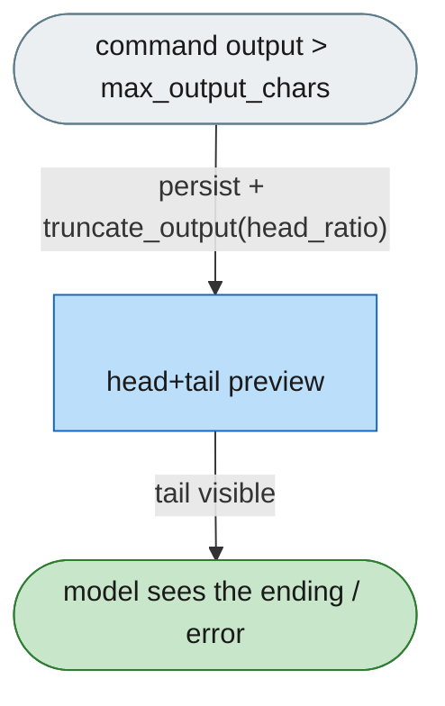
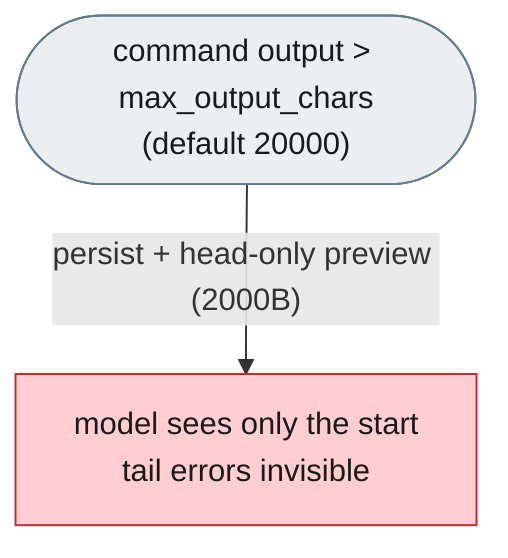
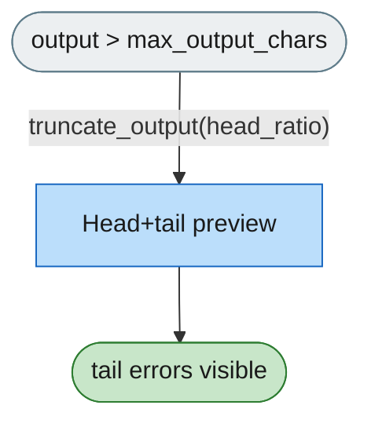

# [Feature]: Head+tail truncation for large BashTool / PowerShellTool output

## Executive Summary

`BashTool` / `PowerShellTool` persist output larger than `max_output_chars` (default 20000) to a temp file and return a `<persisted-output>` block whose preview is **head-only** (first 2000 bytes). `_output.py` already ships `truncate_output(text, max_chars, head_ratio)` that keeps both the head and the tail with a gap marker, but nothing ever calls it, so the tail of a large output — normally the error or final status — is invisible to the model. This feature makes the shell tools render a **head+tail** preview using that existing helper, with a configurable `head_ratio`, so long runs fail honestly instead of being cut off with no end state.

It also relocates behavior that a host (jiuwenswarm) had been adding by monkey-patching the tool class, back to where the tool lives.

Issue #1378<br>
PR #1379

## Background Description

Shell output handling lives in `openjiuwen/harness/tools/shell/{bash,powershell}/_output.py`. For output larger than `max_output_chars`, `render_tool_content` persists the merged output via `persist_large_output` and shows a `<persisted-output>` message built by `_generate_preview` — a **head-only** cut of the first 2000 bytes. The head+tail helper `truncate_output` exists in the same module but is unused (dead code).


Because the tail is dropped, failures from large outputs (e.g. a long test run's assertion at the end) never reach the model. A host consumed by a product had been compensating by monkey-patching `BashTool`/`PowerShellTool` from outside — a fragile patch over private attributes and the persisted temp file. This is the agent-core part of the fix: the behavior belongs to the tool.

## Design Ideas

### Proposed design

- **Use the existing helper.** In `render_tool_content`, the oversized branch renders the preview with `truncate_output(cleaned_merged, max_output_chars, head_ratio=output.head_ratio)` and keeps the persisted file plus its path in the `<persisted-output>` block. `truncate_output` stops being dead code.
- **Configurable ratio.** `CommandOutput` gains `head_ratio: float = 0.6`. `BashTool` / `PowerShellTool` accept a per-call `head_ratio` input (default 0.6, overridable with `BASH_TOOL_HEAD_RATIO` / `POWER_SHELL_TOOL_HEAD_RATIO`), threaded into every `CommandOutput` including the failure path that surfaces partial output.
- **Cleanup.** Remove `_generate_preview` and `_PREVIEW_SIZE_BYTES` (only served the head-only preview); `_build_persisted_message` now labels the section `Head+tail preview:`.
- **Unchanged thresholds.** Inputs above the limit are still persisted to a temp file at the same `max_output_chars` (20000); small output is still inlined and never persisted.



### Rejected alternatives

- **Keep the host monkey-patch.** It reads private attributes and the persisted file, duplicates upstream behavior, and can silently break on any tool refactor.
- **Add a rail / `post-execute` plugin to rewrite output.** Output rendering is part of the tool's own contract; a plugin adds lifecycle and applies inconsistently across consumers.
- **Keep head-only.** Does not fix the reported problem — the tail errors stay invisible.
- **Bind the ratio to the helper's `0.8` default.** The host behavior being moved used `0.6`; keeping it as the tool default preserves behavior.

## Involved Public APIs

| API | Kind | Change |
|---|---|---|
| `CommandOutput` (`bash`/`powershell` `_output.py`) | dataclass | + `head_ratio: float = 0.6` |
| `render_tool_content` | function | oversized branch now head+tail via `truncate_output` |
| `BashTool` / `PowerShellTool` inputs | tool input | + `head_ratio` (default 0.6) |
| `BASH_TOOL_HEAD_RATIO` / `POWER_SHELL_TOOL_HEAD_RATIO` | env | new default override |
| `_generate_preview` / `_PREVIEW_SIZE_BYTES` | internal | removed |
| `truncate_output` | function | now live (was unused) |

**Impact:** behavior change for oversized shell output only (head-only → head+tail). Small output and the persistence threshold are unchanged. No rail, prompt, or stop-condition contract changes.

## Description of Relevance to Other Modules

- **`openjiuwen/harness/tools/shell/bash/{_output,_tool}.py`** and the **`powershell`** twins — the whole change.
- **Hosts (e.g. jiuwenswarm)** — drop their monkey-patch; the tool now owns head+tail. Their own `mcp_exec_command`-style tools keep their independent truncation.
- No dependency on rails, the task loop, or prompts.

## Test Design and Test Plan

Unit tests:

- `tests/unit_tests/harness/tools/test_bash/test_output.py` — oversized output contains both head and tail markers and the `Head+tail preview:` label inside `<persisted-output>`; small output is inlined; `head_ratio` controls the split; `CommandOutput.head_ratio` defaults to 0.6. Existing `truncate_output` tests unchanged.
- `tests/unit_tests/harness/tools/test_powershell/test_output.py` (new) — the same for PowerShell.
- Existing `test_bash_tool.py` `<persisted-output>` persistence tests remain green.

Performance / reliability:

- No added I/O or model calls; the same single persist + render path, just a head+tail cut instead of head-only.

## Additional Information

Behavior parity: the product-visible effect — large shell output shows head+tail with the full-output path and the persistence threshold unchanged, `head_ratio` default 0.6 — is identical to the behavior previously produced by the host-side patch, now owned by the tool.

---

## Solution

### PR title

`feat(harness): render large BashTool / PowerShellTool output as head+tail`

Paired: [GitHub #1379](https://github.com/openJiuwen-ai/agent-core/pull/1379) ↔ [GitCode !<mr>](https://gitcode.com/openJiuwen/agent-core/merge_requests/<mr>)

**What type of PR is this?**
/kind feature

---

## **What does this PR do / why do we need it**

Makes the shell tools render large output as a head+tail preview (using the existing `truncate_output`), so the end of a long output — where errors and final status live — is always visible to the model, with a configurable split.

**Before** — head-only preview drops the tail:



**After** — head+tail preview keeps both ends:



### **The change, by file**

1. **`openjiuwen/harness/tools/shell/bash/_output.py`** (and the `powershell` twin)
   - `CommandOutput` gains `head_ratio: float = 0.6`.
   - `render_tool_content`'s oversized branch renders the preview with
     `truncate_output(cleaned_merged, max_output_chars, head_ratio=output.head_ratio)` and keeps the
     persisted file plus its path in the `<persisted-output>` block; the label becomes
     `Head+tail preview:`.
   - Removed `_generate_preview` / `_PREVIEW_SIZE_BYTES` (they served only the head-only cut);
     `_build_persisted_message(filepath, original_size, preview)`.
2. **`openjiuwen/harness/tools/shell/bash/_tool.py`** (and the `powershell` twin)
   - `head_ratio` added to the parsed inputs (`_BashInputs` / `_PowerShellInputs`) via
     `_resolve_head_ratio(raw, default=0.6)`, clamped to `[0, 1]`; env `BASH_TOOL_HEAD_RATIO` /
     `POWER_SHELL_TOOL_HEAD_RATIO` overrides the default.
   - Threaded into all three `CommandOutput` sites: invoke success, invoke failure (partial output),
     stream final.
   - Unchanged: `max_output_chars` default `20000`, the persistence threshold, the temp-file path.

### **Rendered output (before → after)**

Before — head-only, first 2000 bytes:

```
<persisted-output>
Output too large (123.4KB). Full output saved to: /tmp/openjiuwen_bash_outputs/bash_ab12cd34.txt

Preview (first 2KB):
<first 2000 bytes of output>
...
</persisted-output>
```

After — head+tail (60 / 40 by default):

```
<persisted-output>
Output too large (123.4KB). Full output saved to: /tmp/openjiuwen_bash_outputs/bash_ab12cd34.txt

Head+tail preview:
<first 60% of max_output_chars>

... [1234 lines omitted] ...

<last 40% of max_output_chars>
</persisted-output>
```

### **Why this matters**

- **No lost tail** — errors / final status stay visible for long runs (pytest, builds, installs).
- **Configurable** — `head_ratio` per call (env override), default 0.6; `max_output_chars` still 20000.
- **No dead code** — `truncate_output` is now the single live implementation.
- **Owned where the tool lives** — hosts no longer monkey-patch the tool class.

### **Expected impact**

- The model always sees the end of a large command's output, so failures are diagnosable without
  re-running the command.
- Small output is unchanged (inline, never persisted); the persistence threshold is unchanged.
- Any consumer of `BashTool` / `PowerShellTool` gets head+tail by default, with no host-side code.

---

## **Which issue(s) this PR fixes**

Fixes #1378

---

## **What scenarios were tested, and what were the verification results（Function, performance, reliability, etc.）**

### **Functional verification**
- Oversized output renders head+tail (both ends present, gap marker, `<persisted-output>` + path).
- `head_ratio` changes the split; small output stays inline.
- Threshold and persistence behavior unchanged.

### **Performance & reliability**
- Same single persist+render path; no extra I/O, no model calls.

---

## **Self-checklist**

- [x] **Design**: tool-owned head+tail via existing `truncate_output`; no host patching
- [x] **Test**: bash + powershell `test_output.py`; existing persistence tests green
- [x] **Verification**: head+tail, ratio, small-output, threshold scenarios
- [x] **Interface**: `head_ratio` added with a default; small-output path unchanged
- [x] **Document**: feature doc `F_04_bash-output-head-tail-truncation.md` + spec `S_05`
