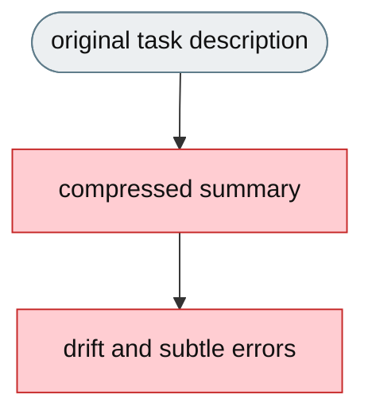
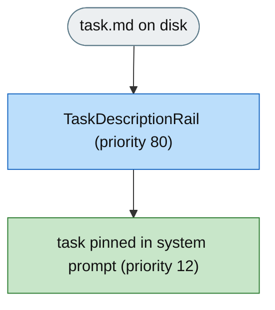

# [Feature]: Task-description rail — pin a task file into the system prompt (agent-core)

## Executive Summary

On long tasks the harness compresses old conversation history, and the original task description can vanish from the model's visible context — the agent then works from a compressed summary instead of the real instructions. This feature adds a generic `TaskDescriptionRail` (`DeepAgentRail`) that reads a task-description file from disk and pins it as a dedicated system-prompt section. Because the system prompt is rebuilt from prompt sections on every model call and is never compressed, the agent always sees the original task no matter how long the conversation has grown.

The rail is framework-level: the code lives in `openjiuwen/harness/rails`, and an integrator opts in by instantiating it with a file path. No agent-core configuration field is added.

Issue #1396<br>
PR #1397

## Background Description

Context compression operates only on conversation messages; the system prompt is assembled from `PromptSection`s on every call and is never compressed. Before this change there was no generic mechanism to keep a file's content pinned in the system prompt across an entire run, so on long tasks the original task description could be compressed away and the agent drifted from its real instructions. This matters most for tasks with strict output formats, exact file names, precise constraints, and multi-step requirements.


## Design Ideas

### Proposed design

- **`TaskDescriptionRail`** — a `DeepAgentRail` (rail `priority=80`, the `HeartbeatRail` tier) that reads a task-description file from disk and pins it as a dedicated system-prompt section on every model call.
- **Pinned section** — injects `PromptSection(name=SectionName.TASK_DESCRIPTION, priority=12)`, placed after `IDENTITY` (10) and before `SAFETY` (20), so the agent reads the task right after its identity preamble; the section lives in the system prompt, never the conversation history, so compression never touches it.
- **Lifecycle** — `before_invoke` clears any stale section and attempts an immediate read; `before_model_call` retries injection if the file was not available at invoke time (handles late-mounted volumes).
- **Constructor-only configuration** — the rail takes a `task_path: str`; there is no `DeepAgentConfig` field. Whether and how to enable it is the integrator's decision.
- **`uninit` cleanup** — removes the injected section and clears the builder reference, so hot-reload never leaks a stale section.


### Rejected alternatives

- **Inject into conversation history.** The very thing compression drops — defeats the purpose.
- **Add `task_description` to `DeepAgentConfig`.** A single optional, file-sourced rail doesn't justify widening the framework config surface; a constructor argument is enough and keeps the config where it belongs (the integrator).
- **Read once at `init`.** Misses task files mounted asynchronously after the agent starts (common in CI/benchmarks); `before_model_call` retry covers that.
- **A prompt-only mechanism (no rail).** A rail gives the lifecycle hooks (invoke / model-call / uninit) needed to keep the section fresh and to tear it down cleanly on reload.

## Involved Public APIs

| API | Kind | Change |
|---|---|---|
| `TaskDescriptionRail` | class | new (`openjiuwen/harness/rails/task_description_rail.py`, exported from `openjiuwen.harness.rails`) |
| `SectionName.TASK_DESCRIPTION` | constant | new (`openjiuwen/harness.prompts.sections`) |

**Impact:** purely additive and opt-in. No existing rail, prompt, or spec contract changes. A consumer that never instantiates the rail is unaffected.

## Description of Relevance to Other Modules

- **`openjiuwen/harness/rails/`** — the new rail, alongside other section-injecting rails (`HeartbeatRail`).
- **`openjiuwen/harness/prompts/sections`** — adds the `TASK_DESCRIPTION` section name constant.
- **`openjiuwen.harness.prompts.PromptSection` / `SystemPromptBuilder`** — existing injection surface the rail uses; no new prompt infrastructure.
- **Integrators (e.g. jiuwenswarm)** — instantiate `TaskDescriptionRail(path)` and register it on the agent, gated on their own config.

## Test Design and Test Plan

Unit tests (`tests/unit_tests/harness/rails/test_task_description_rail.py`):

1. **Injection** — a populated file produces a `PromptSection` with a `{cn, en}` language mapping and the expected content.
2. **Empty file** — not marked injected; a later `before_model_call` injects once the file is populated.
3. **Missing file** — not marked injected; no section, no crash.
4. **`uninit`** — removes the injected section and clears the builder reference.

Performance / reliability:

- File read happens once per invoke (and only retries while the file is absent); no added I/O on the hot path when the file is present.

## Additional Information

Behavior: the pinned section is additive and independent of the loop, rails, or prompts. Rail priority 80 and section priority 12 are deliberate — the rail initializes in the `HeartbeatRail` tier (after tool/planning rails, before resilience/evolution), and the section renders immediately after the identity preamble.

---

## Solution

### PR title

`feat(harness): add TaskDescriptionRail to pin a task file in the system prompt`

Paired: [GitHub #1397](https://github.com/openJiuwen-ai/agent-core/pull/1397) ↔ [GitCode !2836](https://gitcode.com/openJiuwen/agent-core/merge_requests/2836)

**What type of PR is this?**
/kind feature

---

## **What does this PR do / why do we need it**

Adds a generic `TaskDescriptionRail` that pins a task-description file into the system prompt, so the original task stays visible for the whole run and is never compressed away.

**Before** — the task can be compressed out of the conversation:



**After** — the task is pinned in a never-compressed system-prompt section:



### **The change, by file**

1. **`openjiuwen/harness/rails/task_description_rail.py`** (new)
   - `TaskDescriptionRail(DeepAgentRail)` with rail `priority = 80` — the `HeartbeatRail` tier, so it
     initializes after the tool/planning rails (90–95) and before the resilience/evolution tiers
     (70–60). Section *ordering* is a separate axis, controlled by the `PromptSection` priority below.
   - `__init__(task_path: str)` — the only configuration surface; no `DeepAgentConfig` field is added,
     so whether and how to enable the rail is the integrator's decision.
   - `init(agent)` captures `agent.system_prompt_builder`; `uninit(agent)` calls
     `system_prompt_builder.remove_section(SectionName.TASK_DESCRIPTION)` and clears the reference, so
     hot-reload never leaks a stale section.
   - `before_invoke` clears any previous section, resets `_injected`, and reads the file;
     `before_model_call` calls `_try_inject()` again while `_injected` is false, covering task files
     mounted after the agent starts (e.g. late-mounted volumes).
   - `_try_inject()` reads the file and, when non-empty, injects
     `PromptSection(name=SectionName.TASK_DESCRIPTION, content={"cn": body, "en": body}, priority=12)`
     with `body = "# Task Description\n\n<file contents>"`.
   - `_read_file()` returns `None` on a missing/unreadable file and logs a warning — no crash, no side
     effect — and `_injected` stays false so the next model call retries.
2. **`openjiuwen/harness/prompts/sections/__init__.py`**
   - Adds `TASK_DESCRIPTION = "task_description"` to the `SectionName` constants.
3. **`openjiuwen/harness/rails/__init__.py`**
   - Imports and exports `TaskDescriptionRail` alongside the other rails (alphabetically after
     `TaskCompletionRail`).

### **What the pinned section looks like**

The rail injects a section whose rendered body is:

```
# Task Description

<contents of task.md>
```

Section priority 12 places it in the assembled prompt immediately after the identity section (priority
10) and before the safety/rules section (priority 20), so the agent reads the task right after learning
who it is:

```
[identity / persona]          # IDENTITY        (priority 10)
# Task Description            # task_description (priority 12)
{task.md contents}
[safety / rules]              # SAFETY          (priority 20)
...
```

Because this section lives in the system prompt (rebuilt from sections on every model call), it is never
touched by conversation-history compression.

### **Why this matters**

- **No lost task** — the original description survives any amount of context compression, so the agent
  never works from a degraded summary on long runs.
- **Generic and reusable** — any integrator pins a task file with one `TaskDescriptionRail(path)` call;
  nothing in the rail is product-specific, so jiuwenswarm and others share the same behavior.
- **Opt-in and cheap** — a consumer that never instantiates the rail pays nothing; when enabled, the
  only cost is one file read per invocation.
- **Late-mount tolerant** — `before_model_call` retries until the file appears, matching CI/benchmark
  setups where the task file lands after the agent starts.

### **Expected impact**

- The model always sees the full original task, eliminating drift from compressed summaries and subtle
  errors on tasks with strict formats, exact filenames, or precise constraints.
- Late-mounted task files are picked up automatically; empty/missing files inject nothing and are
  retried rather than failing.
- Additive only: no existing rail, prompt, or config contract changes; consumers that don't opt in are
  unaffected.

---

## **Which issue(s) this PR fixes**

Fixes #1396

---

## **What scenarios were tested, and what were the verification results（Function, performance, reliability, etc.）**

### **Functional verification**
- Populated file → section injected with `{cn, en}` mapping.
- Empty / missing file → not injected; populated later → injected on next model call.
- `uninit` → section removed, builder reference cleared.

### **Performance & reliability**
- One read per invoke; retry only while the file is absent; no hot-path cost when present.

---

## **Self-checklist**

- [x] **Design**: generic `DeepAgentRail`, constructor-only config, no framework config field
- [x] **Test**: `test_task_description_rail.py` covers injection, retry, and cleanup
- [x] **Verification**: section pinned across model calls; `uninit` leaves no residue
- [x] **Interface**: additive only (`TaskDescriptionRail`, `SectionName.TASK_DESCRIPTION`)
- [x] **Document**: feature doc `F_04_task-description-rail.md` + spec `S_04`
