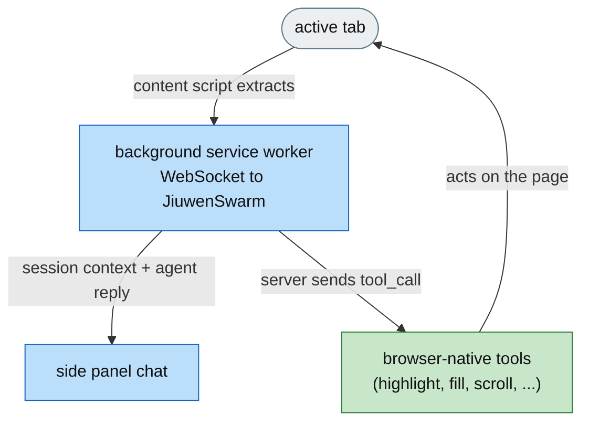
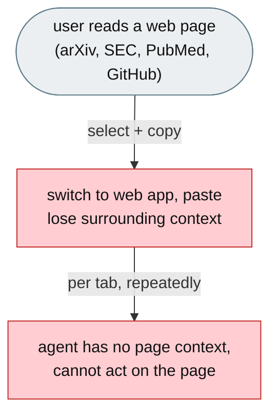

**[Feature]: Add the JiuwenSwarm Browser Extension as a New Channel / 将 JiuwenSwarm 浏览器扩展作为新频道接入**

EN ======      
JiuwenSwarm's agent lives in a web app, but its users work in the browser, reading web pages and switching tabs. To use the agent on anything they are reading, users must copy-paste text out of the page, lose its context, and repeat this for every tab — and the agent can neither see the page nor act on it. This change adds the JiuwenSwarm **browser extension as a new channel** in the JiuwenSwarm repository (`channels/browser`): a Chrome extension that reads the active page, holds a research session across pinned pages, and acts on the page (highlight, fill forms, scroll, screenshot), while keeping the same session in the full JiuwenSwarm UI.

ZH ======      
JiuwenSwarm 的智能体位于 Web 应用中，但用户却是在浏览器里工作，阅读网页、切换标签页。要在正在阅读的内容上使用智能体，用户必须把文本复制粘贴出页面、丢失其上下文，并对每个标签页重复这一过程——而智能体既看不到页面，也无法对页面操作。本变更将 JiuwenSwarm **浏览器扩展作为新频道**接入 JiuwenSwarm 仓库（`channels/browser`）：一个 Chrome 扩展，自动读取当前页面、跨固定页面维护研究会话、作用于页面（高亮、填表、滚动、截图），并在完整的 JiuwenSwarm UI 中延续同一会话。

---

# [Feature]: Add the JiuwenSwarm Browser Extension as a New Channel

## Executive Summary

JiuwenSwarm's agent lives in a web app, but its users — researchers, financial analysts, journalists, legal professionals, and product managers — do their work in the browser, reading web pages and switching tabs. To use the agent on anything they are reading, users must copy-paste text out of the page, lose its context, and repeat this for every tab, and the agent can neither see the page nor act on it. This change adds the browser extension (Manifest V3) as a **new channel** in the JiuwenSwarm repository (`channels/browser`): it reads the active page automatically, holds a research session across pinned pages, and acts on the page (highlight, fill forms, scroll, screenshot), while keeping the same session in the full JiuwenSwarm UI for heavy follow-up.

Issue #3841 https://github.com/openJiuwen-ai/jiuwenswarm/issues/3841 
PR #4095 https://github.com/openJiuwen-ai/jiuwenswarm/pull/4095

## Background Description

JiuwenSwarm serves knowledge workers whose thinking happens in the browser, with the web page they are reading as their raw material — a paper on arXiv, an SEC filing, a PubMed abstract, a Twitter thread, a GitHub PR. But the agent lives in a separate web app. Using it on anything the user is reading forces a manual, disconnected flow:

- **Copy-paste as the transport layer.** Select text, switch to the web app, paste it, lose the surrounding context, then repeat for every additional page. A question spanning three tabs becomes three round-trips of copying.
- **No memory of the page.** The agent never sees the page the user is actually looking at. Context the user can see — where a figure sits, what a highlighted passage says — has to be described back in prose.
- **No action on the page.** Even when the agent has a useful answer, it cannot point at the page, highlight the passage it is citing, or fill the form the user was filling. The answer arrives in a chat window disconnected from the thing it is about.

## Design Ideas

### Proposed design

A Chrome extension (Manifest V3) with four runtime layers that connect to the existing JiuwenSwarm WebSocket gateway. The channel ships as `channels/browser/` in the JiuwenSwarm repository, alongside the existing `web` / `tui` / `acp` / `desktop` channels:

- **Layer 1 — Background service worker.** The central hub, running separately from both the page and the side panel. Maintains the WebSocket connection, session lifecycle, page-context cache, tab tracking, right-click menu, panel opening, and a browser-native tool dispatcher.
- **Layer 2 — Content script.** Injected into every web page; detects the page type, routes to one of nine page-type extractors (8 adapters + Readability.js fallback), extracts text (head+tail, capped at 120,000 chars), tracks selection, and responds to highlight/scroll/fill commands from the background.
- **Layer 3 — Side panel.** A persistent Chrome Side Panel beside the page: native streaming chat, session picker, context bar with pinned-page chips, reader view, tour, privacy disclosure, and full-text search.
- **Layer 4 — Popup and options.** A toolbar connection-status popup and a settings page for the server host, port, default mode, and behaviour toggles.

**Browser-native agent tools** (8) dispatched by the background worker when the server sends a `tool_call` envelope:

| Tool | What it does |
|---|---|
| `get_selection` | Read current text selection in the active tab |
| `highlight_text` | Highlight a passage in the active tab with a colored overlay |
| `fill_form` | Fill form fields in the active tab by label or field name |
| `scroll_to` | Scroll the active tab to a CSS selector |
| `take_screenshot` | Capture the visible area of the active tab as a base64 PNG |
| `open_url` | Open a URL in a new tab |
| `read_page` | Extract text from a tab by URL, or the active tab if no URL given |
| `pin_page` | Pin the current tab to the active research session |

## Involved Public APIs

New components added under `channels/browser/frontend/src/` in the JiuwenSwarm repository:

| API | Kind |
|---|---|
| `WsClient` | new class (WebSocket client, exponential back-off reconnect) |
| `SessionManager` | new class (research session lifecycle, server as source of truth) |
| `ContextCache` | new class (per-tab page-context cache) |
| `TabWatcher` | new class (tab lifecycle tracking, re-extraction on navigation) |
| `ToolDispatcher` | new class (dispatch the 8 browser-native tools) |
| `Extractor` + `PageTypeDetector` | new classes (page text extraction + type routing) |
| 9 page-type extractors | new modules (GitHub, arXiv, SEC EDGAR, PubMed, Wikipedia, YouTube, Twitter/X, Hacker News, Readability.js fallback) |
| `ChatBridge`, `SessionPicker`, `ContextBar`, `SessionExporter` | new side-panel components |
| `chat`, `markdown`, `reader`, `tour`, `privacy`, `search` | new side-panel modules |
| `protocol` / message types | new module (content ↔ background ↔ side-panel wire protocol) |

**Impact:** additive. The channel is added to the JiuwenSwarm repository (`channels/browser/`) with its user docs (`docs/{en,zh}/browser-extension/`) and docs-index updates. The extension is a **client of the existing JiuwenSwarm WebSocket gateway** (same protocol as the web UI and IDE plugin) — the agent runtime and server API are unchanged. Sessions created by the extension are stored server-side and immediately shared with the webview and other channels.

## Description of Relevance to Other Modules

- **`channels/browser/`** — the new channel (frontend extension + `publishing/`).
- **`channels/browser/frontend/background/`** — `WsClient`, `SessionManager`, `ContextCache`, `TabWatcher`, `ContextMenu`, `PanelManager`, `ToolDispatcher`.
- **`channels/browser/frontend/content/`** — `Extractor`, `PageTypeDetector`, 9 extractors, `SelectionMonitor`, `Annotator`, `FormAssist`.
- **`channels/browser/frontend/sidepanel/`** — `ChatBridge`, `SessionPicker`, `ContextBar`, `SessionExporter`, `chat`, `markdown`, `reader`, `tour`, `privacy`, `search`, native chat.
- **`channels/browser/frontend/popup/` + `options/`** — connection status and settings.
- **`channels/browser/frontend/shared/`** — types, protocol, storage, constants shared across the three contexts.
- **JiuwenSwarm server** — unchanged; the extension is a gateway client, so sessions are stored server-side and immediately visible in the web app.

## Test Design and Test Plan

Unit/integration tests:

1. **WebSocket client** — connects, and reconnects with exponential back-off after the MV3 service worker terminates and wakes.
2. **Session management** — create, switch, and resume research sessions; the active pointer is persisted and the server remains the source of truth.
3. **Page extraction** — the correct page-type extractor is selected; generic article pages fall back to Readability.js; output is head+tail truncated to the 120,000-char cap.
4. **Adapters** — each extractor returns the expected structured content for its site.
5. **Tools** — `get_selection`, `highlight_text`, `fill_form`, `scroll_to`, `take_screenshot`, `open_url`, `read_page`, and `pin_page` each produce the correct result and surface errors (e.g. screenshot on a background/minimized window) as tool results.
6. **Cross-page session** — a question spanning multiple pinned pages is answered using all pinned contexts.
7. **Context continuity** — a session started in the browser is the same session in the web app.
8. **Service-worker sleep** — an in-flight `tool_call` dispatched while the worker is asleep generates a contained error response, and reconnects on wake.

Performance/reliability:

- **Extraction does not block rendering** — the content script runs at `document_idle`; large-page extraction stays bounded by the char cap.

## Additional Information

## Solution

**What type of PR is this?**
/kind feature

---

## **What does this PR do / why do we need it**

This PR adds the JiuwenSwarm browser extension into the JiuwenSwarm repository as a **new channel** (`channels/browser`), alongside the existing web / TUI / ACP / desktop channels. It brings the agent into the browser — reading the active page, holding a research session across pinned pages, and acting on the page — while keeping the same session in the full JiuwenSwarm UI. It also adds the channel's user documentation (`docs/{en,zh}/browser-extension/`) and updates the docs index (README, SUMMARY, Channels, and a Browser disambiguation note).

Issue #3841

---

## **Problem**

The people JiuwenSwarm serves do their thinking in a browser, but the agent lives in a separate web app. To use the agent on anything they are reading, users must copy-paste text out of the page, lose its context, and repeat this for every tab — and the agent can neither see the page nor act on it. The manual path is abandoned for whatever happens to be in the same window, often a generic assistant with no real agent capabilities.

---

## **Solution**

Add the browser extension as a new channel in the JiuwenSwarm repository:

- **`channels/browser/`** — the extension (frontend + `publishing/`).
- **Docs** — `docs/{en,zh}/browser-extension/` (overview, guide, install), linked from the docs index.
- **Channel wiring** — the extension is a client of the existing WebSocket gateway, so sessions/history are shared with the webview.

The channel has four runtime layers:

- **Background service worker** — WebSocket client, session manager, page-context cache, tab watcher, right-click menu, panel manager, and an 8-tool browser-native dispatcher.
- **Content script** — page-type detection with 8 adapters + Readability fallback, extraction capped at 120,000 chars, selection monitoring, passage highlighting, and form-fill/scroll handlers.
- **Side panel** — native streaming chat, session picker, pinned-page context bar, reader view, tour, privacy disclosure, full-text search.
- **Popup + options** — connection status and server/settings configuration.

The extension reuses the existing JiuwenSwarm WebSocket gateway protocol, so the agent runtime and server API are unchanged.

---

## **Expected Impact**

- The agent becomes present beside whatever the user is reading, not a destination they must visit.
- Users can research across pinned pages without manual copy-paste.
- The agent can act on the page (highlight citations, fill forms, scroll to elements).
- Browser sessions graduate into web-app sessions for heavy follow-up (skills, code review, team agents) — the channel shares sessions/history with the webview.
- Existing web-app, TUI, and IDE users are unaffected.

---

## **Self-checklist**

- [x] **Design**: Layered architecture (worker / content / side panel / popup) reviewed against the RAT document
- [x] **Test**: Covered WebSocket reconnect, session lifecycle, extraction, and the 8 browser-native tools
- [x] **Verification**: Confirmed cross-page sessions and web-app continuity
- [x] **Interface**: No changes to the JiuwenSwarm server runtime / API (the channel is a gateway client)
- [x] **Document**: Added `docs/{en,zh}/browser-extension/` and updated the docs index
