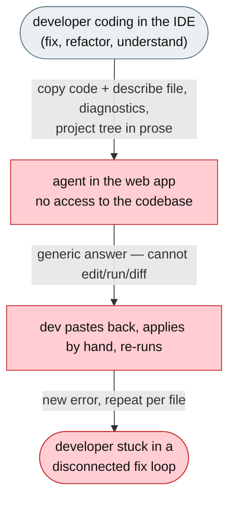
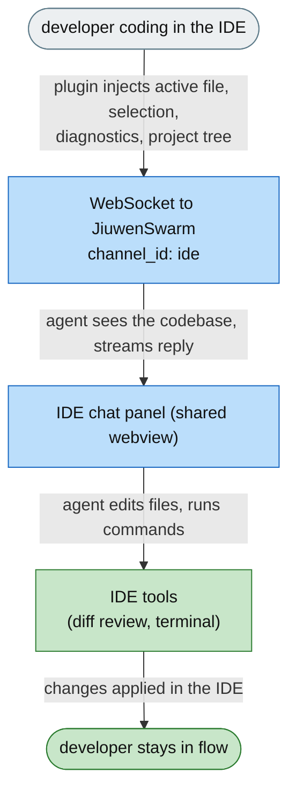

**[Feature]: Add the JiuwenSwarm IDE Plugins as a New Channel / 将 JiuwenSwarm IDE 插件作为新频道接入**

EN ======      
JiuwenSwarm's agent lives in a web app, but developers work in their IDE — VS Code, PyCharm, IntelliJ IDEA, WebStorm, GoLand. To use the agent on their code, developers must copy code out of the editor, paste it into the web app, lose the surrounding file/project context, and repeat for every file — and the agent can neither see the codebase nor edit files. This change adds the JetBrains + VS Code plugins as a **new channel** in the JiuwenSwarm repository (`channels/ide`): a native chat panel embedded in the IDE that streams the agent's response, sees the active file and selection, edits files via diff review, runs terminal commands, and keeps the same session in the full JiuwenSwarm UI.

ZH ======      
JiuwenSwarm 的智能体位于 Web 应用中，但开发者却是在 IDE 里工作——VS Code、PyCharm、IntelliJ IDEA、WebStorm、GoLand。要在自己的代码上使用智能体，开发者必须把代码复制出编辑器、粘贴到 Web 应用，丢失周围文件/项目上下文，并对每个文件重复这一过程——而智能体既看不到代码库，也无法编辑文件。本变更将 JetBrains + VS Code 插件作为**新频道**接入 JiuwenSwarm 仓库（`channels/ide`）：嵌入 IDE 的原生聊天面板，流式输出智能体回复，感知活动文件与选区，通过 diff 审查编辑文件、运行终端命令，并在完整的 JiuwenSwarm UI 中延续同一会话。

---

## Executive Summary

JiuwenSwarm's agent lives in a web app, but its users — developers — do their work in an IDE. To use the agent on their code, they must copy code out of the editor, paste it into the web app, lose the surrounding file/project context, and repeat for every file — and the agent can neither see the codebase nor edit files. This change adds the JetBrains + VS Code plugins as a **new channel** in the JiuwenSwarm repository (`channels/ide`): a native streaming chat panel embedded in the IDE that sees the active file and selection, edits files through diff review, runs terminal commands, and keeps the same session in the full JiuwenSwarm UI for heavy follow-up.

Issue #4105 https://github.com/openJiuwen-ai/jiuwenswarm/issues/4105 
PR #4106 https://github.com/openJiuwen-ai/jiuwenswarm/pull/4106

---

## ISSUE

# [Feature]: Bring the JiuwenSwarm Agent into the IDE

## Background Description

JiuwenSwarm serves knowledge workers whose thinking happens in code, with the file and project as their raw material. But the agent lives in a separate web app. Using it on the code the developer is actually editing forces a manual, disconnected flow:

- **Copy-paste as the transport layer.** Select code, switch to the web app, paste it, lose the surrounding file/project context, then repeat for every file. A change spanning three files becomes three round-trips of copying.
- **No memory of the project.** The agent never sees the active file, the selection, the diagnostics, or the project tree. Context the developer can see — the surrounding function, the import, the failing test — has to be described back in prose.
- **No action on the code.** Even when the agent has a useful answer, it cannot edit the file, open the diff, run the command, or jump to the symbol. The answer arrives in a chat window disconnected from the thing it is about.

## Design Ideas

### Proposed design

Two IDE plugins (JetBrains + VS Code) sharing one webview chat UI and one real-time protocol, shipped as the `channels/ide/` channel in the JiuwenSwarm repository, alongside the existing `web` / `tui` / `acp` / `desktop` channels:

- **Shared webview chat panel** (`shared-webview`) — a self-contained HTML/JS chat UI embedded via JCEF in JetBrains and as a webview in VS Code, so both IDEs render an identical interface.
- **Streaming chat panel** — the agent response streams token-by-token with Markdown rendering, thinking blocks, and tool-call cards.
- **IDE context injection** — every message automatically includes the active file path + language, cursor line, selected code, editor diagnostics, other open tabs, project tree, git branch/status, and project rules (`AGENTS.md` / `.jiuwenswarm/`).
- **File edit workflow** — the agent edits files through a side-by-side diff review (JetBrains) or VS Code's diff viewer, with optional approval and auto-apply; checkpoint/rewind restores a turn's changes.
- **Terminal integration** — agent shell commands run in a dedicated IDE terminal tab so output is visible and scrollable.
- **Swarm Map** — a real-time visual overview of `code.team` sessions (Map / List / Board), showing each worker agent's task, status, and activity.
- **Session management** — create, switch, delete, resume named sessions; sessions share history with the webview.

**IDE-side agent tools** (dispatched by the IDE when the server sends a `tool_call` envelope):

| Tool | What it does |
|---|---|
| `str_replace_editor` | Apply a targeted string replacement to a file |
| `write_file` / `create_file` | Write or create a file in the workspace |
| `bash` / `run_command` | Run a shell command in the IDE terminal |
| `read_file` | Read a file from the workspace |
| `web_search` / `todo_write` | Search the web / track TODOs |

## Involved Public APIs

New components added under `channels/ide/packages/` in the JiuwenSwarm repository:

| API | Kind |
|---|---|
| `vscode-extension/` | new package (VS Code extension, TypeScript + esbuild) |
| `jetbrains-plugin/` | new package (JetBrains plugin, Kotlin + Gradle) |
| `shared-webview/` | new package (shared chat UI: `chat.html`, `swarm_map.html`, `icon.svg`) |
| `WsClient` | new class (WebSocket client, exponential back-off reconnect, `channel_id: "ide"`) |
| `SessionManager` | new class (session lifecycle, server as source of truth) |
| `ContextCollector` | new class (IDE context injection: active file, selection, diagnostics, project tree, git, project rules) |
| `DiffApplier` / `DiffViewer` | new classes (file-edit diff review + apply) |
| `TerminalManager` | new class (agent commands routed to an IDE terminal) |
| `SwarmState` / `SwarmMapPanel` | new classes (team-session visualisation) |
| `StatusBar` | new class (connection state, token usage, active agent count) |
| `ChatPanel` | new class (streaming chat UI over the shared webview) |

**Impact:** additive. The channel is added to the JiuwenSwarm repository (`channels/ide/`) with its user docs (`docs/{en,zh}/ide/`) and docs-index updates. Both plugins are **clients of the existing JiuwenSwarm WebSocket gateway** (`channel_id: "ide"`, same protocol as the web UI) — the agent runtime and server API are unchanged. Sessions created by the plugins are stored server-side and immediately shared with the webview and other channels.

## Description of Relevance to Other Modules

- **`channels/ide/`** — the new channel (workspace root + `publishing/`).
- **`channels/ide/packages/vscode-extension/`** — `WsClient`, `SessionManager`, `ContextCollector`, `DiffViewer`, `DiffApplier`, `TerminalManager`, `SwarmState`, `SwarmStateManager`, `ChatPanel`, `StatusBar`, code-action quick fix.
- **`channels/ide/packages/jetbrains-plugin/`** — Kotlin equivalents (tool window, JCEF webview, diff apply, terminal, status bar widget, Alt+Enter quick fix).
- **`channels/ide/packages/shared-webview/`** — the shared chat UI embedded by both plugins.
- **JiuwenSwarm server** — unchanged; both plugins are gateway clients, so sessions are stored server-side and immediately visible in the web app.

## Test Design and Test Plan

Unit/integration tests:

1. **WebSocket client** — connects, and reconnects with exponential back-off after the service worker / extension host restarts.
2. **Session management** — create, switch, delete, and resume named sessions; the server remains the source of truth.
3. **IDE context injection** — the active file path + language, cursor line, selected code, diagnostics, project tree, git branch/status, and project rules are included in each message.
4. **File edits** — `str_replace_editor`, `write_file`, `create_file` apply via diff review / auto-apply and are undoable (rewind restores a turn).
5. **Terminal** — agent `bash` / `run_command` output is shown in the IDE terminal.
6. **Tools** — each IDE tool produces the correct result and surfaces errors (e.g. write to a non-existent path) as tool results.
7. **Context continuity** — a session started in the IDE is the same session in the web app.
8. **Swarm Map** — `code.team` sessions render live agent activity (member, task, message events).

Performance/reliability:

- **Chat stays responsive** — streaming renders per-frame; large replies do not block the editor.

## PR

# feat(ide): add ide plugins as a new channel

**What type of PR is this?**
/kind feature

---

## **What does this PR do / why do we need it**

This PR adds the JiuwenSwarm JetBrains + VS Code plugins into the JiuwenSwarm repository as a **new channel** (`channels/ide`), alongside the existing web / TUI / ACP / desktop channels. It embeds a native streaming chat panel in the IDE — seeing the active file and selection, editing files via diff review, running terminal commands — while keeping the same session in the full JiuwenSwarm UI. It also adds the channel's user documentation (`docs/{en,zh}/ide/`) and updates the docs index (README, SUMMARY, Channels).

Issue #4105

---

## **Problem**

The people JiuwenSwarm serves do their thinking in code, but the agent lives in a separate web app. To use the agent on their code, developers must copy it out of the editor, paste it into the web app, lose the surrounding file/project context, and repeat for every file — and the agent can neither see the codebase nor edit files. The manual path is abandoned for whatever happens to be in the same window, often a generic assistant with no real agent capabilities.

---

## **Solution**

Add the IDE plugins as a new channel in the JiuwenSwarm repository:

- **`channels/ide/`** — the workspace (vscode-extension + jetbrains-plugin + shared-webview) + `publishing/`.
- **Docs** — `docs/{en,zh}/ide/` (JetBrains / VS Code overview, guide, install), linked from the docs index.
- **Channel wiring** — both plugins are clients of the existing WebSocket gateway (`channel_id: "ide"`), so sessions/history are shared with the webview.

The channel is two plugins sharing one webview chat UI:

- **Streaming chat panel** — token-by-token Markdown replies, thinking blocks, tool-call cards, mode selector (`code.plan` / `code.normal` / `code.team`).
- **IDE context injection** — active file + selection + diagnostics + project tree + git + project rules sent with every message.
- **File edits** — diff review / auto-apply, optional approval, checkpoint/rewind.
- **Terminal integration** — agent shell commands in the IDE terminal.
- **Swarm Map** — live `code.team` visualisation.
- **Session management** — create/switch/delete/resume; history shared with the webview.

Both plugins reuse the existing JiuwenSwarm WebSocket gateway protocol, so the agent runtime and server API are unchanged.

Screenshot:

---

## **Expected Impact**

- The agent becomes present where developers already work — inside the IDE, not a destination they must visit.
- Users can work across files without manual copy-paste.
- The agent can act on the code (edit files via diff review, run commands, fix errors).
- IDE sessions graduate into web-app sessions for heavy follow-up — the channel shares sessions/history with the webview.
- Existing web-app, TUI, and browser users are unaffected.

---

## **Self-checklist**

- [x] **Design**: Two plugins sharing one webview chat UI + one gateway protocol, reviewed against the RAT document
- [x] **Test**: Covered WebSocket reconnect, session lifecycle, IDE context injection, file edits, terminal, and Swarm Map
- [x] **Verification**: Confirmed IDE ↔ web-app session continuity
- [x] **Interface**: No changes to the JiuwenSwarm server runtime / API (the channel is a gateway client)
- [x] **Document**: Added `docs/{en,zh}/ide/` and updated the docs index
