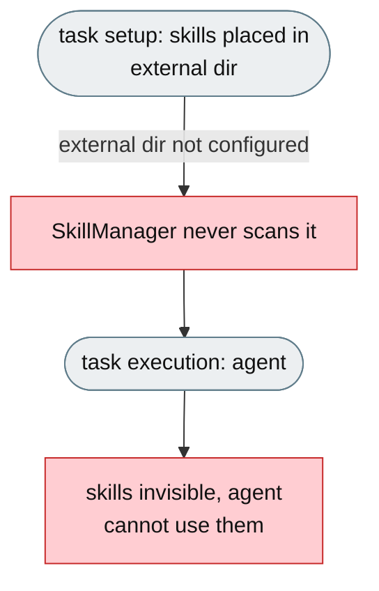
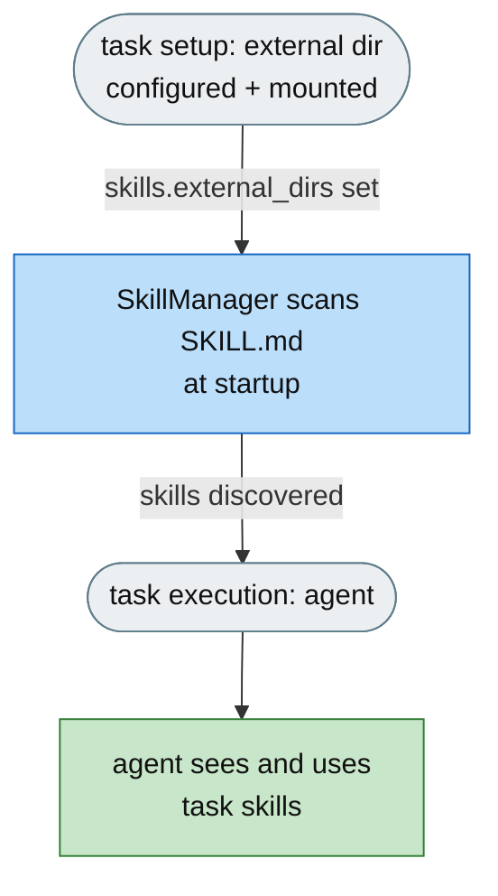

# [Feature]: Dynamic external skill discovery — load skills from arbitrary external directories

## Executive Summary

SkillsBench tasks ship skills under `tasks/<task>/environment/skills/`, but jiuwenswarm only scanned internal skill directories, so those task-provided skills were invisible to the agent (not in the system prompt, not listable, not retrievable, not mounted). This feature adds a first-class `skills.external_dirs` config (or `EXTERNAL_SKILL_DIRS` env var) that makes external directories behave exactly like internal ones, so benchmark skills become first-class citizens.

Issue #3546 https://github.com/openJiuwen-ai/jiuwenswarm/issues/3546<br>
PR #214 https://github.com/openJiuwen-ai/jiuwenswarm/pull/214

## Background Description

SkillsBench tasks provide skills under `tasks/<task>/environment/skills/`, but jiuwenswarm had no mechanism to discover them — `SkillManager` only scanned internal dirs (`~/.jiuwenswarm/.../skills/` plus built-ins). As a result, external skills were not visible in the system prompt, not listable via skill-listing tools, not retrievable via skill-get, not indexed by Symphony retrieval, not linked into team member workspaces, and not mounted into the Docker container at all. Benchmark skills were completely invisible to the agent.



## Design Ideas

### Proposed design

- **Config entry** — `skills.external_dirs` accepts a YAML list or a semicolon-delimited `EXTERNAL_SKILL_DIRS` env-var string; each existing directory is treated exactly like an internal skill directory.
- **SkillManager integration** — `_load_external_skill_dirs()` parses/validates the config; `_scan_external_skills()` walks each external dir for `SKILL.md`; listing (`handle_skills_list`) appends external skills; skill-get resolves them; `get_external_skill_dirs()` is the public accessor.
- **First-class parity** — external skills are marked `source="external"`, `installed=True`, and appear in the system prompt, listing tools, and retrieval exactly like internal ones.
- **Local priority** — when a name collides with a locally-installed skill, the local one wins and the external duplicate is skipped.
- **Agent visibility** — `_build_skill_rail()` appends external dirs to the `SkillUseRail` scan roots, so external skills show in the system prompt and `auto_list`; an `external_only` flag isolates the agent to task-provided skills only (benchmark/CI mode).
- **Team workspaces** — the swarm skill provider links external skills into team member workspaces alongside internal ones.




## Involved Public APIs

| API | Kind |
|---|---|
| `SkillManager.get_external_skill_dirs()` | new method (read-only accessor) |
| `SkillManager._load_external_skill_dirs()` | new method (config parsing) |
| `SkillManager._scan_external_skills()` | new method (directory scanning) |

Config additions (under `skills`):

| Field | Type | Default |
|---|---|---|
| `skills.external_dirs` | list[str] or `;`-delimited str | empty |
| `skills.external_only` | bool | `false` |

**Impact:** additive and opt-in (empty by default). No existing skill-listing, skill-get, or retrieval contract changes. External skills are read-only in the evolution rails.

## Description of Relevance to Other Modules

- **`jiuwenswarm/server/runtime/skill/skill_manager.py`** — loads, scans, lists, and resolves external skill dirs; marks them `source="external"`.
- **`jiuwenswarm/server/runtime/agent_adapter/interface_deep.py`** — `_build_skill_rail()` appends external dirs to `SkillUseRail` scan roots; `external_only` isolates to external-only.
- **`jiuwenswarm/resources/config.yaml`** — declares `skills.external_dirs` and `skills.external_only`.
- **`jiuwenswarm/agents/swarm/providers/skills.py`** — team member skill toolkit links external skills into member workspaces.
- **Skill evolution rails** — intentionally unchanged; external dirs may be read-only.

## Test Design and Test Plan

Unit/integration tests:

1. **Config parsing** — YAML list and semicolon-delimited env-var string both resolve to directory paths; non-existent/非-directory paths are skipped with a warning.
2. **Scanning** — external dirs are walked for `SKILL.md`; discovered skills are marked `source="external"` and `installed=True`.
3. **Local priority** — an external skill whose name collides with a local skill is skipped.
4. **Listing** — `handle_skills_list()` includes external skills.
5. **Skill-get** — external skills are resolvable via skill-get and content-reading.
6. **Agent visibility** — external dirs reach `SkillUseRail` scan roots and appear in the system prompt and `auto_list`.
7. **`external_only`** — with `external_only=true` and non-empty external dirs, only external skills are visible.
8. **Disabled path** — empty `external_dirs` → no external skills, behaviour unchanged.

Performance/reliability:

- **Zero overhead when unconfigured** — empty `external_dirs` means no extra scanning.

## Additional Information

## Solution

Paired: [GitHub #214](https://github.com/openJiuwen-ai/jiuwenswarm/pull/214) ↔ [GitCode !3770](https://gitcode.com/openJiuwen/jiuwenswarm/merge_requests/3770)

**What type of PR is this?**
/kind feature

---

## **What does this PR do / why do we need it**

This PR introduces **Dynamic External Skill Discovery**, enabling jiuwenswarm to load skills from arbitrary external directories — including SkillsBench task-provided skills — exactly as if they were installed internally.

Issue #3546

### **The problem**

SkillsBench tasks include skills under:

```
tasks/<task>/environment/skills/
```

But jiuwenswarm previously had **no mechanism** to discover them:

- SkillManager only scanned internal dirs (`~/.jiuwenswarm/.../skills/` + built-ins)
- External skills were **not visible** in the system prompt
- Not listable via skill-listing tools
- Not retrievable via skill-get
- Not indexed by Symphony retrieval
- Not linked into team member workspaces
- And critically: **skills were not mounted into the Docker container at all**

As a result, benchmark skills were completely invisible to the agent.

### **The solution**

Add a first-class configuration option:

```
skills.external_dirs:
  - /path/to/external/skills
```

Any directory listed here is treated exactly like an internal skill directory:

- Appears in system prompt (mode: all)
- Returned by skill-listing tools (mode: auto_list)
- Indexed by Symphony retrieval
- Linked into team member workspaces
- Resolved by skill-get and content-reading operations


On the benchmark side, a setup script mounts each task's `skills/` directory into the container, and the launch wrapper auto-detects the mount path and writes it into `.env` as `EXTERNAL_SKILL_DIRS`.

This makes SkillsBench skills **first-class citizens** inside jiuwenswarm.

---

## **Technical Changes**

### **Config — jiuwenswarm/resources/config.yaml**

- Added:

```
skills:
  external_dirs: ${EXTERNAL_SKILL_DIRS:-}
```

- Accepts YAML list or semicolon-delimited env-var string
- Fully documented in EN + CN

---

### **SkillManager — server/runtime/skill/skill_manager.py**

New capabilities:

- `self._external_skill_dirs` loaded from config
- `_load_external_skill_dirs()` — parse + validate external dirs
- `_scan_external_skills()` — walk external dirs for SKILL.md
- `handle_skills_list()` — append external skills
- `handle_skills_get()` — third search block for external dirs
- `_resolve_local_skill_dir()` — now falls through into external dirs
- `get_external_skill_dirs()` — public accessor

External skills are marked:

```
source="external"
installed=True
```

Local skills take priority if names collide.

---

### **interface_deep.py**

- `_build_skill_rail()` now passes:

```
[main_dir] + external_dirs
```

to `SkillUseRail`, making external skills:

- visible in system prompt
- listable via auto_list

- `_visible_skill_names_for_list_skill()` updated to scan both main + external dirs
- Skill evolution rails intentionally unchanged (external dirs may be read-only)

---

### **Team Member Provider — agents/swarm/providers/skills.py**

- `_link_member_configured_skills()` now walks all source dirs including external
- `build_member_skill_toolkit()` creates SkillManager first so external dirs can be passed to the linker

---

### **SkillsBench Integration**

#### **Config**

`jiuwenswarm_benchflow/config.yaml`:

```
skills:
  external_dirs: ${EXTERNAL_SKILL_DIRS:-}
```

#### **Launch wrapper**

`jiuwenswarm_benchflow/__init__.py`:

- Probes common mount paths (`/app/skills`, `/app/environment/skills`, `/skills`)
- If found, writes:

```
EXTERNAL_SKILL_DIRS=<path>
```

into `~/.jiuwenswarm/config/.env`

#### **Mount scripts**

- `add-skills-mount.py` — inserts:

```
- ./skills:/app/skills:ro
```

into each task's docker-compose.yaml
Backs up originals as `.bak`.

- `remove-skills-mount.py` — restores from backups.

---

## **Expected Impact**

- SkillsBench tasks now expose their skills to jiuwenswarm automatically
- External skills appear in system prompt, listing tools, retrieval, and team workspaces
- Benchmark agents can use task-provided skills without any manual copying
- External skill discovery becomes a general feature usable outside benchmarks

---

## **Self-checklist**

- [x] **Design**: Reviewed with maintainers
- [x] **Test**: Verified external skill discovery across listing, retrieval, and skill-get
- [x] **Verification**: Confirmed SkillsBench tasks expose skills correctly via mounts
- [ ] **Interface**: No external API changes
- [x] **Document**: Full bilingual documentation added
