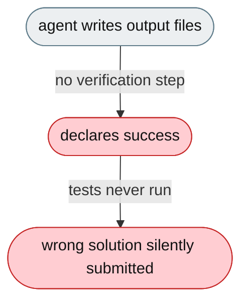
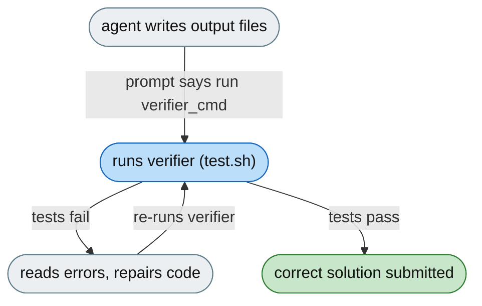

# [Feature]: Self-verification loop for code tasks using external verifier scripts

## Executive Summary

JiuwenSwarm previously wrote code for SkillsBench tasks and immediately declared success without checking correctness, even though SkillsBench provides a test script for every task. This feature adds a `verification.verifier_cmd` config that injects a "Verification Step" into the code-mode system prompt, so the agent runs the verifier after producing output, reads failures, repairs, and retries until tests pass or iterations run out.

Issue #3567 https://github.com/openJiuwen-ai/jiuwenswarm/issues/3567<br>
PR #328 https://github.com/openJiuwen-ai/jiuwenswarm/pull/328

## Background Description

SkillsBench mounts a verifier script at `/verifier/test.sh` inside the container, but jiuwenswarm had no mechanism to run it — incorrect solutions were silently submitted and fixable errors were missed. A previous attempt to inject verifier logic via an ACP monkey-patch in `skillsbench/__init__.py` was rejected because it lived in the wrong layer, duplicated logic that belongs in jiuwenswarm, and was brittle.



## Design Ideas

### Proposed design

- **Config** — `verification.verifier_cmd` (default empty), also settable via the `VERIFICATION_CMD` env var (`${VERIFICATION_CMD:-}` in config). Empty → no behaviour change.
- **Prompt builder** — `_code_verification_prompt()` reads `verifier_cmd` at agent startup; if non-empty, returns a `PromptSection(name="code_verification", priority=28)` containing a "Verification Step"; if empty, returns `None` and the prompt is unchanged. `build_code_system_prompt()` conditionally includes it.
- **Directive content** — after writing all required output files, run the verifier; if all tests pass the task is complete; if any fail, diagnose, fix, and re-run; repeat until success or iterations run out; if the verifier can't be found or executed, skip and submit the best answer.



## Involved Public APIs

| API | Kind |
|---|---|
| `_code_verification_prompt()` | new function (in `code_prompt_builder.py`) |

Config additions (under `verification`):

| Field | Type | Default |
|---|---|---|
| `verification.verifier_cmd` | str | `""` (empty) |

**Impact:** additive and opt-in (empty by default). When empty, the prompt is unchanged and no verifier runs.

## Description of Relevance to Other Modules

- **`jiuwenswarm/agents/harness/code/prompt/code_prompt_builder.py`** — `_code_verification_prompt()` and its conditional inclusion in `build_code_system_prompt()`.
- **`jiuwenswarm/resources/config.yaml`** — declares `verification.verifier_cmd` (via `${VERIFICATION_CMD:-}`).
- **SkillsBench** — sets `verifier_cmd: "bash /verifier/test.sh"` in its config override; no additional SkillsBench code required.

## Test Design and Test Plan

Unit/integration tests:

1. **Empty config** — `verifier_cmd` empty → `_code_verification_prompt()` returns `None`, prompt unchanged.
2. **Configured** — non-empty `verifier_cmd` → section `code_verification` at priority 28 is returned with the expected directive and the configured command.
3. **Inclusion** — `build_code_system_prompt()` includes the section only when configured.
4. **Env var** — `VERIFICATION_CMD` flows through config into the same path.
5. **Verifier unavailable** — the directive instructs the agent to skip and submit the best answer if the command can't be executed.

Performance/reliability:

- **No change when unconfigured** — the default (empty) path is identical to before.

## Additional Information

## Solution

Paired: [GitHub #328](https://github.com/openJiuwen-ai/jiuwenswarm/pull/328) ↔ [GitCode !3791](https://gitcode.com/openJiuwen/jiuwenswarm/merge_requests/3791)

**What type of PR is this?**
/kind feature

---

## **What does this PR do / why do we need it**

This PR introduces a **Self-Verification Loop** for code-generation tasks. When a verifier script is configured, the agent automatically runs it after producing its output. If tests fail, the agent reads the error output, repairs the code, and retries — repeating until tests pass or the iteration limit is reached.

Issue #3567

### **The problem**

JiuwenSwarm previously wrote code for SkillsBench tasks and immediately declared success without ever checking correctness. SkillsBench provides a test script for every task, but the agent never ran it. As a result:

- Incorrect solutions were silently submitted
- Fixable errors were missed
- Benchmark scores suffered

SkillsBench mounts a verifier script at:

```
/verifier/test.sh
```

inside the container. JiuwenSwarm had **no mechanism** to run it. A previous attempt to inject verifier logic via an ACP monkey-patch in `skillsbench/__init__.py` was rejected because:

- It lived in the wrong layer
- It duplicated logic that belongs inside jiuwenswarm
- It was brittle and hard to maintain

---

## **Solution**

The verification logic is now implemented **properly inside jiuwenswarm**, with a clean configuration surface and prompt-level integration.


### **1. Config: `verification.verifier_cmd`**

Added to `jiuwenswarm/resources/config.yaml`:

```
verification:
  verifier_cmd: ""   # default
```

Also readable from:

```
VERIFICATION_CMD
```

If empty → no change in behavior.
If set → agent enters the self-verification loop.

---

### **2. Prompt Builder: `_code_verification_prompt()`**

Added to:

```
agents/harness/code/prompt/code_prompt_builder.py
```

Behavior:

- Reads `verification.verifier_cmd` at agent startup
- If non-empty, returns a `PromptSection` with priority `VERIFICATION = 28`
- Injects a structured **Verification Step** into the code-mode system prompt
- If empty, returns `None` and the prompt is unchanged

`build_code_system_prompt()` conditionally includes this section.

This ensures the agent *knows* it must:

1. Run the verifier command
2. Inspect test output
3. Repair failures
4. Retry until success

---

### **3. SkillsBench Activation**

`skillsbench/jiuwenswarm_benchflow/config.yaml` now sets:

```
verification:
  verifier_cmd: "bash /verifier/test.sh"
```

This config file is already copied over jiuwenswarm's default at runtime by the launch wrapper, so **no additional SkillsBench code changes are required**.

---

## **Expected Impact**

- SkillsBench tasks now run their official test scripts automatically
- Incorrect outputs are repaired immediately instead of being submitted
- Benchmark scores improve due to fewer silent failures
- Verification becomes a general feature usable outside SkillsBench
- No behavior change when `verifier_cmd` is empty (safe default)

---

## **Self-checklist**

- [x] **Design**: Reviewed with maintainers; correct layering
- [x] **Test**: Verified prompt injection and command execution paths
- [x] **Verification**: Confirmed loop behavior with failing and passing tests
- [ ] **Interface**: No external API changes
- [x] **Document**: Added bilingual documentation for `verification.verifier_cmd`
