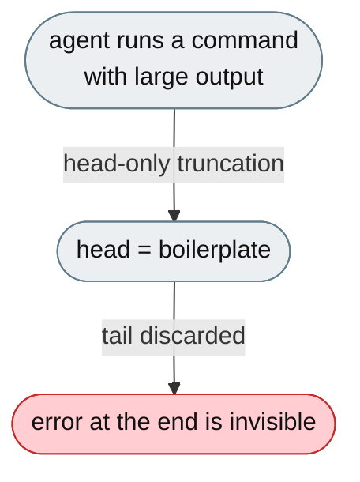
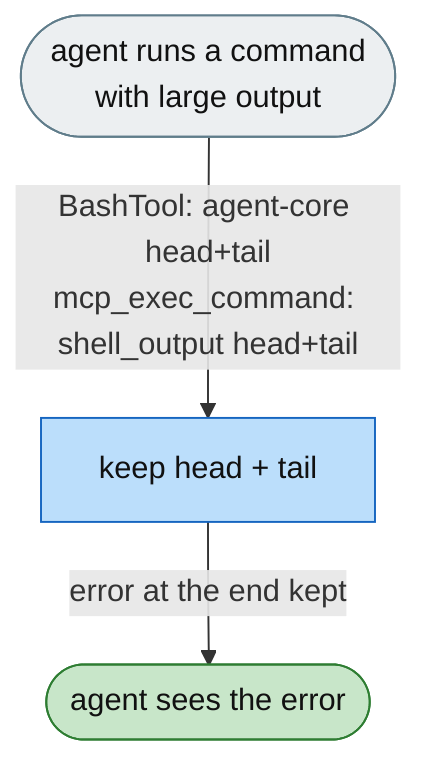

# [Feature]: Head+tail truncation for large shell output — preserve error tails and reduce context bloat

## Executive Summary

Large shell output was truncated head-only, discarding the tail where errors live. This change gives jiuwenswarm's own `mcp_exec_command` tool a configurable **head+tail** truncation (`shell_output.max_chars` / `head_ratio`), and removes the host-side monkey-patch that used to inject head+tail into the openjiuwen `BashTool` — that behavior is now owned by the openjiuwen shell tools themselves (agent-core), so jiuwenswarm no longer patches another project's tool class.

Issue #3568<br>
PR #334

## Background Description

Two shell tools are involved:

- **`BashTool` / `PowerShellTool`** — openjiuwen (agent-core) tools. The agent's primary shell tool.
- **`mcp_exec_command`** — jiuwenswarm's own command tool (`command_tools.py`).

The host previously compensated for `BashTool`'s head-only 2 KB preview by monkey-patching the tool class from `bash_tool_safety.py`. That patch read the persisted temp file, re-truncated it, and re-rendered — fragile (private attributes, temp-file path, `<persisted-output>` string) and out of place for a host. Meanwhile `mcp_exec_command` had no default limit at all and used head-only `_clip_text`.



## Design Ideas

### Proposed design

- **`mcp_exec_command` gets head+tail** — `_clip_head_tail()` keeps `head_ratio × max_chars` of the head and the remainder of the tail with a `[N lines omitted]` marker; `_get_shell_output_config()` reads `shell_output` from config; `max_output_chars=0` now falls back to the configured default instead of "no limit".
- **`shell_output` config** — `max_chars` (default 20000) and `head_ratio` (default 0.6), documented; applies to `mcp_exec_command`.
- **Drop the BashTool monkey-patch** — remove `_shell_output_config` / `_post_process_bash_output` and the invoke/stream output post-processing from `bash_tool_safety.py`. `bash_tool_safety.py` keeps only the jiuwenswarm-specific **pre-execution safety** policy (`_check_command_safety`, `_check_worktree_path_safety`, `_enforce_tui_spawn_budget`).
- **BashTool/PowerShellTool truncation is upstream** — the openjiuwen shell tools now render head+tail via their own `truncate_output` and accept `max_output_chars` / `head_ratio` as tool inputs (agent-core change). External behavior for the agent is preserved: large output still shows head+tail with the persisted file path.


### Rejected alternatives

- **Keep patching `BashTool` from the host.** Reads private attributes and the persisted file, duplicates upstream behavior, and breaks on tool refactors. (That is exactly why the behavior moved to agent-core.)
- **Keep `mcp_exec_command` unlimited / head-only.** Large outputs still flood the context or lose the error tail.
- **Unify both tools through one jiuwenswarm config.** `BashTool` is not jiuwenswarm's; its limit belongs to the tool (agent-core inputs), so the two tools are configured where each lives.

## Involved Public APIs

| API | Kind | Change |
|---|---|---|
| `_clip_head_tail()` (`command_tools.py`) | helper | new (replaces `_clip_text`) |
| `_get_shell_output_config()` (`command_tools.py`) | helper | new |
| `mcp_exec_command` | tool | `max_output_chars=0` → config default; head+tail |
| `_post_process_bash_output()` (`bash_tool_safety.py`) | helper | **removed** |
| `_shell_output_config()` (`bash_tool_safety.py`) | helper | **removed** |
| `shell_output.max_chars` | config | new, default `20000` |
| `shell_output.head_ratio` | config | new, default `0.6` |

**Impact:** `mcp_exec_command` output is now bounded and tail-preserving; `BashTool`/`PowerShellTool` behavior is unchanged for the agent but the truncation now comes from agent-core. No public tool-card or invoke-signature changes. The host no longer monkey-patches the openjiuwen tool class.

## Description of Relevance to Other Modules

- **`jiuwenswarm/agents/harness/common/tools/command_tools.py`** — `mcp_exec_command` head+tail + config defaults (unchanged from the branch; correct as-is).
- **`jiuwenswarm/agents/harness/common/tools/bash_tool_safety.py`** — safety-only after the patch removal.
- **`jiuwenswarm/resources/config.yaml`** and **`docs/en/Configuration.md`** — `shell_output` documented as applying to `mcp_exec_command`.
- **`openjiuwen.harness.tools.shell.{bash,powershell}`** (agent-core) — owner of the `BashTool`/`PowerShellTool` head+tail behavior (`truncate_output`, `head_ratio`).

## Test Design and Test Plan

Unit/integration tests:

1. **Under budget** — output shorter than `max_chars` returned unchanged.
2. **Over budget** — head+tail split with a `[N lines omitted]` marker (~60% head / ~40% tail).
3. **Tail preserved** — an error at the end survives truncation.
4. **`mcp_exec_command` default** — `max_output_chars=0` falls back to `shell_output.max_chars` (not unlimited).
5. **Config override** — non-default `max_chars` / `head_ratio` honoured.
6. **Safety preserved** — `bash_tool_safety.py` still blocks the policy commands (`test_bash_tool_safety.py`).
7. **Patch removed** — no invocation of the removed output post-processing; BashTool truncation is not rewritten by the host.

Performance/reliability:

- **Reduced context bloat** — `mcp_exec_command` output is bounded to `max_chars` instead of unbounded.

## Additional Information

Behavior parity: the agent still sees head+tail for large shell output with the persisted path; the fallback threshold and default ratio (0.6) are unchanged. The only structural change is *where* `BashTool`'s truncation is implemented (tool, not host).

---

## Solution

### PR title

`feat(shell): head+tail truncation for large shell output`

Paired: [GitHub #334](https://github.com/openJiuwen-ai/jiuwenswarm/pull/334) ↔ [GitCode !3792](https://gitcode.com/openJiuwen/jiuwenswarm/merge_requests/3792)

**What type of PR is this?**
/kind feature

---

## **What does this PR do / why do we need it**

Gives jiuwenswarm's `mcp_exec_command` a configurable head+tail output limit, and removes the host-side monkey-patch that forced head+tail onto the openjiuwen `BashTool` — that behavior now belongs to the tool in agent-core.

### **The problem**

- Large command output loses its tail: the head is boilerplate (collecting, progress bars, compiler banners) while errors/stack traces/assertions are at the end.
- `mcp_exec_command` had no default limit and used head-only truncation.
- `BashTool` head+tail was patched from the host, over private attributes and the persisted temp file.


### **The solution**

- `shell_output.max_chars` / `shell_output.head_ratio` now bound `mcp_exec_command` output with a head+tail split.
- `bash_tool_safety.py` keeps only jiuwenswarm's pre-execution safety policy; the output post-processing is deleted.
- `BashTool` / `PowerShellTool` head+tail is provided by agent-core.

### **The change, by file**

1. **`jiuwenswarm/resources/config.yaml`** — new `shell_output` block:
   ```yaml
   shell_output:
     max_chars: 20000
     head_ratio: 0.6
   ```
   `max_chars` bounds the model-facing output; `head_ratio` splits the budget (0.6 head / 0.4 tail).
2. **`jiuwenswarm/agents/harness/common/tools/command_tools.py`** — jiuwenswarm's own `mcp_exec_command`:
   - `_clip_text()` (head-only) replaced by `_clip_head_tail(value, max_chars, head_ratio)` → keeps
     `head_ratio × max_chars` of the head and the remainder of the tail, with a `[N lines omitted]` marker.
   - `_get_shell_output_config()` reads `shell_output`; `max_output_chars=0` now falls back to the
     configured default instead of "no limit".
3. **`jiuwenswarm/agents/harness/common/tools/bash_tool_safety.py`**
   - Removed `_shell_output_config()`, `_post_process_bash_output()`, and the output post-processing in
     `_wrap_invoke` / `_wrap_stream`.
   - **Kept** only the pre-execution safety policy: `_check_command_safety`,
     `_check_worktree_path_safety`, `_enforce_tui_spawn_budget` (unchanged).
4. **`docs/en/Configuration.md`** — §11 documents `shell_output` for `mcp_exec_command` and notes that
   `BashTool` / `PowerShellTool` take `max_output_chars` / `head_ratio` as agent-core tool inputs.
5. **agent-core counterpart** — `BashTool` / `PowerShellTool` now render head+tail themselves
   (`openjiuwen/harness/tools/shell/{bash,powershell}`), so the host patch is gone.

### **Expected impact**

- Errors at the end of `mcp_exec_command` output are always visible; output is bounded to `max_chars`.
- `BashTool` / `PowerShellTool` behavior for the agent is unchanged, but the truncation is now the
  tool's own — no host monkey-patch to break on a tool refactor.
- No public tool-card or invoke-signature changes.



---

## **Which issue(s) this PR fixes**

Fixes #3568

---

## **What scenarios were tested, and what were the verification results（Function, performance, reliability, etc.）**

### **Functional verification**
- `mcp_exec_command`: head+tail split, tail preserved, `max_output_chars=0` uses the config default, config override honoured.
- `bash_tool_safety.py`: safety checks still block policy commands; the output patch is gone.
- `BashTool`: head+tail still shown for large output (now from agent-core), persisted path unchanged.

### **Performance & reliability**
- `mcp_exec_command` output is bounded; no extra I/O or model calls.

---

## **Self-checklist**

- [x] **Design**: BashTool truncation owned by agent-core; jiuwenswarm owns `mcp_exec_command` only
- [x] **Test**: head+tail, tail-preserved, config-default, override, safety-preserved
- [x] **Verification**: errors at the end visible for both tools
- [x] **Interface**: no external tool-card/signature changes
- [x] **Document**: `shell_output` documented for `mcp_exec_command`; agent-core counterpart referenced
