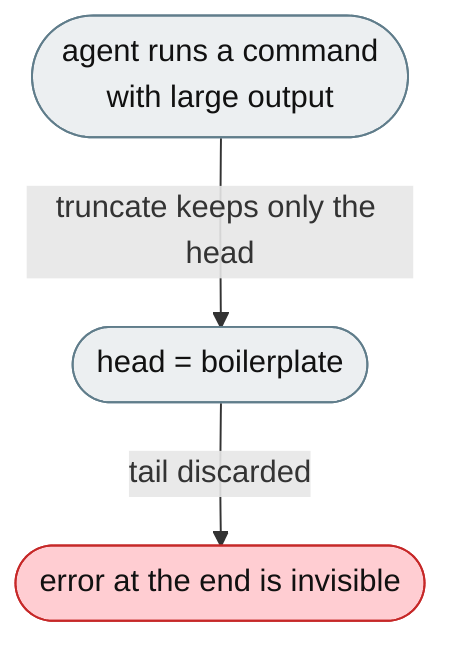
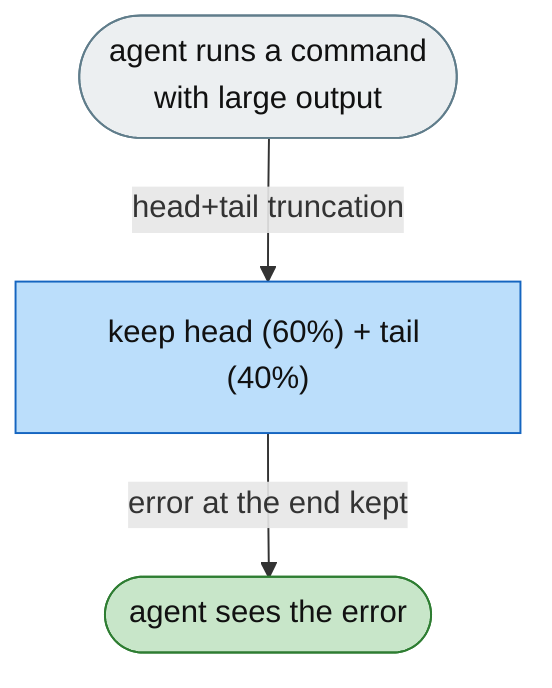

# [Feature]: Head+tail truncation for bash output — preserve error tails and reduce context bloat

## Executive Summary

When the agent runs commands that produce huge output (package installs, pytest runs, builds), it previously saw either the whole output (blowing up the context) or only the first 2,000 characters — and the important part (errors, stack traces, assertion failures) is always at the end, so the agent routinely missed the information needed to diagnose failures. This feature switches shell output to head+tail truncation, so the agent always sees both the beginning and the end of the output.

Issue #3568 https://github.com/openJiuwen-ai/jiuwenswarm/issues/3568<br>
PR #334 https://github.com/openJiuwen-ai/jiuwenswarm/pull/334

## Background Description

`BashTool` truncated output above 20,000 chars by persisting the full output to disk and returning only a 2 KB head preview, while `mcp_exec_command` had no limit at all — and both used head-only truncation (`_clip_text`), discarding the tail entirely. Since the head is almost always boilerplate (collecting, progress bars, dependency resolution, compiler banners) and the errors are at the end, pytest failures, compiler errors, and exit-status messages were often invisible to the agent.



## Design Ideas

### Proposed design

- **Config** — `shell_output.max_chars` (default 20000) and `shell_output.head_ratio` (default 0.6); the head gets 60% of the budget, the tail 40%.
- **`command_tools.py`** — `_clip_head_tail()` allocates `head_ratio × max_chars` to the head and the remainder to the tail, inserting a `[N lines omitted]` marker; `_get_shell_output_config()` reads config defaults; `mcp_exec_command` now uses the config default when `max_output_chars=0` (previously no truncation).
- **`bash_tool_safety.py`** — `_post_process_bash_output()` intercepts `<persisted-output>` blocks emitted by `BashTool`, reads the persisted file, applies `truncate_output()` with the configured `head_ratio`, and returns inline head+tail instead of the old 2 KB head preview; hooked into both the invoke and stream paths.



## Involved Public APIs

| API | Kind |
|---|---|
| `_clip_head_tail()` | new helper (in `command_tools.py`) |
| `_get_shell_output_config()` | new helper |
| `_post_process_bash_output()` | new helper (in `bash_tool_safety.py`) |

Config additions (under `shell_output`):

| Field | Type | Default |
|---|---|---|
| `shell_output.max_chars` | int | `20000` |
| `shell_output.head_ratio` | float | `0.6` |

**Impact:** changes truncation behaviour for both shell tools (BashTool and `mcp_exec_command`). No public tool-card or invoke-signature changes.

## Description of Relevance to Other Modules

- **`jiuwenswarm/agents/harness/common/tools/command_tools.py`** — `_clip_head_tail` / `_get_shell_output_config` for `mcp_exec_command`.
- **`jiuwenswarm/agents/harness/common/tools/bash_tool_safety.py`** — `_post_process_bash_output` monkey-patches `BashTool.invoke`/`.stream`.
- **`jiuwenswarm/resources/config.yaml`** — declares the `shell_output` config block.
- **`openjiuwen.harness.tools.shell.bash._output.truncate_output`** — the openjiuwen utility that performs the actual head+tail split.

## Test Design and Test Plan

Unit/integration tests:

1. **Under budget** — output shorter than `max_chars` is returned unchanged.
2. **Over budget** — output is split head+tail with a `[N lines omitted]` marker; head is ~60% and tail ~40% of the budget.
3. **Tail preserved** — a failure/error at the end survives truncation.
4. **`mcp_exec_command` default** — `max_output_chars=0` falls back to `shell_output.max_chars`.
5. **Persisted-output path** — a `<persisted-output>` block is replaced with inline head+tail from the persisted file.
6. **Config override** — non-default `max_chars` / `head_ratio` are honoured.

Performance/reliability:

- **Reduced context bloat** — huge outputs are bounded to `max_chars` instead of full or head-only.

## Additional Information

## Solution

Paired: [GitHub #334](https://github.com/openJiuwen-ai/jiuwenswarm/pull/334) ↔ [GitCode !3792](https://gitcode.com/openJiuwen/jiuwenswarm/merge_requests/3792)

**What type of PR is this?**
/kind feature

---

## **What does this PR do / why do we need it**

This PR introduces **head+tail truncation** for large shell output, ensuring the agent always sees both the beginning **and** the end of command output — especially the error messages that matter.

Issue #3568

### **The problem**

When the agent runs commands that produce huge output (package installs, pytest runs, builds), it previously saw:

- **Either** the entire output (blowing up the context window)
- **Or** only the **first** 2,000 characters

The first part of command output is almost always useless boilerplate:

- "Collecting…"
- progress bars
- dependency resolution
- compiler banners

The **important** part — errors, stack traces, assertion failures — is always at the **end**.

Because the agent only saw the head, it routinely missed the information needed to diagnose failures.

- `BashTool` truncated output above 20,000 chars by persisting the full output to disk and returning only a **2 KB head preview**.
- `mcp_exec_command` had **no limit at all**.
- Both used head-only truncation (`_clip_text`), discarding the tail entirely.

This meant pytest failures, compiler errors, and exit status messages were often invisible.

---

## **Solution**

The agent now receives **both the head and the tail** of command output, separated by a clear marker:

```
[1234 lines omitted]
```

Error messages at the end are **never lost**, regardless of verbosity.


### **1. Config — `jiuwenswarm/resources/config.yaml`**

Added:

```
shell_output:
  max_chars: 20000
  head_ratio: 0.6
```

- 60% of the budget goes to the head
- 40% goes to the tail
- Fully documented in EN + CN
- Readable via `shell_output.max_chars` and `shell_output.head_ratio`

---

### **2. `command_tools.py`**

Replaced head-only truncation with a new **head+tail** implementation:

- `_clip_head_tail()` — allocates `head_ratio × max_chars` to the head and the remainder to the tail
- Inserts `[N lines omitted]` marker
- `_get_shell_output_config()` — reads config defaults
- `mcp_exec_command` now uses config defaults when `max_output_chars=0` (previously: no truncation)

This ensures **consistent truncation behavior** across both shell tools.

---

### **3. `bash_tool_safety.py`**

Added `_post_process_bash_output()`:

- Intercepts `<persisted-output>` blocks emitted by BashTool
- Reads the persisted file
- Applies `truncate_output()` (openjiuwen utility) using configured `head_ratio`
- Returns inline head+tail output instead of the old 2 KB head preview

Hooked into:

- `_wrap_invoke` — post-result
- `_wrap_stream` — final summary chunk

This ensures **streaming and non-streaming** paths both receive head+tail output.

---

### **4. SkillsBench Integration**

`skillsbench/jiuwenswarm_benchflow/config.yaml` now includes:

```
shell_output:
  max_chars: 20000
  head_ratio: 0.6
```

This ensures pytest verifier output is readable and consistent across benchmark tasks.

---

## **Expected Impact**

- Agent always sees error tails from pytest, compilers, and shell commands
- Dramatically improved debugging accuracy
- Reduced context bloat from massive command output
- Consistent behavior across BashTool and MCP command execution
- SkillsBench verifier output becomes fully visible to the agent

---

## **Self-checklist**

- [x] **Design**: Reviewed with maintainers
- [x] **Test**: Verified head+tail truncation across BashTool and mcp_exec_command
- [x] **Verification**: Confirmed pytest failures and compiler errors appear in tail
- [ ] **Interface**: No external API changes
- [x] **Document**: Added bilingual documentation for `shell_output` config
