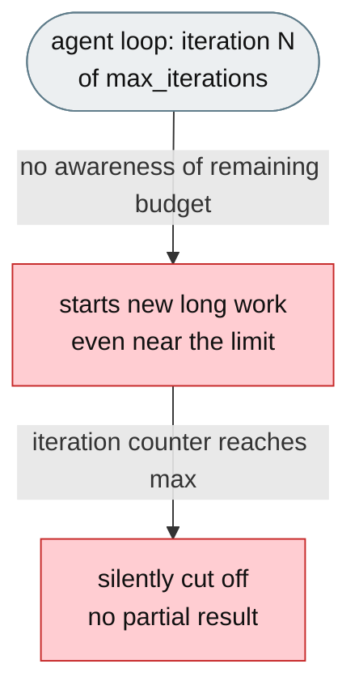
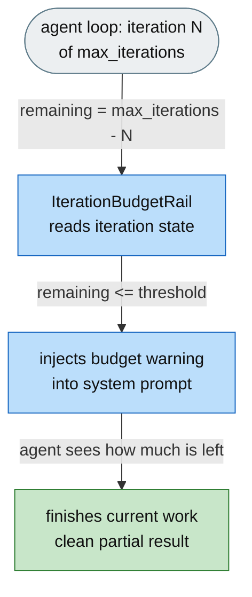

# [Feature]: Iteration-budget awareness with automatic low-budget warnings

## Executive Summary

Agents on long tasks start large refactors or multi-step investigations late in the run and get abruptly terminated when the iteration counter expires, because no component read the current iteration and no prompt section told the agent how much budget remained. This feature adds a rail that warns the agent — via a system-prompt section — how many steps remain, so it prioritises finishing and produces a clean partial result instead of being silently cut off.

Issue #3548 https://github.com/openJiuwen-ai/jiuwenswarm/issues/3548<br>
PR #368 https://github.com/openJiuwen-ai/jiuwenswarm/pull/368

## Background Description

The ReAct agent loop iterates from `iteration = 0` to `react.max_iterations`, and the current iteration is tracked in session state (the `iteration` key written by `ContextProcessorRail`). But no component read that value and no prompt section communicated the remaining budget to the LLM, so the agent started new long work late in the run and died silently when the counter hit `max_iterations` — no graceful degradation, no chance to wrap up.



## Design Ideas

### Proposed design

- **`IterationBudgetRail`** — a `DeepAgentRail` (rail `priority=6`, just after `RuntimePromptRail` at 5) that fires on `before_model_call` every turn.
- **Read + compute** — reads the current iteration from `ctx.session.get_state("iteration")`, computes `remaining = max_iterations - iteration`.
- **Conditional injection** — when `remaining <= budget_warning_threshold`, injects `PromptSection(name="iteration_budget_warning", priority=96)` telling the agent how many iterations remain, to prioritise finishing, not to start new long subtasks, and to produce the best partial result with a clear statement of what remains.
- **Cleanup** — removes the section when not near the limit, and clears any stale warning on `before_invoke` to prevent bleed-through across invocations.
- **Config** — reads `max_iterations` (default 100) and `budget_warning_threshold` (default 10) from the mode config.



## Involved Public APIs

New class (public addition):

| API | Kind |
|---|---|
| `IterationBudgetRail` | new class (`DeepAgentRail`) |

Config additions (under the mode config / `react`):

| Field | Type | Default |
|---|---|---|
| `max_iterations` | int | `100` |
| `budget_warning_threshold` | int | `10` |

**Impact:** additive. No existing rail, prompt, or config contract changes. The rail reads existing session state (`iteration`) and only changes the system prompt when near the limit.

## Description of Relevance to Other Modules

- **`jiuwenswarm/agents/harness/common/rails/iteration_budget_rail.py`** — the new rail itself.
- **`jiuwenswarm/server/runtime/agent_adapter/interface_deep.py`** — `_build_iteration_budget_rail()` builds and attaches the rail with `max_iterations`/`budget_warning_threshold` read from mode config.
- **`ContextProcessorRail`** — the existing writer of the `iteration` session-state key this rail reads; no change to it.

## Test Design and Test Plan

Unit/integration tests:

1. **Above threshold** — when `remaining > threshold`, no section is injected (and any stale section is removed).
2. **At/below threshold** — when `remaining <= threshold`, `PromptSection(name="iteration_budget_warning", priority=96)` is injected with the expected warning text (used/total/remaining + finish guidance).
3. **Boundary** — `remaining == threshold` injects; `remaining == threshold + 1` does not.
4. **Missing state** — when `iteration` is absent from session state, the rail does nothing.
5. **Cleanup** — `before_invoke` removes a stale warning so it never bleeds into the next invocation.
6. **`uninit`** — the section is removed on teardown.

Performance/reliability:

- **No overhead far from the limit** — the rail only mutates the prompt when near the threshold; otherwise it just removes a no-op section.

## Additional Information

## Solution

Paired: [GitHub #368](https://github.com/openJiuwen-ai/jiuwenswarm/pull/368) ↔ [GitCode !3802](https://gitcode.com/openJiuwen/jiuwenswarm/merge_requests/3802)

**What type of PR is this?**
/kind feature

---

## **What does this PR do / why do we need it**

This PR adds **Iteration Budget Awareness** to the ReAct agent loop.
When the agent is running low on iterations, it now receives a clear warning in its system prompt telling it:

- exactly how many steps remain
- to prioritise finishing current work
- to produce the best partial result possible
- to explicitly state remaining TODOs

This prevents the agent from being **silently cut off** mid-refactor or mid-investigation.

Issue #3548

---

## **Problem**

Agents working on long tasks often start large refactors or multi-step investigations late in the run — e.g., iteration 145 out of 150 — and then get terminated abruptly when the iteration counter expires.

The agent had **no awareness** of how much "time" it had left.
No graceful degradation.
No opportunity to wrap up.

The ReActAgent loop iterates from:

```
iteration = 0 … react.max_iterations
```

The current iteration is tracked in session state (`iteration` key written by ContextProcessorRail).
However:

- **No component** read this value
- **No prompt section** communicated remaining budget to the LLM
- The agent simply died when the counter hit max_iterations

---

## **Solution**

The agent now sees a **visible iteration-budget warning** when it is running low.
The warning tells it:

- how many steps remain
- to wrap up ongoing work
- to produce a final partial result
- to clearly list remaining tasks

This gives the agent a chance to land gracefully.


A new **IterationBudgetRail** (priority 6) fires on **before_model_call** every turn.

It:

1. Reads the current iteration from `ctx.session.get_state("iteration")`
2. Computes:

```
remaining = max_iterations - iteration
```

3. If `remaining ≤ budget_warning_threshold`, injects:

```
PromptSection(
    priority=96,
    name="iteration_budget_warning",
    content="You are running low on iterations…"
)
```

4. Removes the section when not near the limit
5. Removes stale warnings on every **before_invoke** to prevent bleed-through across invocations

### **Configuration**

Added to the `react:` config section:

```
budget_warning_threshold: 10   # default
```

SkillsBench sets:

```
budget_warning_threshold: 15   # 10% of its 150-iteration budget
```

---

## **Expected Impact**

- Agents no longer get cut off mid-work
- Better final outputs when near iteration limits
- Clear partial results instead of silent termination
- Improved benchmark stability for long-running tasks
- No behavior change when far from the limit

---

## **Self-checklist**

- [x] **Design**: Reviewed with maintainers
- [x] **Test**: Verified warning injection/removal across multiple rails
- [x] **Verification**: Confirmed correct behavior at thresholds and boundaries
- [ ] **Interface**: No external API changes
- [x] **Document**: Added bilingual documentation for iteration budget warnings
