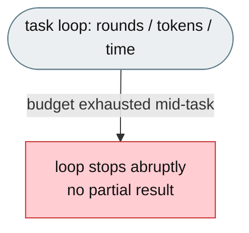
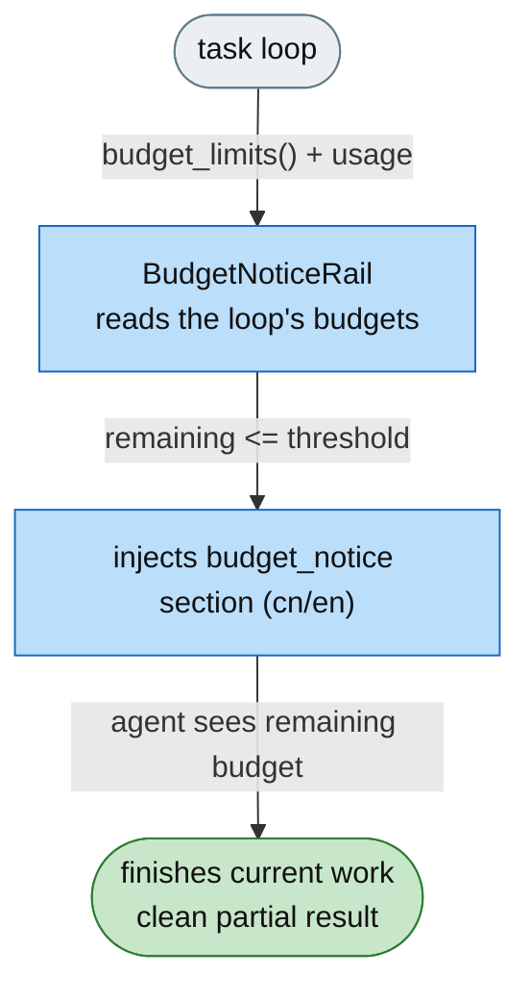

# [Feature]: Task-loop budget awareness — automatic low-budget wind-down warnings (rounds, tokens, time)

## Executive Summary

Agents on long tasks run until a task-loop budget is exhausted and then stop abruptly, mid-work, with no chance to land a usable result. This feature makes the agent aware of its remaining budget: when the task loop is running low on rounds, tokens, or wall-clock time, a localized system-prompt notice tells the agent how much remains and to finish cleanly with a partial result and an explicit statement of what is left. The notice is produced by agent-core's generic `BudgetNoticeRail`, which reads the loop's actual budgets through `LoopCoordinator.budget_limits()`; jiuwenswarm mounts the rail and supplies the rounds budget.

Issue #3548 https://github.com/openJiuwen-ai/jiuwenswarm/issues/3548 
PR #368 https://github.com/openJiuwen-ai/jiuwenswarm/pull/368

## Background Description

DeepAgent's outer task loop is bounded by a set of stop-condition budgets — rounds, cumulative tokens, and wall-clock — evaluated by `LoopCoordinator`. When any budget is exhausted the loop ends immediately, whether or not the agent has finished, so the run can be cut off in the middle of a refactor or investigation.

jiuwenswarm mounts agent-core's `BudgetNoticeRail` on the agent and gives the outer task loop a real rounds budget, so the agent receives a wind-down notice before the budget is spent. This is the jiuwenswarm half of the fix; the rail and the loop-budget accessors live in agent-core.

## Design Ideas

### Proposed design

- **Mount agent-core's `BudgetNoticeRail`** — `interface_deep._build_budget_notice_rail(config)` builds the rail and the existing `_RailBuildInfo` table attaches it as `_budget_notice_rail`.
- **Give the loop a real rounds budget** — jiuwenswarm adds `TaskCompletionRail(max_rounds=react.max_iterations)` to the rail list, so the outer loop is genuinely capped at `max_iterations` and `LoopCoordinator.budget_limits()` exposes that limit.
- **Single source of truth** — the rail reads the loop's limits (`budget_limits()`) and current usage; jiuwenswarm does not carry a parallel copy of the budget inside the rail.
- **Host threshold** — `react.budget_warning_threshold` maps to the rail's absolute remaining-rounds threshold (default 10). Token/time budgets warn when configured on the loop.
- **Localized notice** — the prompt section text (cn/en) comes from agent-core's `budget_notice` section; jiuwenswarm only passes the language.

### Rejected alternatives

- **Implement the rail in jiuwenswarm** — the capability is generic and provided by agent-core; a host copy would duplicate it and drift.
- **Let the rail carry its own `max_iterations`** — a parallel copy of the budget can desynchronise from the limit that actually stops the loop.
- **Warn without configuring a loop budget** — the rail reads the loop's real budgets, so there would be nothing to warn about; the rounds cap must be configured on the loop.
- **One rail per resource** — three sections competing for one prompt slot, with duplicated lifecycle and no benefit.

## Involved Public APIs

| API | Kind |
|---|---|
| `_build_budget_notice_rail(config)` | adapter builder (mounts agent-core `BudgetNoticeRail`) |
| `_budget_notice_rail` | rail registration attribute in `_build_agent_rails` |
| Config (`react`) | `max_iterations` — outer task-loop rounds cap (single source of truth) |
| Config (`react`) | `budget_warning_threshold` — remaining rounds at which to warn (default 10) |

**Impact:** additive to the agent's rail set; the user-facing config keys and defaults are preserved. Requires the agent-core `BudgetNoticeRail` feature (agent-core issue #1348).

## Description of Relevance to Other Modules

- **`jiuwenswarm/server/runtime/agent_adapter/interface_deep.py`** — builds/mounts the rail and supplies the loop rounds budget.
- **`jiuwenswarm/resources/config.yaml`** — `react.max_iterations` / `react.budget_warning_threshold`.
- **agent-core** — provides `BudgetNoticeRail`, the localized `budget_notice` section, and `LoopCoordinator.budget_limits()`.

## Test Design and Test Plan

Unit tests (`tests/unit_tests/agents/harness/test_budget_notice_rail.py`):

1. **Default threshold** — empty config → 10 remaining rounds.
2. **Loose parsing** — null / empty / non-integer `budget_warning_threshold` falls back, never crashes.
3. **Explicit threshold** — `budget_warning_threshold: 5` is honored.
4. **Single source of truth** — with `max_iterations` absent from the rail config, the rail warns based on the loop's real rounds limit (loop built with `MaxRoundsEvaluator`) and clears when the budget is healthy.

Performance/reliability:

- Passive rail: no extra model calls, no blocking I/O, no evaluator mutation.

## Additional Information

Depends on the agent-core feature: `BudgetNoticeRail` + `LoopCoordinator.budget_limits()` (agent-core issue #1348 / PR #1349).

## Solution

Paired: [GitHub #368](https://github.com/openJiuwen-ai/jiuwenswarm/pull/368) ↔ [GitCode !3802](https://gitcode.com/openJiuwen/jiuwenswarm/merge_requests/3802)

**What type of PR is this?**
/kind feature

---

## **What does this PR do / why do we need it**

This PR adds **task-loop budget awareness** to the agent. The agent now receives a localized system-prompt notice when the task loop is running low on rounds, tokens, or wall-clock time, telling it how much remains and to finish with the best partial result and an explicit statement of what is left.

The notice is injected by agent-core's `BudgetNoticeRail`, which reads the loop's actual budgets (`LoopCoordinator.budget_limits()`). jiuwenswarm mounts the rail and gives the outer task loop a real rounds budget (`TaskCompletionRail(max_rounds=react.max_iterations)`), so the cap is enforced and the rail has a limit to report.

### **Configuration**

`react.max_iterations` (outer task-loop rounds cap) and `react.budget_warning_threshold` (remaining rounds at which to warn, default 10) in `config.yaml`.

### **Why this matters**

- **Graceful landing** — the agent finishes with a usable partial result instead of being cut off.
- **All budgets covered** — rounds, tokens, time (whatever the loop enforces), not just one.
- **Single source of truth** — the warning reads the loop's real limits; no parallel host copy.
- **Low cost** — passive rail: no extra model calls, no blocking I/O, no overhead far from the limit.

---

## **Which issue(s) this PR fixes**

Fixes #3548

---

## **What scenarios were tested, and what were the verification results（Function, performance, reliability, etc.）**

### **Functional verification**
- Empty/null/non-integer `budget_warning_threshold` → default 10 remaining rounds.
- Explicit `budget_warning_threshold` honored.
- Rail warns based on the loop's real rounds budget and clears when the budget is healthy.
- Localized notice renders in the agent's prompt language.

### **Performance & reliability**
- No behavior change far from the limit; no extra model calls or blocking I/O.

---

## **Self-checklist**

- [x] **Design**: Mounts the generic agent-core rail and configures the loop budget
- [x] **Test**: Builder mapping + single-source-of-truth tests
- [x] **Verification**: Default/loose/explicit threshold and healthy-path clearing
- [x] **Interface**: User config keys preserved
- [x] **Document**: Config comments updated
