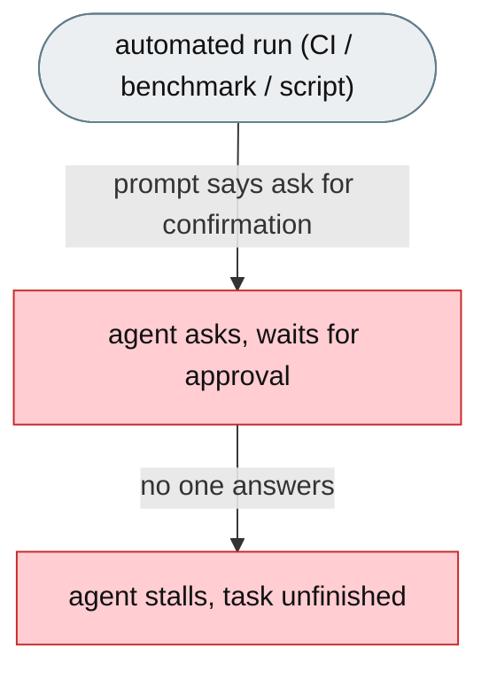
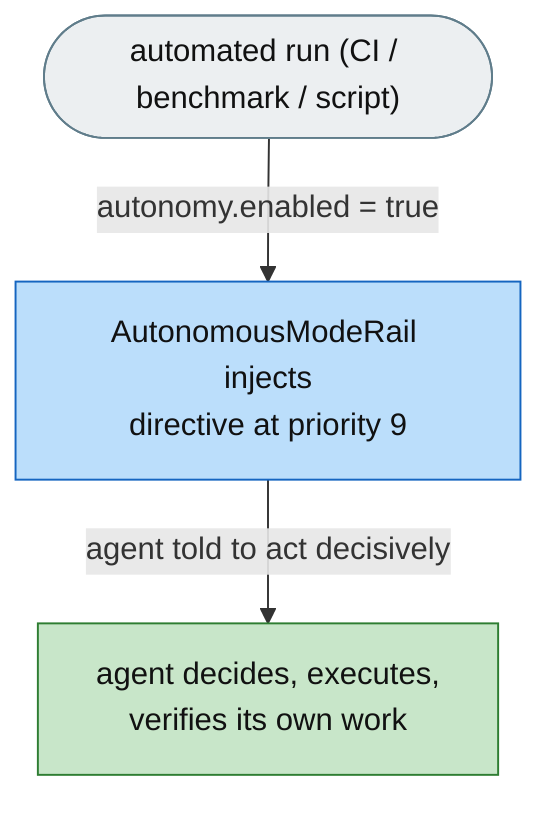

# [Feature]: Autonomous execution mode — top-level prompt override for unattended environments

## Executive Summary

jiuwenswarm's system prompt was designed for interactive use — it tells the agent to ask for confirmation, pause on ambiguity, and ask before acting — so in unattended environments (CI, benchmarks, scripted runs) the agent stalls or loops because no one answers its questions. This feature adds an `autonomy.enabled` switch that injects a high-priority directive telling the agent to act decisively, verify its own work, and finish end-to-end without waiting for approval.

Issue #3552 https://github.com/openJiuwen-ai/jiuwenswarm/issues/3552<br>
PR #370 https://github.com/openJiuwen-ai/jiuwenswarm/pull/370

## Background Description

The code-mode system prompt contains an `ACTIONS_WITH_CARE` section (priority 35) and related sections that force the LLM to request confirmation before risky operations. These sections are statically compiled into the system prompt, injected at agent startup, and impossible to override without modifying built-in prompt files. In unattended environments no one answers the confirmation questions, so the agent stalls or loops and tasks remain unfinished despite the agent being fully capable of completing them.



## Design Ideas

### Proposed design

- **`AutonomousModeRail`** — a `DeepAgentRail` (rail `priority=3`) that reads `autonomy.enabled` from config and, when enabled, injects a `PromptSection(name="autonomous_mode", priority=9)`.
- **Top-of-prompt placement** — priority 9 sits just before `INTRO` (10), so the autonomy directive frames all downstream sections; because LLMs process the system prompt top-to-bottom, this overrides the confirmation-request language without modifying built-in prompt files.
- **Directive content** — never ask for clarification or confirmation; never ask permission before acting (all tool use pre-authorised); never hedge; verify your own work; complete the task end-to-end.
- **Persistence** — `init()` injects the section immediately, and `before_invoke` re-asserts it each invocation to keep it present.
- **Disabled no-op** — when `autonomy.enabled` is false, `init()` and `before_invoke` do nothing, leaving interactive behaviour unchanged.


## Involved Public APIs

New class (public addition):

| API | Kind |
|---|---|
| `AutonomousModeRail` | new class (`DeepAgentRail`) |

Config additions (under `autonomy`):

| Field | Type | Default |
|---|---|---|
| `autonomy.enabled` | bool | `false` |

**Impact:** additive and opt-in (`enabled` defaults to `false`). No existing prompt, rail, or config contract changes. When disabled, the rail is a no-op.

## Description of Relevance to Other Modules

- **`jiuwenswarm/agents/harness/common/rails/autonomous_mode_rail.py`** — the new rail and its directive content.
- **`jiuwenswarm/server/runtime/agent_adapter/interface_deep.py`** — `_build_autonomous_mode_rail()` attaches the rail with the resolved `autonomy.enabled` flag (the rail itself no-ops when disabled).
- **`jiuwenswarm/resources/config.yaml`** — declares the `autonomy.enabled` config key.
- **Tool-permission layer (`permissions.enabled`)** — complementary: SkillsBench sets `permissions.enabled: false` to disable the tool-permission layer, while this rail handles LLM behavioural disposition.

## Test Design and Test Plan

Unit/integration tests:

1. **Enabled** — `autonomy.enabled=true` → `init()` injects `autonomous_mode` at priority 9; content is the autonomy directive.
2. **Disabled** — `autonomy.enabled=false` → `init()` and `before_invoke` do nothing; the section is absent.
3. **Persistence** — `before_invoke` removes and re-adds the section so it stays present across invocations.
4. **Cleanup** — `uninit()` removes the section.

Performance/reliability:

- **No overhead when disabled** — the rail is a no-op unless enabled.

## Additional Information

## Solution

Paired: [GitHub #370](https://github.com/openJiuwen-ai/jiuwenswarm/pull/370) ↔ [GitCode !3797](https://gitcode.com/openJiuwen/jiuwenswarm/merge_requests/3797)

**What type of PR is this?**
/kind feature

---

## **What does this PR do / why do we need it**

This PR introduces **Autonomous Execution Mode**, allowing jiuwenswarm to operate decisively and independently in environments where **no human is present** — CI pipelines, scripted agent runs, evaluation harnesses, and benchmark systems.

When autonomy is enabled, the agent:

- **acts without asking for confirmation**
- **makes decisions independently**
- **verifies its own work**
- **finishes tasks without waiting for human approval**

When autonomy is disabled (default), interactive behavior remains unchanged.

Issue #3552

---

## **Problem**

jiuwenswarm's system prompt was originally designed for **interactive use**. It instructs the agent to:

- "ask for confirmation before proceeding"
- "pause on ambiguity"
- "ask before acting"

This is correct when a human is present.
But in unattended environments:

- no one answers the confirmation questions
- the agent stalls or loops
- tasks remain unfinished despite the agent being fully capable of completing them

This severely limits automation and benchmark performance.

The code-mode system prompt contains an `ACTIONS_WITH_CARE` section (priority 35) and related sections that **force** the LLM to request confirmation before risky operations.
These sections are:

- statically compiled into the system prompt
- injected at agent startup
- impossible to override without modifying built-in prompt files

There was **no mechanism** to suppress or supersede these sections for non-interactive deployments.

---

## **Solution**

A new `autonomy.enabled` switch tells the agent:

- "You are operating without a supervisor."
- "Do not ask for confirmation."
- "Decide and execute."
- "Verify your own work."
- "Complete the task end-to-end."

This produces fully autonomous behavior appropriate for CI, scripts, and benchmarks.



A new **AutonomousModeRail** (priority 3) implements autonomy cleanly and safely.

### **How it works**

1. Reads:

```
autonomy.enabled = true/false
```

from config.
2. When enabled, injects a **PromptSection** at **priority 9** — just before `INTRO` (priority 10), the first static section.
3. Because LLMs process system prompts **top-to-bottom**, placing the autonomy directive first:
   - frames all downstream sections
   - overrides confirmation-request language
   - does not require modifying built-in prompt files
4. The autonomy section is **re-injected on every before_invoke** to ensure persistence across invocations.
5. When autonomy is disabled, the rail does nothing — interactive behavior remains unchanged.

### **Relationship to permissions**

SkillsBench already sets:

```
permissions.enabled: false
```

This disables the tool-permission layer.
The new rail handles **LLM behavioral disposition**, completing the autonomy stack.

---

## **Expected Impact**

- Agent no longer stalls waiting for confirmation in CI or benchmarks
- Fully autonomous behavior in unattended environments
- No change for interactive users
- Cleaner architecture: autonomy implemented in jiuwenswarm, not in SkillsBench monkey-patches
- Improved reliability and completion rates for long tasks

---

## **Self-checklist**

- [x] **Design**: Reviewed with maintainers; correct layering
- [x] **Test**: Verified injection, override, and persistence across invocations
- [x] **Verification**: Confirmed decisive behavior in autonomy mode
- [ ] **Interface**: No external API changes
- [x] **Document**: Added bilingual documentation for `autonomy.enabled`
