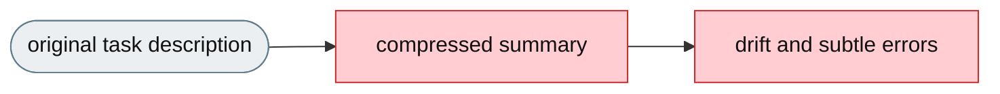
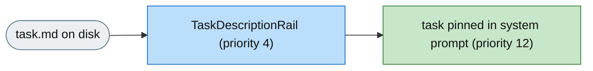

# [Feature]: Persistent task-description rail keeps the original task visible across compression

## Executive Summary

On long tasks, jiuwenswarm compresses old conversation history to save space, which can make the original task description vanish from the agent's visible context — the agent then works from a compressed summary instead of the real instructions, causing subtle errors on tasks with strict output formats, exact file names, or precise constraints. This feature pins the full task description in a dedicated system-prompt section that is never compressed, so the agent always sees the original task regardless of how long the conversation has grown.

Issue #3543 https://github.com/openJiuwen-ai/jiuwenswarm/issues/3543<br>
PR #371 https://github.com/openJiuwen-ai/jiuwenswarm/pull/371

## Background Description

Context compression operates only on conversation messages, but the system prompt is rebuilt from prompt sections on every model call and is never compressed. Before this change there was no mechanism to keep a file's content pinned in the system prompt across the entire run, so on long tasks the original task description could be compressed away and the agent drifted from its real instructions. This matters most for tasks with strict output formats, exact file names, precise constraints, and multi-step requirements.



## Design Ideas

### Proposed design

- **`TaskDescriptionRail`** — a `DeepAgentRail` (rail `priority=4`, before `RuntimePromptRail` at 5) that reads a task-description file from disk and pins it as a dedicated system-prompt section on every model call.
- **Pinned section** — injects `PromptSection(name="task_description", priority=12)`, placed between `INTRO` (10) and `SYSTEM` (15) so the agent reads the task right after its identity preamble; the section lives in the system prompt, never the conversation history, so compression never touches it.
- **Lifecycle** — `before_invoke` clears any stale section and attempts an immediate read; `before_model_call` retries injection if the file was not available at invoke time (handles late-mounted volumes).
- **Opt-in only** — the rail is instantiated only when `task_description.enabled` is true, so interactive sessions incur zero overhead.
- **Config** — `task_description.enabled` (bool) and `task_description.path` (default `/app/task.md`).


## Involved Public APIs

New class (public addition):

| API | Kind |
|---|---|
| `TaskDescriptionRail` | new class (`DeepAgentRail`) |

Config additions (under `task_description`):

| Field | Type | Default |
|---|---|---|
| `task_description.enabled` | bool | `false` |
| `task_description.path` | str | `/app/task.md` |

**Impact:** additive and opt-in (`enabled` defaults to `false`). No existing rail, prompt, or config contract changes. When disabled, the rail is not instantiated.

## Description of Relevance to Other Modules

- **`jiuwenswarm/agents/harness/common/rails/task_description_rail.py`** — the new rail itself.
- **`jiuwenswarm/server/runtime/agent_adapter/interface_deep.py`** — builds and registers the rail in the agent rail set only when `task_description.enabled` is true.
- **`jiuwenswarm/resources/config.yaml`** — declares the `task_description` config block.
- **`openjiuwen.harness.prompts.PromptSection`** — the injected section targets the existing system-prompt builder (`system_prompt_builder.add_section`), so no new prompt infrastructure is needed.

## Test Design and Test Plan

Unit/integration tests:

1. **Injection** — when `task_description.enabled` is true and the file exists, the section is added with name `task_description`, priority 12, and content `# Task Description\n\n<file content>`.
2. **Removal** — `before_invoke` clears a stale section before re-injecting, so a changed file replaces the old content.
3. **Late mount** — if the file is not available at `before_invoke`, `before_model_call` retries until `_injected` is true.
4. **Missing/unreadable file** — `_read_file` returns `None` and the rail logs a warning and skips; no crash, no side effect.
5. **Disabled path** — `task_description.enabled=false` → the rail is not instantiated and the prompt is unchanged.

Performance/reliability:

- **Zero overhead when disabled** — the rail is not built for interactive sessions unless enabled.

## Additional Information

## Solution

Paired: [GitHub #371](https://github.com/openJiuwen-ai/jiuwenswarm/pull/371) ↔ [GitCode !3798](https://gitcode.com/openJiuwen/jiuwenswarm/merge_requests/3798)

**What type of PR is this?**
/kind feature

---

## **What does this PR do / why do we need it**

This PR adds a **Task Description Re-injection Rail** that ensures the agent always sees the **full original task description**, even after many rounds of context compression.

The task description is now pinned in the system prompt — not in the conversation history — so it never disappears. This prevents drift, preserves exact requirements, and improves correctness on long tasks.

Issue #3543

---

## **Problem**

On long tasks, jiuwenswarm compresses old conversation history to save space. A side effect: the **original task description** can vanish from the agent's visible context. Once that happens, the agent is working from a **compressed summary** of the task rather than the real instructions. On tasks with strict output formats, exact file names, precise constraints, and multi-step requirements, this leads to subtle errors and incomplete results, even when the agent is fully capable.

Under the hood, context compression operates only on **conversation messages** (`dialogue_compressor`, `round_level_compressor`, etc.), but the **system prompt** is rebuilt from prompt sections on every model call and is **never compressed**. There was **no mechanism** to keep a file's content pinned in the system prompt across the entire run.

---

## **Solution**

The task description is now placed in a **dedicated, permanent slot** in the system prompt. This slot is never compressed, always visible, refreshed at every invocation, and updated if the file changes. The agent reads the task description before every response, guaranteeing stable grounding.



A new **TaskDescriptionRail** (priority 4) implements this behavior.

### **How it works**

1. **Reads config:**
   ```yaml
   task_description.enabled: true/false
   task_description.path: "/app/task.md"
   ```
2. **When enabled, injects:**
   ```python
   PromptSection(
       name="task_description",
       priority=12,
       content=<contents of task.md>
   )
   ```
   Priority 12 places it between `INTRO` (10) and `SYSTEM` (15), so the agent sees the task immediately after its identity preamble.
3. **Lifecycle**
   - `before_invoke` — clears any previous section, then attempts an immediate read/inject (supports fresh mounts).
   - `before_model_call` — retries injection if the file was not available at invoke time; handles late-mounted volumes (common in SkillsBench).
4. The rail is instantiated **only when enabled**, so interactive sessions incur zero overhead.

### **SkillsBench Integration**

SkillsBench sets:
```yaml
task_description.enabled: true
task_description.path: "/app/task.md"
```
Every benchmark task mounts `task.md`, so the agent always sees the full task description.

---

## **Expected Impact**

- Original task description is **always visible**, regardless of compression
- Eliminates drift from compressed summaries
- Improves correctness on long, multi-step tasks
- Supports late-mounted task files (common in benchmarks)
- Zero impact on interactive sessions unless enabled

---

## **Self-checklist**

- [x] **Design**: Reviewed with maintainers
- [x] **Test**: Verified injection, removal, and late-mount behavior
- [x] **Verification**: Confirmed stable visibility across long runs
- [ ] **Interface**: No external API changes
- [x] **Document**: Added bilingual documentation for `task_description.*`
