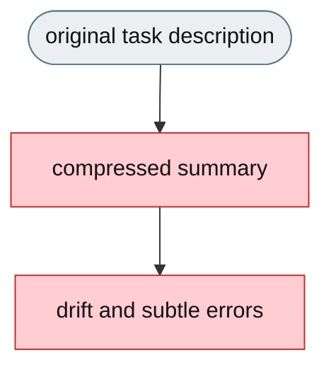
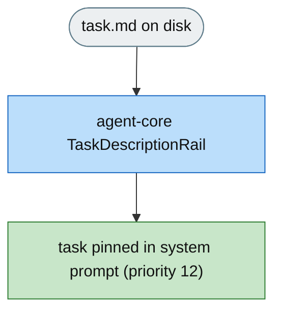

# [Feature]: Task description re-injection keeps the original task visible across compression

## Executive Summary

On long tasks jiuwenswarm compresses old conversation history to save space, which can make the original task description vanish from the agent's visible context — the agent then works from a compressed summary instead of the real instructions, causing subtle errors on tasks with strict output formats, exact file names, or precise constraints. This change pins the full task description in a dedicated system-prompt section that is never compressed, so the agent always sees the original task regardless of how long the conversation has grown.

The mechanism is the openjiuwen `TaskDescriptionRail` (agent-core) — a generic harness rail. jiuwenswarm owns only the product configuration (`task_description.enabled` / `task_description.path`) and the wiring that instantiates the rail when enabled.

Issue #3543<br>
PR #371

## Background Description

Context compression operates only on conversation messages; the system prompt is rebuilt from prompt sections on every model call and is never compressed. Before this change there was no mechanism to keep a file's content pinned in the system prompt across the entire run, so on long tasks the original task description could be compressed away and the agent drifted from its real instructions. This matters most for tasks with strict output formats, exact file names, precise constraints, and multi-step requirements.

Two parts are involved:

- **`TaskDescriptionRail`** — openjiuwen (agent-core). A generic `DeepAgentRail` that reads a file and pins it as a system-prompt section.
- **jiuwenswarm config + wiring** — `task_description.enabled` / `task_description.path` in `config.yaml`, and the adapter builds the rail only when enabled.


## Design Ideas

### Proposed design

- **agent-core `TaskDescriptionRail`** — the generic rail (agent-core, `openjiuwen.harness.rails.TaskDescriptionRail`): `DeepAgentRail`, rail `priority=80`, injects `PromptSection(name="task_description", priority=12)` between `IDENTITY` (10) and `SAFETY` (20). `before_invoke` clears and re-reads; `before_model_call` retries while the file is absent (late-mounted volumes).
- **`task_description` config** — `enabled` (default `false`) and `path` (default `/app/task.md`), documented; gating is product-side.
- **Adapter wiring** — `interface_deep.py` instantiates `TaskDescriptionRail(path)` only when `task_description.enabled` is true; the hot-reload path (`_get_current_agent_rails`) rebuilds it from the current config snapshot and lists the old instance when disabled so it is torn down cleanly.
- **Opt-in only** — the rail is not built for sessions that leave `enabled` false, so interactive sessions incur zero overhead.


### Rejected alternatives

- **Implement the rail inside jiuwenswarm.** It is generic harness behavior; every integrator that wants task pinning would re-implement it. The generic rail belongs to the harness (agent-core).
- **Pin the task in the conversation history.** That is exactly what compression drops.
- **Always-on injection.** Reads the file and adds a section even when no task file exists; wasted work and a prompt section that is empty for interactive sessions.

## Involved Public APIs

| API | Kind | Change |
|---|---|---|
| `task_description.enabled` | config | new, default `false` |
| `task_description.path` | config | new, default `/app/task.md` |
| `TaskDescriptionRail` | agent-core class | consumed (not owned) by jiuwenswarm |
| `interface_deep.py` rail wiring | internal | builds/registers the rail when enabled; hot-reload includes teardown |

**Impact:** additive and opt-in (`enabled` defaults to `false`). No existing rail, prompt, or config contract changes. The rail's behavior is owned by agent-core; jiuwenswarm only configures and wires it.

## Description of Relevance to Other Modules

- **`openjiuwen.harness.rails.TaskDescriptionRail`** (agent-core) — the rail; the source of the pinning behavior.
- **`jiuwenswarm/resources/config.yaml`** and **`docs/en/Configuration.md`** — the `task_description` config block.
- **`jiuwenswarm/server/runtime/agent_adapter/interface_deep.py`** — builds the rail from config and registers it in the agent rail set only when enabled.
- **`openjiuwen.harness.prompts.PromptSection`** — the injection surface the rail targets; no new prompt infrastructure.

## Test Design and Test Plan

Unit/integration tests:

1. **Injection** — populated file → a `task_description` section is added with the expected content.
2. **Empty / missing file** — no section injected; a later model call injects once the file is populated.
3. **`uninit`** — removes the section and clears the builder reference.
4. **Disabled path** — `task_description.enabled=false` → the rail is not instantiated and the prompt is unchanged.

The rail-behavior cases (1–3) are covered by agent-core's `tests/unit_tests/harness/rails/test_task_description_rail.py` (the rail's home). The jiuwenswarm side (4 + the enabled-gate / hot-reload wiring) is a thin config-to-constructor path exercised through the adapter build/hot-reload suites.

Performance/reliability:

- **Zero overhead when disabled** — the rail is not built for interactive sessions unless enabled.
- One file read per invoke; retry only while the file is absent.

## Additional Information

Behavior: the task is pinned in a never-compressed system-prompt section, refreshed at every invocation, and updated if the file changes. The structural split is *where* the behavior lives — the rail in agent-core, the configuration and wiring in jiuwenswarm.

---

## Solution

### PR title

`feat(prompting): re-inject task description to keep original task visible across compression`

Paired: [GitHub #371](https://github.com/openJiuwen-ai/jiuwenswarm/pull/371) ↔ [GitCode !3798](https://gitcode.com/openJiuwen/jiuwenswarm/merge_requests/3798)

**What type of PR is this?**
/kind feature

---

## **What does this PR do / why do we need it**

Pins the full task description in a never-compressed system-prompt section, via the agent-core `TaskDescriptionRail`, configured by jiuwenswarm's `task_description.enabled` / `task_description.path`.

### **The problem**

- On long tasks, compression can drop the original task description; the agent then works from a summary and drifts.
- There was no mechanism to keep a file's content pinned in the system prompt across the whole run.



### **The solution**

- `task_description.enabled` / `task_description.path` gate and locate a task file.
- When enabled, jiuwenswarm builds an agent-core `TaskDescriptionRail` that pins the file as a permanent system-prompt section (priority 12), rebuilt every model call and never compressed.
- Hot-reload rebuilds the rail from the current config, and disables cleanly (the old instance is torn down).

### **The change, by file**

1. **`jiuwenswarm/resources/config.yaml`** — new `task_description` block:
   ```yaml
   task_description:
     enabled: false
     path: /app/task.md
   ```
2. **`jiuwenswarm/server/runtime/agent_adapter/interface_deep.py`**
   - `_build_task_description_rail(config_base)` reads `task_description.path` (default `/app/task.md`)
     and constructs `TaskDescriptionRail(path)`.
   - `_build_agent_rails` appends the rail to the build list only when
     `bool(config_base["task_description"].get("enabled", False))` is true, so disabled sessions never
     build it.
   - `_get_current_agent_rails` rebuilds the rail from the current config snapshot on hot reload, and —
     when disabled — still lists the previous instance via
     `_td_reload_rail = self._task_description_rail or _old_td_rail`, so `_hot_reload_rails` uninit's it
     and the section is torn down instead of leaking.
3. **`docs/en/Configuration.md`** — documents `task_description.enabled` / `task_description.path`.
4. **agent-core counterpart** — `TaskDescriptionRail` lives in `openjiuwen/harness/rails` (`task_description_rail.py`, exported) and owns the pinning behavior.

### **Expected impact**

- The original task description is always visible, regardless of compression.
- Eliminates drift from compressed summaries; improves correctness on long, multi-step tasks.
- Supports late-mounted task files (common in benchmarks).
- Zero impact on interactive sessions unless enabled.



---

## **Which issue(s) this PR fixes**

Fixes #3543

---

## **What scenarios were tested, and what were the verification results（Function, performance, reliability, etc.）**

### **Functional verification**
- Populated file → `task_description` section injected with expected content.
- Empty / missing file → no injection; populated later → injected on next model call.
- `uninit` → section removed, no residue.
- `enabled=false` → rail not built, prompt unchanged.

### **Performance & reliability**
- Zero overhead when disabled; one read per invoke, retry only while the file is absent.

---

## **Self-checklist**

- [x] **Design**: generic rail owned by agent-core; jiuwenswarm owns config + wiring
- [x] **Test**: rail behavior covered by agent-core; jiuwenswarm enabled-gate / hot-reload wiring exercised
- [x] **Verification**: task visible across compression; clean teardown on disable
- [x] **Interface**: additive config (`task_description.*`); no existing contract changes
- [x] **Document**: `task_description.*` documented; agent-core counterpart referenced
