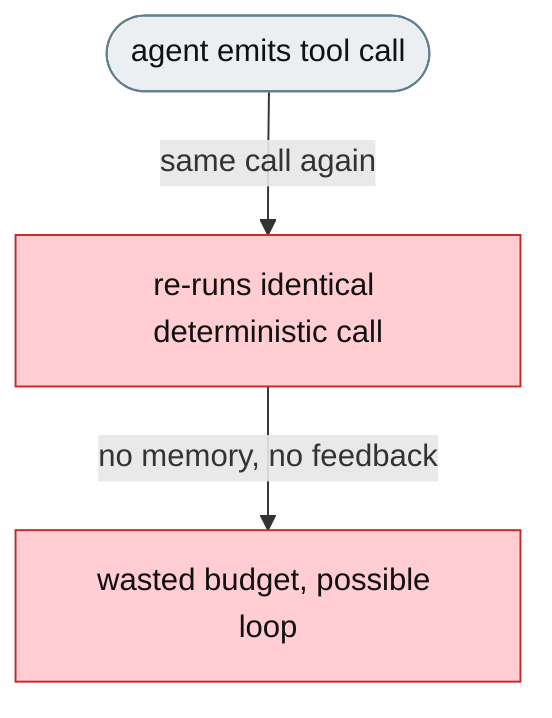
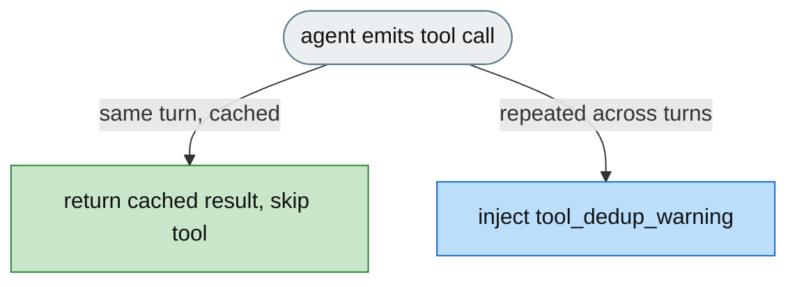

# [Feature]: Tool-call deduplication cache with cross-turn repetition warnings

## Executive Summary

Agents repeatedly run the same deterministic tool calls with identical arguments — reading the same file, re-running the same grep, listing the same directory — wasting iteration budget, tokens, and time, and sometimes looping without progress. This feature adds a rail that short-circuits identical repeat calls within a turn by returning a cached result, and warns the agent in the system prompt when it repeats the same call too many times across turns.

Issue #3549 https://github.com/openJiuwen-ai/jiuwenswarm/issues/3549<br>
PR #372 https://github.com/openJiuwen-ai/jiuwenswarm/pull/372

## Background Description

The ReAct agent loop has no memory of previously executed tool calls. Within a single model response the LLM may emit duplicate tool calls, and across turns it may repeat the same `(tool_name, args)` pair many times. There was no mechanism to short-circuit redundant executions and no feedback to the LLM about repeated calls, so the agent wasted budget and could get stuck in a repetition loop.



## Design Ideas

### Proposed design

- **`ToolCallDeduplicationRail`** — a `DeepAgentRail` (rail `priority=8`) with two mechanisms.
- **Per-turn dedup** — `before_model_call` clears a per-turn cache; `before_tool_call` computes a key `tool_name:md5(sorted_args)[:8]` for cacheable tools and, on a hit, sets `ctx.extra["_skip_tool"] = True`, injects the cached result into `ctx.inputs` (as a synthetic `ToolMessage` when available), and skips the real tool; `after_tool_call` stores fresh results in the cache.
- **Cross-turn warning** — `after_tool_call` increments a per-key counter; when a key reaches `warn_after` (default 3) real executions for the first time, the rail injects `PromptSection(name="tool_dedup_warning", priority=97)` listing all over-threshold calls and telling the agent to stop repeating them.
- **Deterministic-only whitelist** — dedup applies only to read-only tools (`read_file`, `read_text_file`, `read`, `glob`, `glob_file_search`, `list_dir`, `list_files`, `grep`, `search`); side-effecting tools (write, edit, bash, terminal) are never intercepted.
- **Config** — `tool_dedup.enabled` (default false) gates the rail; `tool_dedup.warn_after` (default 3).


## Involved Public APIs

New class (public addition):

| API | Kind |
|---|---|
| `ToolCallDeduplicationRail` | new class (`DeepAgentRail`) |

Config additions (under `tool_dedup`):

| Field | Type | Default |
|---|---|---|
| `tool_dedup.enabled` | bool | `false` |
| `tool_dedup.warn_after` | int | `3` |

**Impact:** additive and opt-in (`enabled` defaults to `false`). No existing tool, rail, or prompt contract changes. Side-effecting tools are never intercepted.

## Description of Relevance to Other Modules

- **`jiuwenswarm/agents/harness/common/rails/tool_dedup_rail.py`** — the new rail, its cache keying, and the deterministic-tool whitelist.
- **`jiuwenswarm/server/runtime/agent_adapter/interface_deep.py`** — `_build_tool_call_deduplication_rail()` attaches the rail only when `tool_dedup.enabled` is true.
- **`jiuwenswarm/resources/config.yaml`** — declares the `tool_dedup` config block.

## Test Design and Test Plan

Unit/integration tests:

1. **Per-turn hit** — an identical cacheable call within the same turn returns the cached result and sets `_skip_tool`, bypassing the real tool.
2. **Cache reset** — `before_model_call` clears the per-turn cache, so a call in a new turn executes for real.
3. **Cache write** — `after_tool_call` stores a fresh result for future hits.
4. **Cross-turn counter** — `after_tool_call` increments per-key counts; a cache hit does not double-count.
5. **Warning threshold** — when a key reaches `warn_after` real executions, `tool_dedup_warning` (priority 97) is injected once and lists all over-threshold keys.
6. **Whitelist** — non-cacheable (side-effecting) tools are never intercepted or counted.
7. **Disabled path** — `tool_dedup.enabled=false` → the rail is not attached.

Performance/reliability:

- **No overhead when disabled** — the rail is not built unless enabled.

## Additional Information

## Solution

Paired: [GitHub #372](https://github.com/openJiuwen-ai/jiuwenswarm/pull/372) ↔ [GitCode !3799](https://gitcode.com/openJiuwen/jiuwenswarm/merge_requests/3799)

**What type of PR is this?**
/kind feature

---

## **What does this PR do / why do we need it**

This PR adds a **Tool-call Deduplication Cache** that prevents the agent from repeatedly running the same deterministic tool calls with identical arguments.
It eliminates wasted work, reduces iteration consumption, prevents loops, and improves benchmark scores.

The rail also warns the agent when it is repeating the same call across turns, helping it break out of unproductive patterns.

Issue #3549

---

## **Problem**

Agents frequently repeat the same tool calls:

- reading the same file multiple times
- running the same grep or search repeatedly
- listing the same directory over and over

This wastes:

- iteration budget
- tokens
- time

And in some cases, the agent gets stuck in a **repetition loop**, making no progress.

The ReActAgent loop has **no memory** of previously executed tool calls.

- Within a single model response, the LLM may emit duplicate tool calls.
- Across turns, the agent may repeat the same `(tool_name, args)` pair many times.
- There was no mechanism to short-circuit redundant executions.
- No feedback was provided to the LLM about repeated calls.

---

## **Solution**

A new rail keeps a record of every tool call:

- If the same deterministic call appears **again in the same turn**, the cached result is returned immediately — no tool execution.
- If the same call is repeated **too many times across turns**, the agent is warned in its system prompt and told to stop repeating it.



A new **ToolCallDeduplicationRail** (priority 8) implements two mechanisms.

---

## **1. Per-turn deduplication**

- The per-turn cache is cleared on **before_model_call**.
- In **before_tool_call**, the rail computes a key:

```
(tool_name, MD5[:8](sorted_args))
```

- If the key is already cached:
  - `ctx.extra["_skip_tool"] = True`
  - A synthetic `ToolMessage` with the cached result is injected into `ctx.inputs`
  - The real tool execution is bypassed
- In **after_tool_call**, real results are stored in the cache for future hits.

This eliminates redundant calls within the same turn.

---

## **2. Cross-turn repetition warnings**

- In **after_tool_call**, the rail increments a per-key counter.
- When a key reaches `warn_after` (default **3**) real executions, the rail injects:

```
PromptSection(
    priority=97,
    name="tool_dedup_warning",
    content="You have repeated these tool calls..."
)
```

- The section lists all over-threshold calls and instructs the agent to stop repeating them.

This provides feedback to the LLM and helps break repetition loops.

---

## **Deterministic vs. side-effecting tools**

Deduplication applies **only** to deterministic, read-only tools:

- `read_file`
- `glob`
- `grep`
- `list_dir`
- `search`
- etc.

Side-effecting tools (write, edit, bash, terminal, etc.) are **never** intercepted.

---

## **Configuration**

Added to config:

```
tool_dedup:
  enabled: true
  warn_after: 3
```

SkillsBench sets this to true.

---

## **Expected Impact**

- Eliminates redundant tool calls
- Prevents repetition loops
- Saves tokens and iteration budget
- Improves benchmark scores
- Provides actionable feedback to the agent
- Zero impact on side-effecting tools

---

## **Self-checklist**

- [x] **Design**: Reviewed with maintainers
- [x] **Test**: Verified per-turn and cross-turn behavior
- [x] **Verification**: Confirmed correct behavior on deterministic tools
- [ ] **Interface**: No external API changes
- [x] **Document**: Added bilingual documentation for `tool_dedup.*`
