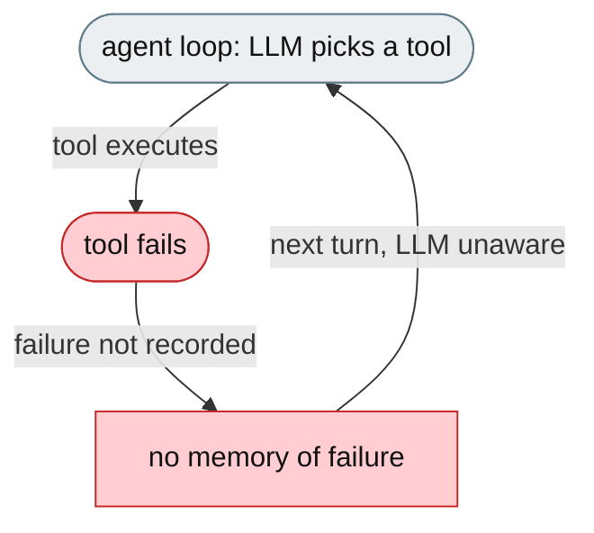
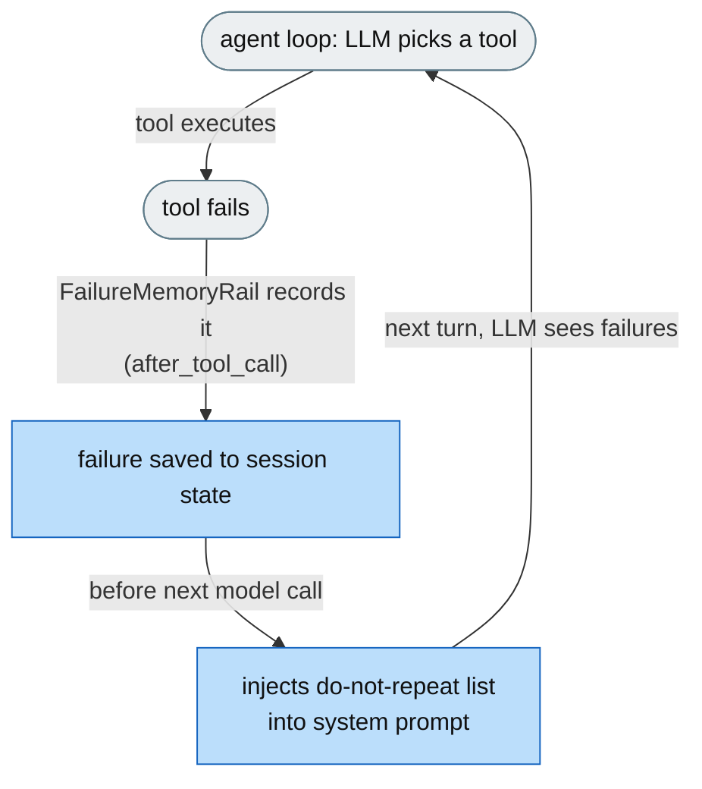

# [Feature]: Failure-pattern memory rail — prevent repeated failed tool calls

## Executive Summary

Agents repeat actions that have already failed — running a command that doesn't exist, reading a wrong path, re-running a test that fails the same way — wasting iterations, tokens, and time, and looping instead of adapting. This feature adds a rail that records every tool failure (exceptions and error-containing results) in session state and injects a "do not repeat these approaches" list into the system prompt before every model call.

Issue #3557 https://github.com/openJiuwen-ai/jiuwenswarm/issues/3557<br>
PR #396 https://github.com/openJiuwen-ai/jiuwenswarm/pull/396

## Background Description

The ReAct agent loop had no persistent memory of failed tool calls. Hard failures (exceptions) were not recorded, soft failures (tool results containing error text) were not recorded, and the LLM had to infer failure from conversation context — which is lossy under compression. There was no mechanism to surface failure patterns back to the model, so the agent retried the same broken command, flag, or path dozens of times without learning it doesn't work.



## Design Ideas

### Proposed design

- **`FailureMemoryRail`** — a `DeepAgentRail` (rail `priority=7`) with three hooks.
- **Soft-failure detection (`after_tool_call`)** — scans `ctx.inputs.tool_result` for error patterns (Traceback, `Error:`, `Permission denied`, `returned non-zero exit status`, etc.); on match, extracts the first error-containing lines as a snippet and records `{tool, args, error}` in session state.
- **Hard-failure detection (`on_tool_exception`)** — when the tool executor raises, records `str(ctx.exception)` (capped at 300 chars).
- **Injection (`before_model_call`)** — rebuilds `PromptSection(name="failure_memory", priority=95)` listing all known failures and instructing the agent not to repeat them; the section lives in the system prompt, so it survives compression.
- **Storage** — failures are stored in `ctx.session` under `_failure_memory`; capped at `max_failures` (default 10); exact duplicates of the most recent entry are suppressed.
- **Config** — `failure_memory.enabled` (default false) gates the rail; `failure_memory.max_failures` (default 10).


## Involved Public APIs

New class (public addition):

| API | Kind |
|---|---|
| `FailureMemoryRail` | new class (`DeepAgentRail`) |

Config additions (under `failure_memory`):

| Field | Type | Default |
|---|---|---|
| `failure_memory.enabled` | bool | `false` |
| `failure_memory.max_failures` | int | `10` |

**Impact:** additive and opt-in (`enabled` defaults to `false`). No existing tool, rail, or prompt contract changes.

## Description of Relevance to Other Modules

- **`jiuwenswarm/agents/harness/common/rails/failure_memory_rail.py`** — the new rail, error patterns, and snippet/args summarisation.
- **`jiuwenswarm/server/runtime/agent_adapter/interface_deep.py`** — `_build_failure_memory_rail()` attaches the rail only when `failure_memory.enabled` is true.
- **`jiuwenswarm/resources/config.yaml`** — declares the `failure_memory` config block.

## Test Design and Test Plan

Unit/integration tests:

1. **Soft-failure detection** — `after_tool_call` records an entry when the result contains an error pattern; non-error results are ignored.
2. **Hard-failure detection** — `on_tool_exception` records `str(ctx.exception)` (capped).
3. **Snippet extraction** — the first error-containing lines are extracted (capped at 300 chars).
4. **Injection** — `before_model_call` rebuilds `PromptSection(name="failure_memory", priority=95)` when failures exist.
5. **Deduplication** — an exact duplicate of the most recent entry is suppressed.
6. **Cap** — the list is capped at `max_failures` (rolling window).
7. **Disabled path** — `failure_memory.enabled=false` → the rail is not attached.

Performance/reliability:

- **No overhead when disabled** — the rail is not built unless enabled.

## Additional Information

## Solution

Paired: [GitHub #396](https://github.com/openJiuwen-ai/jiuwenswarm/pull/396) ↔ [GitCode !3808](https://gitcode.com/openJiuwen/jiuwenswarm/merge_requests/3808)

**What type of PR is this?**
/kind feature

---

## **What does this PR do / why do we need it**

This PR adds a **Failure-pattern Memory Rail** that remembers tool failures and shows them to the agent before every model call.
This prevents the agent from repeatedly trying approaches that have already failed — saving iterations, reducing loops, and improving benchmark scores.

The failure list lives in the **system prompt**, not the conversation history, so it survives context compression and remains visible throughout the entire task.

Issue #3557

---

## **Problem**

Agents often repeat actions that have already failed:

- running a command that doesn't exist
- reading a path that is wrong
- re-running a test that fails the same way
- retrying a grep or search that always returns empty

This wastes:

- iteration budget
- tokens
- time

And causes the agent to loop instead of adapting.

The ReActAgent loop had **no persistent memory** of failed tool calls.

- Hard failures (exceptions) were not recorded.
- Soft failures (tool returns output containing errors) were not recorded.
- The LLM had to infer failure from conversation context — which is lossy under compression.
- No mechanism existed to surface failure patterns back to the model.

---

## **Solution**

A new rail watches every tool call.
When a failure is detected:

- the failure is remembered
- a concise snippet is stored
- before every model call, the agent is shown a list of all known failures
- the agent is explicitly instructed **not to repeat** those approaches

This gives the agent durable awareness of what does **not** work.



A new **FailureMemoryRail** (priority 7) implements persistent failure tracking.

---

## **FailureMemoryRail — Three Hooks**

### **1. `after_tool_call` — detect soft failures**

The rail scans `ctx.inputs.tool_result` for error patterns:

- `Traceback`
- `Error:`
- `Permission denied`
- `returned non-zero exit status`
- other common failure markers

When matched:

- extracts the first error-containing lines as a snippet
- stores `{tool, args_summary, error_snippet}` in session state

### **2. `on_tool_exception` — detect hard failures**

If the tool executor raises an exception:

- captures `str(ctx.exception)`
- stores it as a failure entry

### **3. `before_model_call` — inject failure list**

Before every model call:

- rebuilds a `PromptSection(priority=95, name="failure_memory")`
- lists all known failures
- instructs the agent not to repeat them
- injects the section into the system prompt

Because this section lives in the **system prompt**, it survives compression.

---

## **Failure Storage**

Failures are stored in:

```
ctx.session.update_state({"_failure_memory": [...]})
```

Each entry contains:

- `tool`
- `args_summary`
- `error_snippet`

Additional behaviors:

- capped at `max_failures` (default **10**)
- exact duplicates of the most recent entry are suppressed
- refreshed every turn to stay current

---

## **Configuration**

Added to config:

```
failure_memory:
  enabled: true
  max_failures: 10
```

SkillsBench enables this by default.

---

## **Expected Impact**

- Prevents repeated failed tool calls
- Reduces loops and wasted iterations
- Improves benchmark scores
- Provides persistent, compression-resistant failure memory
- Helps the agent adapt instead of retrying known-bad approaches

---

## **Self-checklist**

- [x] **Design**: Reviewed with maintainers
- [x] **Test**: Verified soft and hard failure detection
- [x] **Verification**: Confirmed prompt injection and dedup behavior
- [ ] **Interface**: No external API changes
- [x] **Document**: Added bilingual documentation for `failure_memory.*`
