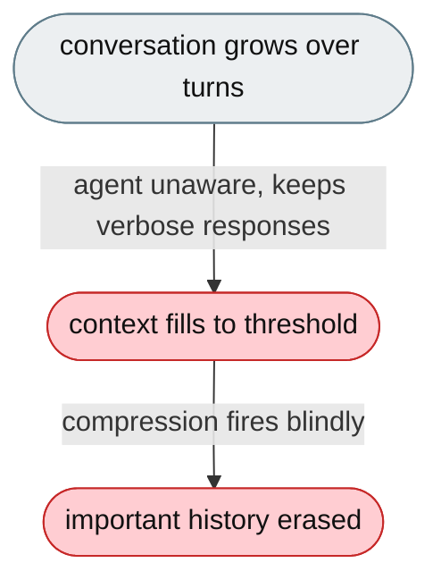
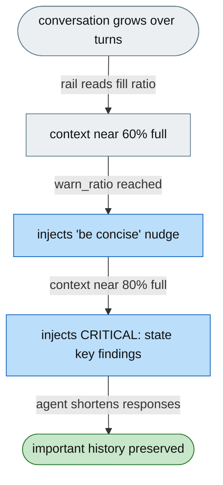

# [Feature]: Context-headroom guard — warn the agent before compression erases history

## Executive Summary

As the conversation grows, automatic compression fires to summarise or discard older turns — but it is blind to what matters, and the agent keeps producing verbose responses right up until the threshold, making the compression more destructive. This feature adds a rail that monitors how full the context window is and injects escalating conciseness directives (a moderate nudge at 60% fill, an urgent directive at 80%) so the agent shortens responses and states key findings before compression erases history.

Issue #3570 https://github.com/openJiuwen-ai/jiuwenswarm/issues/3570<br>
PR #397 https://github.com/openJiuwen-ai/jiuwenswarm/pull/397

## Background Description

The ReAct agent triggers dialogue compression when token usage crosses `react.context_engine_config.dialogue_compressor_config.tokens_threshold`, but the agent has no awareness of how close it is to that threshold — it keeps generating verbose responses until compression fires, and there is no proactive signal that compression is imminent. So compression summarises away old turns (including possibly important details) at the worst moment.



## Design Ideas

### Proposed design

- **`ContextHeadroomRail`** — a `DeepAgentRail` (rail `priority=9`) with a single `before_model_call` hook.
- **Usage ratio** — reads `ctx.context.statistic().total_tokens` and divides by `ctx.context._context_window_tokens` (fallback 100 000) to compute the fill ratio.
- **Two thresholds**:
  - `warn_ratio` (default 0.60) → injects `PromptSection(name="context_headroom", priority=93)` with a moderate "be concise" nudge (don't restate, prefer short confirmations).
  - `critical_ratio` (default 0.80) → replaces it with a strong "CRITICAL" directive (be extremely brief, state key findings now before they're compressed away).
- **Below warn_ratio** — the section is removed, so normal turns have zero overhead.
- **Config** — `context_headroom.enabled` (default false), `context_headroom.warn_ratio` (0.60), `context_headroom.critical_ratio` (0.80).


## Involved Public APIs

New class (public addition):

| API | Kind |
|---|---|
| `ContextHeadroomRail` | new class (`DeepAgentRail`) |

Config additions (under `context_headroom`):

| Field | Type | Default |
|---|---|---|
| `context_headroom.enabled` | bool | `false` |
| `context_headroom.warn_ratio` | float | `0.60` |
| `context_headroom.critical_ratio` | float | `0.80` |

**Impact:** additive and opt-in (`enabled` defaults to `false`). No changes to the context engine; uses only the public `ctx.context.statistic()` API and `before_model_call`.

## Description of Relevance to Other Modules

- **`jiuwenswarm/agents/harness/common/rails/context_headroom_rail.py`** — the new rail and its two directive texts.
- **`jiuwenswarm/server/runtime/agent_adapter/interface_deep.py`** — `_build_context_headroom_rail()` attaches the rail only when `context_headroom.enabled` is true.
- **`jiuwenswarm/resources/config.yaml`** — declares the `context_headroom` config block.
- **Context engine / compressor** — unchanged; the rail only reads stats, it does not trigger compression.

## Test Design and Test Plan

Unit/integration tests:

1. **Below warn_ratio** — no section is injected.
2. **Warn threshold** — at `ratio >= warn_ratio`, the moderate "be concise" nudge is injected at priority 93.
3. **Critical threshold** — at `ratio >= critical_ratio`, the CRITICAL directive replaces the nudge.
4. **Removal** — when usage drops below `warn_ratio`, the section is removed.
5. **Unavailable context** — when `ctx.context` is `None` or the ratio can't be computed, the rail does nothing.
6. **Disabled path** — `context_headroom.enabled=false` → the rail is not attached.

Performance/reliability:

- **Zero overhead below warn_ratio** — normal turns are untouched.

## Additional Information

## Solution

Paired: [GitHub #397](https://github.com/openJiuwen-ai/jiuwenswarm/pull/397) ↔ [GitCode !4982](https://gitcode.com/openJiuwen/jiuwenswarm/merge_requests/4982)

**What type of PR is this?**
/kind feature

---

## **What does this PR do / why do we need it**

This PR adds a **Context Headroom Guard** that warns the agent when the context window is filling up.
As the window approaches compression thresholds, the agent receives escalating instructions to shorten responses and preserve key information before compression occurs.

This prevents destructive loss of important history and improves stability on long tasks.

Issue #3570

---

## **Problem**

As the agent works, the conversation grows.
Eventually, automatic compression fires — summarizing or discarding older turns.

Compression is **blind**:

- it doesn't know what was important
- it can erase key details
- the agent loses track of what it already did
- verbose responses accelerate the problem

The agent continues producing long answers even when the context is nearly full, making compression more destructive.

The ReActAgent triggers dialogue compression when token usage crosses:

```
react.context_engine_config.dialogue_compressor_config.tokens_threshold
```

But:

- the agent has **no awareness** of how close it is to the threshold
- it keeps generating verbose responses until compression fires
- there is no mechanism to proactively slow token accumulation
- no signal warns the model that compression is imminent

---

## **Solution**

A new rail monitors how full the context window is.
As it fills:

- first a **moderate nudge** tells the agent to be concise
- then a **strong directive** tells it to be extremely brief and state any key findings immediately

This gives the agent time to adjust before compression erases important history.



A new **ContextHeadroomRail** (priority 9) implements this behavior.

### **How it works**

On **before_model_call**, the rail:

1. Calls:

   ```
   ctx.context.statistic().total_tokens
   ```

2. Divides by:

   ```
   ctx.context._context_window_tokens
   ```

3. Computes the **fill ratio**.

Two thresholds drive behavior:

---

### **1. warn_ratio (default 0.60)**

If `fill_ratio ≥ warn_ratio`:

- inject:

  ```
  PromptSection(priority=93, name="context_headroom_warning")
  ```

- instruct the agent to:
  - avoid restating past work
  - prefer short confirmations
  - reduce verbosity

---

### **2. critical_ratio (default 0.80)**

If `fill_ratio ≥ critical_ratio`:

- replace the section with a **strong directive**:
  - be extremely brief
  - skip explanations
  - state key findings now before they are compressed away

---

### **Below warn_ratio**

- the section is removed
- zero overhead on normal turns

---

### **Implementation notes**

- Uses only `before_model_call` and the public `ctx.context.statistic()` API
- No changes to the context engine
- Thresholds are fully configurable
- Works seamlessly with existing compression rails

---

## **Expected Impact**

- Agent becomes aware of context pressure
- Reduces verbosity before compression triggers
- Preserves important history
- Improves stability on long tasks
- Prevents destructive loss of context
- Zero impact when context is not full

---

## **Self-checklist**

- [x] **Design**: Reviewed with maintainers
- [x] **Test**: Verified warn and critical thresholds
- [x] **Verification**: Confirmed correct prompt injection and removal
- [ ] **Interface**: No external API changes
- [x] **Document**: Added bilingual documentation for `context_headroom.*`
