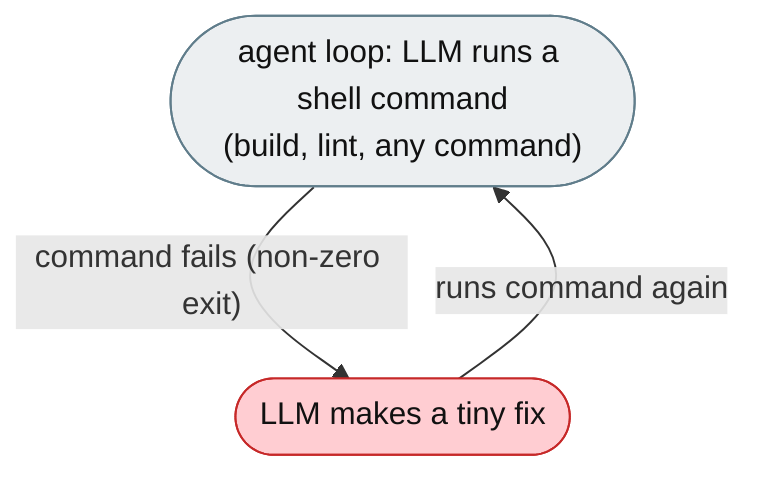
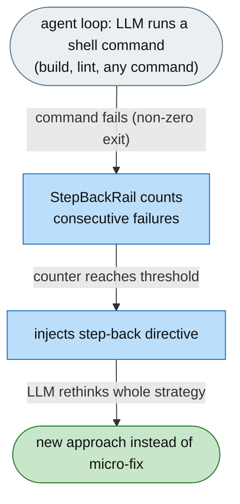

# [Feature]: Step-back rail — reset strategy after consecutive shell failures

## Executive Summary

When the agent's shell commands keep failing — a broken build, a wrong lint command, a bad flag — it often enters a micro-fix loop — tiny fix, retry, fail, repeat dozens of times — never stepping back to reconsider whether its whole approach is wrong. This feature adds a rail that counts consecutive shell-command failures and, once the count reaches a threshold, injects a high-urgency directive telling the agent to stop tweaking and rethink its entire strategy.

Issue #3562 https://github.com/openJiuwen-ai/jiuwenswarm/issues/3562<br>
PR #399 https://github.com/openJiuwen-ai/jiuwenswarm/pull/399

## Background Description

The ReAct agent has no mechanism to detect consecutive failures. Each model call sees only the most recent error, there is no aggregate signal that failures have been happening for several turns, and nothing in the system prompt distinguishes "first failure → try a small fix" from "fifth failure → rethink the whole plan". So the agent keeps making tiny tweaks and retrying until the iteration budget runs out, with the underlying issue still unsolved.



## Design Ideas

### Proposed design

- **`StepBackRail`** — a `DeepAgentRail` (rail `priority=10`) with three hooks.
- **Failure counting (`after_tool_call`)** — if the tool is a shell executor (`mcp_exec_command`, `bash`, `run_bash`, `execute_command`, `run_command`, `run_shell`), parse the JSON result for an exit code (`exit_code`, `exitCode`, `returncode`, `return_code`): exit code 0 resets the counter, non-zero increments it; an unparseable result leaves it unchanged.
- **Exception counting (`on_tool_exception`)** — an exception from a shell tool increments the counter like a non-zero exit.
- **Directive injection (`before_model_call`)** — reads the counter from session state (`_step_back_consecutive_failures`); if `counter >= step_back_after`, injects `PromptSection(name="step_back_prompt", priority=94)` naming the failure count and instructing the agent to re-read the task, identify the root cause, design a completely different strategy, and execute it; if below threshold, the section is removed.
- **Config** — `step_back.enabled` (default false) gates the rail; `step_back.step_back_after` (default 3).


## Involved Public APIs

New class (public addition):

| API | Kind |
|---|---|
| `StepBackRail` | new class (`DeepAgentRail`) |

Config additions (under `step_back`):

| Field | Type | Default |
|---|---|---|
| `step_back.enabled` | bool | `false` |
| `step_back.step_back_after` | int | `3` |

**Impact:** additive and opt-in (`enabled` defaults to `false`). No existing tool, rail, or prompt contract changes.

## Description of Relevance to Other Modules

- **`jiuwenswarm/agents/harness/common/rails/step_back_rail.py`** — the new rail, shell-tool whitelist, exit-code parsing, and directive content.
- **`jiuwenswarm/server/runtime/agent_adapter/interface_deep.py`** — `_build_step_back_rail()` attaches the rail only when `step_back.enabled` is true.
- **`jiuwenswarm/resources/config.yaml`** — declares the `step_back` config block.

## Test Design and Test Plan

Unit/integration tests:

1. **Non-shell tool** — calls to non-shell tools are ignored.
2. **Success reset** — exit code 0 resets the counter to 0.
3. **Failure increment** — non-zero exit code increments the counter.
4. **Exception** — a shell-tool exception increments the counter like a non-zero exit.
5. **Unparseable result** — an exit-code-less result leaves the counter unchanged.
6. **Threshold injection** — at `counter >= step_back_after`, `step_back_prompt` (priority 94) is injected with the failure count and the rethink directive; below threshold it is removed.
7. **Disabled path** — `step_back.enabled=false` → the rail is not attached.

Performance/reliability:

- **No overhead when progressing normally** — the counter stays at 0 and no section is injected.

## Additional Information

## Solution

Paired: [GitHub #399](https://github.com/openJiuwen-ai/jiuwenswarm/pull/399) ↔ [GitCode !3810](https://gitcode.com/openJiuwen/jiuwenswarm/merge_requests/3810)

**What type of PR is this?**
/kind feature

---

## **What does this PR do / why do we need it**

This PR adds a **Step-back Prompt Rail** that detects when the agent is stuck in a loop of consecutive shell failures and injects a high-urgency directive telling it to stop making tiny tweaks and rethink its entire strategy.

This prevents the agent from wasting iterations on repeated micro-fixes and helps it pivot to a more effective approach.

Issue #3562

---

## **Problem**

When the agent hits a failing test or broken command, it often enters a loop:

1. Make a tiny fix
2. Retry
3. Fail
4. Make another tiny fix
5. Retry
6. Fail

This can repeat **dozens of times**.

The agent never steps back to reconsider whether its entire approach is wrong.
By the time the iteration budget runs out, the underlying issue is still unsolved.

The agent needs a clear forcing function that says:

> "Stop tweaking. Your strategy is wrong. Step back and rethink."

The ReActAgent has **no mechanism** to detect consecutive failures.

- Each model call sees only the most recent error.
- There is no aggregate signal that failures have been happening for several turns.
- Nothing in the system prompt distinguishes:
  - "first failure → try a small fix"
  - "fifth failure → rethink your entire plan"

The agent cannot adapt because it cannot see the pattern.

---

## **Solution**

A new rail silently counts how many shell commands have failed **in a row**.

Once the count reaches the configured threshold (default **3**):

- a high-urgency message appears in the system prompt
- it names the exact number of consecutive failures
- it instructs the agent to:
  1. re-read the requirements
  2. identify the root cause
  3. design a completely different strategy
  4. execute that new strategy

The moment a shell command succeeds, the message disappears — zero cost on normal progress.



A new **StepBackRail** (priority 10) implements this behavior.

---

## **StepBackRail — Three Hooks**

### **1. `after_tool_call` — detect shell failures**

If the tool is a shell executor (`mcp_exec_command` or aliases):

- parse JSON result for `exit_code`
- if `exit_code == 0`: reset counter
- else: increment counter

### **2. `on_tool_exception` — treat exceptions as failures**

Any exception from a shell tool increments the counter exactly like a non-zero exit.

### **3. `before_model_call` — inject step-back directive**

Reads the counter from session state:

```
_step_back_consecutive_failures
```

If:

```
counter ≥ step_back_after
```

inject:

```
PromptSection(priority=94, name="step_back_prompt")
```

containing:

- the exact failure count
- the four-step strategy reset directive

If below threshold, the section is removed.

Because the section lives in the **system prompt**, it survives context compression.

---

## **Configuration**

Added to config:

```
step_back:
  enabled: true
  step_back_after: 3
```

SkillsBench enables this by default.

---

## **Expected Impact**

- Prevents repeated micro-fix loops
- Helps the agent pivot to new strategies
- Saves iteration budget
- Improves benchmark scores
- Zero overhead when tasks are progressing normally

---

## **Self-checklist**

- [x] **Design**: Reviewed with maintainers
- [x] **Test**: Verified failure counting, reset, and prompt injection
- [x] **Verification**: Confirmed correct behavior across shell tools and exceptions
- [ ] **Interface**: No external API changes
- [x] **Document**: Added bilingual documentation for `step_back.*`
