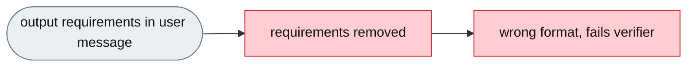
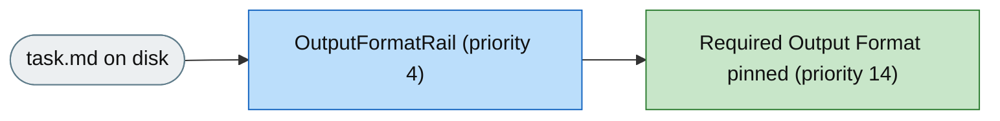

# [Feature]: Output-format reminder rail preserves the required output structure across compression

## Executive Summary

Benchmark tasks specify exactly what to produce — file path, format (JSON/CSV/YAML), fields, and structure — but context compression discards those original requirements from conversation history, so the agent produces output in the wrong format, writes to the wrong file, or omits required fields. This feature adds a rail that extracts the output-relevant content from the task file and pins it as a concise "Required Output Format" reminder in the system prompt, which is never compressed.

Issue #3544 https://github.com/openJiuwen-ai/jiuwenswarm/issues/3544<br>
PR #401 https://github.com/openJiuwen-ai/jiuwenswarm/pull/401

## Background Description

Task requirements — including the output format — arrive as a user message at the start of a run. When context compression fires, historical messages are removed, the output specification disappears, and the system prompt contains no persistent reminder of what output to produce, so the agent remembers only the high-level goal and not the exact constraints. This causes the agent to fail the verifier despite solving the underlying problem.



## Design Ideas

### Proposed design

- **`OutputFormatRail`** — a `DeepAgentRail` (rail `priority=4`) that reads the task file and extracts only output-relevant content, then pins it as a permanent system-prompt section.
- **Extraction pipeline** — strip YAML front-matter, keep the last 1–2 prose paragraphs that contain output-signal keywords, and include up to two fenced code blocks tagged with a structured format (`json`, `csv`, `tsv`, `yaml`, `yml`, `xml`, `toml`, `txt`, `text`, `plaintext`).
- **Length cap** — the extracted snippet is capped at `output_format.max_chars` (default 800), truncated on a newline boundary.
- **Pinned section** — injects `PromptSection(name="output_format_reminder", priority=14)`, placed after task description (12) and before the general system prompt (15), so the agent sees the format contract early and consistently.
- **Lifecycle** — `before_invoke` clears any stale section and attempts a read; `before_model_call` retries if the file was not yet mounted; silently skips when the file is missing or has no format-relevant content.
- **Config** — `output_format.enabled` (bool), `output_format.path` (default `/app/task.md`), `output_format.max_chars` (default 800).



## Involved Public APIs

New class (public addition):

| API | Kind |
|---|---|
| `OutputFormatRail` | new class (`DeepAgentRail`) |

Config additions (under `output_format`):

| Field | Type | Default |
|---|---|---|
| `output_format.enabled` | bool | `false` |
| `output_format.path` | str | `/app/task.md` |
| `output_format.max_chars` | int | `800` |

**Impact:** additive and opt-in (`enabled` defaults to `false`). No existing rail, prompt, or config contract changes. When disabled, the rail is not attached.

## Description of Relevance to Other Modules

- **`jiuwenswarm/agents/harness/common/rails/output_format_rail.py`** — the new rail and its extraction helpers.
- **`jiuwenswarm/server/runtime/agent_adapter/interface_deep.py`** — attaches `OutputFormatRail` to the rail set only when `output_format.enabled` is true.
- **`jiuwenswarm/resources/config.yaml`** — declares the `output_format` config block.
- **Task Description Rail (`task_description`)** — independent but complementary; this rail runs at the same priority (4) and sits after it in the prompt (priority 14 vs 12).

## Test Design and Test Plan

Unit/integration tests:

1. **Front-matter stripping** — YAML front-matter delimited by `---` is removed before extraction.
2. **Paragraph extraction** — only the last 1–2 paragraphs containing output-signal keywords are kept.
3. **Code-block extraction** — up to two fenced blocks tagged `json`/`csv`/`yaml`/`xml`/etc. are included verbatim.
4. **Length cap** — the snippet is truncated to `max_chars` on a newline boundary.
5. **Injection** — `PromptSection(name="output_format_reminder", priority=14)` with content `# Required Output Format\n\n<snippet>`.
6. **No content** — when the file is missing or has no format-relevant content, the section is silently skipped (no crash, no side effect).
7. **Disabled path** — `output_format.enabled=false` → the rail is not attached.

Performance/reliability:

- **Zero overhead when disabled** — the rail is not built unless enabled.

## Additional Information

## Solution

Paired: [GitHub #401](https://github.com/openJiuwen-ai/jiuwenswarm/pull/401) ↔ [GitCode !3811](https://gitcode.com/openJiuwen/jiuwenswarm/merge_requests/3811)

**What type of PR is this?**
/kind feature

---

## **What does this PR do / why do we need it**

This PR adds an **Output Format Reminder Rail** that extracts the output-specific instructions from the task file and pins them permanently in the system prompt.
This ensures the agent always remembers **exactly what output to produce** — file path, format, schema, and structure — even after heavy context compression.

This dramatically reduces benchmark failures caused by producing output in the wrong format or location.

Issue #3544

---

## **Problem**

Benchmark tasks often specify:

- which file to write
- what format to use (JSON, CSV, YAML, plain text)
- what fields or columns to include
- what structure the output must follow

The agent reads this at the beginning of the task. But as the conversation grows, **context compression** discards old messages — including the original output requirements.

The agent then:

- produces output in the wrong format
- writes to the wrong file
- omits required fields
- fails the verifier despite solving the underlying problem

Task requirements (including output format) arrive as a **user message** at the start. When compression fires, historical messages are removed, the output specification disappears, the system prompt contains **no persistent reminder** of output format, and the agent remembers only the high-level goal, not the exact constraints.

---

## **Solution**

A new rail reads the task file once and extracts only the **output-relevant content**: the final paragraphs describing what to write and where, and any structured code blocks showing expected JSON/CSV/YAML/XML formats. This concise extract is pinned permanently in the system prompt as a **Required Output Format** reminder, visible for the entire task regardless of compression.


A new **OutputFormatRail** (priority 4) implements this behavior.

---

## **Extraction Logic**

The rail reads the file at:

```
output_format.path (default: /app/task.md)
```

Extraction steps:

### **1. Strip YAML front-matter**
SkillsBench task files begin with:

```
---
metadata...
---
```

This is removed.

### **2. Extract last 1–2 paragraphs**
Only paragraphs containing **output-signal keywords** are kept, such as:

- "write to"
- "output file"
- "JSON format"
- "CSV columns"
- "produce the following structure"

This prevents irrelevant context from leaking in.

### **3. Extract structured code blocks**
Up to **two** fenced blocks tagged:

- `json`
- `csv`
- `yaml`
- `xml`

These blocks show the exact expected schema and are included verbatim.

### **4. Cap content length**
The final section is capped at:

```
output_format.max_chars (default 800)
```

to keep the prompt concise.

### **5. Injection**
Injected as:

```
PromptSection(priority=14, name="output_format_reminder")
```

Placed:

- after **task identity** (10)
- after **task description re-injection** (12)
- before **general system prompt** (15)

This ensures the agent sees the output requirements early and consistently.

### **6. Lifecycle**
- **before_invoke**: clear stale section, attempt initial read
- **before_model_call**: retry if file was not yet mounted
- silently skip if file missing or no output-relevant content found

---

## **Expected Impact**

- Output format is never lost to compression
- Agent consistently produces correct file formats and schemas
- Fewer benchmark failures due to wrong output structure
- Zero overhead when tasks lack output-specific requirements
- Works seamlessly with the task description rail and context headroom guard

---

## **Self-checklist**

- [x] **Design**: Reviewed with maintainers
- [x] **Test**: Verified extraction logic and prompt injection
- [x] **Verification**: Confirmed correct behavior with JSON/CSV/YAML/XML examples
- [ ] **Interface**: No external API changes
- [x] **Document**: Added bilingual documentation for `output_format.*`
