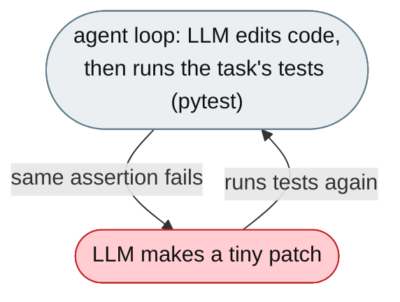
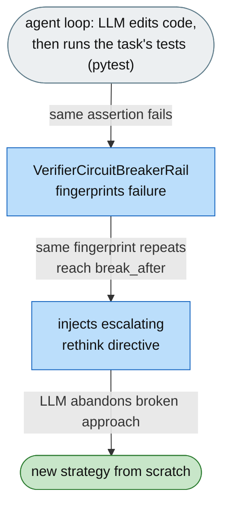

# [Feature]: Verifier circuit-breaker rail — break repeated identical test-failure loops

## Executive Summary

On coding tasks the agent repeatedly runs tests, sees the same failure, makes a tiny patch, and reruns — 15–20 times — never realizing the failure is identical, and exhausting the iteration budget (a guaranteed 0 on binary-scored SkillsBench tasks). This feature adds a rail that fingerprints verifier failures and, when the same signature repeats consecutively, injects an escalating directive: stop patching at 3 repetitions, abandon the approach and start from scratch at 6.

Issue #3560 https://github.com/openJiuwen-ai/jiuwenswarm/issues/3560<br>
PR #409 https://github.com/openJiuwen-ai/jiuwenswarm/pull/409

## Background Description

The ReAct agent enters a tight verifier-failure loop — `pytest → FAILED (same assertion) → patch → pytest → FAILED (same assertion) → …`. Because the agent has no awareness that the failure signature is identical across turns, it treats each failure as a new diagnostic, never escalates its reasoning, and exhausts the budget on variants of the same broken approach. There was no mechanism to detect repeated identical failures or surface that pattern to the LLM.



## Design Ideas

### Proposed design

- **`VerifierCircuitBreakerRail`** — a `DeepAgentRail` (rail `priority=11`, just after `StepBackRail` at 10) with two hooks.
- **Failure detection (`after_tool_call`)** — if the tool is a shell executor and the output looks like verifier/pytest output (≥2 of a known marker set), extract the meaningful failure lines (`FAILED`, `AssertionError`, `E` snippets), normalize variable parts (temp paths, timestamps, line numbers, memory addresses), and compute a 16-hex MD5 fingerprint.
- **Consecutive tracking** — store the fingerprint and a consecutive counter in session state; if the fingerprint matches the previous one, increment the counter, otherwise reset it to 1; a verifier success (all tests pass) clears both.
- **Escalating injection (`before_model_call`)** — when the counter reaches `break_after` (default 3), inject `PromptSection(name="verifier_circuit_breaker", priority=96)` telling the agent to stop patching and rethink; when it reaches `break_after × 2`, the directive escalates to "abandon the approach, undo recent changes, start from scratch". Below threshold the section is removed.
- **Config** — `verifier_circuit_breaker.enabled` and `verifier_circuit_breaker.break_after` (default 3).


## Involved Public APIs

New class (public addition):

| API | Kind |
|---|---|
| `VerifierCircuitBreakerRail` | new class (`DeepAgentRail`) |

Config additions (under `verifier_circuit_breaker`):

| Field | Type | Default |
|---|---|---|
| `verifier_circuit_breaker.enabled` | bool | `true` |
| `verifier_circuit_breaker.break_after` | int | `3` |

**Impact:** additive. No existing tool, rail, or prompt contract changes. The rail is intentionally narrow — it only fires on verifier-style output, leaving ordinary shell failures to `StepBackRail`.

## Description of Relevance to Other Modules

- **`jiuwenswarm/agents/harness/common/rails/verifier_circuit_breaker_rail.py`** — the new rail, marker set, failure-fingerprint, and normalization logic.
- **`jiuwenswarm/server/runtime/agent_adapter/interface_deep.py`** — `_build_verifier_circuit_breaker_rail()` attaches the rail unless explicitly disabled.
- **`jiuwenswarm/resources/config.yaml`** — declares the `verifier_circuit_breaker` config block.
- **`StepBackRail`** — complementary but distinct: this rail handles *identical* verifier failures; StepBackRail handles generic consecutive shell failures.

## Test Design and Test Plan

Unit/integration tests:

1. **Verifier detection** — output is classified as verifier output only with ≥2 markers.
2. **Success clears state** — "N passed" (no "failed") or `reward: 1` resets the fingerprint and counter.
3. **Same fingerprint** — an identical normalized failure increments the counter.
4. **Different fingerprint** — a changed failure resets the counter to 1.
5. **Normalization** — temp paths, timestamps, line numbers, and addresses are stripped before hashing.
6. **Threshold injection** — at `break_after`, `verifier_circuit_breaker` (priority 96) is injected; below threshold it is removed.
7. **Escalation** — at `break_after × 2`, the "abandon everything" directive replaces the "rethink" directive.
8. **Non-verifier output** — ordinary shell output is ignored (left to StepBackRail).
9. **Disabled path** — explicitly disabled → the rail is not attached.

Performance/reliability:

- **No overhead when tests pass** — the counter is cleared on verifier success.

## Additional Information

## Solution

Paired: [GitHub #409](https://github.com/openJiuwen-ai/jiuwenswarm/pull/409) ↔ [GitCode !3817](https://gitcode.com/openJiuwen/jiuwenswarm/merge_requests/3817)

**What type of PR is this?**
/kind feature

---

## **What does this PR do / why do we need it**

This PR adds a **Verifier Circuit-Breaker Rail** that detects when the agent is stuck in a loop of **identical test failures** and injects a high-urgency directive telling it to stop patching the same code and rethink its entire strategy.

This directly addresses the single most damaging failure pattern in SkillsBench runs.

Issue #3560

---

## **Problem**

When working on coding tasks, the agent repeatedly:

1. runs tests
2. sees the **same failure**
3. makes a tiny patch
4. runs tests again
5. sees the **same failure**
6. repeats

This can continue for **15–20 attempts**, consuming the entire iteration budget.
The agent never realizes the failure is **identical**, so it never abandons the broken strategy.

On binary-scored SkillsBench tasks, this produces a guaranteed **0**.

The ReAct agent enters a tight verifier-failure loop:

```
pytest → FAILED (same assertion)
patch → pytest → FAILED (same assertion)
patch → …
```

Because the agent has **no awareness** that the failure signature is identical across turns:

- it treats each failure as a new diagnostic
- it never escalates its reasoning
- it exhausts the iteration budget on variants of the same broken approach

There was no mechanism to detect repeated identical failures or to surface that pattern to the LLM.

---

## **Solution**

After each test run, the system checks whether the failure is **identical** to the previous one.

- At **3 consecutive identical failures**, the agent receives:

  > "Stop patching this code. Rethink your approach entirely."

- At **6 consecutive identical failures**, the message escalates:

  > "Your current strategy is fundamentally broken — undo your changes and start from scratch."

A verifier success clears the counter immediately.



A new **VerifierCircuitBreakerRail** (priority 11) implements this behavior.

---

## **VerifierCircuitBreakerRail — Two Hooks**

### **1. `after_tool_call` — detect and fingerprint failures**

After each shell tool call:

- Check whether output looks like pytest/verifier output
  - ≥2 markers from a known set (e.g., `FAILED`, `AssertionError`, `E`, `^E`, traceback markers)
- Extract meaningful lines:
  - `FAILED …`
  - `AssertionError`
  - error snippets
- Normalize variable components:
  - timestamps
  - temp paths
  - line numbers
- Produce a **16-hex MD5 fingerprint**
- Store fingerprint + consecutive count in session state
- Increment count if fingerprint matches previous
- Reset count on success

### **2. `before_model_call` — inject circuit-breaker directive**

Reads:

```
_verifier_circuit_breaker_fingerprint
_verifier_circuit_breaker_consecutive
```

from session state.

If:

```
consecutive ≥ break_after (default 3)
```

inject:

```
PromptSection(priority=96, name="verifier_circuit_breaker")
```

containing:

- the exact failure count
- a directive to stop patching and rethink the approach

If:

```
consecutive ≥ break_after × 2
```

the directive escalates:

- instruct the agent to undo recent changes
- design a completely new strategy
- restart from a clean conceptual slate

If below threshold, the section is removed.

Because the section lives in the **system prompt**, it survives context compression.

---

## **Configuration**

Added to config:

```
verifier_circuit_breaker:
  enabled: true
  break_after: 3
```

SkillsBench enables this by default.

---

## **Expected Impact**

- Breaks the most common and most damaging failure loop in SkillsBench
- Prevents wasting 100+ iterations on identical failures
- Forces strategic resets when needed
- Dramatically improves benchmark scores
- Zero overhead when tests are passing or failures are changing meaningfully

---

## **Self-checklist**

- [x] **Design**: Reviewed with maintainers
- [x] **Test**: Verified fingerprinting, escalation, and reset behavior
- [x] **Verification**: Confirmed correct detection of identical pytest failures
- [ ] **Interface**: No external API changes
- [x] **Document**: Added bilingual documentation for `verifier_circuit_breaker.*`
