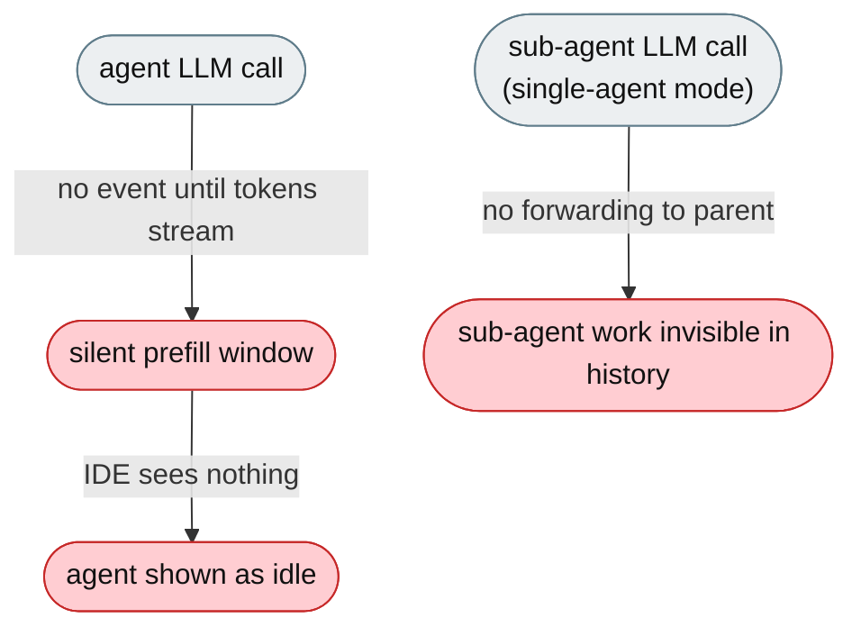
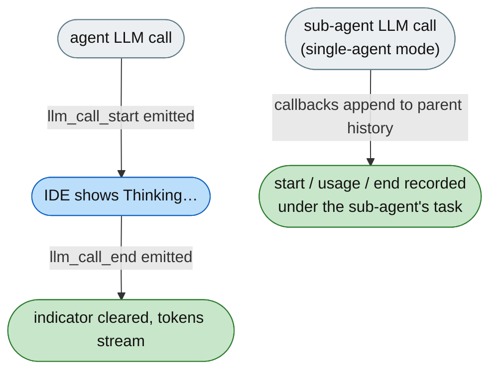

# [Feature]: Emit llm_call_start / llm_call_end events to make LLM activity visible (IDE "Thinking…" indicator)

## Executive Summary

Between a tool result and the first generated token, the model is computing but the IDE saw the agent as idle — there was no event at the moment an LLM call actually began or ended. This feature emits two stream events, `chat.llm_call_start` and `chat.llm_call_end`, around every model call so IDE clients can show a "Thinking…" indicator during the prefill/TTFT window and attribute activity to the correct agent lane in team mode. It also forwards the task tool's sub-agent LLM calls into the parent session's history, so those nested calls are visible too.

Issue #3575 https://github.com/openJiuwen-ai/jiuwenswarm/issues/3575
PR #2362 https://github.com/openJiuwen-ai/jiuwenswarm/pull/2362

## Background Description

The server emitted `chat.llm_usage` after the call and `chat.reasoning`/`chat.delta` once tokens streamed, but nothing at the moment the LLM call actually started. There was no "LLM call has begun" or "LLM call has ended" event, so IDE clients had no way to show a "Thinking…" indicator during the silent prefill window — which felt wrong, especially in multi-agent team mode where users expect to see which agent is actively working.



## Design Ideas

### Proposed design

- **`StreamEventRail`** — `before_model_call` emits `llm_call_start`; `after_model_call` emits `llm_call_end`, both via `session.write_stream(OutputSchema(type=..., payload=...))`. Attached to every agent, in every mode.
- **Payload** — `_emit_llm_call_signal()` includes `member_name` and `role` (so team-mode UIs know which agent), plus a `prompt` preview on start and extracted response `content` on end. `member_name`/`role` are only populated in team mode (`team_runtime_inheritance.py`); the plain single-agent and auto-harness paths pass none, so those fields are omitted.
- **Fire-and-forget** — emission failures are debug-logged only and cannot break a turn.
- **Sub-agent forwarding (`agent_observability.py`)** — the agent's **task tool** spawns `DeepAgent` sub-agents (in single-agent mode) that run under a sub-session id (`<parent>_sub_<type>_<uuid>`) in a different asyncio task, so `StreamEventRail`'s `write_stream` does not reach the parent. Instead, LLM callbacks detect these task-tool sub-agent calls and append `chat.llm_call_start` / `chat.usage_metadata` / `chat.llm_call_end` directly into the **parent** session's history (so the Logger nests each sub-agent's calls under its task tool). Parent request context is kept in a process-global dict keyed by session id (a ContextVar isn't visible across tasks); the image-modality probe is excluded so it doesn't pollute the trace.
- **Adapter forwarding** — `interface_deep.py` forwards both chunk types as `chat.llm_call_start` / `chat.llm_call_end` with `member_name`/`role`/`prompt`/`content`, stamping `llm_start_ts` to anchor start/end to the call's start timestamp.
- **Persistence rules (`session_history.py`)** — `chat.llm_call_start` is persisted only when it carries a non-empty `prompt`; `chat.llm_call_end` is always persisted (so start/end stay symmetric even for tool-calling calls with no text); `chat.usage_metadata` is persisted when it has metadata.
- **Timestamp anchoring (`interface.py`)** — `chat.llm_call_start` and `chat.usage_metadata` are anchored to the call's start timestamp so they render before the response text (`chat.final`); `chat.llm_call_end` keeps its real completion timestamp.
- **Gateway pass-through** — `web_connect.py` adds both event types to `_WEB_FULL_PAYLOAD_EVENT_TYPES` so the full payload reaches web/IDE clients instead of being stripped to `{session_id, content}`.



## Involved Public APIs

| API | Kind |
|---|---|
| `StreamEventRail._emit_llm_call_signal()` | new method |
| `chat.llm_call_start` / `chat.llm_call_end` | new stream event types |
| `agent_observability` sub-agent LLM callbacks | new callbacks (append parent-history records) |
| `session_history` persistence filter | extended (start/end/usage rules) |
| `interface._resolve_final_record_timestamp` | extended (timestamp anchoring) |

**Impact:** additive. Two new stream event types; no existing event is removed or renamed. Emission is best-effort (failures swallowed).

## Description of Relevance to Other Modules

- **`jiuwenswarm/agents/harness/common/rails/stream_event_rail.py`** — emits the start/end signals in `before_model_call`/`after_model_call`; carries `member_name`/`role` in team mode.
- **`jiuwenswarm/agents/harness/team/team_runtime_inheritance.py`** — constructs `JiuSwarmStreamEventRail(member_name=..., role=...)` for team members.
- **`jiuwenswarm/agents/harness/agent_observability.py`** — sub-agent LLM callbacks that forward `chat.llm_call_start`/`chat.usage_metadata`/`chat.llm_call_end` into the parent session's history.
- **`jiuwenswarm/server/runtime/agent_adapter/interface_deep.py`** — the agent-stream dispatcher forwards the chunks as `chat.llm_call_start`/`chat.llm_call_end`.
- **`jiuwenswarm/server/runtime/agent_adapter/interface.py`** — timestamp anchoring so start/usage render before `chat.final`.
- **`jiuwenswarm/server/runtime/session/session_history.py`** — persistence filter for the new event types.
- **`jiuwenswarm/gateway/channel_manager/web/web_connect.py`** — adds both types to `_WEB_FULL_PAYLOAD_EVENT_TYPES` for full-payload pass-through.
- **jiuwenswarm-ide** — consumes the events to drive the "Thinking…" indicator and per-agent lane activity (not in this repo).

## Test Design and Test Plan

Unit/integration tests:

1. **Start emission** — `before_model_call` emits `llm_call_start` with the expected payload.
2. **End emission** — `after_model_call` emits `llm_call_end`.
3. **Payload fields** — `member_name`/`role` are included when set; `prompt` on start; `content` on end.
4. **Fire-and-forget** — a write-stream failure is swallowed and does not break the turn.
5. **Sub-agent forwarding** — sub-agent LLM calls append `chat.llm_call_start`/`chat.usage_metadata`/`chat.llm_call_end` into the parent session's history; the image-probe call is excluded.
6. **Persistence** — start is persisted only with a non-empty prompt; end is always persisted; usage only with metadata.
7. **Timestamp anchoring** — start/usage records anchor to `llm_start_ts`; end keeps its real timestamp.
8. **Dispatch** — `interface_deep` forwards both chunk types as `chat.*` with `member_name`/`role`/`prompt`/`content`.
9. **Gateway pass-through** — both types are in `_WEB_FULL_PAYLOAD_EVENT_TYPES`, so the full payload is forwarded.

Performance/reliability:

- **Zero overhead when idle** — events only fire around actual model calls.

## Additional Information

## Solution

Paired: [GitHub #2362](https://github.com/openJiuwen-ai/jiuwenswarm/pull/2362) ↔ [GitCode !4522](https://gitcode.com/openJiuwen/jiuwenswarm/merge_requests/4522)

**What type of PR is this?**
/kind feature

---

## **What does this PR do / why do we need it**

This PR introduces **per-call LLM start/end stream events** so IDE clients can correctly show a **"Thinking…"** indicator during the prefill/TTFT window.
Previously, the agent appeared "idle" between a tool result and the first generated token, even though the model was actively computing. This change makes LLM activity visible from the moment a call begins until it ends.

Issue #3575

---

## **Problem**

The IDE only knew the agent was thinking **after** tokens started streaming or **after** the model call finished.
The gap between:

- a tool result
- and the first generated token

is often several hundred milliseconds.
During this silent window, the IDE showed the agent as **idle**, which felt wrong and confusing — especially in multi-agent team mode where users expect to see which agent is actively working.

The server emitted:

- `chat.llm_usage` **after** the call
- `chat.reasoning` / `chat.delta` **once tokens streamed**

But **nothing** at the moment the LLM call actually started.
There was no event for:

- "LLM call has begun"
- "LLM call has ended"

IDE clients had no way to show a "Thinking…" indicator during prefill.

---

## **Solution**

Emit two new stream events around every model call:

- **`chat.llm_call_start`** — right before the LLM call begins
- **`chat.llm_call_end`** — immediately after the call finishes

IDE clients can now:

- show "Thinking…" as soon as the model starts working
- clear the indicator precisely when the call ends
- attribute activity to the correct agent lane in team mode


The implementation follows the existing streaming architecture:

---

## **1. StreamEventRail — emit start/end signals**

`before_model_call` now emits **llm_call_start**
`after_model_call` emits **llm_call_end**

Both use:

```
session.write_stream(OutputSchema(...))
```

— the same transport used for `context.usage`.

A helper `_emit_llm_call_signal()` includes:

- `member_name`
- `role`

so team-mode UIs can show which agent is thinking.

Emission is **fire-and-forget**: failures are debug-logged only and cannot break a turn.

---

## **2. Agent adapter — forward as chat.* events**

`interface_deep.py` forwards both chunk types as:

- `chat.llm_call_start`
- `chat.llm_call_end`

This is the only agent-stream dispatcher in the codebase, so forwarding here ensures consistent behavior across all clients.

---

## **3. Gateway — full payload pass-through**

`web_connect.py` adds both event types to:

```
_WEB_FULL_PAYLOAD_EVENT_TYPES
```

so the gateway forwards the **full payload** (including member_name/role) to web/IDE clients.
Without this, the gateway would strip the payload down to `{session_id, content}`.

---

## **4. Sub-agent calls → parent session history**

The agent's **task tool** spawns `DeepAgent` sub-agents (single-agent mode) that run
under a sub-session id (`<parent>_sub_<type>_<uuid>`) in a different asyncio task,
so `StreamEventRail`'s `write_stream` does not reach the parent session.
`agent_observability.py` LLM callbacks detect these task-tool sub-agent calls and
append `chat.llm_call_start` / `chat.usage_metadata` / `chat.llm_call_end`
directly into the **parent** session's history, so the Logger nests each
sub-agent's LLM calls under its task tool. The image-modality probe is excluded
so it does not pollute the trace.

---

## **5. Persistence + timestamp anchoring**

`session_history.py` keeps `chat.llm_call_start` only when it carries a non-empty
`prompt`, always keeps `chat.llm_call_end` (so start/end stay symmetric even for
tool-calling calls), and keeps `chat.usage_metadata` when it has metadata.
`interface.py` anchors `chat.llm_call_start` and `chat.usage_metadata` to the
call's start timestamp so they render before the response text (`chat.final`),
while `chat.llm_call_end` keeps its real completion timestamp.

---

## **Why this belongs in jiuwenswarm (not agent-core)**

It follows the established layering:

- **agent-core** provides the transport (`write_stream`, before/after_model_call hooks)
- **jiuwenswarm** defines product-level `chat.*` events
- **jiuwenswarm-ide** consumes these events to show "Thinking…" indicators and lane activity

This keeps responsibilities clean and consistent with existing design.

---

## **Verification**

- `py_compile` + import checks pass
- All **37 backend tests** green
  - stream_event_rail
  - interface stream dispatch
  - web channel coalescing

## **Self-checklist**

- [x] **Design**: Reviewed with maintainers
- [x] **Test**: 37 backend tests green
- [x] **Verification**: py_compile + import checks pass
- [ ] **Interface**: No external API changes
- [x] **Document**: Documented `chat.llm_call_start` / `chat.llm_call_end`
